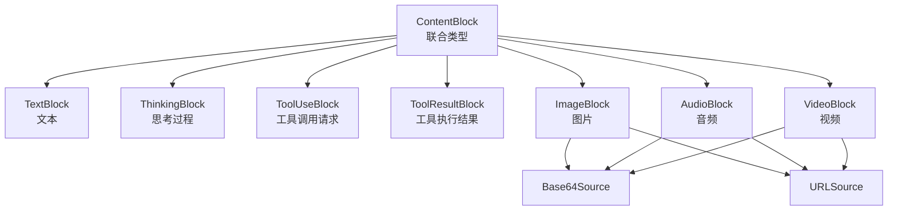

# ContentBlock 类型系统

> **Level 4**: 理解核心数据流  
> **前置要求**: [Msg 基类](./02-msg-basics.md)  
> **后续章节**: [消息生命周期](./02-message-lifecycle.md)

---

## 学习目标

学完之后，你能：
- 说出 7 种 ContentBlock 类型的名称和用途
- 理解 TypedDict + `total=False` 的设计意图
- 阅读 `_message_block.py` 的完整类型定义
- 知道每种 Block 在什么场景下被创建

---

## 背景问题

Msg 的 `content` 可以是字符串或 `list[ContentBlock]`。但 LLM 的响应不只是文本——它可能是一个工具调用请求、一张生成的图片、一段语音。每种内容有不同的结构。

**ContentBlock 解决的就是"消息内容的类型化表示"** — 用类型系统而非约定俗成的 dict 键值来表达内容的多样性。

---

## 源码入口

| 项目 | 值 |
|------|-----|
| **文件路径** | `src/agentscope/message/_message_block.py` |
| **总行数** | 129 行 |
| **定义的类型** | 7 个 Block 类型 + 2 个 Source 类型 + 联合类型 |

---

## 架构定位

### ContentBlock 类型树



7 种 Block 类型可以分为三组：
- **纯文本**: `TextBlock`, `ThinkingBlock`
- **工具交互**: `ToolUseBlock`, `ToolResultBlock`
- **多模态**: `ImageBlock`, `AudioBlock`, `VideoBlock`

---

## 逐类型源码分析

### TextBlock — 文本内容

**文件**: `_message_block.py:9-16`

```python
class TextBlock(TypedDict, total=False):
    type: Required[Literal["text"]]
    text: str
```

最简单的 Block。`total=False` 意味着只有 `type` 是必需的（`Required`），`text` 可选。

**创建场景**: 
- LLM 返回纯文本回复时
- 用户输入消息被包装时
- Formatter 转换消息时

### ThinkingBlock — 思考过程

**文件**: `_message_block.py:18-23`

```python
class ThinkingBlock(TypedDict, total=False):
    type: Required[Literal["thinking"]]
    thinking: str
```

用于支持 Claude 等模型的 extended thinking 功能。LLM 的"内心独白"被放入 ThinkingBlock。

**关键设计**: ThinkingBlock 在 Agent 间广播时会被剥离（`_agent_base.py:487-514`）。其他 Agent 不应该看到调用方的思考过程。这是 Agent 隐私保护的一部分。

### ToolUseBlock — 工具调用请求

**文件**: `_message_block.py:79-91`

```python
class ToolUseBlock(TypedDict, total=False):
    type: Required[Literal["tool_use"]]
    id: Required[str]
    name: Required[str]
    input: Required[dict[str, object]]
    raw_input: str
```

5 个字段中 4 个是必需的：

| 字段 | 用途 | 示例 |
|------|------|------|
| `id` | 工具调用的唯一 ID | `"call_abc123"` |
| `name` | 工具函数名 | `"get_weather"` |
| `input` | 已解析的参数 dict | `{"city": "北京"}` |
| `raw_input` | LLM 原始返回的参数字符串（可选） | `'{"city": "北京"}'` |

**`input` vs `raw_input`**: `input` 是框架解析后的 dict（可直接传给函数），`raw_input` 是 LLM API 返回的原始字符串（用于调试和兼容性）。

### ToolResultBlock — 工具执行结果

**文件**: `_message_block.py:94-106`

```python
class ToolResultBlock(TypedDict, total=False):
    type: Required[Literal["tool_result"]]
    id: Required[str]
    output: Required[str | List[TextBlock | ImageBlock | AudioBlock | VideoBlock]]
    name: Required[str]
```

**关键设计**: `output` 可以是 `str` 或 `list[ContentBlock]`。这意味着工具不仅可以返回文本（`"25°C, 晴"`），还可以返回图片（地图）、音频（语音播报）等。

**与 ToolUseBlock 的关联**: `ToolResultBlock.id` 必须匹配对应的 `ToolUseBlock.id`。Agent 通过 id 关联请求和响应。

### 多模态 Block 与 Source 类型

`ImageBlock`, `AudioBlock`, `VideoBlock` 的结构完全相同（除了 type 字面量）：

```python
class ImageBlock(TypedDict, total=False):
    type: Required[Literal["image"]]
    source: Required[Base64Source | URLSource]

# AudioBlock 同理，type="audio"
# VideoBlock 同理，type="video"
```

多模态数据通过 `source` 字段区分来源：

```python
class Base64Source(TypedDict, total=False):
    type: Required[Literal["base64"]]
    media_type: Required[str]     # "image/jpeg", "audio/mpeg"
    data: Required[str]           # base64 编码的数据 (RFC 2397)

class URLSource(TypedDict, total=False):
    type: Required[Literal["url"]]
    url: Required[str]            # 可访问的 URL
```

**为什么有两种 Source？**
- `base64`: LLM 直接生成的数据（如生成的图片），内嵌在响应中
- `url`: 外部资源引用，减少传输量

### 联合类型

**文件**: `_message_block.py:110-128`

```python
ContentBlock = (
    ToolUseBlock | ToolResultBlock | TextBlock | ThinkingBlock
    | ImageBlock | AudioBlock | VideoBlock
)

ContentBlockTypes = Literal[
    "text", "thinking", "tool_use", "tool_result",
    "image", "audio", "video",
]
```

`ContentBlock` 是联合类型，用于类型注解。`ContentBlockTypes` 是字面量联合，用于 `get_content_blocks()` 的参数类型。

---

## Block 类型在真实代码中的使用

### ReActAgent 中的 Block 判断逻辑

**文件**: `src/agentscope/agent/_react_agent.py`

```python
# 判断是否有工具调用 (第 442 行)
for tool_call in msg_reasoning.get_content_blocks("tool_use"):
    ...

# 判断退出循环条件 (第 513 行)
elif not msg_reasoning.has_content_blocks("tool_use"):
    reply_msg = msg_reasoning   # 纯文本回复，退出循环
    break

# 提取文本回复 (第 466 行)
if msg_reasoning.has_content_blocks("text"):
    reply_msg = Msg(self.name,
                    msg_reasoning.get_content_blocks("text"), "assistant",
                    metadata=structured_output)
```

### Agent 间广播时剥离 ThinkingBlock

**文件**: `src/agentscope/agent/_agent_base.py:496-513`

```python
@staticmethod
def _strip_thinking_blocks_single(msg: Msg) -> Msg:
    if not isinstance(msg.content, list):
        return msg
    filtered = [b for b in msg.content if b.get("type") != "thinking"]
    # ...返回新 Msg（不包含 thinking blocks）
```

---

## 工程经验

### 为什么用 `TypedDict(total=False)` 而不是普通 dict？

`total=False` 使所有字段变为可选（除非用 `Required` 标记）。这意味着：

```python
# 这样是合法的（即使缺少 text 和 raw_input 字段）
block: ToolUseBlock = {
    "type": "tool_use",
    "id": "call_1",
    "name": "get_weather",
    "input": {"city": "北京"},
    # raw_input 不需要提供
}
```

**设计原因**: LLM API 返回的数据可能缺少某些可选字段。`total=False` 允许创建不完整的 Block 而不会产生类型错误。

**代价**: 类型检查器无法捕捉缺失必需字段的错误。这是 Python 动态类型生态中的常见权衡。

### 为什么 ToolResultBlock.output 可以包含多模态数据？

```python
output: Required[str | List[TextBlock | ImageBlock | AudioBlock | VideoBlock]]
```

这使工具可以返回丰富的结果：
- 文本工具 → `output="25°C, 晴"`
- 图表工具 → `output=[ImageBlock(...)]` — 生成的数据可视化图表
- 视频工具 → `output=[VideoBlock(...)]` — 生成的视频

**坑**: Formatter 需要为不支持多模态的旧 LLM API 做兼容处理。`FormatterBase.convert_tool_result_to_string()` (`_formatter_base.py:37`) 就是处理这个的——把多模态 output 转为纯文本描述。

### `type` 字段使用 `tool_use` 而非 `tool_call`

AgentScope 选择 `"tool_use"` 而非很多框架使用的 `"tool_call"`。这与 Anthropic API 的命名一致（Anthropic 使用 `tool_use` 而非 OpenAI 的 `tool_calls`）。

这是 AgentScope 早期更多参考了 Anthropic API 设计的历史痕迹。

---

## Contributor 指南

### 如何添加新的 ContentBlock 类型

假设你要添加 `FileBlock`（文件附件）：

1. 在 `_message_block.py` 中定义：
```python
class FileBlock(TypedDict, total=False):
    type: Required[Literal["file"]]
    name: str
    data: Required[Base64Source | URLSource]
```

2. 更新联合类型：
```python
ContentBlock = (ToolUseBlock | ... | FileBlock)
ContentBlockTypes = Literal["text", ..., "file"]
```

3. 在 `__init__.py` 中导出

4. 在 Formatter 中处理新类型（每个 Formatter 都需要）

**危险**: 添加新 Block 类型是**全局性的变更**——会影响所有 Formatter、AgentBase._strip_thinking_blocks、Msg.get_content_blocks 等。改动前务必跑全量测试。

### 调试 Block 相关问题

```python
# 打印 Msg 中的所有 block 类型
types = [b["type"] for b in msg.get_content_blocks()]
print(f"Block types in msg: {types}")

# 检查具体 block 的结构
import json
for block in msg.get_content_blocks():
    print(json.dumps(block, indent=2, ensure_ascii=False))
```

---

## 下一步

> 理解了 ContentBlock 的 7 种类型后，接下来看一条 Msg 从创建到销毁的完整生命周期。

阅读 [消息生命周期](./02-message-lifecycle.md)。


---

## 工程现实与架构问题

### 技术债 (Block 类型层)

| 位置 | 问题 | 影响 | 优先级 |
|------|------|------|--------|
| `_message_block.py` | 新 Block 类型需要修改多个文件 | 添加成本高，容易遗漏 | 中 |
| `total=False` | 可选字段无验证 | 缺失必需字段时静默失败 | 中 |
| 多模态 | 部分 Formatter 不支持所有 Block | 工具返回图片可能丢失 | 高 |

**[HISTORICAL INFERENCE]**: TypedDict 的类型宽松性是性能和灵活性的权衡，但导致运行时错误难以追踪。多模态支持的复杂性来自各模型 API 的差异。

### 性能考量

```python
# ContentBlock 操作延迟
创建 TextBlock:            ~0.001ms
创建 ToolUseBlock:         ~0.002ms
get_content_blocks():       ~0.01-0.1ms (取决于列表长度)

# 序列化影响
单个 Block:                ~0.001ms
100 个 Block 序列化:       ~0.5-2ms
```

### 渐进式重构方案

```python
# 方案: 添加 Block 验证装饰器
from functools import wraps

def validate_block(required_fields):
    def decorator(block_class):
        original_init = block_class.__init__
        @wraps(original_init)
        def new_init(self, *args, **kwargs):
            for field in required_fields:
                if field not in kwargs and field not in args:
                    raise ValueError(f"Missing required field: {field}")
            original_init(self, *args, **kwargs)
        return new_init
    return decorator

@validate_block(["type", "id", "name", "input"])
class ToolUseBlock(TypedDict, total=False):
    type: Required[Literal["tool_use"]]
    id: Required[str]
    ...
```

