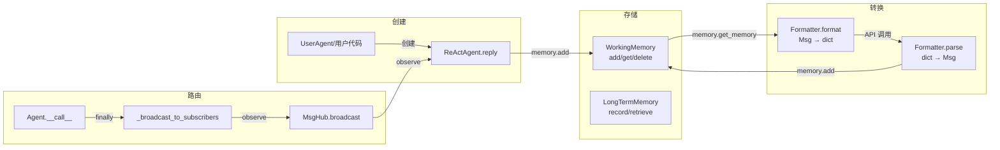
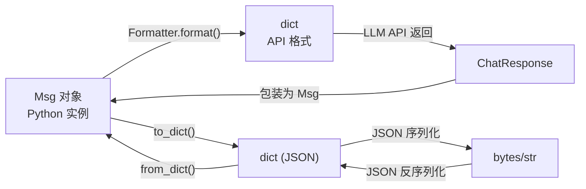
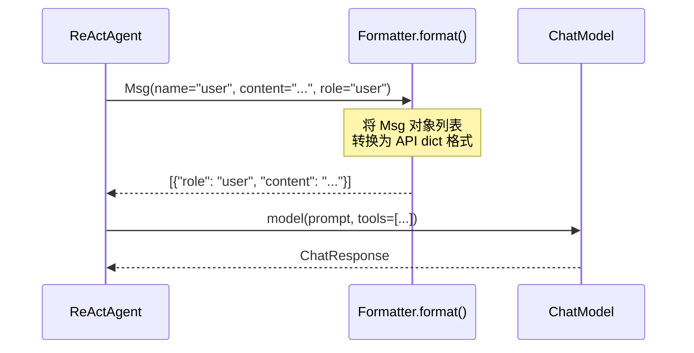

# 消息生命周期：创建 → 传递 → 存储 → 广播

> **Level 4**: 理解核心数据流
> **前置要求**: [ContentBlock 类型系统](./02-content-blocks.md)
> **后续章节**: [Pipeline 基础](../03-pipeline/03-pipeline-basics.md)

---

## 学习目标

学完本章后，你能：
- 描述一条 Msg 从创建到最终广播的完整生命周期
- 理解 Msg 的 4 种存在形态及其转换时机
- 知道消息在哪些组件中被复制（而非共享引用）
- 理解消息的序列化/反序列化过程

---

## 背景问题

一条消息 "北京天气怎么样" 从用户输入到 Agent 回复，经历了哪些"形态变化"？

它可能是：
1. **Python 对象** (`Msg` 实例) — 在 Agent 内部处理时
2. **dict** — 在传给 LLM API 前被 Formatter 转换时
3. **JSON 字符串** — 在网络传输或持久化时
4. **序列化字节** — 在 Redis 存储或跨进程通信时

理解消息的**生命周期**，你才能理解为什么有时候修改了 `msg.content` 却发现没生效（因为消息被复制了），以及为什么 Tracing 能追踪到每一条消息（因为每条消息有唯一 ID）。

---

## 架构定位

### Msg 在组件间流转的完整路径



**关键**: Msg 在 4 种形态间转换（Python 对象 → API dict → ChatResponse → JSON），每个转换点都有可能丢失或改变信息。理解这个生命周期的每个节点，才能定位消息相关 bug 的根因。

---

## 消息的 4 种存在形态



| 形态 | 何时出现 | 典型位置 |
|------|----------|----------|
| `Msg` 对象 | Agent 内部处理 | `ReActAgent.reply()` |
| `dict` (API 格式) | 调用 LLM 前/后 | `Formatter.format()` |
| `dict` (JSON) | 持久化/传输 | `Msg.to_dict()` |
| `bytes/str` | Redis/网络 | JSON 序列化 |

---

## 生命周期阶段

### 阶段 1：创建 (Creation)

**文件**: `src/agentscope/message/_message_base.py:21-73`

```python
class Msg:
    def __init__(
        self,
        name: str,
        content: str | Sequence[ContentBlock],
        role: Literal["user", "assistant", "system"],
        metadata: dict[str, JSONSerializableObject] | None = None,
        timestamp: str | None = None,
        invocation_id: str | None = None,
    ) -> None:
        self.id = shortuuid.uuid()  # 唯一 ID
        self.name = name
        self.content = content
        self.role = role
        self.metadata = metadata
        self.timestamp = timestamp or datetime.now().isoformat()
        self.invocation_id = invocation_id
```

**创建来源**:

| 来源 | 源码位置 | 说明 |
|------|----------|------|
| 用户输入 | `UserAgent` (`_user_agent.py`) | 用户在终端输入后创建 |
| Agent 生成 | `ReActAgent._reasoning()` (`_react_agent.py:604`) | LLM 返回后包装为 Msg |
| 工具执行 | `Toolkit.call_tool_function()` (`_toolkit.py:853`) | 工具结果包装为 ToolResultBlock |
| 系统注入 | `KnowledgeBase.retrieve()` (`rag/_knowledge_base.py`) | RAG 检索结果注入 |

**每个创建路径都会生成新的 `msg.id`** — 这是追踪消息的基础。

### 阶段 2：格式化 (Formatting)

**文件**: `src/agentscope/formatter/_formatter_base.py:16`

消息在传给 LLM API 前，必须被 Formatter 转换为 API 要求的 dict 格式：



**Formatter 输出的不是 Msg**，而是 `list[dict]`，对应各 LLM API 的 messages 参数格式。

**关键设计**: Formatter 是**无损转换** — `format()` 输入是 `list[Msg]`，输出是 `list[dict]`，信息不丢失。区别只是结构变了。

### 阶段 3：LLM 处理 (LLM Processing)

**文件**: `src/agentscope/model/_model_base.py`

模型处理后返回 `ChatResponse`：

```python
# _model_response.py:10
class ChatResponse:
    content: list[ContentBlock]  # 与 Msg.content 类型相同
    usage: Usage
    model: str
    invocation_id: str
```

**ChatResponse 不是 Msg** — 它是 Model 层的返回对象，还没有 Msg 的元数据（name, role 等）。

Agent 负责将 `ChatResponse` 包装为 `Msg`：

```python
# _react_agent.py:604-606
msg = Msg(
    name=self.name,
    content=list(res.content),  # ChatResponse.content → Msg.content
    role="assistant",
    metadata=...,  # 可能包含 structured_output
)
```

### 阶段 4：记忆存储 (Memory Storage)

**文件**: `src/agentscope/memory/_working_memory/_base.py:32`

消息被存入记忆：

```python
async def add(self, msg: Msg | Sequence[Msg] | None) -> None:
    if msg is None:
        return
    msgs = [msg] if isinstance(msg, Msg) else list(msg)
    for m in msgs:
        # 这里 m 被添加到 self._memory 列表
        self._memory.append(m)
```

**关键行为**: `memory.add(msg)` 存储的是**引用**，不是副本。如果你之后修改 `msg.content`，记忆中的消息也会被修改。

**坑**: 但 Formatter 返回的是**新 dict**，不是 Msg，所以：

```python
msg = Msg("user", "hi", "user")
await memory.add(msg)
msg.content = "modified"  # 记忆中的 msg.content 也会变！

# 但 Formatter 不会影响 memory：
api_format = formatter.format([msg])  # 返回新 dict
api_format[0]["content"] = "changed"  # msg 不受影响
```

### 阶段 5：序列化 (Serialization)

**文件**: `src/agentscope/message/_message_base.py:75`

当需要持久化或跨进程传输时：

```python
def to_dict(self) -> dict:
    return {
        "id": self.id,
        "name": self.name,
        "content": self.content,  # content 可能是 list[ContentBlock]
        "role": self.role,
        "metadata": self.metadata,
        "timestamp": self.timestamp,
        "invocation_id": self.invocation_id,
    }
```

**ContentBlock 的序列化**: 因为 `ContentBlock` 是 `TypedDict`（就是 dict），所以 `to_dict()` 对 ContentBlock 不需要特殊处理。

**反序列化**:

```python
@classmethod
def from_dict(cls, json_data: dict) -> "Msg":
    return cls(
        name=json_data["name"],
        content=json_data["content"],  # 可能是 str 或 list
        role=json_data["role"],
        metadata=json_data.get("metadata"),
        timestamp=json_data.get("timestamp"),
        invocation_id=json_data.get("invocation_id"),
    )
```

### 阶段 6：广播 (Broadcasting)

**文件**: `src/agentscope/agent/_agent_base.py:469`

Agent 回复后，消息被广播给订阅者：

```python
async def _broadcast_to_subscribers(self, msg: Msg) -> None:
    # 1. 剥离 ThinkingBlock（如果是 assistant 消息）
    broadcast_msg = self._strip_thinking_blocks(msg)

    # 2. 广播给所有订阅者
    for subscriber in self._subscribers:
        await subscriber.observe(broadcast_msg)
```

**`observe()` vs `reply()`**:

| 方法 | 调用者 | 行为 |
|------|--------|------|
| `reply()` | 用户/上游 Agent | **主动**调用，产生新回复 |
| `observe()` | MsgHub | **被动**接收，不产生回复 |

**ThinkingBlock 剥离** (`_agent_base.py:496`):

```python
@staticmethod
def _strip_thinking_blocks_single(msg: Msg) -> Msg:
    if not isinstance(msg.content, list):
        return msg
    filtered = [b for b in msg.content if b.get("type") != "thinking"]
    return Msg(msg.name, filtered, msg.role, msg.metadata)
```

这是 Agent 的"内心独白"不被其他 Agent 看到的设计。

---

## 完整生命周期图

```mermaid
flowchart TD
    subgraph 创建阶段
        A1[用户输入<br/>UserAgent] --> A2[创建 Msg<br/>id=uuid()]
        A3[LLM 返回<br/>ChatResponse] --> A4[包装为 Msg<br/>name=self.name]
        A5[工具执行<br/>Toolkit] --> A6[ToolResultBlock<br/>id匹配tool_use]
        A7[RAG检索<br/>KnowledgeBase] --> A8[系统消息<br/>注入记忆]
    end

    subgraph 处理阶段
        B1[Formatter.format<br/>Msg → dict] --> B2[Model调用<br/>LLM API]
        B2 --> B3[ChatResponse<br/>content=ContentBlocks]
    end

    subgraph 存储阶段
        C1[memory.add<br/>添加引用] --> C2[memory.get_memory<br/>返回消息列表]
        C2 --> B1
    end

    subgraph 广播阶段
        D1[_broadcast_to_subscribers<br/>AgentBase] --> D2[_strip_thinking_blocks<br/>移除思考过程]
        D2 --> D3[subscriber.observe<br/>被动接收]
        D3 --> A1
    end

    A2 --> B1
    A4 --> D1
    A6 --> A4
    A8 --> C1
    B3 --> A4
    C2 --> B1
```

---

## 工程经验

### 消息何时被复制？

| 操作 | 复制还是引用 | 源码位置 |
|------|-------------|----------|
| `memory.add(msg)` | **引用** | `_base.py:32` |
| `formatter.format(msgs)` | **复制**（新 dict） | `_formatter_base.py` |
| `msg.to_dict()` | **复制**（新 dict） | `_message_base.py:75` |
| `_strip_thinking_blocks(msg)` | **复制**（新 Msg） | `_agent_base.py:496` |
| `subscriber.observe(msg)` | **引用传递** | `_agent_base.py:185` |

**重要结论**: Formatter 返回的是新 dict，所以调用 `formatter.format()` 不会影响原始 Msg。但 `memory.add()` 是引用，所以修改原始 Msg 会影响记忆。

### 为什么 `invocation_id` 很重要？

`invocation_id` 将 Msg 与一次 LLM API 调用关联起来：

```python
# _react_agent.py:396
await self.memory.add(msg)  # msg.invocation_id 可能为 None

# _react_agent.py:586-602 (流式输出)
async for content_chunk in res:
    msg.content = content_chunk.content
    msg.invocation_id = res.invocation_id  # 关联到 API 调用
```

**Tracing 利用这个字段** 将 Msg 和 LLM API 调用串联成调用链。

### 消息的 timestamp 是什么时候设置的？

```python
# _message_base.py:66
self.timestamp = timestamp or datetime.now().isoformat()
```

如果创建时不传 `timestamp`，自动设置为**当前时间**（ISO 格式，精确到毫秒）。

但注意：**不是每条消息都会更新 timestamp**。如果你修改了 `msg.content`，`msg.timestamp` 不会自动更新。这可能导致调试时混淆消息的"创建时间"和"最后修改时间"。

---

## Contributor 指南

### 调试消息生命周期问题

```python
# 1. 打印消息的完整结构
import json
print(json.dumps(msg.to_dict(), indent=2, ensure_ascii=False))

# 2. 检查消息 ID 是否唯一
print(f"msg.id = {msg.id}")
print(f"msg.timestamp = {msg.timestamp}")
print(f"msg.invocation_id = {msg.invocation_id}")

# 3. 检查 content 类型
print(f"content type = {type(msg.content)}")
if isinstance(msg.content, list):
    print(f"block types = {[b.get('type') for b in msg.content]}")

# 4. 检查消息是否被正确存储
memory = InMemoryMemory()
await memory.add(msg)
stored = await memory.get_memory()
print(f"stored[0].id = {stored[0].id}")  # 应该等于 msg.id
```

### 常见生命周期 bug

**Bug 1: 修改已存储消息的内容**

```python
# 错误示例
msg = Msg("user", "hi", "user")
await memory.add(msg)
msg.content = "modified"  # memory 中的 msg 也被改了！

# 正确做法：创建新消息
msg2 = Msg(msg.name, "modified", msg.role)
await memory.add(msg2)
```

**Bug 2: 广播后修改消息影响订阅者**

```python
# 错误示例
await agent.reply(msg)
msg.content = "changed after broadcast"  # 订阅者可能已经引用了旧引用

# 正确做法：如果需要修改，广播前完成
```

**Bug 3: 流式输出时消息 ID 变化**

在流式输出时，`msg` 对象被不断修改：

```python
# _react_agent.py:589
async for content_chunk in res:
    msg.content = content_chunk.content  # msg 被就地修改
    await self.print(msg, False)
```

这意味着**流式输出过程中，msg.id 不变，但 content 在变**。如果 Tracing 在流式中途采样，会看到"内容不完整"的消息。

---

## 下一步

现在你理解了消息如何在整个系统中流动。接下来学习：

1. [Pipeline 基础](../03-pipeline/03-pipeline-basics.md) — 理解多个 Agent 如何通过 Pipeline 协作
2. [MsgHub 发布-订阅](../03-pipeline/03-msghub.md) — 理解 Agent 间的广播机制


---

## 工程现实与架构问题

### 技术债 (消息生命周期)

| 位置 | 问题 | 影响 | 优先级 |
|------|------|------|--------|
| `memory.add()` | 存储引用而非副本 | 修改原消息影响记忆 | 高 |
| 流式输出 | msg 被就地修改 | Tracing 可能采样到不完整消息 | 中 |
| `invocation_id` | 可能为 None | 消息与 API 调用关联丢失 | 中 |
| timestamp | 修改 content 后不更新 | 调试时时间信息混淆 | 低 |

**[HISTORICAL INFERENCE]**: 引用存储 vs 副本存储是性能优先的设计选择。流式输出中的就地修改是交互体验优先的权衡。invocation_id 为 None 反映了早期对追踪系统的不完善考虑。

### 性能考量

```python
# 消息生命周期各阶段延迟
Msg 创建:                   ~0.01-0.05ms
Formatter.format():         ~1-5ms (取决于历史消息数量)
LLM API 调用:             ~200-2000ms
memory.add():              ~0.1-0.5ms
to_dict() 序列化:         ~0.5-2ms
broadcast observe():       ~1-5ms (取决于订阅者数量)
```

### 渐进式重构方案

```python
# 方案 1: 添加消息快照机制
class Msg:
    def __init__(self, *args, **kwargs):
        super().__init__(*args, **kwargs)
        self._frozen = False

    def freeze(self):
        """冻结消息，防止后续修改"""
        self._frozen = True

    def __setattr__(self, name, value):
        if getattr(self, '_frozen', False):
            raise RuntimeError(f"Cannot modify frozen Msg {self.id}")
        super().__setattr__(name, value)

# 方案 2: 添加修改追踪
class TrackedMemory:
    async def add(self, msg: Msg):
        # 存储副本而非引用
        msg_copy = Msg.from_dict(msg.to_dict())
        self._memory.append(msg_copy)
```

