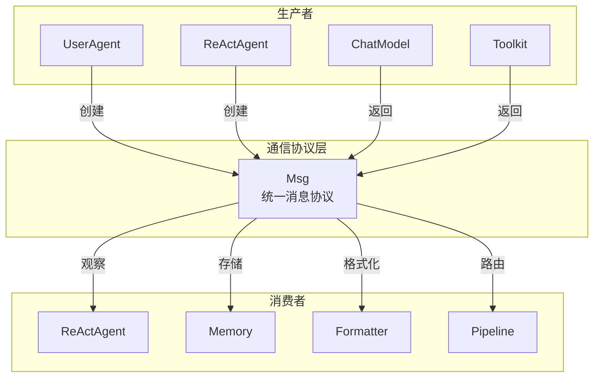

# Msg 基类：name / content / role

> **Level 3**: 理解模块边界  
> **前置要求**: [核心概念速览](../01-getting-started/01-concepts.md)  
> **后续章节**: [ContentBlock 类型系统](./02-content-blocks.md)

---

## 学习目标

学完之后，你能：
- 理解 Msg 的 6 个字段的含义和约束
- 创建各种类型的 Msg 对象
- 使用 `get_content_blocks()` 和 `get_text_content()` 提取内容
- 理解 Msg 为什么是 AgentScope 的"唯一通信协议"

---

## 背景问题

**为什么需要 Msg？**

在多 Agent 系统中，Agent A 给 Agent B 发一条消息，这条消息可能包含：
- 纯文本："北京天气怎么样"
- 工具调用请求：`{name: "get_weather", input: {city: "北京"}}`
- 工具执行结果：`{output: "25°C, 晴"}`
- 多模态内容：图片、音频

如果每个 Agent 自己定义消息格式，框架就没法统一处理路由、存储、格式化。Msg 就是 AgentScope 的**统一消息协议**。

**设计约束**: AgentScope 的 `Msg.role` 只有三种：`"user"`, `"assistant"`, `"system"`。注意没有 `"tool"` — 工具的结果也是 system 角色。这是与 OpenAI API 的一个关键差异。

---

## 源码入口

| 项目 | 值 |
|------|-----|
| **文件路径** | `src/agentscope/message/_message_base.py` |
| **类名** | `Msg` |
| **构造函数** | `__init__` (第 24 行) |
| **序列化** | `to_dict()` (第 75 行) |
| **反序列化** | `from_dict()` (第 86 行) |
| **内容提取** | `get_content_blocks()` (第 198 行) |
| **文本提取** | `get_text_content()` (第 123 行) |

---

## 架构定位

### Msg 在系统中的位置



**关键洞察**: Msg 是所有组件的**交汇点**。理解 Msg 就等于理解了 AgentScope 的通信模型。

---

## 核心源码分析

### Msg 的 6 个字段

**文件**: `src/agentscope/message/_message_base.py:24-73`

```python
class Msg:
    def __init__(
        self,
        name: str,                                      # 1. 发送者名称
        content: str | Sequence[ContentBlock],           # 2. 消息内容
        role: Literal["user", "assistant", "system"],    # 3. 角色
        metadata: dict[str, JSONSerializableObject] | None = None,  # 4. 元数据
        timestamp: str | None = None,                    # 5. 时间戳
        invocation_id: str | None = None,               # 6. API 调用 ID
    ) -> None:
```

| 字段 | 类型 | 必需 | 说明 |
|------|------|------|------|
| `name` | `str` | ✅ | 发送者名称，如 `"user"`, `"Friday"` |
| `content` | `str \| list[ContentBlock]` | ✅ | 消息正文，可以是纯文本或 Block 列表 |
| `role` | `"user" \| "assistant" \| "system"` | ✅ | 角色，被 assert 严格约束 |
| `metadata` | `dict \| None` | ❌ | 附加元数据，如结构化输出 |
| `timestamp` | `str \| None` | ❌ | 自动生成（精确到毫秒） |
| `invocation_id` | `str \| None` | ❌ | 关联的 API 调用 ID，用于追踪 |

还有一个隐式字段：`id` — 自动通过 `shortuuid.uuid()` 生成（第 66 行），用于唯一标识每条消息。

### 角色约束：为什么没有 "tool" 角色？

第 61 行的断言：

```python
assert role in ["user", "assistant", "system"]
```

与 OpenAI API 不同，AgentScope **故意不支持 `"tool"` 角色**。工具调用的结果使用 `"system"` 角色。

**设计原因**: 工具结果本质上是"系统生成的信息"，而非"用户或助手的表达"。使用 `system` 角色简化了角色模型（3 种而非 4 种），减少了角色判断的分支逻辑。

**工程权衡**: 这意味着如果你直接比较 AgentScope 的 Msg 与 OpenAI API 的 messages，角色可能不同。Formatter 负责处理这种差异。

### 内容的双重表示

第 54-59 行：

```python
assert isinstance(content, (list, str))
self.content = content
```

`content` 可以是：
- **字符串**: 简单文本消息
- **list[ContentBlock]**: 富文本/多模态消息

**设计用意**: 支持从简单到复杂的渐进式使用。一行字符串足够做简单 demo，ContentBlock 列表支持完整的工具调用、多模态场景。

### `get_content_blocks()` 的核心逻辑

**文件**: `_message_base.py:198-229`

```python
def get_content_blocks(self, block_type=None):
    blocks = []
    if isinstance(self.content, str):
        blocks.append(TextBlock(type="text", text=self.content))  # 自动转换
    else:
        blocks = self.content or []

    if isinstance(block_type, str):
        blocks = [_ for _ in blocks if _["type"] == block_type]
    elif isinstance(block_type, list):
        blocks = [_ for _ in blocks if _["type"] in block_type]
    return blocks
```

**关键行为**: 如果 `content` 是字符串，自动转换为 `TextBlock`。这确保了上游代码（如 `_react_agent.py`）可以统一用 `get_content_blocks("text")` 提取文本，无论原始 content 是字符串还是列表。

**类型安全**: 第 149-196 行使用了 Python 的 `@overload` 装饰器做类型窄化——传入 `"text"` 返回 `list[TextBlock]`，传入 `None` 返回 `list[ContentBlock]`。

### `get_text_content()` — 快速提取纯文本

**文件**: `_message_base.py:123-147`

```python
def get_text_content(self, separator: str = "\n") -> str | None:
    if isinstance(self.content, str):
        return self.content
    gathered_text = []
    for block in self.content:
        if block.get("type") == "text":
            gathered_text.append(block["text"])
    if gathered_text:
        return separator.join(gathered_text)
    return None
```

注意返回 `None` 的情况：当 content 是列表且没有 text block 时（如纯工具调用消息），返回 `None` 而不是空字符串。

---

## 使用示例

### 创建各种类型的 Msg

```python
from agentscope.message import Msg

# 纯文本用户消息
user_msg = Msg("user", "你好", "user")

# 多内容块助手消息
from agentscope.message import TextBlock, ToolUseBlock
assistant_msg = Msg(
    "assistant",
    [
        TextBlock(type="text", text="让我查一下"),
        ToolUseBlock(
            type="tool_use",
            id="call_1",
            name="get_weather",
            input={"city": "北京"},
        ),
    ],
    "assistant",
)

# 带元数据的消息（结构化输出）
structured_msg = Msg(
    "assistant",
    "查询结果如下...",
    "assistant",
    metadata={"temperature": 25, "condition": "晴"},
)
```

### 提取内容

```python
msg = Msg("assistant", [
    TextBlock(type="text", text="你好"),
    TextBlock(type="text", text="世界"),
], "assistant")

# 获取纯文本
text = msg.get_text_content()          # "你好\n世界"
text = msg.get_text_content(" ")       # "你好 世界"

# 按类型提取
texts = msg.get_content_blocks("text") # [TextBlock(...), TextBlock(...)]

# 检查是否包含某类型
msg.has_content_blocks("tool_use")     # False
msg.has_content_blocks("text")         # True
```

### 序列化与反序列化

```python
msg = Msg("user", "你好", "user")
data = msg.to_dict()
# {"id": "...", "name": "user", "role": "user", "content": "你好", ...}

restored = Msg.from_dict(data)
assert restored.name == msg.name
assert restored.content == msg.content
```

---

## 工程经验

### 为什么用 TypedDict 而不是 Pydantic 定义 ContentBlock？

`ContentBlock` 类型（`TextBlock`, `ToolUseBlock` 等）都是用 `TypedDict` 而非 Pydantic 定义的。

**原因**:
1. **性能**: TypedDict 没有运行时验证开销，它们就是 dict
2. **兼容性**: 直接对接 LLM API 返回的 JSON dict，零转换成本
3. **内存**: TypedDict 比 Pydantic 实例更轻量

**代价**: 没有自动验证。如果把 `"tool_use"` 拼成 `"tooluse"`，不会立即报错，而是在后续处理中静默失败。这是为了性能而做的权衡。

### 为什么 `content` 字段同时支持 str 和 list？

这是典型的"渐进式 API"设计：
- 新手用字符串：`Msg("user", "你好", "user")` — 简单直观
- 进阶用列表：`Msg("assistant", [TextBlock(...), ToolUseBlock(...)], "assistant")` — 功能完整

**替代方案**: 始终用 `list[ContentBlock]` 但提供工厂方法。AgentScope 选择了更宽松的方案，但代价是每个下游消费者都需要处理两种类型。

### `role` 的 assert 会带来什么坑？

```python
assert role in ["user", "assistant", "system"]
```

这是 **assert 语句**而非 **raise ValueError**。区别在于：`python -O`（优化模式）会跳过所有 assert。

在**生产环境**中通常不会用 `-O` 运行，所以这不是一个实际问题。但在测试框架中可能被优化掉。更好的做法是：

```python
if role not in ["user", "assistant", "system"]:
    raise ValueError(f"Invalid role: {role}")
```

这是代码中一个值得改进的点。

---

## Contributor 指南

### 适合新手的修改

| 文件 | 难度 | 可做的改进 |
|------|------|-----------|
| `_message_base.py` | ⭐ | 将 assert 改为显式 ValueError |
| `_message_block.py` | ⭐ | 新增 ContentBlock 类型（如 FileBlock） |

### 如何调试 Msg 相关问题

```python
# 打印 Msg 的完整信息
print(repr(msg))
# Msg(id='abc123', name='user', content='你好', role='user', ...)

# 检查 content 的实际结构
print(type(msg.content))
# <class 'str'> 或 <class 'list'>

# 如果是 list，检查每个 block
for block in msg.get_content_blocks():
    print(f"  type={block['type']}, keys={list(block.keys())}")
```

### 修改时的核心约束

1. **不要给 `role` 添加第四种值** — 会破坏 Formatter 的角色映射逻辑
2. **不要修改 `ContentBlock` 的必需字段** — 会影响所有下游消费者
3. **如果新增 Block 类型** — 必须同步更新 `ContentBlock` 联合类型和 `ContentBlockTypes`

---

## 下一步

> 理解了 Msg 的基本结构后，接下来要理解 Msg 中可以承载的 7 种 ContentBlock 类型。

阅读 [ContentBlock 类型系统](./02-content-blocks.md)。


---

## 工程现实与架构问题

### 技术债 (消息层)

| 位置 | 问题 | 影响 | 优先级 |
|------|------|------|--------|
| `_message_base.py:123` | `role` 使用 assert 而非 ValueError | 优化模式 `-O` 下验证失效 | 中 |
| `Msg.content` | str/list 混合类型处理复杂 | 下游需要类型判断分支 | 中 |
| 序列化 | `invocation_id` 可能为 None | 追踪时消息关联丢失 | 低 |

**[HISTORICAL INFERENCE]**: assert vs ValueError 是早期快速迭代的遗留，验证失效风险低但存在。str/list 混合是渐进式 API 的代价，类型判断增加了下游复杂度。

### 性能考量

```python
# Msg 操作延迟估算
Msg.__init__():                ~0.01-0.05ms
get_text_content():            ~0.001-0.01ms
to_dict():                    ~0.01-0.05ms
from_dict():                  ~0.01-0.05ms

# 序列化影响
大型 Msg (100+ blocks):      ~0.5-2ms
经 network 传输:              ~10-100ms
```

### 渐进式重构方案

```python
# 方案: 统一 content 类型
class Msg:
    def __init__(self, name, content, role, ...):
        # 将字符串自动转换为 TextBlock 列表
        if isinstance(content, str):
            content = [TextBlock(type="text", text=content)]
        self.content: list[ContentBlock] = content

    def get_text_content(self) -> str:
        # 不再需要类型判断
        return "\n".join(
            block["text"] for block in self.content
            if block.get("type") == "text"
        )
```

