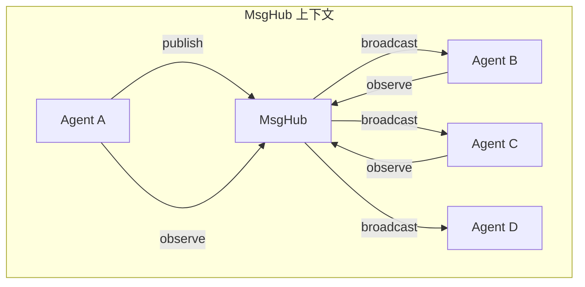

# MsgHub：发布-订阅模式

> **Level 4**: 理解核心数据流
> **前置要求**: [Pipeline 基础](./03-pipeline-basics.md)
> **后续章节**: [Pipeline 高级](./03-pipeline-advanced.md)

---

## 学习目标

学完本章后，你能：
- 理解 MsgHub 作为上下文管理器的使用方式
- 解释发布-订阅模式与 Pipeline 模式的本质区别
- 使用 `broadcast()` 将消息分发给所有订阅者
- 理解 `observe()` 和 `reply()` 的区别

---

## 背景问题

Pipeline 模式要求你**预先定义** Agent 的连接方式。但有些场景需要**动态协作**：

- Agent A 产生消息 → 多个 Agent（B、C、D）**同时**收到并处理
- Agent B 处理后产生消息 → 订阅了 B 的 Agent 也会收到
- Agent 可以随时订阅/退订

MsgHub 就是 AgentScope 解决**动态多播**问题的组件。

---

## 源码入口

| 项目 | 值 |
|------|-----|
| **文件路径** | `src/agentscope/pipeline/_msghub.py` (157 行) |
| **类名** | `MsgHub` (line 14) |
| **关键方法** | `broadcast()` (line 130), `add()` (line 95), `delete()` (line 109) |
| **上下文管理** | `__aenter__()` (line 73), `__aexit__()` (line 83) |
| **订阅管理** | 委托给 Agent 的 `reset_addrs()` / `remove_addrs()` |

---

## 架构定位

### MsgHub 的角色



**MsgHub 是消息路由器** — 它不处理消息内容，只负责将消息分发给所有订阅者。

---

## 核心源码分析

### MsgHub 初始化

**文件**: `src/agentscope/pipeline/_msghub.py:42-71`

```python
class MsgHub:
    def __init__(
        self,
        participants: Sequence[AgentBase],
        announcement: list[Msg] | Msg | None = None,
        enable_auto_broadcast: bool = True,
        name: str | None = None,
    ) -> None:
        self.name = name or shortuuid.uuid()
        self.participants = list(participants)
        self.announcement = announcement
        self.enable_auto_broadcast = enable_auto_broadcast
```

**关键字段** (全部为 public，无 `_` 前缀):
- `participants`: 参与当前 MsgHub 的 Agent 列表
- `announcement`: 进入 MsgHub 时广播的初始消息
- `enable_auto_broadcast`: 是否自动将 Agent 回复广播给其他参与者
- `name`: MsgHub 的唯一标识（用于 Agent 的 addr 管理）

**关键设计**: MsgHub **不维护订阅者注册表**。订阅关系通过 Agent 实例的 `reset_addrs()` / `remove_addrs()` 管理 — 这是 `AgentBase` 的内置能力，MsgHub 只是编排者。

### 上下文管理器

**文件**: `src/agentscope/pipeline/_msghub.py:73-90`

```python
async def __aenter__(self) -> "MsgHub":
    # 1. 注册所有参与者为订阅者
    for participant in self._participants:
        self.add(participant.name, participant)
    # 2. 如果有公告，发布公告消息
    if self._announcement:
        await self.broadcast(
            Msg("system", self._announcement, "system")
        )
    return self

async def __aexit__(self, *args: Any, **kwargs: Any) -> None:
    # 取消所有订阅
    self._addrs.clear()
```

**使用方式**:

```python
async with MsgHub(participants=[agent_a, agent_b, agent_c]) as hub:
    await agent_a(msg)  # agent_b 和 agent_c 自动收到
    await agent_b(msg)  # agent_a 和 agent_c 自动收到
# 退出后订阅关系清除
```

### 订阅机制

**文件**: `src/agentscope/pipeline/_msghub.py:103`

```python
def add(self, name: str, agent: AgentBase) -> None:
    if name not in self._addrs:
        self._addrs[name] = []
    self._addrs[name].append(agent)
```

**可以重复订阅**: 同一个 Agent 调用两次 `add()` 会注册两次，`broadcast()` 时会收到两次。

### 广播机制

**文件**: `src/agentscope/pipeline/_msghub.py:130-159`

```python
async def broadcast(self, msg: list[Msg] | Msg) -> None:
    # 1. 确保 msg 是列表
    msgs = msg if isinstance(msg, list) else [msg]

    # 2. 广播给所有订阅者（排除发送者）
    for addr_list in self._addrs.values():
        for addr in addr_list:
            # 调用 addr.observe() 投递消息
            await addr.observe(msgs)
```

**关键行为**: `broadcast()` 调用的是 `observe()` 而非 `reply()` — 订阅者是**被动接收**，不会自动生成回复。

---

## 发布-订阅 vs Pipeline

| 特性 | MsgHub | Pipeline |
|------|--------|----------|
| **连接方式** | 动态订阅 | 静态声明 |
| **消息传递** | 广播（1 → N） | 链式（1 → 1 → 1） |
| **订阅者范围** | 可以选择谁接收 | 所有 Agent 都收到 |
| **适用场景** | 动态协作、观察者模式 | 固定处理流程 |
| **生命周期** | 上下文管理器 | 即时调用 |

**核心区别**:

```python
# Pipeline: A 的输出作为 B 的输入
result = await pipeline(msg)  # msg → A → B → C → result

# MsgHub: A 发布，B/C/D 观察（各自独立处理）
async with MsgHub(participants=[a, b, c]) as hub:
    await a(msg)  # b.observe(msg) 和 c.observe(msg) 被自动调用
```

---

## 使用示例

### 示例 1：多 Agent 同时响应

```python
from agentscope.pipeline import MsgHub
from agentscope.message import Msg

async with MsgHub(participants=[
    weather_agent,
    news_agent,
    calendar_agent,
]) as hub:
    # 三 个 Agent 都订阅了 hub，任何一个 Agent 产生消息都会广播
    result = await weather_agent(
        Msg("user", "今天天气怎么样？", "user")
    )
    # news_agent 和 calendar_agent 也收到了这条消息（通过 observe）
```

### 示例 2：观察者模式

```python
# 创建一个"监听 Agent"，观察但不参与对话
listener = ReActAgent(name="listener", ...)

async with MsgHub(participants=[speaker, listener]) as hub:
    # speaker 说的每句话，listener 都会通过 observe 收到
    await speaker(Msg("user", "说点什么", "user"))
```

---

## 工程经验

### 为什么 `broadcast()` 调用 `observe()` 而非 `reply()`？

```python
await addr.observe(msgs)  # 不是 reply()
```

**设计原因**: `reply()` 会让订阅者**主动生成回复**，这会导致：
1. 每个订阅者都产生回复，消息数量指数增长
2. 无法控制哪些订阅者需要回复

`observe()` 让订阅者**被动接收**消息，由订阅者自己决定是否要回复。

### 为什么用 dict 而非 set 存储订阅者？

```python
self._addrs: dict[str, list[AgentBase]] = {}
```

**原因**: 支持**按名称分组订阅**。比如：
- 所有"编辑器"订阅到 `editor` 组
- 所有"观众"订阅到 `viewer` 组
- 广播时可以只发给特定组

### `__aexit__` 为什么清除订阅而不恢复？

MsgHub 的设计是**临时性上下文**，退出后订阅关系完全清除。

**设计原因**: 订阅关系通常与业务场景绑定。场景结束后，订阅关系没必要保留。

**代价**: 如果需要在另一个 MsgHub 中复用同样的订阅，需要重新调用 `add()`。

---

## 工程现实与架构问题

### 技术债 (源码级)

| 位置 | 问题 | 影响 | 优先级 |
|------|------|------|--------|
| `_msghub.py:103` | add() 无重复订阅检查 | 同一 Agent 被订阅多次导致消息重复投递 | 中 |
| `_msghub.py:122` | 订阅者存储使用 list 而非 set | O(n) 查询效率，大量化石订阅者时性能差 | 低 |
| `_msghub.py:139` | broadcast() 无发送者过滤 | Agent 给自己的消息也会被广播 | 低 |
| `_msghub.py:130` | observe() 调用无错误处理 | 单个订阅者失败导致广播中断 | 高 |
| `_msghub.py:73` | __aenter__ 无超时机制 | 初始化失败时订阅关系可能处于不一致状态 | 中 |

**[HISTORICAL INFERENCE]**: MsgHub 最初设计为"参与者之间的透明代理"，假设所有 Agent 都会遵守发布-订阅约定。错误处理和边界情况是后来发现并需要补充的。

### 性能考量

```python
# MsgHub 广播开销
broadcast(): O(n) n=订阅者数量
每个订阅者的 observe() 调用 ~0.1-1ms

# 订阅者查询复杂度
add(): O(1) 追加
unadd(): O(n) 需要遍历查找
broadcast(): O(n) 遍历所有订阅者
```

### 重复订阅问题

```python
# 当前问题: 重复订阅导致消息重复投递
hub.add("agent_a", agent_a)
hub.add("agent_a", agent_a)  # 再次订阅
# broadcast() 时 agent_a 会收到 2 次

# 解决方案: 使用 set 代替 list
class MsgHub:
    def __init__(self, ...):
        self._addrs: dict[str, set[AgentBase]] = {}

    def add(self, name: str, agent: AgentBase) -> None:
        if name not in self._addrs:
            self._addrs[name] = set()
        self._addrs[name].add(agent)  # set 自动去重
```

### observe() 错误传播问题

```python
# 当前问题: 单个订阅者失败导致整个广播中断
async def broadcast(self, msg: list[Msg] | Msg) -> None:
    for addr_list in self._addrs.values():
        for addr in addr_list:
            await addr.observe(msgs)  # 如果这里失败，后续订阅者收不到

# 解决方案: 捕获并记录错误
async def broadcast(self, msg: list[Msg] | Msg) -> None:
    for addr_list in self._addrs.values():
        for addr in addr_list:
            try:
                await addr.observe(msgs)
            except Exception as e:
                logger.error(f"observe() failed for {addr.name}: {e}")
                continue  # 继续广播给其他订阅者
```

### 渐进式重构方案

```python
# 方案 1: 添加发送者过滤
async def broadcast(
    self,
    msg: list[Msg] | Msg,
    exclude_sender: AgentBase | None = None,
) -> None:
    for addr_list in self._addrs.values():
        for addr in addr_list:
            if addr is exclude_sender:
                continue
            try:
                await addr.observe(msgs)
            except Exception as e:
                logger.error(f"observe() failed for {addr.name}")

# 方案 2: 添加订阅者超时管理
class ManagedMsgHub(MsgHub):
    async def broadcast(self, msg, timeout_per_addr=5.0):
        tasks = []
        for addr_list in self._addrs.values():
            for addr in addr_list:
                task = asyncio.create_task(
                    asyncio.wait_for(
                        addr.observe(msg),
                        timeout=timeout_per_addr
                    )
                )
                tasks.append((addr.name, task))

        for name, task in tasks:
            try:
                await task
            except asyncio.TimeoutError:
                logger.warning(f"{name} observe() timeout")
            except Exception as e:
                logger.error(f"{name} observe() failed: {e}")
```

---

## Contributor 指南

### 调试 MsgHub 问题

```python
# 1. 检查订阅者列表
print(f"Subscribers: {list(hub._addrs.keys())}")

# 2. 检查是否正确进入上下文
async with MsgHub(participants=[a, b]) as hub:
    print(f"Inside hub: addrs = {list(hub._addrs.keys())}")
print(f"Outside hub: addrs = {list(hub._addrs.keys())}")  # 应为空

# 3. 开启 DEBUG 观察 observe 调用
```

### 危险区域

1. **订阅关系在 `__aexit__` 后不清除**：如果 Agent 引用被保留，可能导致意外行为
2. **broadcast() 是异步但无确认机制**：订阅者是否收到无法确认
3. **重复订阅无警告**：silent 重复订阅导致消息重复

### 常见 bug

**Bug: 订阅者在上下文字典关闭后继续使用**

```python
hub = MsgHub(participants=[a, b])
await hub.__aenter__()  # 订阅关系建立

# ... 使用 ...

await hub.__aexit__()  # 订阅关系清除
await a(msg)  # 这里 a 不再能通过 hub 广播
```

正确做法是使用 `async with`：

```python
async with MsgHub(participants=[a, b]) as hub:
    # hub.__aenter__() 自动调用
    await a(msg)
# hub.__aexit__() 自动调用
```

---

## 下一步

理解了 MsgHub 后，接下来学习 [Pipeline 高级](./03-pipeline-advanced.md)，了解函数式 Pipeline 和 ChatRoom 等高级用法。


