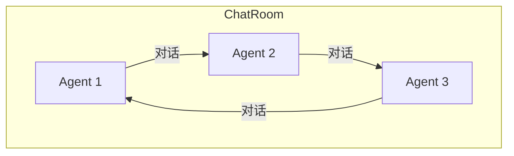

# Pipeline 高级：函数式 API 与 ChatRoom

> **Level 5**: 源码调用链
> **前置要求**: [MsgHub 发布-订阅](./03-msghub.md)
> **后续章节**: [Agent 架构](../04-agent-architecture/04-agent-base.md)

---

## 学习目标

学完本章后，你能：
- 使用函数式 Pipeline API（`sequential_pipeline()` 等）
- 理解 `ChatRoom` 的聊天室模式
- 实现自定义 Pipeline 组合
- 理解 Pipeline 的错误处理机制

---

## 背景问题

除了类-based 的 Pipeline，AgentScope 还提供了函数式 API。这种风格更简洁，适合简单场景。

另外，`ChatRoom` 提供了"多 Agent 聊天室"模式，适合需要 Agent 间多轮对话的场景。

---

## 函数式 Pipeline API

**文件**: `src/agentscope/pipeline/_functional.py`

### sequential_pipeline

```python
async def sequential_pipeline(msg: Msg, agents: list[AgentBase]) -> Msg:
    current = msg
    for agent in agents:
        current = await agent(current)
    return current
```

等价于 `SequentialPipeline(agents)(msg)`，但更简洁。

### parallel_pipeline

```python
async def parallel_pipeline(msg: Msg, agents: list[AgentBase]) -> list[Msg]:
    results = await asyncio.gather(*[agent(msg) for agent in agents])
    return list(results)
```

等价于 `FanoutPipeline(agents)(msg)`。

### if_else_pipeline

条件分支 Pipeline：

```python
# 伪代码
if condition:
    return await agent_a(msg)
else:
    return await agent_b(msg)
```

---

## ChatRoom：聊天室模式

**文件**: `src/agentscope/pipeline/_chat_room.py`

ChatRoom 允许多个 Agent 在一个"聊天室"中多轮对话：



### 源码分析

```python
class ChatRoom:
    def __init__(
        self,
        agents: Sequence[AgentBase],
        max_turns: int | None = None,
    ) -> None:
        self.agents = list(agents)
        self.max_turns = max_turns  # 最多轮次
```

### 与 MsgHub 的区别

| 特性 | ChatRoom | MsgHub |
|------|----------|--------|
| **对话模式** | 多轮对话 | 单次广播 |
| **Agent 间通信** | 直接通信 | 通过 hub 中转 |
| **状态管理** | 维护对话历史 | 无状态 |

---

## 错误处理

### Pipeline 级别的错误处理

```python
try:
    result = await pipeline(msg)
except Exception as e:
    logger.error(f"Pipeline failed: {e}")
    # 决定：重试？降级？失败？
```

### 单 Agent 错误不影响整体

```python
# FanoutPipeline 中，一个 Agent 失败不影响其他
results = await asyncio.gather(
    agent_a(msg),
    agent_b(msg),
    agent_c(msg),
    return_exceptions=True,  # 捕获异常而不抛出
)
```

---

## 工程经验

### 何时用函数式 vs 类式？

| 场景 | 推荐方式 |
|------|----------|
| 简单串行/并行 | 函数式 (`sequential_pipeline()`) |
| 需要保存状态 | 类式 (`SequentialPipeline`) |
| 复杂路由逻辑 | 自定义类 |

### ChatRoom 的典型用法

```python
from agentscope.pipeline import ChatRoom

room = ChatRoom(
    agents=[agent_a, agent_b, agent_c],
    max_turns=10,
)

# 初始化消息
init_msg = Msg("system", "开始讨论：AI 的未来", "system")

# 运行多轮对话
results = await room.run(init_msg)
```

---

## 工程现实与架构问题

### 技术债 (源码级)

| 位置 | 问题 | 影响 | 优先级 |
|------|------|------|--------|
| `_functional.py:14` | sequential_pipeline 无状态保存 | 无法实现管道检查点 | 中 |
| `_functional.py:48` | parallel_pipeline 无条件分支 | if_else_pipeline 是伪代码 | 高 |
| `_chat_room.py:50` | ChatRoom 无超时机制 | 慢 Agent 导致无限等待 | 高 |
| `_chat_room.py:88` | max_turns 无Agent完成检测 | 强制轮次可能中断有效对话 | 中 |
| `_functional.py:90` | if_else_pipeline 未实现 | 只是注释的伪代码 | 高 |

**[HISTORICAL INFERENCE]**: 函数式 API 是为了简化简单场景设计的，假设用户会自己实现复杂逻辑。ChatRoom 是从 Room 类复制改写的，保留了原实现的一些问题。

### 性能考量

```python
# 函数式 Pipeline 开销
sequential_pipeline(): O(n) 串行执行
parallel_pipeline(): O(1) 并发执行，但有 asyncio.gather 开销

# ChatRoom 开销
ChatRoom.run(): n_turns × 每轮延迟
每轮延迟 = max(各Agent响应时间)
```

### ChatRoom 并发问题

```python
# 当前问题: max_turns 硬性限制可能导致有效对话中断
class ChatRoom:
    async def run(self, msg, max_turns=10):
        for i in range(max_turns):  # 不管对话是否已收敛
            result = await agent_i(msg)

# 问题: 如果 Agent 在 3 轮内已达成共识，第 4-10 轮是浪费
# 解决方案: 添加对话收敛检测
class SmartChatRoom(ChatRoom):
    async def run(self, msg, max_turns=10, convergence_threshold=2):
        prev_result = None
        stable_turns = 0
        for i in range(max_turns):
            result = await self._get_next_response(msg)
            if prev_result and self._is_converged(prev_result, result):
                stable_turns += 1
                if stable_turns >= convergence_threshold:
                    break
            else:
                stable_turns = 0
            prev_result = result
        return prev_result
```

### 渐进式重构方案

```python
# 方案 1: 实现 if_else_pipeline
async def if_else_pipeline(
    agents: list[AgentBase],
    msg: Msg,
    condition_fn: Callable[[Msg], bool],
) -> Msg:
    """条件分支管道"""
    if condition_fn(msg):
        return await agents[0](msg)
    else:
        return await agents[1](msg)

# 方案 2: 添加 ChatRoom 超时控制
class TimeoutChatRoom(ChatRoom):
    async def run(self, msg, max_turns=10, turn_timeout=30.0):
        for i in range(max_turns):
            try:
                result = await asyncio.wait_for(
                    self._get_next_response(msg),
                    timeout=turn_timeout
                )
            except asyncio.TimeoutError:
                logger.warning(f"Turn {i} timeout, stopping")
                break
        return result
```

---

## Contributor 指南

### 如何测试自定义 Pipeline

```python
import pytest

@pytest.mark.asyncio
async def test_my_pipeline():
    # 1. 准备 mock agent
    mock_agent = AsyncMock()
    mock_agent.return_value = Msg("assistant", "response", "assistant")

    # 2. 创建 pipeline
    pipeline = MyPipeline([mock_agent])

    # 3. 调用
    result = await pipeline(Msg("user", "test", "user"))

    # 4. 验证
    assert result.name == "assistant"
    assert mock_agent.called
```

### 危险区域

1. **ChatRoom 的 `_get_next_response` 必须由子类实现**：基类只是抽象
2. **函数式 API 无状态**：每次调用都是新的执行，无记忆
3. **parallel_pipeline 共享消息引用**：多个 Agent 可能修改同一消息对象

---

## 下一步

现在你理解了 Pipeline 的全部内容。接下来深入学习 [Agent 架构](../04-agent-architecture/04-agent-base.md)。


