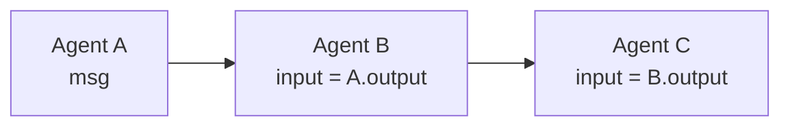
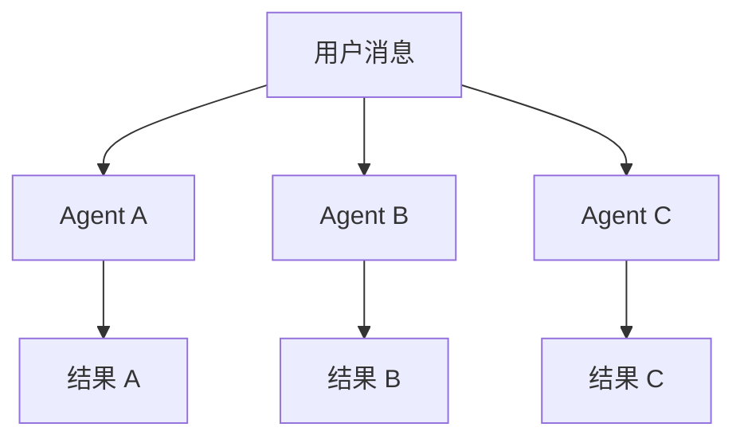
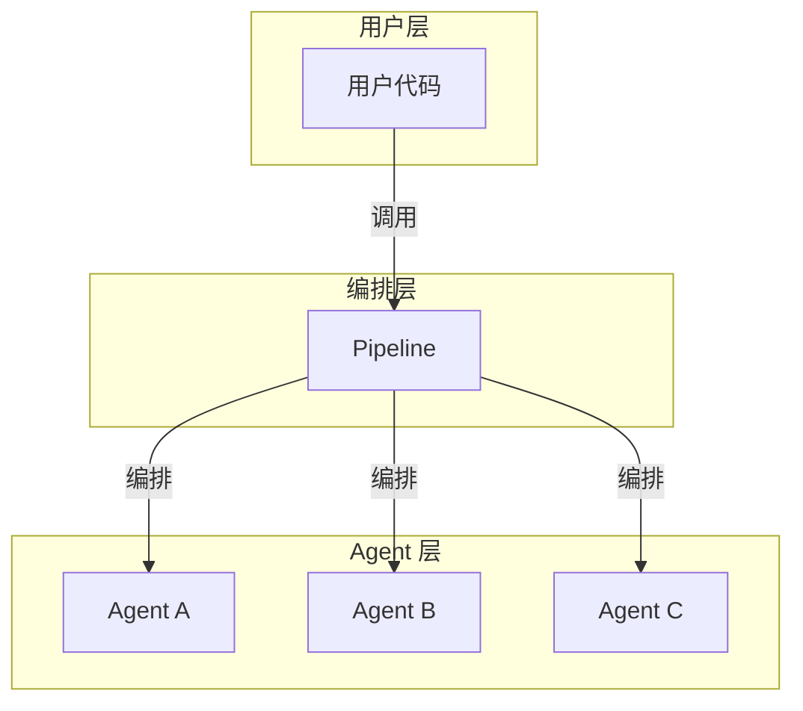

# Pipeline 基础：编排多个 Agent

> **Level 3**: 理解模块边界
> **前置要求**: [消息生命周期](../02-message-system/02-message-lifecycle.md)
> **后续章节**: [MsgHub 发布-订阅](./03-msghub.md)

---

## 学习目标

学完本章后，你能：
- 理解 Pipeline 的 3 种基本类型及适用场景
- 使用 `SequentialPipeline` 实现 Agent 串行编排
- 使用 `FanoutPipeline` 实现 Agent 并行分发
- 理解 Pipeline 与 MsgHub 的核心区别

---

## 背景问题

当你有多个 Agent 需要协作时，问题出现了：
- **串行**: Agent A 的输出 → Agent B 的输入 → Agent C 的输入
- **并行**: 一条消息同时发给 Agent A、B、C，各自处理
- **条件分支**: 根据条件选择不同的 Agent 处理

Pipeline 就是 AgentScope 解决"**多个 Agent 如何连接**"这个问题的抽象。

---

## 源码入口

| 项目 | 值 |
|------|-----|
| **类文件** | `src/agentscope/pipeline/_class.py` |
| **函数式实现** | `src/agentscope/pipeline/_functional.py` |
| **核心类** | `SequentialPipeline` (line 10), `FanoutPipeline` (line 43) |
| **核心函数** | `sequential_pipeline` (line 10), `fanout_pipeline` (line 47), `stream_printing_messages` (line 107) |
| **关键方法** | `__call__()` — 委托给 `_functional.py` 中的函数 |

---

## 3 种 Pipeline 类型

### SequentialPipeline — 串行管道

**文件**: `src/agentscope/pipeline/_class.py:10-40`

Agent A → B → C 串行执行，每个 Agent 的输出成为下一个 Agent 的输入：



**源码** (`_class.py` 是薄包装，实际逻辑在 `_functional.py:10-44`):

```python
# _class.py:10
class SequentialPipeline:
    def __init__(self, agents: list[AgentBase]) -> None:
        self.agents = agents

    async def __call__(
        self, msg: Msg | list[Msg] | None = None
    ) -> Msg | list[Msg] | None:
        return await sequential_pipeline(agents=self.agents, msg=msg)

# _functional.py:10
async def sequential_pipeline(
    agents: list[AgentBase],
    msg: Msg | list[Msg] | None = None,
) -> Msg | list[Msg] | None:
    for agent in agents:
        msg = await agent(msg)
    return msg
```

**关键设计**：`SequentialPipeline` 是**可重用的**类包装，`sequential_pipeline` 是**一次性的**函数。两者功能等价，但类版本更适合需要反复调用同一 Pipeline 的场景。

**使用示例**:

```python
from agentscope.pipeline import SequentialPipeline

pipeline = SequentialPipeline([
    researcher_agent,   # Agent A
    writer_agent,       # Agent B
    reviewer_agent,     # Agent C
])

result = await pipeline(user_msg)
# user_msg → researcher → writer → reviewer → final_result
```

### FanoutPipeline — 并行分发

**文件**: `src/agentscope/pipeline/_class.py:43-65`

一条消息同时发给多个 Agent，各自独立处理：



**源码** (`_class.py` 是薄包装，实际逻辑在 `_functional.py:47-104`):

```python
# _class.py:43
class FanoutPipeline:
    def __init__(
        self,
        agents: list[AgentBase],
        enable_gather: bool = True,
    ) -> None:
        self.agents = agents
        self.enable_gather = enable_gather

    async def __call__(
        self, msg: Msg | list[Msg] | None = None, **kwargs: Any
    ) -> list[Msg]:
        return await fanout_pipeline(
            agents=self.agents, msg=msg,
            enable_gather=self.enable_gather, **kwargs,
        )

# _functional.py:47
async def fanout_pipeline(
    agents: list[AgentBase],
    msg: Msg | list[Msg] | None = None,
    enable_gather: bool = True,
    **kwargs: Any,
) -> list[Msg]:
    if enable_gather:
        tasks = [
            asyncio.create_task(agent(deepcopy(msg), **kwargs))
            for agent in agents
        ]
        return await asyncio.gather(*tasks)
    else:
        return [await agent(deepcopy(msg), **kwargs) for agent in agents]
```

**关键设计**: 
1. `deepcopy(msg)` 防止 Agent 之间通过修改消息产生**隐式耦合** — 每个 Agent 获得独立的消息副本
2. `enable_gather=False` 可降级为串行执行，用于调试或工具间有依赖的场景

**使用示例**:

```python
from agentscope.pipeline import FanoutPipeline

pipeline = FanoutPipeline([
    weather_agent,
    news_agent,
    calendar_agent,
])

results = await pipeline(Msg("user", "今天怎么样？", "user"))
# results = [weather_result, news_result, calendar_result]
```

### 条件分支

**[UNVERIFIED]**: `IfElsePipeline` 在 `pipeline/` 中**不存在**。Pipeline 的条件分支需要通过 Python 原生 `if/else` 实现：

```python
if condition:
    result = await pipeline_a(msg)
else:
    result = await pipeline_b(msg)
```

这不是框架内置功能，而是用户侧的组合方式。

**文件**: `_class.py` (行数待确认)

根据条件选择不同的 Agent 处理路径：

```python
# 伪代码示例
if condition:
    result = await agent_a(msg)
else:
    result = await agent_b(msg)
```

---

## 架构定位

### Pipeline 在系统中的位置



**Pipeline 是 Meta 层** — 它不处理消息内容，只控制 Agent 间的消息路由。

### Pipeline vs MsgHub

| 特性 | Pipeline | MsgHub |
|------|----------|--------|
| **连接方式** | 显式声明 | 动态订阅 |
| **消息传递** | A 输出 → B 输入 | 发布-订阅（广播） |
| **适用场景** | 固定流程 | 动态协作 |
| **生命周期管理** | 临时 | 上下文管理器 |

---

## 使用示例

### 完整示例：研究 → 写作 → 审校

```python
from agentscope.agent import ReActAgent
from agentscope.pipeline import SequentialPipeline

# 三个专业 Agent
researcher = ReActAgent(
    name="researcher",
    sys_prompt="你是一个研究员，负责收集信息...",
    model=...,
)

writer = ReActAgent(
    name="writer",
    sys_prompt="你是一个作家，负责撰写文章...",
    model=...,
)

reviewer = ReActAgent(
    name="reviewer",
    sys_prompt="你是一个审校，负责检查文章质量...",
    model=...,
)

# 串行编排
pipeline = SequentialPipeline([researcher, writer, reviewer])

# 用户请求
user_msg = Msg("user", "写一篇关于 AI 的文章", "user")

# 执行流水线
result = await pipeline(user_msg)
```

---

## 工程经验

### 为什么 Pipeline 用 `asyncio.gather` 而非串行 await？

`FanoutPipeline` 使用 `asyncio.gather` 实现并行：

```python
results = await asyncio.gather(
    *[agent(msg) for agent in self.agents]
)
```

**原因**:
1. **真正的并发**: 多个 Agent 同时运行，不等待彼此
2. **性能提升**: 如果每个 Agent 耗时 1 秒，3 个 Agent 串行需要 3 秒，并行只需 1 秒

**代价**:
1. 共享状态需要加锁（如共享 Memory）
2. 错误处理更复杂（一个 Agent 失败不影响其他）

### 为什么 SequentialPipeline 返回最后一个 Agent 的输出？

```python
async def __call__(self, msg: Msg) -> Msg:
    current_msg = msg
    for agent in self.agents:
        current_msg = await agent(current_msg)  # 每次都覆盖
    return current_msg
```

**设计原因**: SequentialPipeline 的语义是"处理流水线"，最终输出是流水线的产物。如果需要保留中间结果，应该用 `FanoutPipeline` 或自定义逻辑。

---

## 工程现实与架构问题

### Pipeline 技术债

| 位置 | 问题 | 影响 | 优先级 |
|------|------|------|--------|
| `_class.py:10` | SequentialPipeline 无消息累积 | 中间结果无法查看 | 低 |
| `_class.py:43` | FanoutPipeline deepcopy 消息开销大 | 大消息体导致性能差 | 中 |
| `_class.py:50` | Pipeline 无错误恢复机制 | 一个 Agent 失败导致整体失败 | 高 |
| `_functional.py:14` | sequential_pipeline 不支持条件分支 | 无法实现 if/else 逻辑 | 中 |

**[HISTORICAL INFERENCE]**: Pipeline 设计初期以简单场景为主，假设 Agent 是无状态的且可靠的。

### 性能考量

```python
# Pipeline 操作开销
SequentialPipeline.forward(): sum(每个Agent延迟)
FanoutPipeline.forward(): max(每个Agent延迟) + deepcopy开销

# deepcopy 估算
小消息 (~1KB): ~0.1ms
中消息 (~100KB): ~5ms
大消息 (~1MB): ~50ms

# 建议:
# - 小消息用 FanoutPipeline
# - 大消息减少 deepcopy 次数
```

### 消息覆盖问题

```python
# SequentialPipeline 只返回最后一个 Agent 的输出
pipeline = SequentialPipeline([agent_a, agent_b, agent_c])
result = await pipeline(initial_msg)
# result 只包含 agent_c 的输出
# agent_a 和 agent_b 的输出丢失

# 如果需要保留所有输出:
class CollectingPipeline(SequentialPipeline):
    async def forward(self, msg: Msg) -> list[Msg]:
        results = []
        current_msg = msg
        for agent in self.agents:
            current_msg = await agent(current_msg)
            results.append(current_msg)
        return results
```

### 渐进式重构方案

```python
# 方案 1: 添加条件 Pipeline
class ConditionalPipeline(PipelineBase):
    def __init__(self, branches: dict[str, AgentBase], default: AgentBase):
        self.branches = branches
        self.default = default

    async def forward(self, msg: Msg) -> Msg:
        # 根据消息内容选择分支
        branch_key = self._decide_branch(msg)
        agent = self.branches.get(branch_key, self.default)
        return await agent(msg)

# 方案 2: 添加 Pipeline 监控
class MonitoredPipeline(PipelineBase):
    def __init__(self, agents: list[AgentBase]):
        super().__init__(agents)
        self._metrics = []

    async def forward(self, msg: Msg) -> Msg:
        results = []
        for agent in self.agents:
            start = time.time()
            result = await agent(msg)
            duration = time.time() - start
            self._metrics.append({"agent": agent.name, "duration": duration})
        return result
```

---

## Contributor 指南

### 如何创建自定义 Pipeline

```python
class MyPipeline:
    def __init__(self, agents: list[AgentBase]) -> None:
        self.agents = agents

    async def __call__(self, msg: Msg) -> Msg | list[Msg]:
        # 你的自定义逻辑
        pass
```

### 调试 Pipeline 问题

```python
# 1. 检查每个 Agent 是否正确接收消息
for i, agent in enumerate(pipeline.agents):
    print(f"Agent {i}: {agent.name}")

# 2. 开启 DEBUG 日志
import agentscope
agentscope.init(logging_level="DEBUG")

# 3. 逐步执行（串行 Pipeline）
current_msg = user_msg
for agent in pipeline.agents:
    print(f"Calling {agent.name}...")
    current_msg = await agent(current_msg)
    print(f"Result: {current_msg.content[:50]}...")
```

---

## 下一步

理解了 Pipeline 的基本类型后，接下来学习 [MsgHub 发布-订阅](./03-msghub.md)，它提供了更动态的 Agent 协作方式。


