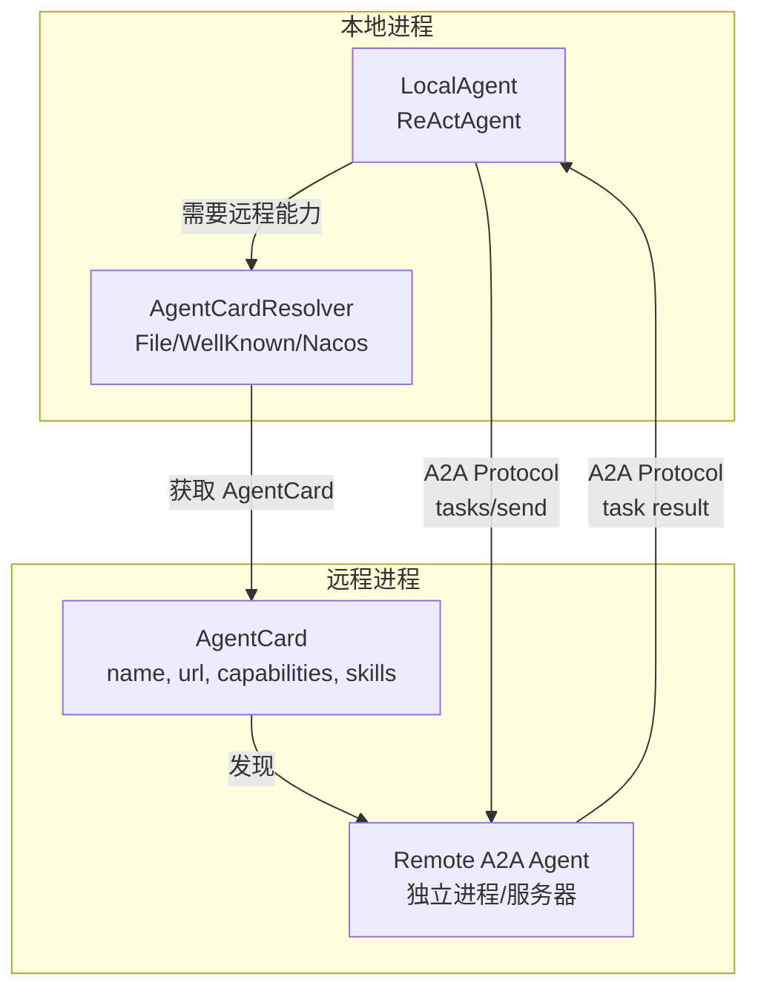
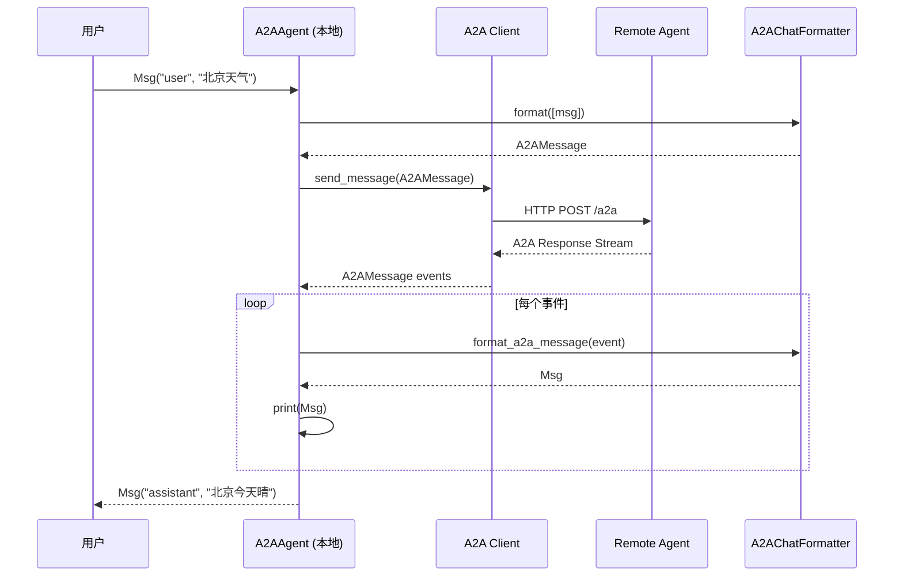

# A2AAgent：Agent-to-Agent 协议

> **Level 5**: 源码调用链
> **前置要求**: [UserAgent 人工参与](./04-user-agent.md)
> **后续章节**: [模型与格式化器](../05-model-formatter/05-model-interface.md)

---

## 学习目标

学完本章后，你能：
- 理解 A2A（Agent-to-Agent）协议的目的和架构
- 掌握 A2AAgent 的实现细节和消息转换机制
- 知道 A2A 的发现机制（Agent Card）
- 理解 A2AAgent 与普通 Agent 的区别和限制

---

## 背景问题

当多个 Agent 部署在不同机器上时，它们如何发现彼此并通信？

**传统方案的问题**：
- 每个 Agent 框架有自己的通信协议
- 服务发现依赖特定平台（Nacos、etcd）
- 缺乏标准化导致互操作困难

**A2A（Agent-to-Agent）协议**是 Google 提出的开放标准，让不同实现、不同部署的 Agent 能相互通信。

---

## 源码入口

| 项目 | 值 |
|------|-----|
| **文件路径** | `src/agentscope/agent/_a2a_agent.py` |
| **类名** | `A2AAgent` |
| **行数** | 288 行 |
| **协议实现** | `src/agentscope/a2a/` (AgentCard 解析器: File/WellKnown/Nacos) |
| **Formatter** | `src/agentscope/formatter/_a2a_formatter.py` |

---

## 架构定位

### A2AAgent 在分布式 Agent 拓扑中的角色



**关键**: `A2AAgent` 既可作为客户端也可作为服务端。`AgentCard` 是服务发现的核心——描述 Agent 的能力、端点 URL 和 I/O 模式。解析器从文件 (`FileAgentCardResolver`)、Well-Known URI (`WellKnownAgentCardResolver`) 或 Nacos 注册中心获取 AgentCard。

---

## A2A 协议架构

### Agent Card

每个 Agent 发布一个 **Agent Card**，描述自己的能力：

```json
{
  "name": "weather-agent",
  "description": "提供天气预报和空气质量信息",
  "url": "http://localhost:5000",
  "provider": {
    "organization": "example",
    "version": "1.0.0"
  },
  "capabilities": {
    "streaming": true,
    "pushNotifications": false
  },
  "skills": [
    {"id": "weather", "name": "Weather", "description": "获取天气信息"}
  ]
}
```

### 发现机制

| 机制 | 说明 | 使用场景 |
|------|------|---------|
| **File** | 本地 JSON 文件 | 开发测试 |
| **Nacos** | 阿里云服务发现 | 生产环境（阿里云） |
| **.well-known** | HTTP URL | 公网服务 |
| **URL 直接** | 直接指定 Agent Card URL | 已知服务 |

### A2A 协议消息格式

```python
# A2A Message 格式
{
    "role": "user" | "assistant",
    "content": "...",  # TextContent 或其他内容
    "name": "optional-sender-name",
    "messageId": "unique-id",
    "timestamp": "2024-01-01T00:00:00Z"
}
```

---

## A2AAgent 实现

**文件**: `src/agentscope/agent/_a2a_agent.py:29-289`

### 初始化

```python
class A2AAgent(AgentBase):
    def __init__(
        self,
        agent_card: AgentCard,
        client_config: ClientConfig | None = None,
        consumers: list[Consumer] | None = None,
        additional_transport_producers: dict[str, TransportProducer] | None = None,
    ) -> None:
        super().__init__()

        # 验证 agent_card 类型
        if not isinstance(agent_card, AgentCard):
            raise ValueError(f"agent_card must be AgentCard, got {type(agent_card)}")

        self.name = agent_card.name
        self.agent_card = agent_card

        # 创建 ClientFactory 用于后续创建客户端
        self._a2a_client_factory = ClientFactory(
            config=client_config or ClientConfig(
                httpx_client=httpx.AsyncClient(timeout=httpx.Timeout(600)),
            ),
            consumers=consumers,
        )

        # 存储观察到的消息
        self._observed_msgs: list[Msg] = []

        # 使用 A2A 专用 Formatter
        self.formatter = A2AChatFormatter()
```

### reply() 方法

**文件**: `_a2a_agent.py:177-260`

```python
async def reply(
    self,
    msg: Msg | list[Msg] | None = None,
    **kwargs: Any,
) -> Msg:
    """发送消息到远程 A2A Agent 并接收响应"""

    if "structured_model" in kwargs:
        raise ValueError(
            "structured_model is not supported in A2AAgent.reply() "
            "due to the lack of structured output support in A2A protocol."
        )

    from a2a.types import Message as A2AMessage

    # 1. 合并观察到的消息和输入消息
    msgs_list = self._observed_msgs
    if msg is not None:
        if isinstance(msg, Msg):
            msgs_list.append(msg)
        else:
            msgs_list.extend(msg)

    # 2. 创建 A2A 客户端
    client = self._a2a_client_factory.create(card=self.agent_card)

    # 3. 将 Msg 转换为 A2A Message
    a2a_message = await self.formatter.format([_ for _ in msgs_list if _])

    # 4. 发送消息并处理响应
    response_msg = None
    async for item in client.send_message(a2a_message):
        if isinstance(item, A2AMessage):
            # 转换 A2A Message 为 Msg
            response_msg = await self.formatter.format_a2a_message(self.name, item)
            await self.print(response_msg)
        elif isinstance(item, tuple):
            task, _ = item
            if task is not None:
                for _ in await self.formatter.format_a2a_task(self.name, task):
                    await self.print(_)
                    response_msg = _

    # 5. 清空观察到的消息
    self._observed_msgs.clear()

    if response_msg:
        return response_msg

    raise ValueError("No response received from remote agent")
```

### observe() 方法

**文件**: `_a2a_agent.py:154-175`

```python
async def observe(self, msg: Msg | list[Msg] | None) -> None:
    """接收消息但不生成回复

    观察到的消息会存储起来，在 reply() 被调用时
    与输入消息合并。reply() 完成后会清空。
    """
    if msg is None:
        return

    if isinstance(msg, Msg):
        self._observed_msgs.append(msg)
    elif isinstance(msg, list) and all(isinstance(m, Msg) for m in msg):
        self._observed_msgs.extend(msg)
    else:
        raise TypeError(f"msg must be Msg or list[Msg], got {type(msg)}")
```

---

## 消息转换机制

### Msg → A2A Message

使用 `A2AChatFormatter.format()`:

```python
# AgentScope Msg
msg = Msg("user", "北京天气", "user")

# 转换为 A2A Message
a2a_message = await formatter.format([msg])
# {
#     "role": "user",
#     "content": {"type": "text", "text": "北京天气"},
#     "messageId": "...",
#     "timestamp": "..."
# }
```

### A2A Message → Msg

使用 `A2AChatFormatter.format_a2a_message()`:

```python
# A2A Message
a2a_msg = {"role": "assistant", "content": {"type": "text", "text": "北京今天晴"}}

# 转换为 AgentScope Msg
msg = await formatter.format_a2a_message("assistant", a2a_msg)
# Msg("assistant", "北京今天晴", "assistant")
```

---

## 状态管理

### state_dict

**文件**: `_a2a_agent.py:114-152`

```python
def state_dict(self) -> dict:
    """获取状态字典"""
    return {
        "_observed_msgs": [msg.to_dict() for msg in self._observed_msgs],
    }

def load_state_dict(self, state_dict: dict, strict: bool = True) -> None:
    """从状态字典加载"""
    if "_observed_msgs" in state_dict:
        self._observed_msgs = [
            Msg.from_dict(d) for d in state_dict["_observed_msgs"]
        ]
```

---

## 使用示例

### 创建 A2AAgent

```python
from agentscope.agent import A2AAgent
from a2a.types import AgentCard

# 方式 1: 直接指定 Agent Card
agent_card = AgentCard(
    name="weather-agent",
    description="提供天气预报",
    url="http://localhost:5000",
    capabilities={"streaming": True},
)

agent = A2AAgent(agent_card=agent_card)

# 方式 2: 从 URL 加载
# AgentCard.from_url("http://remote-agent/.well-known/agent.json")

# 方式 3: 从文件加载
# AgentCard.from_file("./agent_card.json")
```

### 调用远程 Agent

```python
from agentscope.message import Msg

# 直接调用
result = await agent(Msg("user", "北京天气如何?", "user"))
print(result.content)  # "北京今天晴，温度25度"

# 使用 observe 模式
await agent.observe(Msg("user", "记住我是北京用户", "user"))
result = await agent(Msg("user", "我所在城市天气", "user"))
# 观察到的消息会与输入消息合并
```

### 处理中断

**文件**: `_a2a_agent.py:262-288`

```python
async def handle_interrupt(self, msg: Msg | list[Msg] | None = None) -> Msg:
    """处理回复被中断的情况"""
    response_msg = Msg(
        self.name,
        "I noticed that you have interrupted me. What can I do for you?",
        "assistant",
        metadata={"_is_interrupted": True},
    )

    await self.print(response_msg, True)

    # 添加到观察消息，供下次 reply 使用
    self._observed_msgs.append(response_msg)

    return response_msg
```

---

## A2AAgent 限制

**文件**: `_a2a_agent.py:37-45`

> 由于 A2A 协议的限制：
>
> 1. **仅支持 chatbot 场景**：即一对一的用户-助手交互。要支持多 Agent 交互，需要服务器端正确处理 A2A 消息中的 `name` 字段
> 2. **不支持结构化输出**：`reply()` 方法不支持 `structured_model` 参数，因为 A2A 协议本身不支持结构化输出
> 3. **观察消息管理**：`observe()` 接收的消息存储在本地，在 `reply()` 处理后会清空

---

## 架构图

### A2A 通信流程



### 与普通 Agent 对比

| 特性 | AgentBase (ReActAgent) | A2AAgent |
|------|------------------------|----------|
| **通信方式** | 本地方法调用 | 远程 HTTP |
| **工具调用** | 直接调用 Toolkit | 通过 A2A 协议转发 |
| **记忆管理** | 本地 MemoryBase | 本地 + 远程 |
| **结构化输出** | 支持 | 不支持 |
| **流式响应** | 支持 | 支持 |

---

## 工程现实与架构问题

### 技术债 (源码级)

| 位置 | 问题 | 影响 | 优先级 |
|------|------|------|--------|
| `_a2a_agent.py:37` | 不支持 structured_model | 无法使用 Pydantic 输出 | 高 |
| `_a2a_agent.py:118` | httpx.AsyncClient 无连接复用 | 每次请求创建新连接 | 中 |
| `_a2a_agent.py:126` | _observed_msgs 无大小限制 | 长时间运行导致内存泄漏 | 高 |
| `_a2a_agent.py:181` | reply() 后清空 _observed_msgs | 中间状态无法保留供调试 | 低 |
| `_a2a_agent.py:186` | 无响应时抛出 ValueError | 网络超时被转换为通用错误 | 中 |

**[HISTORICAL INFERENCE]**: A2AAgent 是为兼容外部 A2A Agent 设计的，优先考虑协议兼容性而非功能完整性。structured_model 不支持是因为 A2A 协议本身缺乏结构化输出机制。

### 性能考量

```python
# A2A 通信开销
网络延迟: 取决于远程 Agent 位置 (10ms-500ms)
消息转换 (Msg ↔ A2A): ~1-5ms
每次请求创建 httpx.AsyncClient: ~10-50ms

# _observed_msgs 内存占用
每条 Msg: ~1KB-100KB (取决于内容长度)
1000 条消息: ~1MB-100MB
```

### 消息观察者泄漏问题

```python
# 当前问题: _observed_msgs 无限增长
class A2AAgent(AgentBase):
    async def observe(self, msg: Msg | list[Msg] | None) -> None:
        if isinstance(msg, Msg):
            self._observed_msgs.append(msg)  # 只追加，从不清理
        elif isinstance(msg, list):
            self._observed_msgs.extend(msg)

# 如果 A2AAgent 长时间运行且持续收到 observe() 调用
# _observed_msgs 会持续增长导致 OOM

# 解决方案: 添加容量限制
class BoundedA2AAgent(A2AAgent):
    MAX_OBSERVED_MSGS = 1000

    async def observe(self, msg: Msg | list[Msg] | None) -> None:
        await super().observe(msg)
        # 截断超长列表
        if len(self._observed_msgs) > self.MAX_OBSERVED_MSGS:
            excess = len(self._observed_msgs) - self.MAX_OBSERVED_MSGS
            self._observed_msgs = self._observed_msgs[excess:]
```

### 渐进式重构方案

```python
# 方案 1: 添加连接池管理
class A2AAgent(AgentBase):
    def __init__(self, agent_card: AgentCard, ...):
        super().__init__()
        self._a2a_client_factory = ClientFactory(
            config=client_config or ClientConfig(
                httpx_client=httpx.AsyncClient(
                    timeout=httpx.Timeout(600),
                    limits=httpx.Limits(
                        max_keepalive_connections=20,
                        max_connections=100,
                    ),
                ),
            ),
            ...
        )

# 方案 2: 添加结构化输出兼容层
class StructuredA2AAgent(A2AAgent):
    async def reply(
        self,
        msg: Msg | list[Msg] | None = None,
        structured_model: Type[BaseModel] | None = None,
        **kwargs,
    ) -> Msg:
        if structured_model is not None:
            # 回退到本地处理（如果可用）
            raise NotImplementedError(
                "A2AAgent cannot produce structured output directly. "
                "Use a local agent for structured output."
            )
        return await super().reply(msg, **kwargs)

# 方案 3: 改进错误处理
async def reply(self, msg, **kwargs) -> Msg:
    try:
        # ... 发送逻辑 ...
    except httpx.TimeoutException as e:
        raise TimeoutError(f"A2A request to {self.agent_card.name} timed out") from e
    except httpx.ConnectError as e:
        raise ConnectionError(f"Cannot connect to {self.agent_card.url}") from e
    except ValueError as e:
        if "No response" in str(e):
            raise
        raise
```

---

## Contributor 指南

### 调试 A2A 问题

```python
# 1. 检查 Agent Card 是否可访问
import httpx
card = await httpx.AsyncClient().get("http://localhost:5000/.well-known/agent.json")
print(card.json())

# 2. 检查 A2A 客户端初始化
print(f"Agent name: {agent.name}")
print(f"Agent card URL: {agent.agent_card.url}")

# 3. 检查消息转换
formatter = agent.formatter
a2a_msg = await formatter.format([Msg("user", "test", "user")])
print(f"A2A message: {a2a_msg}")

# 4. 手动发送消息测试
client = agent._a2a_client_factory.create(card=agent.agent_card)
async for item in client.send_message(a2a_msg):
    print(f"Received: {item}")
```

### 危险区域

1. **Agent Card 验证**：未验证 Agent Card 的 URL 是否可访问
2. **消息格式转换**：A2A 与 AgentScope 的 Role 映射可能不完全一致
3. **错误处理**：`reply()` 在没有收到响应时会抛出 ValueError，但网络超时等情况需要额外处理

---

## 下一步

现在你理解了 Agent 架构。接下来学习 [模型与格式化器](../05-model-formatter/05-model-interface.md)。


