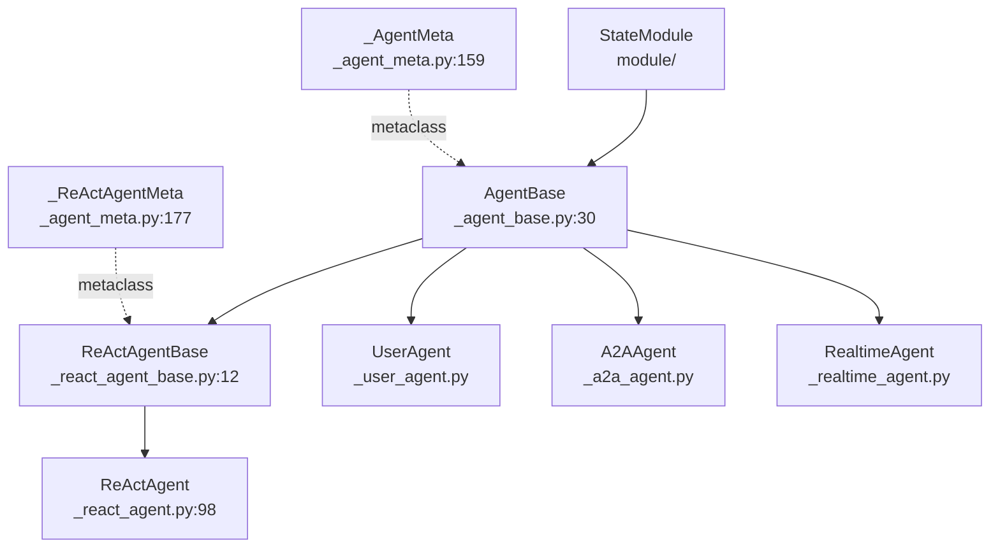
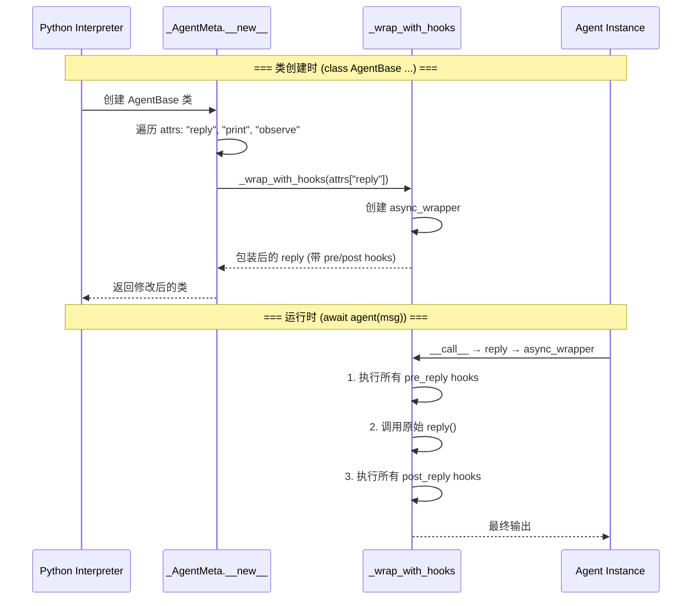

# AgentBase：所有 Agent 的基类

> **Level 4**: 理解核心数据流
> **前置要求**: [MsgHub 发布-订阅](../03-pipeline/03-msghub.md)
> **后续章节**: [ReActAgent 完整调用链](./04-react-agent.md)

---

## 学习目标

学完本章后，你能：
- 理解 AgentBase 不继承 ABC、不定义抽象方法的设计哲学
- 掌握 `reply()` / `observe()` / `__call__()` 的语义差异和调用关系
- 理解**元类驱动的 Hook 包装机制**（`_AgentMeta._wrap_with_hooks`）
- 理解 `_strip_thinking_blocks` 的隐私保护设计
- 知道 `handle_interrupt` 的默认行为和子类覆盖点

---

## 背景问题

AgentScope 支持 5 种 Agent 类型（ReActAgent, UserAgent, A2AAgent, RealtimeAgent, 自定义 Agent），它们需要一个共同的基类来提供：

1. **统一的生命周期**：`__call__` 包装 `reply`，处理中断和广播
2. **Hook 系统**：允许在 `reply`/`observe`/`print` 前后注入自定义逻辑
3. **消息队列**：支持流式消息的异步分发（`msg_queue`）
4. **订阅者机制**：Agent 可以将回复广播给其他 Agent

AgentBase 是实现这些共享能力的基类。但它**不是传统意义的抽象基类**——它不继承 `abc.ABC`，核心方法（`reply`, `observe`）直接抛出 `NotImplementedError` 而非使用 `@abstractmethod`。

---

## 源码入口

| 项目 | 值 |
|------|-----|
| **主文件** | `src/agentscope/agent/_agent_base.py:30` |
| **类签名** | `class AgentBase(StateModule, metaclass=_AgentMeta)` |
| **行数** | 774 行 |
| **元类** | `_AgentMeta` at `_agent_meta.py:159` |
| **父类** | `StateModule` (from `module/`) |
| **关键方法** | `__call__()` (line 448), `reply()` (line 197), `observe()` (line 185), `print()` (line 205) |
| **Hook 装饰器** | `_wrap_with_hooks` at `_agent_meta.py:55` |

---

## 继承层次



**关键**：`_ReActAgentMeta` 继承 `_AgentMeta`，为 `_reasoning` 和 `_acting` 额外添加 Hook 包装。这是元类层次结构：`type` → `_AgentMeta` → `_ReActAgentMeta`。

---

## 核心方法分析

### `__call__()` — 统一包装入口

**文件**: `src/agentscope/agent/_agent_base.py:448-467`

```python
async def __call__(self, *args: Any, **kwargs: Any) -> Msg:
    self._reply_id = shortuuid.uuid()

    reply_msg: Msg | None = None
    try:
        self._reply_task = asyncio.current_task()
        reply_msg = await self.reply(*args, **kwargs)

    except asyncio.CancelledError:
        reply_msg = await self.handle_interrupt(*args, **kwargs)

    finally:
        # Broadcast the reply message to all subscribers
        if reply_msg:
            await self._broadcast_to_subscribers(reply_msg)
        self._reply_task = None

    return reply_msg
```

`__call__` 是**包装层**（非业务逻辑层），它做了四件事：
1. 生成唯一 `_reply_id` 用于追踪
2. 捕获 `asyncio.CancelledError` 并委托给 `handle_interrupt`
3. 在 `finally` 块中广播回复（保证"至少一次"语义）
4. 清除 `_reply_task` 引用

**用户调用 `await agent(msg)` 实际调用的是 `__call__`，而非 `reply()`**。

### `reply()` — 主动回复（子类必须覆盖）

**文件**: `_agent_base.py:197-203`

```python
async def reply(self, *args: Any, **kwargs: Any) -> Msg:
    raise NotImplementedError(
        f"The reply function is not implemented in "
        f"{self.__class__.__name__} class.",
    )
```

注意：这是 `raise NotImplementedError`，不是 `@abstractmethod`。这是一个**运行时检查**而非静态检查。

### `observe()` — 被动观察

**文件**: `_agent_base.py:185-195`

```python
async def observe(self, msg: Msg | list[Msg] | None) -> None:
    raise NotImplementedError(
        f"The observe function is not implemented in"
        f" {self.__class__.__name__} class.",
    )
```

`reply()` vs `observe()` 的区别：

| 维度 | `reply()` | `observe()` |
|------|-----------|-------------|
| 调用者 | `__call__` / 用户代码 | `_broadcast_to_subscribers` |
| 触发时机 | 用户主动调用 Agent | MsgHub 或其他 Agent 广播 |
| 是否返回 Msg | 是 | 否 (`None`) |
| 典型实现 | ReAct 推理循环 | 将消息存入 `_observed_msgs` |

### `print()` — 消息输出与队列

**文件**: `_agent_base.py:205-259`

```python
async def print(
    self,
    msg: Msg,
    last: bool = True,
    speech: AudioBlock | list[AudioBlock] | None = None,
) -> None:
    if not self._disable_msg_queue:
        await self.msg_queue.put((deepcopy(msg), last, speech))
        await asyncio.sleep(0)  # 让出控制权给消费者协程

    if self._disable_console_output:
        return

    # 渲染 thinking_and_text_to_print（text + thinking blocks）
    for block in msg.get_content_blocks():
        if block["type"] == "text":
            self._print_text_block(msg.id, name_prefix=msg.name, ...)
        elif block["type"] == "thinking":
            self._print_text_block(msg.id, name_prefix=f"{msg.name}(thinking)", ...)
        elif last:
            self._print_last_block(block, msg)
```

两个关键开关：
- `_disable_msg_queue`：禁用消息队列（用于非 Studio 环境）
- `_disable_console_output`：禁用控制台输出（用于纯 API 模式）

### `handle_interrupt()` — 中断处理

**文件**: `_agent_base.py:516-526`

```python
async def handle_interrupt(self, *args: Any, **kwargs: Any) -> Msg:
    raise NotImplementedError(
        f"The handle_interrupt function is not implemented in "
        f"{self.__class__.__name__}",
    )
```

基类抛 `NotImplementedError`。子类（如 ReActAgent）必须覆盖此方法来处理用户中断。

---

## Hook 系统：元类驱动的包装机制

**这是 AgentScope 设计中最容易被误解的部分。** Hook 不是通过 `_call_hooks` 方法在运行时调用，而是通过**元类在类创建时**用 `_wrap_with_hooks` 装饰器包装目标方法。

### 架构总览



### `_wrap_with_hooks` 装饰器

**文件**: `src/agentscope/agent/_agent_meta.py:55-156`

```python
def _wrap_with_hooks(original_func: Callable) -> Callable:
    func_name = original_func.__name__.replace("_", "")
    hook_guard_attr = f"_hook_running_{func_name}"

    @wraps(original_func)
    async def async_wrapper(self, *args, **kwargs) -> Any:
        # 防重入保护
        if getattr(self, hook_guard_attr, False):
            return await original_func(self, *args, **kwargs)

        # 参数归一化：将 *args/**kwargs 转为统一的 kwargs dict
        normalized_kwargs = _normalize_to_kwargs(original_func, self, *args, **kwargs)

        # pre-hooks（实例优先于类）
        pre_hooks = (
            list(getattr(self, f"_instance_pre_{func_name}_hooks").values()) +
            list(getattr(self.__class__, f"_class_pre_{func_name}_hooks").values())
        )
        for pre_hook in pre_hooks:
            modified = await _execute_async_or_sync_func(
                pre_hook, self, deepcopy(normalized_kwargs))
            if modified is not None:
                normalized_kwargs = modified

        # 调用原始方法
        setattr(self, hook_guard_attr, True)
        try:
            current_output = await original_func(self, ...)
        finally:
            setattr(self, hook_guard_attr, False)

        # post-hooks
        post_hooks = (
            list(getattr(self, f"_instance_post_{func_name}_hooks").values()) +
            list(getattr(self, f"_class_post_{func_name}_hooks").values())
        )
        for post_hook in post_hooks:
            modified = await _execute_async_or_sync_func(
                post_hook, self, deepcopy(normalized_kwargs), deepcopy(current_output))
            if modified is not None:
                current_output = modified

        return current_output

    return async_wrapper
```

`★ Insight ─────────────────────────────────────`
1. **防重入保护的 `hook_guard_attr`**：当 MRO 中多个类定义相同方法时，每个类都会在 `__new__` 中独立包装。`hook_guard_attr` 确保只有最外层的包装器执行 hooks，内层直接调用原始方法。
2. **`_normalize_to_kwargs`** 使用 `inspect.signature.bind()` 将 `*args, **kwargs` 统一为 kwargs dict，使得 hooks 可以通过修改 dict 来改变传给原始方法的参数。
3. **`_execute_async_or_sync_func`** 允许 hooks 是同步或异步函数，来自 `_utils/_common.py`。
`─────────────────────────────────────────────────`

### `_AgentMeta` — 哪些方法被包装

**文件**: `_agent_meta.py:159-174`

```python
class _AgentMeta(type):
    def __new__(mcs, name, bases, attrs):
        for func_name in ["reply", "print", "observe"]:
            if func_name in attrs:
                attrs[func_name] = _wrap_with_hooks(attrs[func_name])
        return super().__new__(mcs, name, bases, attrs)
```

### `_ReActAgentMeta` — ReAct 专属扩展

**文件**: `_agent_meta.py:177-192`

```python
class _ReActAgentMeta(_AgentMeta):
    def __new__(mcs, name, bases, attrs):
        for func_name in ["_reasoning", "_acting"]:
            if func_name in attrs:
                attrs[func_name] = _wrap_with_hooks(attrs[func_name])
        return super().__new__(mcs, name, bases, attrs)
```

### 支持的 Hook 类型（6 种）

**文件**: `_agent_meta.py:36-43` (在 `_AgentMeta` 的元类属性中定义)

```python
supported_hook_types = [
    "pre_reply",     # reply() 调用前，可修改参数
    "post_reply",    # reply() 返回后，可修改输出
    "pre_print",     # print() 调用前
    "post_print",    # print() 调用后
    "pre_observe",   # observe() 调用前
    "post_observe",  # observe() 调用后
]
```

所有 hooks 存储在 `OrderedDict` 中，保证执行顺序。实例级 hooks 优先于类级 hooks。

### Hook 注册 API

```python
# 实例级 hook（仅影响当前实例）
agent.register_instance_hook("pre_reply", "my_hook", my_hook_func)
agent.remove_instance_hook("pre_reply", "my_hook")

# 类级 hook（影响所有实例）
MyAgent.register_class_hook("pre_reply", "my_hook", my_hook_func)
MyAgent.remove_class_hook("pre_reply", "my_hook")
MyAgent.clear_class_hooks("pre_reply")
```

---

## 广播与隐私：`_strip_thinking_blocks`

**文件**: `_agent_base.py:469-514`

当 Agent 的回复广播给订阅者时，`_broadcast_to_subscribers` 会先调用 `_strip_thinking_blocks` 移除 `thinking` 类型的 ContentBlock：

```python
async def _broadcast_to_subscribers(self, msg: Msg | list[Msg] | None) -> None:
    if msg is None:
        return

    broadcast_msg = self._strip_thinking_blocks(msg)

    for subscribers in self._subscribers.values():
        for subscriber in subscribers:
            await subscriber.observe(broadcast_msg)
```

**设计原因**：`thinking` blocks 包含 Agent 的**内部推理过程**（如 Claude 的 extended thinking）。这些推理内容不应暴露给其他 Agent，因为：
1. 隐私：内部思维不应被外部观察到
2. 认知负荷：其他 Agent 不需要看到推理过程来理解回复
3. Token 节省：减少广播消息的体积

---

## 工程现实与架构问题

### 技术债（源码级）

| 位置 | 问题 | 影响 | 优先级 |
|------|------|------|--------|
| `_agent_base.py:197` | `reply()` 抛出 `NotImplementedError` 而非静态抽象 | IDE 无法在类型检查时发现未实现的 `reply()` | 中 |
| `_agent_base.py:516` | `handle_interrupt` 抛出 `NotImplementedError` | 自定义 Agent 忘记覆盖会导致运行时崩溃 | 高 |
| `_agent_meta.py:159` | 元类 `__new__` 仅在 `func_name in attrs` 时包装 | 如果子类通过 `super()` 继承基类的 `reply()`，不会被重新包装 | 中 |
| `_agent_meta.py:92-97` | `assert` 检查 hook 属性存在 | 生产环境中 assert 可能被 `-O` flag 禁用 | 高 |
| `_agent_base.py:483` | `_subscribers` 字典迭代无锁保护 | 广播时并发修改 `_subscribers` 会导致 `RuntimeError` | 中 |

### 为什么不使用 `abc.ABC`？

**[HISTORICAL INFERENCE]**: `AgentBase` 不继承 `ABC`，也不使用 `@abstractmethod`。推测原因：
1. **StateModule 继承链冲突**：`StateModule` 已有自己的元类逻辑，添加 `ABCMeta` 会导致元类冲突
2. **灵活性优先**：某些 Agent 类型可能不需要覆盖所有方法（如纯观察 Agent 不需要 `reply()`）
3. **历史遗留**：最初的设计可能没有考虑静态类型检查

**代价**：无法在 IDE 中获得"未实现抽象方法"的警告，错误推迟到运行时。

### `_AgentMeta.__new__` 中的 `assert` 问题

```python
assert (
    hasattr(self, f"_instance_pre_{func_name}_hooks")
    and hasattr(self, f"_instance_post_{func_name}_hooks")
    ...
), f"Hooks for {func_name} not found"
```

当 Python 以 `-O` 模式运行时，`assert` 语句会被移除，导致 hooks 不存在时静默失败而非报错。应改为 `if not hasattr(...): raise AttributeError(...)`。

### 渐进式重构方案

```python
# 方案 1: 将 assert 改为显式 AttributeError
# 在 _wrap_with_hooks 的 async_wrapper 中:
instance_pre = getattr(self, f"_instance_pre_{func_name}_hooks", None)
if instance_pre is None:
    raise AttributeError(
        f"Missing hook storage for '{func_name}'. "
        f"Ensure the metaclass ({type(self).__class__.__name__}) "
        f"initializes hook attributes."
    )

# 方案 2: 添加 Protocol 定义以支持静态类型检查
from typing import Protocol

class AgentProtocol(Protocol):
    name: str
    async def reply(self, *args: Any, **kwargs: Any) -> Msg: ...
    async def observe(self, msg: Msg | list[Msg] | None) -> None: ...

# AgentBase 实现 Protocol 以实现静态检查
class AgentBase(StateModule, AgentProtocol, metaclass=_AgentMeta):
    ...
```

---

## Contributor 指南

### Safe Files（安全修改区域）

| 文件 | 风险 | 说明 |
|------|------|------|
| `agent/_agent_meta.py:21-53` | 低 | `_normalize_to_kwargs` — 纯函数，易测试 |
| `agent/_utils.py` | 低 | 工具函数，355 字节 |

### Dangerous Areas（危险区域）

| 文件:行号 | 风险 | 说明 |
|-----------|------|------|
| `_agent_meta.py:55-156` | **极高** | `_wrap_with_hooks` — 所有 Agent 的 hook 机制核心，修改可能破坏所有 Agent 行为 |
| `_agent_meta.py:159-174` | 高 | `_AgentMeta.__new__` — 类创建时自动包装，修改影响所有 Agent 子类 |
| `_agent_base.py:448-467` | 高 | `__call__` — 所有 Agent 调用的入口，中断处理和广播逻辑 |
| `_agent_base.py:469-514` | 中 | `_broadcast_to_subscribers` + `_strip_thinking_blocks` — 消息格式依赖 |

### 调试 Hook 系统

```python
# 1. 列出所有已注册的 hooks
for hook_type in agent.supported_hook_types:
    instance_hooks = getattr(agent, f"_instance_{hook_type}_hooks", {})
    class_hooks = getattr(type(agent), f"_class_{hook_type}_hooks", {})
    print(f"{hook_type}: instance={list(instance_hooks.keys())}, "
          f"class={list(class_hooks.keys())}")

# 2. 验证 hook 是否被元类正确包装
import inspect
print(f"reply is wrapped: {hasattr(agent.reply, '__wrapped__')}")
# Hook 包装器使用 @wraps，会保留 __wrapped__ 属性

# 3. 追踪 hook 执行
# 在 hook 函数中添加 logger:
async def debug_hook(self, kwargs):
    logger.info(f"[HOOK] pre_reply called with kwargs keys: {list(kwargs.keys())}")
    return kwargs  # 不修改参数
```

### 创建自定义 Agent

```python
class MyCustomAgent(AgentBase):
    """自定义 Agent — 必须覆盖 reply() 和 handle_interrupt()"""

    def __init__(self, name: str) -> None:
        super().__init__()
        self.name = name

    async def reply(self, *args: Any, **kwargs: Any) -> Msg:
        # 覆盖 reply() — 业务逻辑
        msg = args[0] if args else kwargs.get("msg")
        return Msg(self.name, f"Echo: {msg.content}", "assistant")

    async def observe(self, msg: Msg | list[Msg] | None) -> None:
        # 可选覆盖 — 被动接收逻辑
        pass

    async def handle_interrupt(self, *args: Any, **kwargs: Any) -> Msg:
        # 必需覆盖 — 否则 __call__ 的中断处理会抛 NotImplementedError
        return Msg(self.name, "Interrupted", "assistant")
```

### 测试策略

```python
# 测试 __call__ 的基本行为
@pytest.mark.asyncio
async def test_agent_call_generates_reply_id():
    agent = MyCustomAgent("test")
    result = await agent(Msg("user", "hi", "user"))
    assert agent._reply_id is not None
    assert isinstance(result, Msg)

# 测试 Hook 注册和执行
@pytest.mark.asyncio
async def test_pre_reply_hook_modifies_args():
    hook_called = []

    async def my_hook(self, kwargs):
        hook_called.append(True)
        kwargs["extra"] = "injected"
        return kwargs

    agent = MyCustomAgent("test")
    agent.register_instance_hook("pre_reply", "test_hook", my_hook)

    await agent(Msg("user", "hi", "user"))
    assert len(hook_called) == 1

# 测试 thinking blocks 被剥离
def test_strip_thinking_blocks():
    msg = Msg("agent", [
        TextBlock(type="text", text="Hello"),
        ThinkingBlock(type="thinking", thinking="Hmm..."),
    ], "assistant")
    result = AgentBase._strip_thinking_blocks(msg)
    content_types = [b["type"] for b in result.content]
    assert "thinking" not in content_types
    assert "text" in content_types
```

---

## 下一步

理解了 AgentBase 的设计后，接下来深入 [ReActAgent 完整调用链](./04-react-agent.md)，了解最常用的 Agent 如何实现 `reply()`。

---

