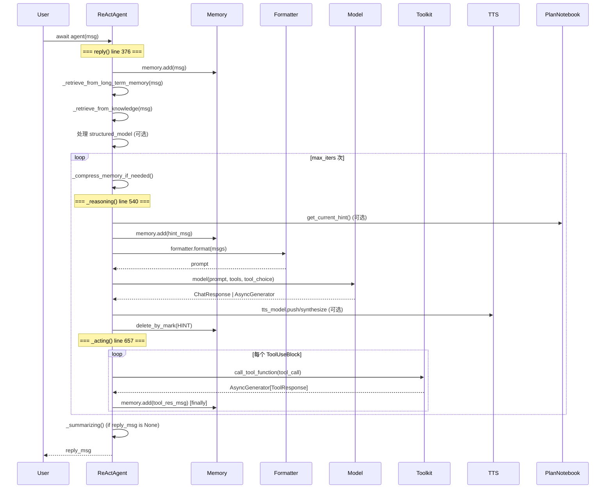

# ReActAgent：完整的推理-行动循环

> **Level 5**: 源码调用链
> **前置要求**: [AgentBase 基类](./04-agent-base.md)
> **后续章节**: [UserAgent 人工参与](./04-user-agent.md)

---

## 学习目标

学完本章后，你能：
- 追踪 `reply()` 中两条不同执行路径：普通文本回复 vs 结构化输出
- 理解 `_reasoning()` 中 TTS、plan_notebook、hint 管理和中断处理的完整流程
- 理解 `_acting()` 的 ToolResultBlock 预创建模式、finish_function 机制和 `finally` 块保证
- 理解 `_summarizing()` 在 max_iters 耗尽时的回退策略
- 知道 `structured_model` 如何通过 finish_function + system hints 实现

---

## 背景问题

`AgentBase.reply()` 只是一个抽象方法签名。真正的 Agent 行为由 `ReActAgent.reply()` 实现，它是 AgentScope 中**最常被调用的方法**。理解这个方法的完整调用链，是理解整个框架的钥匙。

核心问题：**如何让 LLM 在"思考→行动→观察→思考"的循环中自主解决问题？**

AgentScope 的方案：
1. **循环控制**：`max_iters` 限制迭代次数，防止无限循环
2. **工具调用**：LLM 返回 `ToolUseBlock` → `_acting()` 执行 → 结果存入记忆 → 下一轮 `_reasoning()`
3. **结构化输出**：通过 `finish_function` + system hints 强制 LLM 调用特定工具生成结构化数据
4. **中断处理**：`asyncio.CancelledError` 在两层（`_reasoning` 和 `_acting`）传播，确保优雅退出
5. **TTS 集成**：在推理过程中实时推送文本到语音合成模型

---

## 源码入口

| 项目 | 值 |
|------|-----|
| **文件路径** | `src/agentscope/agent/_react_agent.py` |
| **类名** | `ReActAgent(ReActAgentBase)` |
| **行数** | 1137 行 |
| **核心方法** | `reply()` (line 376), `_reasoning()` (line 540), `_acting()` (line 657), `_summarizing()` (line 725) |
| **父类** | `ReActAgentBase` at `_react_agent_base.py:12` |

---

## 架构定位

### ReActAgent 在调用链中的位置



---

## 核心调用链：`reply()` 的完整实现

**文件**: `src/agentscope/agent/_react_agent.py:376-537`

### 阶段 1: 记忆与检索 (lines 396-402)

```python
# Record the input message(s) in the memory
await self.memory.add(msg)

# Retrieve relevant records from the long-term memory if activated
await self._retrieve_from_long_term_memory(msg)
# Retrieve relevant documents from the knowledge base(s) if any
await self._retrieve_from_knowledge(msg)
```

`_retrieve_from_long_term_memory` 在 `_react_agent.py:882`，`_retrieve_from_knowledge` 在 `_react_agent.py:908`。两者都向当前工作记忆注入检索到的上下文。

### 阶段 2: 结构化输出管理 (lines 407-426)

这是 `reply()` 中最复杂的部分，在 Mermaid 图中常被省略：

```python
# Control if LLM generates tool calls in each reasoning step
tool_choice: Literal["auto", "none", "required"] | None = None

self._required_structured_model = structured_model
if structured_model:
    # Register generate_response tool only when structured output is required
    if self.finish_function_name not in self.toolkit.tools:
        self.toolkit.register_tool_function(
            getattr(self, self.finish_function_name),
        )
    # Set the structured output model
    self.toolkit.set_extended_model(
        self.finish_function_name, structured_model,
    )
    tool_choice = "required"
else:
    # Remove generate_response tool if no structured output is required
    self.toolkit.remove_tool_function(self.finish_function_name)
```

`★ Insight ─────────────────────────────────────`
1. **`finish_function_name` 默认为 `"generate_response"`** — AgentScope 将结构化输出也建模为"工具调用"。LLM 通过调用 `generate_response` 工具来产出一个 Pydantic BaseModel 实例。
2. **`tool_choice = "required"`** 在结构化输出模式下强制 LLM 必须调用工具，避免 LLM 返回纯文本而不调用 `finish_function`。
3. **`set_extended_model()`** 动态修改工具的 JSON Schema，将 Pydantic 模型的 schema 注入到工具的参数定义中。
`─────────────────────────────────────────────────`

### 阶段 3: 推理-行动主循环 (lines 428-518)

```python
structured_output = None
reply_msg = None
for _ in range(self.max_iters):
    # -------------- Memory compression --------------
    await self._compress_memory_if_needed()

    # -------------- The reasoning process --------------
    msg_reasoning = await self._reasoning(tool_choice)

    # -------------- The acting process --------------
    futures = [
        self._acting(tool_call)
        for tool_call in msg_reasoning.get_content_blocks("tool_use")
    ]
    # Parallel tool calls or not
    if self.parallel_tool_calls:
        structured_outputs = await asyncio.gather(*futures)
    else:
        structured_outputs = [await _ for _ in futures]
```

这是两条执行路径的分叉点：

#### 路径 A: 结构化输出模式 (lines 455-511)

```python
if self._required_structured_model:
    structured_outputs = [_ for _ in structured_outputs if _]

    if structured_outputs:
        structured_output = structured_outputs[-1]
        if msg_reasoning.has_content_blocks("text"):
            # Re-use existing text response
            reply_msg = Msg(self.name,
                msg_reasoning.get_content_blocks("text"),
                "assistant", metadata=structured_output)
            break

        # Generate textual response in the next iteration
        msg_hint = Msg("user",
            "<system-hint>Now generate a text response "
            "based on your current situation</system-hint>",
            "user")
        await self.memory.add(msg_hint, marks=_MemoryMark.HINT)
        tool_choice = "none"
        self._required_structured_model = None

    elif not msg_reasoning.has_content_blocks("tool_use"):
        # Remind LLM to call finish_function
        msg_hint = Msg("user",
            "<system-hint>Structured output is required, "
            f"go on to finish your task or call "
            f"'{self.finish_function_name}' to generate "
            f"the required structured output.</system-hint>",
            "user")
        await self.memory.add(msg_hint, marks=_MemoryMark.HINT)
        tool_choice = "required"
```

#### 路径 B: 普通文本回复 (lines 513-518)

```python
elif not msg_reasoning.has_content_blocks("tool_use"):
    # Exit when no tool calls and no structured output required
    msg_reasoning.metadata = structured_output
    reply_msg = msg_reasoning
    break
```

### 阶段 4: 兜底总结 (lines 520-525)

```python
# When the maximum iterations are reached and no reply message is generated
if reply_msg is None:
    reply_msg = await self._summarizing()
    reply_msg.metadata = structured_output
    await self.memory.add(reply_msg)
```

### 阶段 5: 长期记忆后处理 (lines 527-536)

```python
if self._static_control:
    await self.long_term_memory.record([
        *await self.memory.get_memory(
            exclude_mark=_MemoryMark.COMPRESSED,
        ),
    ])
```

---

## `_reasoning()` 完整分析

**文件**: `src/agentscope/agent/_react_agent.py:540-655` (116 行)

```mermaid
flowchart TD
    START[_reasoning(tool_choice)] --> PLAN{plan_notebook?}
    PLAN -->|是| HINT[get_current_hint<br/>→ memory.add(hint)]
    PLAN -->|否| FORMAT
    HINT --> FORMAT[formatter.format<br/>system prompt + memory msgs]

    FORMAT --> DELETE[memory.delete_by_mark<br/>清除 HINT 消息]
    DELETE --> MODEL[model(prompt, tools, tool_choice)]

    MODEL --> STREAM_CHECK{model.stream?}
    STREAM_CHECK -->|是| STREAM_LOOP[async for chunk in res<br/>逐块更新 msg.content]
    STREAM_CHECK -->|否| DIRECT[msg.content = list(res.content)]

    STREAM_LOOP --> TTS_STREAM{tts_model<br/>supports_streaming?}
    TTS_STREAM -->|是| TTS_PUSH[tts_model.push(msg)]
    TTS_STREAM -->|否| PRINT
    TTS_PUSH --> PRINT[await self.print(msg, False)]

    DIRECT --> TTS_BLOCK{tts_model?}
    TTS_BLOCK -->|是| TTS_SYNTH[tts_model.synthesize(msg)]
    TTS_BLOCK -->|否| FINAL_PRINT
    TTS_SYNTH --> FINAL_PRINT[await self.print(msg, True)]

    PRINT --> CANCEL_CHECK{CancelledError?}
    FINAL_PRINT --> CANCEL_CHECK
    CANCEL_CHECK -->|是| INTERRUPT[生成 fake ToolResultBlock<br/>标记工具调用已中断]
    CANCEL_CHECK -->|否| RETURN[memory.add(msg)<br/>return msg]
    INTERRUPT --> RETURN
```

关键实现细节：

1. **plan_notebook 集成** (lines 546-551)：在执行推理前检查是否有来自 Plan 模块的 hint 消息
2. **`_MemoryMark.HINT`** (line 566)：hint 消息用完后立即删除，避免污染后续推理
3. **`_MemoryMark.COMPRESSED`** (lines 557-561)：已经被压缩的消息不传给 LLM
4. **TTS 上下文管理器** (lines 579-617)：使用 `_AsyncNullContext()` 作为空模式，支持实时语音合成
5. **中断处理** (lines 625-654)：`asyncio.CancelledError` 在 `finally` 块中处理，为所有 tool_use block 生成假的 `ToolResultBlock`

---

## `_acting()` 完整分析

**文件**: `src/agentscope/agent/_react_agent.py:657-715` (59 行)

```python
async def _acting(self, tool_call: ToolUseBlock) -> dict | None:
    # 预创建 ToolResultBlock，output 初始为空
    tool_res_msg = Msg(
        "system",
        [ToolResultBlock(
            type="tool_result",
            id=tool_call["id"],
            name=tool_call["name"],
            output=[],  # 随 chunk 逐步填充
        )],
        "system",
    )
    try:
        tool_res = await self.toolkit.call_tool_function(tool_call)

        async for chunk in tool_res:
            # 逐步填充 ToolResultBlock 的 output
            tool_res_msg.content[0]["output"] = chunk.content

            await self.print(tool_res_msg, chunk.is_last)

            # 用户中断传播
            if chunk.is_interrupted:
                raise asyncio.CancelledError()

            # finish_function 成功调用时返回结构化输出
            if (
                tool_call["name"] == self.finish_function_name
                and chunk.metadata
                and chunk.metadata.get("success", False)
            ):
                return chunk.metadata.get("structured_output")

        return None

    finally:
        # 无论成功/失败/中断，始终记录工具结果
        await self.memory.add(tool_res_msg)
```

`★ Insight ─────────────────────────────────────`
1. **ToolResultBlock 预创建模式**：在工具执行前创建一个 ID 匹配的 `ToolResultBlock`，然后逐步填充 `output`。这确保了即使工具执行失败或中断，LLM 也能看到部分结果。
2. **`finally` 块保证**：`await self.memory.add(tool_res_msg)` 在 `finally` 中执行，意味着即使发生 `CancelledError` 或任何其他异常，工具调用记录也不会丢失。
3. **中断传播链**：`_acting()` 检测 `chunk.is_interrupted` → raise `CancelledError` → `_reasoning()` 的 except 块捕获 → 生成 fake ToolResultBlock。这是一个跨两层的协作式中断处理。
`─────────────────────────────────────────────────`

---

## `_summarizing()` 分析

**文件**: `src/agentscope/agent/_react_agent.py:725-881` (157 行)

当 `reply()` 的主循环耗尽 `max_iters` 仍无 `reply_msg` 时调用。它构造一个 hint 消息注入记忆，要求 LLM 总结当前状态：

```python
async def _summarizing(self) -> Msg:
    hint_msg = Msg(
        "user",
        "You have failed to generate response within the maximum "
        "iterations. Now respond directly by summarizing the current "
        "situation.",
        role="user",
    )

    prompt = await self.formatter.format([
        Msg("system", self.sys_prompt, "system"),
        *await self.memory.get_memory(
            exclude_mark=_MemoryMark.COMPRESSED
            if self.compression_config and self.compression_config.enable
            else None,
        ),
        hint_msg,  # 追加到最后
    ])

    # TODO: handle the structured output here,
    # maybe force calling the finish_function here
    res = await self.model(prompt)

    # ... TTS 处理和流式输出（与 _reasoning 相同的模式）...
```

**[UNVERIFIED]**: TODO at line 750 表明结构化输出的强制调用在此处未完全实现。

---

## 关键配置参数

| 参数 | 类型 | 默认值 | 源码位置 | 说明 |
|------|------|--------|----------|------|
| `max_iters` | `int` | 5 | `reply():432` | 最大推理-行动循环次数 |
| `parallel_tool_calls` | `bool` | `True` | `reply():447` | 工具调用是否并行 (`asyncio.gather`) |
| `finish_function_name` | `str` | `"generate_response"` | `__init__` | 结构化输出工具的注册名 |
| `print_hint_msg` | `bool` | - | `reply():510` | 是否打印 system hints 到终端 |

---

## 工程现实与架构问题

### 技术债（源码级）

| 位置 | 问题 | 影响 | 优先级 |
|------|------|------|--------|
| `_react_agent.py:376` | `reply()` 有 `# pylint: disable=too-many-branches` | 160 行方法有 ~20 个分支，复杂度过高 | 高 |
| `_react_agent.py:428` | 多模态 Block 处理未完整实现 | multimodal blocks 可能无法正确处理 | 中 |
| `_react_agent.py:750` | `_summarizing()` 的 structured output 处理 TODO | max_iters 耗尽时结构化输出可能丢失 | 中 |
| `_react_agent.py:1093` | 压缩消息含 multimodal 时处理不确定 | 记忆压缩可能丢失多模态内容 | 中 |
| `_react_agent.py:2` | 类 docstring 中标注需要简化 | 1137 行单文件是已知维护负担 | 高 |

### 结构化输出设计的问题

结构化输出通过 `finish_function` + system hints + `tool_choice` 状态机实现，这引入了三个问题：

1. **状态管理复杂**：`tool_choice` 在 `"required"` / `"none"` / `None` 之间切换，状态转换逻辑分散在 30+ 行代码中
2. **HINT 消息泄露风险**：如果 `delete_by_mark` 失败，hints 会持续存在于记忆中
3. **`finish_function` 与真实工具的命名冲突**：如果用户工具恰好叫 `"generate_response"`，行为不可预测

### `reply()` 方法为何难以拆分？

**[HISTORICAL INFERENCE]**: `reply()` 中的共享可变状态（`tool_choice`, `_required_structured_model`, `structured_output`, `reply_msg`）使得提取子方法困难。任何提取都需要将这些状态作为参数传递或封装到 context 对象中。

### 渐进式重构方案

```python
# 方案：将 reply() 的状态封装到 dataclass
@dataclass
class ReplyContext:
    tool_choice: Literal["auto", "none", "required"] | None = None
    required_structured_model: Type[BaseModel] | None = None
    structured_output: dict | None = None
    reply_msg: Msg | None = None

# 然后拆分为独立方法：
class ReActAgent(ReActAgentBase):
    async def _setup_structured_output(self, ctx: ReplyContext, model) -> None: ...
    async def _handle_structured_result(self, ctx: ReplyContext, msg, outputs) -> bool: ...
    async def _handle_normal_result(self, ctx: ReplyContext, msg) -> bool: ...
```

---

## Contributor 指南

### Safe Files（安全修改区域）

| 文件 | 风险 | 说明 |
|------|------|------|
| `agent/_react_agent_base.py` | 低 | 基类抽象，影响面小 |
| `agent/_utils.py` | 低 | 工具函数，355 字节 |

### Dangerous Areas（危险区域）

| 文件:行号 | 风险 | 说明 |
|-----------|------|------|
| `_react_agent.py:376-537` | **极高** | `reply()` — 所有 Agent 调用的核心路径，修改可能破坏所有 Agent 行为 |
| `_react_agent.py:540-655` | 高 | `_reasoning()` — TTS、plan_notebook、hint、中断的复杂交互 |
| `_react_agent.py:657-715` | 中 | `_acting()` — `finally` 块的执行保证不可破坏 |
| `_react_agent.py:625-654` | 中 | 中断处理 — `CancelledError` 和 fake ToolResultBlock 的生成逻辑 |

### 调试技巧

```python
# 1. 追踪 reply() 循环的迭代次数和状态变化
# 在 reply() 的 for 循环体内添加:
print(f"[DEBUG] iter={i}, tool_choice={tool_choice}, "
      f"structured_model={self._required_structured_model is not None}")

# 2. 查看传给 LLM 的完整 prompt（包括格式化后的消息）
prompt = await self.formatter.format([...])
print(f"[DEBUG] prompt message count: {len(prompt)}")

# 3. 检查 _acting 是否产生了结构化输出
structured_outputs = await asyncio.gather(*futures)
print(f"[DEBUG] structured_outputs: {[_ is not None for _ in structured_outputs]}")

# 4. 追踪 memory 中的 HINT 消息
hint_msgs = await self.memory.get_memory(mark=_MemoryMark.HINT)
print(f"[DEBUG] hint messages in memory: {len(hint_msgs)}")
```

### 常见问题诊断

| 问题 | 诊断方法 | 根因 |
|------|----------|------|
| Agent 陷入工具调用死循环 | 检查 `max_iters` 是否设置过小；检查工具结果是否触发新的 tool_use | `tool_choice` 未正确切换为 "none" |
| 结构化输出不生效 | 检查 `finish_function_name` 是否正确注册；检查 `set_extended_model` 是否被调用 | `tool_choice` 未设为 "required" |
| 流式输出中断后 Agent 状态异常 | 检查 `CancelledError` 是否在 _reasoning 的 except 块正确处理 | 中断时 fake ToolResultBlock 未生成 |
| TTS 不工作 | 检查 `tts_model` 是否为 None（默认） | TTS 是可选组件，需显式配置 |

### 测试策略

```python
# 测试基本推理循环
@pytest.mark.asyncio
async def test_react_agent_basic_reply():
    agent = ReActAgent(
        name="TestAgent",
        sys_prompt="Reply with 'Hello'",
        model=mock_model_that_returns_text("Hello"),
        formatter=mock_formatter(),
        memory=InMemoryMemory(),
        toolkit=Toolkit(),
    )
    result = await agent(Msg("user", "Hi", "user"))
    assert "Hello" in str(result.content)

# 测试工具调用
@pytest.mark.asyncio
async def test_react_agent_tool_call():
    toolkit = Toolkit()
    toolkit.register_tool_function(lambda city: "Sunny")

    agent = ReActAgent(..., toolkit=toolkit)
    result = await agent(Msg("user", "weather in Paris?", "user"))
    # 验证工具结果在记忆或回复中

# 测试 max_iters 达到限制
@pytest.mark.asyncio
async def test_react_agent_max_iters():
    agent = ReActAgent(..., max_iters=1)
    # mock 模型一直返回 tool_use
    result = await agent(Msg("user", "do something", "user"))
    # 验证 _summarizing 被调用（通过检查回复内容）

# 测试结构化输出
@pytest.mark.asyncio
async def test_structured_output():
    class WeatherReport(BaseModel):
        temperature: float
        condition: str

    agent = ReActAgent(...)
    result = await agent(msg, structured_model=WeatherReport)
    assert result.metadata is not None
    assert "temperature" in result.metadata
```

---

## 下一步

理解了 ReActAgent 后，接下来学习 [UserAgent 人工参与](./04-user-agent.md)，了解如何让人类在 Agent 推理循环中插入。

---

