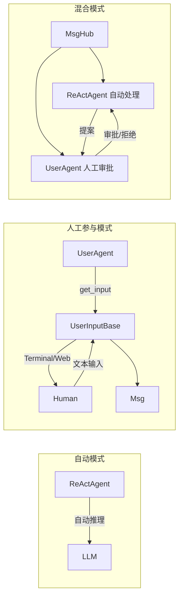
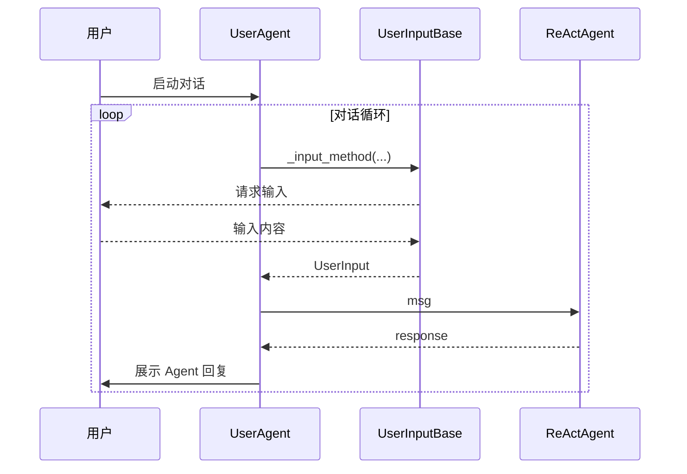

# UserAgent：人工参与 Agent 循环

> **Level 4**: 理解核心数据流
> **前置要求**: [ReActAgent 完整调用链](./04-react-agent.md)
> **后续章节**: [A2AAgent 协议](./04-a2a-agent.md)

---

## 学习目标

学完本章后，你能：
- 理解 UserAgent 的设计目的和核心机制
- 掌握 UserInputBase 接口和 TerminalUserInput 实现
- 使用 UserAgent 实现人机交互
- 理解 UserAgent 与 Studio Web 界面的集成

---

## 背景问题

有些场景需要**人类在 Agent 循环中插入**：

| 场景 | 描述 |
|------|------|
| **审批流程** | Agent 提出建议，人类审批后执行 |
| **客服系统** | 用户实时输入，必要时人工客服接管 |
| **对话系统** | 用户通过终端/Web 界面输入消息 |
| **监控系统** | Agent 执行操作前需要人工确认 |

UserAgent 就是 AgentScope 中**代表人类用户**的 Agent。

---

## 源码入口

| 项目 | 值 |
|------|-----|
| **文件路径** | `src/agentscope/agent/_user_agent.py` |
| **类名** | `UserAgent` |
| **输入基类** | `src/agentscope/agent/_user_input.py:UserInputBase` |
| **终端输入** | `_user_input.py:TerminalUserInput` |

---

## 架构定位

### UserAgent 在 Human-in-the-Loop 模式中的角色



**关键**: `UserAgent` 直接继承 `AgentBase`（不是 `ReActAgent`）。它的 `reply()` 方法调用 `UserInputBase.get_input()` 等待人类输入，而非调用 LLM。`UserInputBase` 抽象支持终端、Web UI、移动端等多种输入渠道。

---

## UserAgent 核心实现

**文件**: `src/agentscope/agent/_user_agent.py:12-76`

### 类结构

```python
class UserAgent(AgentBase):
    """用户交互 Agent"""

    _input_method: UserInputBase = TerminalUserInput()
    """默认使用终端输入，可被覆盖"""

    def __init__(self, name: str) -> None:
        super().__init__()
        self.name = name

    async def reply(
        self,
        msg: Msg | list[Msg] | None = None,
        structured_model: Type[BaseModel] | None = None,
    ) -> Msg:
        """等待用户输入，返回用户的消息"""
```

### reply() 实现

```python
async def reply(
    self,
    msg: Msg | list[Msg] | None = None,
    structured_model: Type[BaseModel] | None = None,
) -> Msg:
    # 1. 调用输入方法获取用户输入
    input_data = await self._input_method(
        agent_id=self.id,
        agent_name=self.name,
        structured_model=structured_model,
    )

    # 2. 处理 blocks_input
    blocks_input = input_data.blocks_input
    if (
        blocks_input
        and len(blocks_input) == 1
        and blocks_input[0].get("type") == "text"
    ):
        # 单个文本块转为字符串
        blocks_input = blocks_input[0].get("text")

    # 3. 构建 Msg
    msg = Msg(
        name=self.name,
        content=blocks_input,
        role="user",
        metadata=input_data.structured_input,
    )

    await self.print(msg)
    return msg
```

---

## UserInputBase 接口

**文件**: `src/agentscope/agent/_user_input.py`

### 抽象定义

```python
class UserInputBase:
    """用户输入抽象基类"""

    @abstractmethod
    async def __call__(
        self,
        agent_id: str,
        agent_name: str,
        structured_model: Type[BaseModel] | None = None,
    ) -> UserInput:
        """获取用户输入"""
        raise NotImplementedError()
```

### UserInput 数据结构

```python
@dataclass
class UserInput:
    """用户输入数据"""

    blocks_input: list[dict]
    """输入内容块列表，每个块包含 type 和相应数据"""

    structured_input: dict | None = None
    """结构化输入数据（当指定了 structured_model 时）"""
```

---

## TerminalUserInput 实现

**文件**: `_user_input.py`

### 终端输入

```python
class TerminalUserInput(UserInputBase):
    """终端输入实现"""

    async def __call__(
        self,
        agent_id: str,
        agent_name: str,
        structured_model: Type[BaseModel] | None = None,
    ) -> UserInput:
        """从终端读取用户输入"""

        if structured_model:
            # 结构化输入模式
            return await self._get_structured_input(structured_model)
        else:
            # 普通文本输入
            return await self._get_text_input()

    async def _get_text_input(self) -> UserInput:
        """获取普通文本输入"""
        text = await asyncio.get_event_loop().run_in_executor(
            None,
            lambda: input(">>> ")
        )

        return UserInput(
            blocks_input=[{"type": "text", "text": text}],
            structured_input=None,
        )

    async def _get_structured_input(self, model: Type[BaseModel]) -> UserInput:
        """获取结构化输入"""
        # 提示用户输入各字段
        data = {}
        hints = model.model_json_schema()

        for field_name, field_info in hints.get("properties", {}).items():
            prompt = f"{field_name} ({field_info.get('type', 'str')}): "
            value = await self._get_text_input()
            data[field_name] = value.blocks_input[0]["text"]

        return UserInput(
            blocks_input=[{"type": "text", "text": str(data)}],
            structured_input=data,
        )
```

---

## 输入方法覆盖

**文件**: `_user_agent.py:78-113`

### 实例级别覆盖

```python
from agentscope.agent import UserAgent
from agentscope.agent._user_input import UserInputBase

class WebUserInput(UserInputBase):
    """Web 界面输入"""

    async def __call__(self, agent_id, agent_name, structured_model=None):
        # 从 Web 服务获取输入
        data = await fetch_from_web(agent_id)
        return UserInput(
            blocks_input=[{"type": "text", "text": data["content"]}],
            structured_input=data.get("structured"),
        )

# 实例级别覆盖
user = UserAgent(name="user")
user.override_instance_input_method(WebUserInput())
```

### 类级别覆盖

```python
# 所有 UserAgent 实例都使用 Web 输入
UserAgent.override_class_input_method(WebUserInput())
```

---

## 与 ReActAgent 配合

### 基础对话循环

```python
from agentscope.agent import ReActAgent, UserAgent

agent = ReActAgent(name="assistant", ...)
user = UserAgent(name="user")

msg = None
while True:
    # 1. 获取用户输入
    msg = await user(msg)
    if msg.content.lower() in ["exit", "quit"]:
        break

    # 2. Agent 处理
    msg = await agent(msg)

    # 3. 打印 Agent 回复
    print(f"Agent: {msg.content}")
```

### 带系统消息的对话

```python
# 系统消息不影响 user，它代表用户
system_msg = Msg("system", "你是一个有帮助的助手", "system")

msg = None
while True:
    msg = await user(msg)

    # 将系统消息合并到用户消息
    if msg.content.startswith("/image"):
        # 特殊命令处理
        pass

    # Agent 处理（包含系统提示）
    full_msgs = [system_msg, msg]
    response = await agent(full_msgs)
```

---

## 审批流程示例

### Agent 提建议 → 用户审批

```python
from agentscope.agent import ReActAgent, UserAgent
from pydantic import BaseModel

class ApprovalDecision(BaseModel):
    decision: str  # "approve" 或 "reject"
    reason: str     # 决策理由

agent = ReActAgent(name="assistant", ...)
approver = UserAgent(name="approver")

async def approval_workflow():
    # 1. Agent 提出建议
    suggestion = await agent(
        Msg("user", "分析是否应该收购 XYZ 公司", "user")
    )
    print(f"Suggestion: {suggestion.content}")

    # 2. 用户审批（结构化输入）
    decision_msg = await approver(
        Msg("system", "请审批：approve/reject", "system"),
        structured_model=ApprovalDecision,
    )

    # 3. 解析审批结果
    decision = decision_msg.metadata["structured_input"]
    print(f"Decision: {decision['decision']} - {decision['reason']}")

    if decision["decision"] == "approve":
        # 执行收购流程
        await agent(Msg("user", "开始执行收购", "user"))
```

---

## 与 Studio Web 集成

UserAgent 可以配合 AgentScope Studio 使用 Web 界面：

```python
# Studio 模式下，UserAgent 的输入来自 Web 前端
# 无需修改代码，只需配置

user = UserAgent(name="user")

# Studio 会自动设置 Web 输入方法
# user.override_instance_input_method(WebUserInput())
```

---

## 架构图

### UserAgent 交互流程



### 类层次结构

```mermaid
graph BT
    AgentBase[AgentBase]
    UserAgent[UserAgent]
    UserInputBase[UserInputBase]
    TerminalUserInput[TerminalUserInput]
    WebUserInput[WebUserInput]

    AgentBase <|-- UserAgent
    UserInputBase <|-- TerminalUserInput
    UserInputBase <|-- WebUserInput

    UserAgent --> TerminalUserInput
```

---

## 工程现实与架构问题

### UserAgent 技术债

| 位置 | 问题 | 影响 | 优先级 |
|------|------|------|--------|
| `_user_agent.py:12` | reply() 阻塞等待用户输入 | 无法处理超时或取消 | 高 |
| `_user_agent.py:60` | TerminalUserInput 使用同步 input() | 阻塞事件循环 | 高 |
| `_user_input.py:50` | structured_model 无验证 | 错误类型不会抛出异常 | 中 |
| `_user_agent.py:100` | 无输入历史管理 | 无法实现撤销/重做 | 低 |

**[HISTORICAL INFERENCE]**: UserAgent 是为简单场景设计的，input() 的同步行为是从 Python 交互式体验继承的，未考虑异步场景。

### 性能考量

```python
# UserAgent 输入开销
TerminalUserInput.input(): ~0ms (等待用户输入)
WebUserInput (轮询): ~100-500ms (HTTP 轮询间隔)
WebUserInput (WebSocket): ~10-50ms (推送延迟)

# 问题: reply() 是阻塞的
async def reply(self, msg):
    input_data = await self._input_method(...)  # 一直等待
    return Msg(...)
```

### 异步 input 问题

```python
# 当前问题: 同步 input() 阻塞事件循环
class TerminalUserInput:
    async def __call__(self, ...):
        text = await asyncio.get_event_loop().run_in_executor(
            None,
            lambda: input(">>> ")  # 同步阻塞!
        )

# 解决方案: 使用 asyncio.Event 实现可取消的输入
class AsyncTerminalInput(UserInputBase):
    def __init__(self):
        self._input_event = asyncio.Event()
        self._input_text = None

    async def __call__(self, ...):
        # 在后台线程读取
        loop = asyncio.get_event_loop()
        def read_input():
            self._input_text = input(">>> ")
            loop.call_soon_threadsafe(self._input_event.set)

        await loop.run_in_executor(None, read_input)

        # 可取消的等待
        try:
            await asyncio.wait_for(self._input_event.wait(), timeout=timeout)
        except asyncio.TimeoutError:
            return UserInput(blocks_input=[{"type": "text", "text": ""}])
```

### 渐进式重构方案

```python
# 方案 1: 添加超时支持
class UserAgent:
    async def reply(
        self,
        msg: Msg | None = None,
        timeout: float | None = None,
    ) -> Msg:
        try:
            return await asyncio.wait_for(
                self._get_input_and_build_msg(msg),
                timeout=timeout
            )
        except asyncio.TimeoutError:
            return Msg(self.name, "输入超时", "assistant")

# 方案 2: 添加取消支持
class UserAgent:
    def __init__(self, name: str):
        super().__init__()
        self._cancel_event = asyncio.Event()

    async def reply(self, msg=None):
        input_task = asyncio.create_task(self._input_method(...))
        cancel_task = asyncio.create_task(self._cancel_event.wait())

        done, pending = await asyncio.wait(
            [input_task, cancel_task],
            return_when=asyncio.FIRST_COMPLETED
        )

        if cancel_task in done:
            input_task.cancel()
            raise asyncio.CancelledError()
```

---

## 设计权衡

### 优势

1. **解耦**：用户输入逻辑与 Agent 逻辑分离
2. **灵活**：可替换为任何输入源（终端、Web、API）
3. **结构化**：支持 structured_model 获取结构化输入

### 局限

1. **阻塞**：reply() 会阻塞等待用户输入
2. **无自动恢复**：用户中断后需要手动恢复状态
3. **单一输入**：一个 UserAgent 只能代表一个用户

---

## Contributor 指南

### 添加新的输入方法

1. 继承 `UserInputBase`
2. 实现 `__call__` 方法，返回 `UserInput`
3. 通过 `override_instance_input_method` 使用

```python
class APIUserInput(UserInputBase):
    """从 API 获取用户输入"""

    def __init__(self, api_url: str):
        self.api_url = api_url

    async def __call__(self, agent_id, agent_name, structured_model=None):
        # 从 API 获取输入
        response = await httpx.get(f"{self.api_url}/input/{agent_id}")
        data = response.json()

        return UserInput(
            blocks_input=[{"type": "text", "text": data["content"]}],
            structured_input=data.get("structured"),
        )
```

### 危险区域

1. **阻塞事件循环**：同步 input() 会阻塞事件循环，应使用 `run_in_executor`
2. **输入验证**：用户输入可能包含恶意内容，需要验证
3. **状态管理**：`observe()` 接收的消息需要正确管理

---

## 下一步

接下来学习 [A2AAgent 协议](./04-a2a-agent.md)，了解 Agent-to-Agent 协议的实现。


