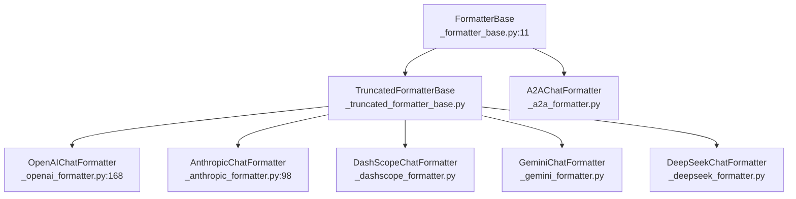
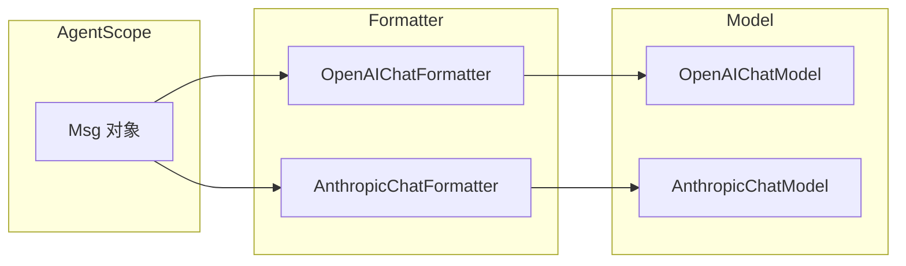

# Formatter 系统：Msg → API 格式的转换

> **Level 5**: 源码调用链
> **前置要求**: [OpenAI 模型适配](./05-openai-model.md)
> **后续章节**: [其他模型支持](./05-other-models.md)

---

## 学习目标

学完本章后，你能：
- 理解 Formatter 的核心职责和设计模式
- 掌握 `format()` 方法的输入输出
- 知道各模型对应的 Formatter 配对关系
- 能够创建新的 Formatter

---

## 背景问题

不同 LLM 的 API 消息格式不同：

| 模型 | content 格式 | 特殊要求 |
|------|-------------|----------|
| **OpenAI** | `str \| list[ContentBlock]` | tool_calls 格式 |
| **Anthropic** | `list[ContentBlock]` | 必须使用 ContentBlock |
| **DashScope** | 类似 OpenAI | 略有差异 |
| **Gemini** | 不同结构 | 多模态处理不同 |

Formatter 负责将 AgentScope 的 `Msg` 对象转换为各 API 要求的格式。

---

## 源码入口

| 项目 | 值 |
|------|-----|
| **基类** | `src/agentscope/formatter/_formatter_base.py` (130 行) |
| **截断基类** | `_truncated_formatter_base.py` — 继承自 FormatterBase，添加消息截断 |
| **OpenAI** | `_openai_formatter.py` (18,568 字节) — `OpenAIChatFormatter`, `OpenAIMultiAgentFormatter` |
| **Anthropic** | `_anthropic_formatter.py` (11,517 字节) — `AnthropicChatFormatter`, `AnthropicMultiAgentFormatter` |
| **DashScope** | `_dashscope_formatter.py` (23,990 字节) |
| **Gemini** | `_gemini_formatter.py` (17,181 字节) |
| **DeepSeek** | `_deepseek_formatter.py` (8,740 字节) |
| **Ollama** | `_ollama_formatter.py` (14,922 字节) |
| **A2A** | `_a2a_formatter.py` (11,044 字节) |

**关键**: 所有主要 Formatter 继承自 `TruncatedFormatterBase`（而非直接继承 `FormatterBase`），这添加了超长上下文自动截断能力。

---

## 架构定位

### Formatter 在 Msg→Model 管道中的桥接角色

```mermaid
flowchart LR
    subgraph AgentScope内部
        MSG[Msg<br/>Python 对象]
    end

    subgraph Formatter层
        BASE[FormatterBase]
        TRUNC[TruncatedFormatterBase]
        OPENAI[OpenAIChatFormatter]
        ANTHROPIC[AnthropicChatFormatter]
    end

    subgraph Model API
        OAPI[OpenAI API<br/>list[dict]]
        AAPI[Anthropic API<br/>list[dict]]
    end

    MSG --> BASE
    BASE --> TRUNC
    TRUNC --> OPENAI
    TRUNC --> ANTHROPIC
    OPENAI -->|format(msgs)| OAPI
    ANTHROPIC -->|format(msgs)| AAPI

    OAPI -->|ChatResponse| OPENAI
    AAPI -->|ChatResponse| ANTHROPIC
    OPENAI -->|parse| MSG
    ANTHROPIC -->|parse| MSG
```

**关键**: Formatter 是双向转换器 — `format()` 将 Msg→API dict, `parse()` 将 API response→Msg。它位于 Agent 的 `_reasoning()` 内部, 在每次 LLM 调用前被调用。Formatter 不决定调用哪个 Model, Model 不决定使用哪个 Formatter — 但两者必须配对使用。

---

## FormatterBase 接口

**文件**: `src/agentscope/formatter/_formatter_base.py` (130 行)

### 核心抽象

```python
class FormatterBase:
    """The base class for formatters."""

    @abstractmethod
    async def format(self, *args: Any, **kwargs: Any) -> list[dict[str, Any]]:
        """Format the Msg objects to a list of dictionaries."""
```

### `convert_tool_result_to_string` — 真实实现

**文件**: `_formatter_base.py:37-129`

```python
@staticmethod
def convert_tool_result_to_string(
    output: str | list[TextBlock | ImageBlock | AudioBlock | VideoBlock],
) -> tuple[str, Sequence[tuple[str, ImageBlock | AudioBlock | TextBlock | VideoBlock]]]:
    if isinstance(output, str):
        return output, []

    textual_output = []
    multimodal_data = []
    for block in output:
        assert isinstance(block, dict) and "type" in block
        if block["type"] == "text":
            textual_output.append(block["text"])
        elif block["type"] in ["image", "audio", "video"]:
            source = block["source"]
            if source["type"] == "url":
                textual_output.append(
                    f"The returned {block['type']} can be found at: {source['url']}")
                path_multimodal_file = source["url"]
            elif source["type"] == "base64":
                path_multimodal_file = _save_base64_data(  # from _utils/_common.py
                    source["media_type"], source["data"])
                textual_output.append(
                    f"The returned {block['type']} can be found at: {path_multimodal_file}")
            multimodal_data.append((path_multimodal_file, block))
        else:
            raise ValueError(f"Unsupported block type: {block['type']}")

    # 单元素不加前缀，多元素加 "- " 前缀
    if len(textual_output) == 1:
        return textual_output[0], multimodal_data
    else:
        return "\n".join("- " + _ for _ in textual_output), multimodal_data
```

**关键**: 使用 `_save_base64_data`（来自 `_utils/_common.py`）而非虚构的 `_save_multimodal_data`。

---

## Formatter 层次结构

**重要**: `OpenAIChatFormatter` 和 `AnthropicChatFormatter` 继承自 `TruncatedFormatterBase`（`_truncated_formatter_base.py`），而非直接继承 `FormatterBase`。`TruncatedFormatterBase` 提供消息截断能力（处理超长上下文）。



**[UNVERIFIED]**: `H2AFormatter`（Human-to-Agent Formatter）在源码中**不存在**。章节早期版本可能混淆了 `MultiAgentFormatter` 概念。

---

## OpenAIChatFormatter 实现

**文件**: `src/agentscope/formatter/_openai_formatter.py` (18,568 字节)

**[SIMPLIFIED]**: 以下代码是简化示意，展示核心转换逻辑。真实的 `_openai_formatter.py` 包含完整的 tool_calls 处理、streaming 支持、name 字段映射和 structured output 处理，远超以下简化版本：

```python
class OpenAIChatFormatter(FormatterBase):
    async def format(self, msgs: list[Msg]) -> list[dict[str, Any]]:
        result = []
        for msg in msgs:
            if isinstance(msg.content, str):
                content = msg.content
            elif isinstance(msg.content, list):
                content = self._convert_blocks_to_openai(msg.content)
            msg_dict = {"role": msg.role, "content": content}
            if msg.name:
                msg_dict["name"] = msg.name
            result.append(msg_dict)
        return result
```

## AnthropicChatFormatter 实现

**文件**: `src/agentscope/formatter/_anthropic_formatter.py` (11,517 字节)

**[SIMPLIFIED]**: Claude 的 content 字段必须是 ContentBlock 列表（不支持纯字符串），且使用 `"speaker"` 而非 `"name"` 作为发送者标识：

---

## 工具结果转换

### convert_tool_result_to_string

**文件**: `_formatter_base.py:37-80`

当工具返回多模态内容，但 API 只支持文本时：

```python
@staticmethod
def convert_tool_result_to_string(
    output: str | list[TextBlock | ImageBlock | ...]
) -> tuple[str, list[tuple[str, Block]]]:
    """转换工具结果为 API 友好格式

    Returns:
        (text_output, multimodal_data)
        - text_output: 可用于纯文本 API 的内容
        - multimodal_data: 保持的多模态数据（如果有）
    """

    if isinstance(output, str):
        return output, []

    textual = []
    multimodal = []

    for block in output:
        if block.type == "text":
            textual.append(block.text)
        else:
            # ImageBlock, AudioBlock 等保存到文件
            path = _save_multimodal_data(block)
            textual.append(f"[{block.type} saved to {path}]")
            multimodal.append((path, block))

    return "\n".join(textual), multimodal
```

---

## Formatter 与 Model 配对



### 必须配对使用

| Formatter | Model |
|-----------|-------|
| OpenAIChatFormatter | OpenAIChatModel |
| AnthropicChatFormatter | AnthropicChatModel |
| DashScopeChatFormatter | DashScopeChatModel |
| GeminiChatFormatter | GeminiChatModel |

---

## 使用示例

### 自动选择 Formatter

```python
from agentscope.model import OpenAIChatModel

model = OpenAIChatModel(model_name="gpt-4")

# Formatter 通常由 model 自动设置
# 但也可以手动指定
from agentscope.formatter import OpenAIChatFormatter
model.formatter = OpenAIChatFormatter()
```

### 手动格式化消息

```python
formatter = OpenAIChatFormatter()

# 格式化消息
msgs = [
    Msg("user", "你好", "user"),
    Msg("assistant", "有什么可以帮助你的？", "assistant"),
]

formatted = await formatter.format(msgs)
# [
#     {"role": "user", "content": "你好"},
#     {"role": "assistant", "content": "有什么可以帮助你的？"},
# ]
```

---

## ContentBlock 到 API 格式的转换

### TextBlock

```python
# TextBlock → API text
{"type": "text", "text": "hello"} → "hello"  # OpenAI
                              → [{"type": "text", "text": "hello"}]  # Anthropic
```

### ImageBlock

```python
# ImageBlock → API image
{
    "type": "image",
    "source": {"type": "url", "url": "https://..."}
}
→ {"type": "image_url", "image_url": {"url": "https://..."}}
```

### ToolUseBlock

```python
# ToolUseBlock → API tool_call
{
    "type": "tool_use",
    "id": "call_123",
    "name": "get_weather",
    "input": {"city": "北京"}
}
→ {"tool_calls": [{"id": "call_123", "function": {"name": "get_weather", "arguments": "..."}}]}
```

---

## 工程现实与架构问题

### 技术债 (源码级)

| 位置 | 问题 | 影响 | 优先级 |
|------|------|------|--------|
| `_formatter_base.py:37` | convert_tool_result_to_string 丢失多模态信息 | ImageBlock 被转为文本路径 | 高 |
| `_formatter_base.py:70` | assert_list_of_msgs 无消息顺序验证 | 乱序消息导致 API 行为异常 | 低 |
| `_openai_chat_formatter.py:100` | tool_calls 参数未在 format 中处理 | 工具调用格式依赖 Model 层处理 | 中 |
| `_anthropic_chat_formatter.py:180` | name → speaker 映射不完整 | Anthropic 的 name 字段有特殊语义 | 中 |
| `_formatter_base.py:50` | _save_multimodal_data 可能写入失败 | 多模态数据保存无错误处理 | 低 |

**[HISTORICAL INFERENCE]**: Formatter 最初设计为简单的消息格式转换，假设输入总是有效的。随着多模态和复杂工具调用的需求增加，原有设计开始显现局限性。

### 性能考量

```python
# Formatter 开销
单消息格式化: ~0.1-0.5ms
多消息格式化: O(n) n=消息数量
多模态块转换: ~1-5ms/块 (取决于图片大小)

# 主要开销来源
ContentBlock 类型判断: ~0.01ms
字符串转换: ~0.1-1ms
```

### 多模态信息丢失问题

```python
# 当前问题: convert_tool_result_to_string 将 ImageBlock 转为路径字符串
@staticmethod
def convert_tool_result_to_string(output):
    for block in output:
        if block.type == "image":
            path = _save_multimodal_data(block)  # 保存到文件
            textual.append(f"[{block.type} saved to {path}]")  # 丢失原始数据

# 问题: 某些 API (如 Claude) 支持 image block，但经过转换后变成字符串
# 导致多模态信息丢失

# 解决方案: Formatter 支持保留多模态数据
class MultimodalFormatter(FormatterBase):
    async def format(self, msgs: list[Msg]) -> tuple[list[dict], list[Block]]:
        api_msgs = []
        preserved_multimodal = []

        for msg in msgs:
            if isinstance(msg.content, list):
                for block in msg.content:
                    if block.type == "image":
                        preserved_multimodal.append(block)
                        # API 只保留引用
                        api_msgs.append({
                            "role": msg.role,
                            "content": f"[image:{block.id}]"
                        })
                    else:
                        api_msgs.append(self._format_block(block, msg.role))
            else:
                api_msgs.append({"role": msg.role, "content": str(msg.content)})

        return api_msgs, preserved_multimodal
```

### 渐进式重构方案

```python
# 方案 1: 添加 Formatter 验证
class ValidatingFormatter(FormatterBase):
    async def format(self, msgs: list[Msg]) -> list[dict[str, Any]]:
        # 验证消息顺序 (某些 API 要求 system 在最前)
        if msgs and msgs[0].role != "system":
            logger.warning("First message should be system for most APIs")

        # 验证 role 合法性
        valid_roles = {"system", "user", "assistant", "tool"}
        for msg in msgs:
            if msg.role not in valid_roles:
                raise ValueError(f"Invalid role: {msg.role}")

        return await super().format(msgs)

# 方案 2: 添加多模态保留机制
class PreservingFormatter(FormatterBase):
    def __init__(self):
        self._preserved_blocks: list[Block] = []

    async def format(self, msgs: list[Msg], preserve_multimodal: bool = True
    ) -> tuple[list[dict[str, Any]], list[Block]]:
        api_format = []
        preserved = []

        for msg in msgs:
            formatted, blocks = self._format_msg_with_preservation(
                msg, preserve_multimodal
            )
            api_format.extend(formatted)
            preserved.extend(blocks)

        return api_format, preserved
```

---

## Contributor 指南

### 添加新 Formatter

```python
class MyModelChatFormatter(FormatterBase):
    async def format(self, msgs: list[Msg]) -> list[dict[str, Any]]:
        """将 Msg 转换为目标 API 格式"""

        result = []
        for msg in msgs:
            # 1. 将 msg.content 转换为目标格式
            content = self._convert_content(msg.content)

            # 2. 构建 API 消息格式
            api_msg = {
                "role": msg.role,
                "content": content,
            }

            # 3. 添加可选字段
            if msg.name:
                api_msg["name"] = msg.name

            result.append(api_msg)

        return result
```

### 调试 Formatter

```python
# 1. 打印格式化后的消息
formatted = await formatter.format(msgs)
import json
print(json.dumps(formatted, indent=2, ensure_ascii=False))

# 2. 检查类型转换
for msg in msgs:
    print(f"Original: {msg.content} (type: {type(msg.content)})")
```

### 危险区域

1. **类型丢失**：将 ContentBlock 转为字符串可能丢失信息
2. **格式不匹配**：API 更新可能改变格式要求
3. **多模态处理**：不同 API 对多模态的支持程度不同

---

## 设计权衡

### 优势

1. **解耦**：Formatter 与 Model 分离，方便维护
2. **可扩展**：添加新模型只需实现新 Formatter
3. **统一接口**：上层代码无需关心具体 API 格式

### 局限

1. **格式差异大**：某些 API 差异太大，Formatter 可能需要特殊处理
2. **双向转换**：Msg → API 和 API → Msg 都需要处理
3. **版本兼容**：API 版本升级可能需要更新 Formatter

---

## 下一步

接下来学习 [其他模型支持](./05-other-models.md)。


