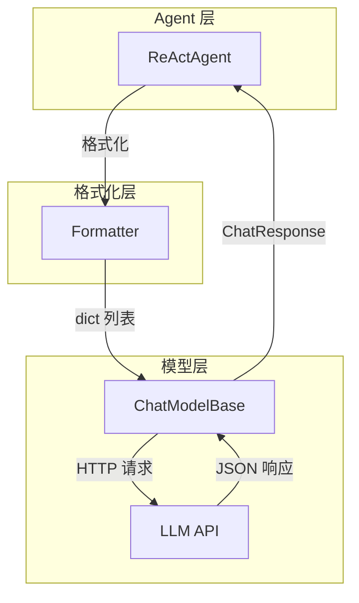

# ChatModelBase：统一模型接口

> **Level 5**: 源码调用链
> **前置要求**: [A2AAgent 协议](../04-agent-architecture/04-a2a-agent.md)
> **后续章节**: [OpenAI 模型适配](./05-openai-model.md)

---

## 学习目标

学完本章后，你能：
- 理解 ChatModelBase 的抽象设计
- 掌握 Model 的调用方式 `await model(prompt, tools=...)`
- 知道如何创建新的模型适配器

---

## 背景问题

不同 LLM 的 API 格式不同：
- OpenAI 用 `{"role": "user", "content": "..."}`
- Anthropic 用 `{"role": "user", "content": [{"type": "text", "text": "..."}]}`
- DashScope 可能又有不同

ChatModelBase 的职责是**封装这些差异**，提供统一的接口。

---

## 源码入口

| 项目 | 值 |
|------|-----|
| **文件路径** | `src/agentscope/model/_model_base.py` |
| **类名** | `ChatModelBase` |
| **行数** | ~78 行（核心抽象） |
| **关键方法** | `__call__()`, `_validate_tool_choice()` |
| **返回类型** | `ChatResponse \| AsyncGenerator[ChatResponse, None]` |

---

## 核心抽象

### ChatModelBase 定义

**文件**: `src/agentscope/model/_model_base.py:13`

```python
class ChatModelBase:
    """Base class for chat models."""

    model_name: str
    stream: bool

    def __init__(self, model_name: str, stream: bool) -> None:
        self.model_name = model_name
        self.stream = stream

    @abstractmethod
    async def __call__(
        self,
        *args: Any,
        **kwargs: Any,
    ) -> ChatResponse | AsyncGenerator[ChatResponse, None]:
        pass
```

**关键设计决策**：

1. **NOT 继承 ABC**：`ChatModelBase` 是普通类（不是 `ABC` 的子类）。它使用 `@abstractmethod` 装饰器依赖 duck-typing 而非显式抽象基类注册。这意味着子类通过约定而非强制来实现接口。

2. **`*args, **kwargs` 而非显式参数**：基类不使用 `prompt, tools, tool_choice` 等具体参数名。这使得每个模型适配器可以自由定义自己的参数列表，但也意味着 IDE 无法提供参数提示 — 类型安全被牺牲以换取灵活性。

3. **返回类型是 Union**：`ChatResponse | AsyncGenerator[ChatResponse, None]` — 流式模式返回异步生成器，非流式返回单个 ChatResponse。调用者需要 `isinstance` 检查或通过子类包装处理这种差异。

### ChatResponse 定义

**文件**: `src/agentscope/model/_model_response.py:20`

```python
class ChatResponse(DictMixin):
    """Model response wrapping text, tool calls, and usage metadata."""

    content: list[ContentBlock]  # TextBlock | ToolUseBlock | ...
    usage: Usage | None          # Token 用量 (prompt_tokens, completion_tokens)
    model: str                   # 实际使用的模型名称
    invocation_id: str           # 调用 ID（关联 tracing span）
```

`DictMixin` 使 ChatResponse 支持字典式访问 (`response["content"]`)，方便在 formatter 中处理。

---

## 使用方式

### 标准调用

```python
from agentscope.model import OpenAIChatModel

model = OpenAIChatModel(api_key="...", model_name="gpt-4o")

response = await model(
    prompt=[
        {"role": "system", "content": "你是一个助手"},
        {"role": "user", "content": "你好"},
    ],
    tools=toolkit.get_json_schemas(),  # 可选
    tool_choice="auto",                  # 可选
)

# response 是 ChatResponse
print(response.content)  # list[ContentBlock]
print(response.usage)   # Usage(total_tokens=..., ...)
```

### 流式调用

```python
model = OpenAIChatModel(api_key="...", model_name="gpt-4o", stream=True)

# stream=True 时，返回 AsyncGenerator
async for chunk in model(prompt):
    print(chunk.content)  # 逐块打印
```

---

## 架构定位

### Model 在系统中的位置



**关键洞察**: Agent 只和 Formatter 交互，Formatter 只和 Model 交互，Model 负责所有 API 调用细节。

---

## 支持的模型

| 模型类 | 文件 | 支持的模型 |
|--------|------|-----------|
| `OpenAIChatModel` | `_openai_model.py` | GPT-4, GPT-4o, GPT-4-turbo |
| `DashScopeChatModel` | `_dashscope_model.py` | 通义千问系列 |
| `AnthropicChatModel` | `_anthropic_model.py` | Claude 3, Claude 3.5 |
| `GeminiChatModel` | `_gemini_model.py` | Gemini Pro, Gemini Ultra |
| `OllamaChatModel` | `_ollama_model.py` | 本地开源模型 |
| `TrinityChatModel` | `_trinity_model.py` | Trinity 模型 |

---

## 工程经验

### 为什么 `__call__` 是 async？

LLM API 调用是**网络 IO**，涉及 HTTP 请求和响应等待。在异步环境中，网络 IO 应该用 `await`，不阻塞事件循环。

### 为什么 tools 参数是 `list[dict]` 而非 `list[Tool]`？

因为不同 LLM 的 tools 格式不同（OpenAI 的 function calling vs Anthropic 的 tool_use）。Model 层接收的是**已经序列化好的 dict**，Formatter 负责生成这个 dict。

### 流式输出的处理

```python
if self.stream:
    # 返回 AsyncGenerator
    async for chunk in model(prompt):
        print(chunk.content, end="", flush=True)
else:
    # 返回完整 ChatResponse
    response = await model(prompt)
    print(response.content)
```

---

## 工程现实与架构问题

### 技术债 (源码级)

| 位置 | 问题 | 影响 | 优先级 |
|------|------|------|--------|
| `_model_base.py:50` | __call__ 无重试机制 | API 限流时会直接失败 | 高 |
| `_model_base.py:50` | __call__ 无超时控制 | 慢 API 导致请求永久阻塞 | 高 |
| `_model_response.py:10` | ChatResponse usage 可能为 None | 上层代码需要做空值检查 | 中 |
| `_model_base.py:13` | 无速率限制机制 | 可能触发 API 提供商限流 | 中 |
| `_model_base.py:50` | stream 和非 stream 返回类型不一致 | 调用方需要区分处理 | 低 |

**[HISTORICAL INFERENCE]**: ChatModelBase 设计时假设 API 调用是可靠的，网络错误和限流由上层处理。实际生产环境中，这些问题会导致服务不稳定。

### 性能考量

```python
# Model 调用延迟估算
同步 HTTP: ~100-500ms (取决于 API 提供商)
异步 HTTP: ~50-300ms (可并发)
流式响应: 首 token ~200ms，后续 ~10-50ms/token

# Token 计算
OpenAI: 1 token ≈ 4 字符 (英文) 或 1-2 字符 (中文)
Anthropic: 近似 OpenAI
```

### API 限流问题

```python
# 当前问题: 无速率限制，可能触发 API 限流
class ChatModelBase(ABC):
    async def __call__(self, prompt, **kwargs):
        # 每次调用都直接请求，无节流
        return await self._request(prompt)

# 解决方案: 添加令牌桶限流
import asyncio
from dataclasses import dataclass, field

@dataclass
class RateLimiter:
    requests_per_second: float
    _tokens: float = field(default=0)
    _last_update: float = field(default=0)

    async def acquire(self) -> None:
        now = asyncio.get_event_loop().time()
        elapsed = now - self._last_update
        self._tokens = min(
            self.requests_per_second,
            self._tokens + elapsed * self.requests_per_second
        )
        if self._tokens < 1:
            await asyncio.sleep((1 - self._tokens) / self.requests_per_second)
        self._tokens -= 1
        self._last_update = now
```

### 渐进式重构方案

```python
# 方案 1: 添加超时控制
class TimeoutChatModelBase(ChatModelBase):
    async def __call__(
        self,
        prompt: list[dict[str, Any]],
        timeout: float = 60.0,
        **kwargs,
    ) -> ChatResponse:
        try:
            return await asyncio.wait_for(
                self._call_impl(prompt, **kwargs),
                timeout=timeout
            )
        except asyncio.TimeoutError:
            raise TimeoutError(f"Model call timed out after {timeout}s")

# 方案 2: 添加自动重试
class RetryChatModelBase(ChatModelBase):
    def __init__(self, *args, max_retries: int = 3, **kwargs):
        super().__init__(*args, **kwargs)
        self.max_retries = max_retries

    async def __call__(self, prompt, **kwargs) -> ChatResponse:
        last_error = None
        for attempt in range(self.max_retries):
            try:
                return await self._call_impl(prompt, **kwargs)
            except (httpx.TimeoutException, httpx.HTTPStatusError) as e:
                last_error = e
                if attempt < self.max_retries - 1:
                    await asyncio.sleep(2 ** attempt)  # 指数退避
        raise last_error
```

---

## Contributor 指南

### 如何添加新模型

```python
class MyModelChatModel(ChatModelBase):
    async def __call__(
        self,
        prompt: list[dict[str, Any]],
        tools: list[dict[str, Any]] | None = None,
        tool_choice: str | None = None,
        **kwargs: Any,
    ) -> ChatResponse:
        # 1. 将 prompt 转换为我的模型的 API 格式
        api_format = self._convert_prompt(prompt)

        # 2. 调用我的模型的 API
        response = await self._call_api(api_format)

        # 3. 将响应转换为 ChatResponse
        return ChatResponse(
            content=self._parse_response(response),
            usage=response.usage,
            model=self.model_name,
            invocation_id=response.id,
        )
```

### 测试新模型适配器

```python
@pytest.mark.asyncio
async def test_my_model():
    model = MyModelChatModel(api_key="test", model_name="test-model")
    response = await model([
        {"role": "user", "content": "Hello"}
    ])
    assert isinstance(response, ChatResponse)
    assert len(response.content) > 0
```

### 危险区域

1. **流式/非流式返回类型不一致**：调用方需要区分处理
2. **usage 可能为 None**：需要做空值检查
3. **无连接池管理**：频繁创建销毁 HTTP 客户端

---

## 下一步

接下来学习 [OpenAI 模型适配](./05-openai-model.md)，了解具体的模型适配实现。


