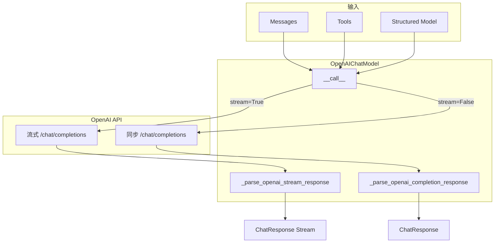
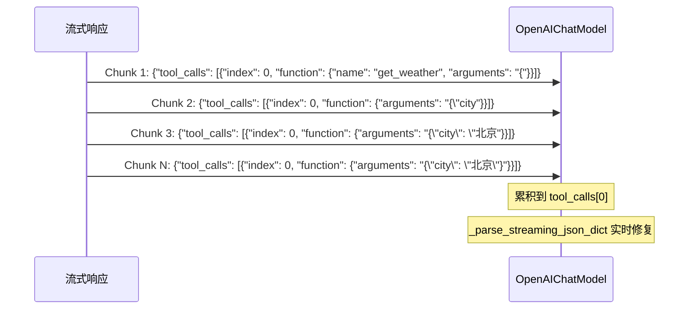

# OpenAI 模型适配

> **Level 5**: 源码调用链
> **前置要求**: [ChatModelBase 统一接口](./05-model-interface.md)
> **后续章节**: [Formatter 系统分析](./05-formatter-system.md)

---

## 学习目标

学完本章后，你能：
- 理解 OpenAIChatModel 的完整实现细节
- 掌握流式响应的解析机制
- 理解 function calling 和 structured output 的实现
- 知道如何调试 OpenAI 模型调用

---

## 背景问题

OpenAI 的 Chat API 与其他模型（如 DashScope、Anthropic）有不同之处：

| 特性 | OpenAI API | 其他模型 |
|------|------------|----------|
| **API 端点** | `/chat/completions` | 各家不同 |
| **工具格式** | `tools` 数组 | 各家不同 |
| **结构化输出** | `response_format` | 各家不同 |
| **音频格式** | `audio` 参数 | 不支持 |

AgentScope 通过 `OpenAIChatModel` 封装这些差异。

---

## 源码入口

| 项目 | 值 |
|------|-----|
| **文件路径** | `src/agentscope/model/_openai_model.py` |
| **类名** | `OpenAIChatModel` |
| **核心方法** | `__call__`, `_parse_openai_stream_response`, `_parse_openai_completion_response` |

---

## 架构定位

### OpenAIChatModel 在 Agent→API 管道中的位置

```mermaid
flowchart LR
    subgraph AgentScope
        AGENT[ReActAgent._reasoning]
        FORMATTER[OpenAIChatFormatter.format]
    end

    subgraph OpenAIChatModel
        CALL[__call__ @trace_llm]
        CLIENT[openai.AsyncClient / AsyncAzureOpenAI]
        PARSE_STREAM[_parse_openai_stream_response]
        PARSE_SYNC[_parse_openai_completion_response]
    end

    subgraph OpenAI_API
        API[POST /chat/completions]
    end

    AGENT -->|prompt + tools| FORMATTER
    FORMATTER -->|list[dict]| CALL
    CALL -->|stream=True| CLIENT
    CALL -->|stream=False| CLIENT
    CLIENT -->|HTTP| API
    API -->|ChatCompletionChunk| PARSE_STREAM
    API -->|ChatCompletion| PARSE_SYNC
    PARSE_STREAM -->|AsyncGenerator[ChatResponse]| AGENT
    PARSE_SYNC -->|ChatResponse| AGENT
```

**关键**: `OpenAIChatModel` 是 `ChatModelBase` 的具体实现。它不处理 Msg 对象 — 输入已经是 `list[dict]`（由 Formatter 预先转换）。它只负责 HTTP 调用和响应解析。`@trace_llm` 装饰器在 `__call__` 上自动添加 OpenTelemetry span。

---

## OpenAIChatModel 实现

**文件**: `src/agentscope/model/_openai_model.py:71-173`

### 初始化

```python
class OpenAIChatModel(ChatModelBase):
    def __init__(
        self,
        model_name: str,
        api_key: str | None = None,
        stream: bool = True,
        reasoning_effort: Literal["low", "medium", "high"] | None = None,
        organization: str = None,
        stream_tool_parsing: bool = True,  # 流式工具解析
        client_type: Literal["openai", "azure"] = "openai",
        client_kwargs: dict[str, JSONSerializableObject] | None = None,
        generate_kwargs: dict[str, JSONSerializableObject] | None = None,
        **kwargs: Any,
    ) -> None:
        import openai

        if client_type == "azure":
            self.client = openai.AsyncAzureOpenAI(
                api_key=api_key,
                organization=organization,
                **(client_kwargs or {}),
            )
        else:
            self.client = openai.AsyncClient(
                api_key=api_key,
                organization=organization,
                **(client_kwargs or {}),
            )

        self.reasoning_effort = reasoning_effort
        self.stream_tool_parsing = stream_tool_parsing
        self.generate_kwargs = generate_kwargs or {}
```

### 核心调用

**文件**: `_openai_model.py:175-343`

```python
@trace_llm
async def __call__(
    self,
    messages: list[dict],
    tools: list[dict] | None = None,
    tool_choice: Literal["auto", "none", "required"] | str | None = None,
    structured_model: Type[BaseModel] | None = None,
    **kwargs: Any,
) -> ChatResponse | AsyncGenerator[ChatResponse, None]:
    """Get the response from OpenAI chat completions API"""

    kwargs = {
        "model": self.model_name,
        "messages": messages,
        "stream": self.stream,
        **self.generate_kwargs,
        **kwargs,
    }

    if structured_model:
        # 结构化输出模式
        if not self.stream:
            response = await self.client.chat.completions.parse(**kwargs)
        else:
            return self._structured_stream_with_fallback(...)
    else:
        # 普通模式
        if self.stream:
            return self._parse_openai_stream_response(...)
        else:
            response = await self.client.chat.completions.create(**kwargs)
            return self._parse_openai_completion_response(...)

    return parsed_response
```

---

## 流式响应解析

**文件**: `_openai_model.py:346-560`

### 流式解析核心逻辑

```python
async def _parse_openai_stream_response(
    self,
    start_datetime: datetime,
    response: AsyncStream,
    structured_model: Type[BaseModel] | None = None,
) -> AsyncGenerator[ChatResponse, None]:
    """Given an OpenAI streaming completion response, yield ChatResponse objects."""

    tool_calls = OrderedDict()  # 工具调用累积
    last_input_objs = {}       # 上一次的输入对象

    async with response as stream:
        async for item in stream:
            chunk = item.chunk if structured_model else item

            # 1. 提取 reasoning（思维链）
            delta_reasoning = getattr(choice.delta, "reasoning_content", None)
            if not isinstance(delta_reasoning, str):
                delta_reasoning = getattr(choice.delta, "reasoning", None)

            # 2. 提取文本内容
            text += getattr(choice.delta, "content", None) or ""

            # 3. 提取音频
            if hasattr(choice.delta, "audio") and "data" in choice.delta.audio:
                audio += choice.delta.audio["data"]

            # 4. 累积工具调用
            for tool_call in getattr(choice.delta, "tool_calls", None) or []:
                if tool_call.index in tool_calls:
                    tool_calls[tool_call.index]["input"] += tool_call.function.arguments
                else:
                    tool_calls[tool_call.index] = {
                        "type": "tool_use",
                        "id": tool_call.id,
                        "name": tool_call.function.name,
                        "input": tool_call.function.arguments or "",
                    }

            # 5. 流式 JSON 解析（如果启用）
            if self.stream_tool_parsing:
                repaired_input = _parse_streaming_json_dict(
                    input_str,
                    last_input_objs.get(tool_id),
                )
                last_input_objs[tool_id] = repaired_input

            # 6. 构建 ChatResponse
            yield ChatResponse(content=contents, usage=usage)
```

### 流式 JSON 修复

**文件**: `_openai_model.py:504-510`

当 `stream_tool_parsing=True` 时，即使 JSON 不完整也会实时解析：

```python
# 如果解析工具输入在流式模式
if self.stream_tool_parsing:
    repaired_input = _parse_streaming_json_dict(
        input_str,  # 可能是不完整的 JSON，如 '{"a": "x'
        last_input_objs.get(tool_id),  # 上一次的修复结果
    )
    last_input_objs[tool_id] = repaired_input
else:
    repaired_input = {}  # 保持为空，直到最终块
```

---

## 结构化输出

**文件**: `_openai_model.py:271-325`

### response_format 方式

```python
if structured_model:
    kwargs["response_format"] = structured_model
    try:
        response = await self.client.chat.completions.parse(**kwargs)
    except openai.BadRequestError as e:
        # 回退到工具调用方式
        self._structured_output_fallback = True
        response = await self._structured_via_tool_call(...)
```

### 工具调用回退方式

**文件**: `_openai_model.py:730-757`

```python
async def _structured_via_tool_call(
    self,
    kwargs: dict,
    structured_model: Type[BaseModel],
    start_datetime: datetime,
) -> Any:
    """Use tool-call approach for structured output."""

    # 将 Pydantic model 转为工具
    format_tool = _create_tool_from_base_model(structured_model)
    kwargs["tools"] = self._format_tools_json_schemas([format_tool])
    kwargs["tool_choice"] = self._format_tool_choice(format_tool["function"]["name"])

    response = await self.client.chat.completions.create(**kwargs)

    if self.stream:
        return self._parse_openai_stream_response(...)
    return response
```

---

## Azure OpenAI 支持

**文件**: `_openai_model.py:157-162`

```python
if client_type == "azure":
    self.client = openai.AsyncAzureOpenAI(
        api_key=api_key,
        organization=organization,
        **(client_kwargs or {}),
    )
else:
    self.client = openai.AsyncClient(
        api_key=api_key,
        organization=organization,
        **(client_kwargs or {}),
    )
```

---

## 使用示例

### 基础调用

```python
from agentscope.model import OpenAIChatModel

model = OpenAIChatModel(
    model_name="gpt-4",
    api_key=os.environ.get("OPENAI_API_KEY"),
)

# 非流式
response = await model([{"role": "user", "content": "Hello!"}])
print(response.content)  # [TextBlock(type="text", text="Hello!")]

# 流式
async for chunk in model([{"role": "user", "content": "Hello!"}]):
    print(chunk.content)
```

### 带工具调用

```python
tools = [
    {
        "type": "function",
        "function": {
            "name": "get_weather",
            "description": "获取天气信息",
            "parameters": {
                "type": "object",
                "properties": {"city": {"type": "string"}},
            },
        },
    }
]

response = await model(
    messages=[{"role": "user", "content": "北京天气如何?"}],
    tools=tools,
    tool_choice="auto",
)
```

### 结构化输出

```python
from pydantic import BaseModel

class WeatherResponse(BaseModel):
    city: str
    temperature: int
    condition: str

model = OpenAIChatModel(model_name="gpt-4")

response = await model(
    messages=[{"role": "user", "content": "北京天气如何?"}],
    structured_model=WeatherResponse,
)
# response.metadata = {"city": "北京", "temperature": 25, "condition": "晴"}
```

---

## 调试技巧

### 开启 HTTP 日志

```python
import logging
import httpx

# 开启 aiohttp/httpx 日志
logging.getLogger("httpx").setLevel(logging.DEBUG)
logging.getLogger("httpcore").setLevel(logging.DEBUG)
```

### 检查请求/响应

```python
# 添加拦截器
from openai import AsyncClient

client = AsyncClient(
    api_key=api_key,
    httpx_kwargs={"event_hooks": {
        "request": [lambda r: print(f"Request: {r}")],
        "response": [lambda r: print(f"Response: {r}")],
    }}
)
```

---

## 架构图

### OpenAI 调用流程



### 工具调用累积



---

## 工程现实与架构问题

### OpenAI 模型技术债

| 位置 | 问题 | 影响 | 优先级 |
|------|------|------|--------|
| `_openai_model.py:428` | 多模态 Block 处理未完整 | multimodal 可能无法正确处理 | 中 |
| `_openai_model.py:750` | Structured Output 处理不完整 | 强制调用工具场景未实现 | 中 |
| `_openai_model.py:500` | reasoning_content 字段处理不一致 | o3/o4 模型推理内容可能丢失 | 中 |

**[HISTORICAL INFERENCE]**: 多模态支持和 Structured Output 是逐步添加的功能，设计时未统一考虑边缘情况。

### 性能考量

```python
# OpenAI API 调用开销估算
首 token 延迟: ~200-500ms (取决于模型和网络)
Token 生成速度: ~50-100 tokens/s (gpt-4)
流式 vs 同步: 流式首 token 更早，但总时间相近

# 建议:
# - 交互场景: 使用流式响应提升感知速度
# - 批量处理: 使用同步响应减少开销
# - 工具调用: 注意 max_tokens 限制，避免截断
```

### Azure OpenAI 差异

| 问题 | 说明 | 兼容性 |
|------|------|--------|
| API 版本路径 | `openai.api_version` 不同 | 需适配 |
| 认证方式 | `azure.ActiveDirectoryConfig` | 需额外配置 |
| Embedding 端点 | `/embeddings` vs `/embeddings?api-version=...` | 需处理 |

### 渐进式重构方案

```python
# 方案: 统一多模态处理
async def _process_multimodal_blocks(
    self,
    blocks: list[ContentBlock],
) -> list[dict]:
    """统一处理多模态 ContentBlock"""
    processed = []
    for block in blocks:
        if block.type == "text":
            processed.append({"type": "text", "text": block.text})
        elif block.type == "image":
            processed.append(await self._process_image_block(block))
        elif block.type == "video":
            processed.append(await self._process_video_block(block))
        # ...
    return processed
```

---

## Contributor 指南

### 危险区域

1. **流式 JSON 解析** (`_parse_streaming_json_dict`)：处理不完整的 JSON 可能导致解析错误
2. **结构化输出回退**：当 `response_format` 失败时回退到工具调用，但 `structured_model` 不会被继承
3. **reasoning_content**：o3/o4 模型的 reasoning 可能在不同字段

### 测试要点

```python
# 测试流式响应
async for chunk in model(messages, stream=True):
    assert isinstance(chunk, ChatResponse)
    assert chunk.content is not None

# 测试工具调用
response = await model(messages, tools=[...], tool_choice="auto")
tool_calls = [b for b in response.content if b.get("type") == "tool_use"]
assert len(tool_calls) > 0

# 测试结构化输出
response = await model(messages, structured_model=WeatherResponse)
assert isinstance(response.metadata, dict)
```

---

## 下一步

接下来学习 [Formatter 系统分析](./05-formatter-system.md)。


