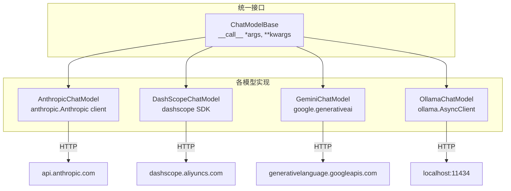

# 其他模型支持：Anthropic/Gemini/DashScope/Ollama

> **Level 5**: 源码调用链
> **前置要求**: [Formatter 系统分析](./05-formatter-system.md)
> **后续章节**: [工具系统核心](../06-tool-system/06-toolkit-core.md)

---

## 学习目标

学完本章后，你能：
- 理解各模型适配器的关键差异
- 掌握 Anthropic Claude 的 content block 格式
- 知道 DashScope 和 Ollama 的配置方式
- 理解为什么不同模型需要不同的 Formatter

---

## 背景问题

每个模型提供商的 API 都有差异：

| 差异点 | OpenAI | Anthropic | DashScope | Ollama |
|--------|--------|-----------|-----------|--------|
| **content 格式** | `str \| list` | `list[ContentBlock]` | 类似 OpenAI | 类似 OpenAI |
| **工具格式** | `tools` 数组 | `tools` 数组 | `tools` 数组 | `tools` 数组 |
| **thinking 支持** | o3/o4 | Claude 3.5 | 通义 | deepseek-r1 |
| **base URL** | api.openai.com | api.anthropic.com | dashscope.aliyuncs.com | localhost |

AgentScope 通过**独立的模型类 + 独立的 Formatter** 处理这些差异。

---

## 源码入口

| 模型 | 文件 | 类名 |
|------|------|------|
| **Anthropic** | `model/_anthropic_model.py` | `AnthropicChatModel(ChatModelBase)` |
| **DashScope** | `model/_dashscope_model.py` | `DashScopeChatModel(ChatModelBase)` |
| **Gemini** | `model/_gemini_model.py` | `GeminiChatModel(ChatModelBase)` |
| **Ollama** | `model/_ollama_model.py` | `OllamaChatModel(ChatModelBase)` |

---

## 架构定位

### 模型适配器的统一模式



**关键**: 所有模型适配器遵循同一模式 — 封装 HTTP client、实现 `__call__`、处理流式/非流式响应。差异化在于: thinking 配置（Claude）、tool_choice 格式（各 API 不同）、multimodal 支持（Gemini/Ollama 特殊处理）。

---

## Anthropic Claude 模型

**文件**: `src/agentscope/model/_anthropic_model.py:40-200`

### AnthropicChatModel 初始化

```python
class AnthropicChatModel(ChatModelBase):
    def __init__(
        self,
        model_name: str,
        api_key: str | None = None,
        max_tokens: int = 2048,
        stream: bool = True,
        thinking: dict | None = None,  # Claude 思维链配置
        stream_tool_parsing: bool = True,
        client_kwargs: dict | None = None,
        generate_kwargs: dict | None = None,
        **kwargs: Any,
    ) -> None:
        import anthropic
        self.client = anthropic.AsyncAnthropic(api_key=api_key, ...)
```

### Claude 消息格式差异

```python
# OpenAI 格式
{"role": "user", "content": "Hello"}

# Anthropic 格式（content 必须是 ContentBlock 列表）
{
    "role": "user",
    "content": [{"type": "text", "text": "Hello"}]
}
```

### thinking 配置

```python
# 启用 Claude 的思维链
thinking = {
    "type": "enabled",
    "budget_tokens": 1024
}
```

### 与 OpenAI 的主要区别

| 特性 | OpenAI | Anthropic |
|------|--------|-----------|
| **API 端点** | `/chat/completions` | `/messages` |
| **HTTP 方法** | POST | POST |
| **max_tokens 参数** | 在 create 中 | 单独参数 |
| **content 类型** | `str \| list` | 必须 `list[ContentBlock]` |

---

## DashScope 模型

**文件**: `src/agentscope/model/_dashscope_model.py`

### DashScopeChatModel

阿里云的通义千问系列模型：

```python
class DashScopeChatModel(ChatModelBase):
    def __init__(
        self,
        model_name: str = "qwen-max",
        api_key: str | None = None,
        stream: bool = True,
        **kwargs,
    ) -> None:
        """初始化 DashScope 模型

        Args:
            model_name: 模型名称，如 "qwen-max", "qwen-plus", "qwen-turbo"
            api_key: DashScope API key
            stream: 是否流式输出
        """
        import dashscope
        dashscope.api_key = api_key
        self.model_name = model_name
```

### 支持的模型

| 模型 | 特点 | 适用场景 |
|------|------|----------|
| `qwen-max` | 最高质量 | 复杂任务 |
| `qwen-plus` | 高性价比 | 一般任务 |
| `qwen-turbo` | 快速响应 | 实时交互 |
| `qwen-vl-plus` | 多模态 | 图文理解 |

---

## Ollama 模型

**文件**: `src/agentscope/model/_ollama_model.py:33-200`

### OllamaChatModel

本地运行的 LLM：

```python
class OllamaChatModel(ChatModelBase):
    def __init__(
        self,
        model_name: str,
        stream: bool = False,
        options: dict | None = None,  # temperature, top_p 等
        keep_alive: str = "5m",  # 模型在内存中保持时间
        enable_thinking: bool | None = None,  # 思维链支持
        host: str | None = None,  # Ollama 服务器地址
        **kwargs,
    ) -> None:
        """初始化 Ollama 模型

        Args:
            model_name: 模型名称，如 "llama2", "qwen2.5", "deepseek-r1"
            stream: 是否流式输出
            options: 额外参数（temperature, top_p, num_ctx 等）
            keep_alive: 模型在内存中保持的时间，如 "5m", "1h", "0" (立即卸载)
            enable_thinking: 是否启用思维链（仅支持部分模型如 qwen3, deepseek-r1）
        """
        from ollama import AsyncClient
        self.client = AsyncClient(host=host or "http://localhost:11434")
```

### 本地模型优势

| 优势 | 说明 |
|------|------|
| **隐私** | 数据不离开本地 |
| **成本** | 无 API 调用费用 |
| **离线** | 无需网络连接 |
| **自定义** | 可以微调自己的模型 |

### 常用配置

```python
model = OllamaChatModel(
    model_name="llama2",
    options={
        "temperature": 0.7,
        "top_p": 0.9,
        "num_ctx": 4096,  # 上下文窗口大小
    },
    keep_alive="30m",  # 30分钟后卸载模型
)
```

---

## 模型选择指南

### 按场景选择

| 场景 | 推荐模型 | 原因 |
|------|---------|------|
| **通用任务** | GPT-4o, Claude 3.5 | 能力最强 |
| **中文任务** | DashScope qwen-max | 中文优化 |
| **长上下文** | Claude 3.5, GPT-4o | 200K 上下文 |
| **成本敏感** | Ollama, DashScope turbo | 本地/API 便宜 |
| **隐私敏感** | Ollama | 数据不离本地 |
| **快速原型** | Ollama | 无需配置 API |

### 按能力选择

```
能力: GPT-4o ≈ Claude 3.5 > Gemini > GPT-3.5 > Claude 3 > ...
成本: GPT-4o > Claude 3.5 > Gemini > Ollama (本地) > DashScope
```

---

## 统一的 ChatResponse

**文件**: `src/agentscope/model/_model_response.py`

所有模型返回统一的 `ChatResponse` 对象：

```python
@dataclass
class ChatResponse:
    """统一的响应格式"""

    content: list[TextBlock | ToolUseBlock | ThinkingBlock | ...]
    """响应内容块列表"""

    usage: ChatUsage | None = None
    """token 使用量"""

    metadata: dict | None = None
    """模型特定元数据"""

    id: str | None = None
    """响应 ID"""
```

这确保了上层代码（Formatter、Agent）与具体模型解耦。

---

## 使用示例

### Anthropic Claude

```python
from agentscope.model import AnthropicChatModel

model = AnthropicChatModel(
    model_name="claude-3-5-sonnet-20241022",
    api_key=os.environ["ANTHROPIC_API_KEY"],
    max_tokens=2048,
    thinking={"type": "enabled", "budget_tokens": 1024},
)

response = await model([{"role": "user", "content": "解释量子计算"}])
```

### DashScope

```python
from agentscope.model import DashScopeChatModel

model = DashScopeChatModel(
    model_name="qwen-max",
    api_key=os.environ["DASHSCOPE_API_KEY"],
)

response = await model([{"role": "user", "content": "写一首诗"}])
```

### Ollama

```python
from agentscope.model import OllamaChatModel

model = OllamaChatModel(
    model_name="deepseek-r1:14b",
    host="http://localhost:11434",
    options={"temperature": 0.7},
    enable_thinking=True,  # 启用思维链
)

response = await model([{"role": "user", "content": "分析这道算法题"}])
```

---

## 工程现实与架构问题

### 技术债 (源码级)

| 位置 | 问题 | 影响 | 优先级 |
|------|------|------|--------|
| `_anthropic_model.py:45` | thinking 模式下 max_tokens 必须足够大 | token 预算不足导致思维链截断 | 高 |
| `_dashscope_model.py:50` | DashScope 使用全局 api_key | 多实例无法区分配置 | 中 |
| `_ollama_model.py:100` | Ollama 无连接健康检查 | 远程 Ollama 服务宕机时无提示 | 中 |
| `_anthropic_model.py:50` | stream_tool_parsing 依赖模型版本 | 旧模型不支持会导致解析失败 | 低 |
| `_ollama_model.py:150` | keep_alive 时间单位不统一 | "5m" 和 300 语义不一致 | 低 |

**[HISTORICAL INFERENCE]**: 各模型适配器是独立开发演进的，缺乏统一的错误处理和配置模式。DashScope 的全局 api_key 是早期设计的历史遗留。

### 性能考量

```python
# 各模型延迟对比 (估算)
OpenAI GPT-4o: ~200-500ms (美国节点)
Anthropic Claude: ~300-600ms
DashScope qwen: ~100-300ms (阿里云内网)
Ollama (本地): ~50-200ms (取决于硬件)

# Token 生成速度
OpenAI: ~50-100 tokens/s
Anthropic: ~40-80 tokens/s
Ollama (RTX 4090): ~30-60 tokens/s
```

### DashScope 全局配置问题

```python
# 当前问题: DashScope 使用全局 api_key
import dashscope
dashscope.api_key = api_key  # 全局设置，无法区分多实例

# 问题: 如果创建多个不同 api_key 的 DashScope 实例
model_a = DashScopeChatModel(model_name="qwen-max", api_key="key_a")
model_b = DashScopeChatModel(model_name="qwen-max", api_key="key_b")
# 实际两者共享同一个 api_key

# 解决方案: 使用实例级配置
class InstanceDashScopeModel(DashScopeChatModel):
    def __init__(self, model_name: str, api_key: str = None, **kwargs):
        super().__init__(model_name, api_key, **kwargs)
        # dashscope.api_key 是全局的，但可以用环境变量隔离
        import os
        os.environ["DASHSCOPE_API_KEY"] = api_key
        dashscope.api_key = os.environ["DASHSCOPE_API_KEY"]
```

### 渐进式重构方案

```python
# 方案 1: Ollama 添加健康检查
class HealthCheckOllama(OllamaChatModel):
    async def _check_connection(self) -> bool:
        try:
            async with asyncio.timeout(5):
                response = await self.client.list()
                return True
        except Exception:
            return False

    async def __call__(self, *args, **kwargs) -> ChatResponse:
        if not await self._check_connection():
            raise ConnectionError(f"Ollama at {self.host} is not responding")
        return await super().__call__(*args, **kwargs)

# 方案 2: Anthropic 添加思维链验证
class ValidatingAnthropicModel(AnthropicChatModel):
    def __init__(self, *args, thinking: dict | None = None, **kwargs):
        super().__init__(*args, thinking=thinking, **kwargs)
        if thinking and self.max_tokens < 1000:
            logger.warning(
                "thinking mode requires max_tokens >= 1000, "
                f"got {self.max_tokens}"
            )
```

---

## Contributor 指南

### 添加新模型

1. 在 `src/agentscope/model/` 下创建新文件，如 `_new_model.py`
2. 继承 `ChatModelBase`
3. 实现 `__call__()` 方法，返回 `ChatResponse`
4. 在 `src/agentscope/model/__init__.py` 中导出

```python
# 示例
class NewModelChatModel(ChatModelBase):
    def __init__(self, model_name: str, api_key: str = None, **kwargs):
        super().__init__(model_name, stream=kwargs.get("stream", True))
        # 初始化客户端

    @trace_llm
    async def __call__(self, messages, **kwargs) -> ChatResponse:
        # 1. 调用 API
        response = await self.client.chat(...)
        # 2. 解析响应
        return self._parse_response(response)
```

### 危险区域

1. **API 版本兼容性**：各模型 API 可能在版本升级时变化
2. **错误处理**：网络错误、超时、API 限流需要正确处理
3. **Token 计数**：不同模型的 token 计算方式可能不同

---

## 下一步

接下来学习 [工具系统核心](../06-tool-system/06-toolkit-core.md)。


