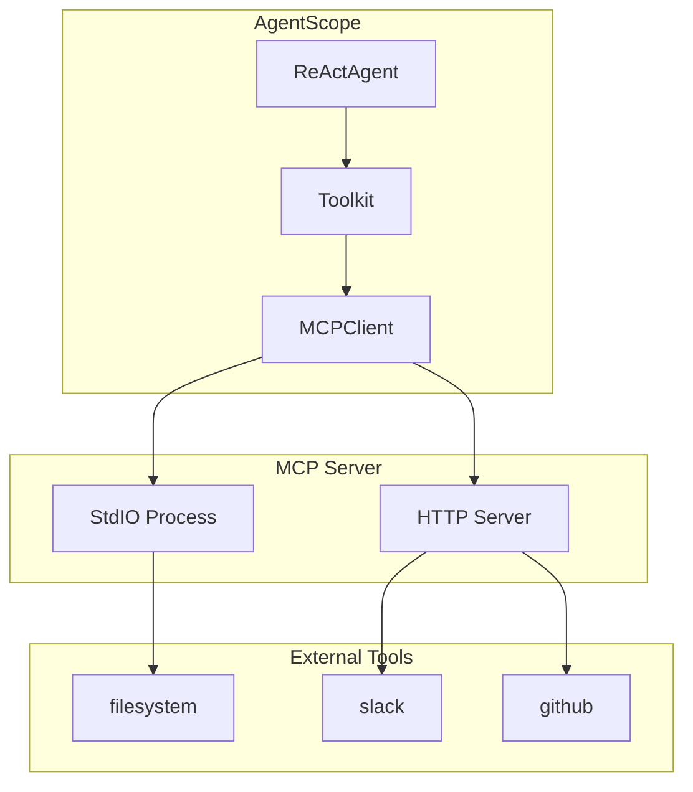
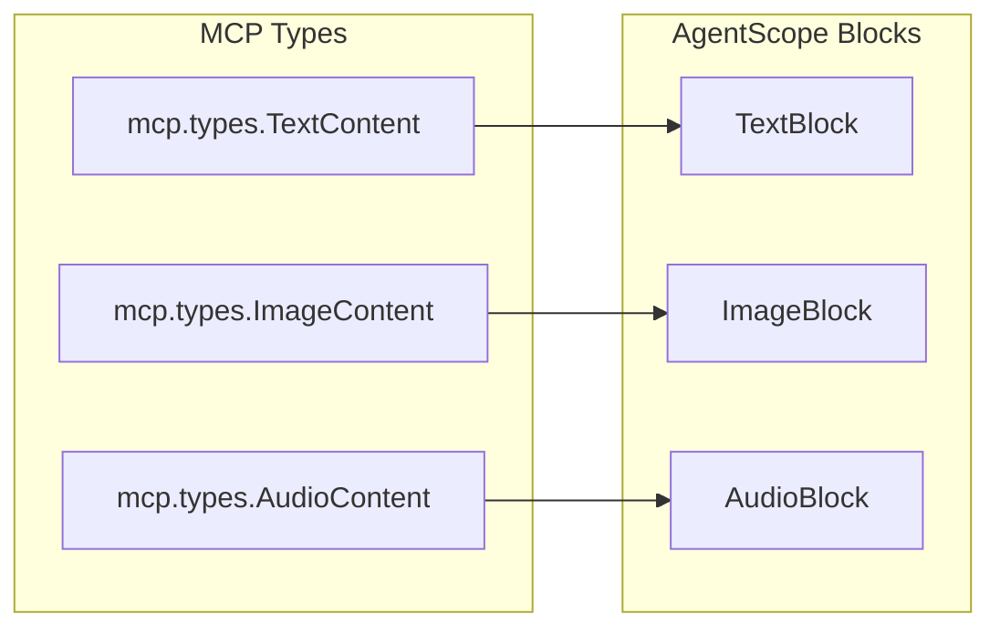

# MCP 协议集成

> **Level 6**: 能修改小功能
> **前置要求**: [工具调用执行流程](./06-tool-execution.md)
> **后续章节**: [记忆系统架构](../07-memory-rag/07-memory-architecture.md)

---

## 学习目标

学完本章后，你能：
- 理解 MCP（Model Context Protocol）协议的目的和架构
- 掌握 StdIOStatefulClient 和 HTTPStatefulClient 的使用
- 知道如何将 MCP 工具注册到 AgentScope Toolkit
- 理解 MCP 内容块到 AgentScope Block 的转换机制

---

## 背景问题

不同 Agent 框架（LangChain、AutoGPT、AgentScope）有各自的工具定义格式。当需要共享工具时，需要一个**统一协议**。

**MCP（Model Context Protocol）** 是 Anthropic 提出的开放标准，让不同的 Agent 框架可以共享工具：

```
┌──────────────────────────────────────────────────────────────┐
│                      MCP 架构                                │
│                                                               │
│   ┌─────────┐    MCP Protocol    ┌─────────────────┐       │
│   │ Agent   │◄──────────────────►│   MCP Server    │       │
│   │Scope    │                     │  (npx server)   │       │
│   └─────────┘                     └────────┬────────┘       │
│                                             │                 │
│                                             ▼                 │
│                                    ┌────────────────┐        │
│                                    │   本地工具     │        │
│                                    │  (filesystem)  │        │
│                                    └────────────────┘        │
└──────────────────────────────────────────────────────────────┘
```

---

## 源码入口

| 项目 | 值 |
|------|-----|
| **目录** | `src/agentscope/mcp/` |
| **基类** | `_client_base.py:MCPClientBase` |
| **状态客户端** | `_stateful_client_base.py:StatefulClientBase` |
| **StdIO 实现** | `_stdio_stateful_client.py:StdIOStatefulClient` |
| **HTTP 实现** | `_http_stateful_client.py:HTTPStatefulClient` |

---

## MCPClientBase 接口

**文件**: `src/agentscope/mcp/_client_base.py:1-103`

### 核心抽象

```python
class MCPClientBase:
    """MCP 客户端基类"""

    def __init__(self, name: str) -> None:
        self.name = name

    @abstractmethod
    async def get_callable_function(
        self,
        func_name: str,
        wrap_tool_result: bool = True,
        execution_timeout: float | None = None,
    ) -> Callable:
        """根据函数名获取可调用函数"""
```

### 内容块转换

**文件**: `_client_base.py:40-102`

MCP 的内容块需要转换为 AgentScope 的 Block 格式：

```python
@staticmethod
def _convert_mcp_content_to_as_blocks(
    mcp_content_blocks: list,
) -> List[TextBlock | ImageBlock | AudioBlock | VideoBlock]:
    """Convert MCP content to AgentScope blocks."""

    for content in mcp_content_blocks:
        if isinstance(content, mcp.types.TextContent):
            # 文本 → TextBlock
            return TextBlock(type="text", text=content.text)

        elif isinstance(content, mcp.types.ImageContent):
            # 图片 → ImageBlock
            return ImageBlock(
                type="image",
                source=Base64Source(
                    type="base64",
                    media_type=content.mimeType,
                    data=content.data,
                ),
            )

        elif isinstance(content, mcp.types.AudioContent):
            # 音频 → AudioBlock
            return AudioBlock(...)

        elif isinstance(content, mcp.types.EmbeddedResource):
            # 嵌入资源 → TextBlock
            if isinstance(content.resource, mcp.types.TextResourceContents):
                return TextBlock(
                    type="text",
                    text=content.resource.model_dump_json(indent=2),
                )
```

---

## StdIOStatefulClient 实现

**文件**: `src/agentscope/mcp/_stdio_stateful_client.py:1-78`

### 设计原理

StdIO 通过**子进程 stdin/stdout** 与 MCP 服务器通信：

```python
class StdIOStatefulClient(StatefulClientBase):
    def __init__(
        self,
        name: str,
        command: str,           # 可执行命令，如 "npx"
        args: list[str] | None = None,  # 命令参数
        env: dict[str, str] | None = None,  # 环境变量
        cwd: str | None = None,  # 工作目录
        encoding: str = "utf-8",
    ) -> None:
        super().__init__(name=name)

        self.client = stdio_client(
            StdioServerParameters(
                command=command,
                args=args or [],
                env=env,
                cwd=cwd,
                encoding=encoding,
            ),
        )
```

### 使用示例

```python
from agentscope.mcp import StdIOStatefulClient

# 创建 MCP 客户端（连接到本地 MCP 服务器）
mcp_client = StdIOStatefulClient(
    name="filesystem",
    command="npx",
    args=["-y", "@anthropic/mcp-server-filesystem", "/path/to/dir"],
)

# 获取工具函数
tool_func = await mcp_client.get_callable_function(
    "read_file",
    wrap_tool_result=True,
)

# 调用工具
result = await tool_func(path="/path/to/file.txt")
```

---

## HTTPStatefulClient 实现

**文件**: `src/agentscope/mcp/_http_stateful_client.py`

通过 **HTTP/SSE** 与远程 MCP 服务器通信：

```python
class HTTPStatefulClient(StatefulClientBase):
    def __init__(
        self,
        name: str,
        url: str,  # MCP 服务器 URL
        headers: dict[str, str] | None = None,
        timeout: float = 60.0,
    ) -> None:
        super().__init__(name=name)
        # HTTP 客户端配置
```

---

## 与 Toolkit 集成

### 注册 MCP 工具

**文件**: `src/agentscope/tool/_toolkit.py` 中的 `register_mcp_tools` 方法

```python
from agentscope.mcp import StdIOStatefulClient
from agentscope.tool import Toolkit

toolkit = Toolkit(...)

# 注册 MCP 工具到 Toolkit
await toolkit.register_mcp_tools(mcp_client)

# MCP 工具现在可以通过 Agent 调用
```

### 完整示例

```python
from agentscope.agent import ReActAgent
from agentscope.mcp import StdIOStatefulClient
from agentscope.tool import Toolkit

# 1. 创建 MCP 客户端
mcp_client = StdIOStatefulClient(
    name="filesystem",
    command="npx",
    args=["-y", "@anthropic/mcp-server-filesystem", "./data"],
)

# 2. 创建 Toolkit 并注册 MCP 工具
toolkit = Toolkit(...)
await toolkit.register_mcp_tools(mcp_client)

# 3. 创建 Agent
agent = ReActAgent(
    name="assistant",
    toolkit=toolkit,
    ...
)

# 4. Agent 可以直接调用 MCP 工具
# Agent: "请读取 ./data/example.txt 文件"
# AgentScope: 调用 mcp_client.read_file(path="./data/example.txt")
```

---

## 架构图

### MCP 通信流程



### 内容转换流程



---

## 调试 MCP 连接

```python
# 1. 检查 MCP 客户端是否正确初始化
print(f"MCP Client name: {mcp_client.name}")

# 2. 列出可用的 MCP 工具
tools = await mcp_client.list_tools()
print(f"Available tools: {[t.name for t in tools]}")

# 3. 手动调用 MCP 工具
result = await mcp_client.call_tool(
    "tool_name",
    {"param1": "value1"}
)
print(f"Result: {result}")

# 4. 检查 StdIO 连接状态
if isinstance(mcp_client, StdIOStatefulClient):
    # 检查子进程是否存活
    print(f"StdioClient active: {mcp_client.client is not None}")
```

---

## 注意事项

### LIFO 关闭原则

**文件**: `_stdio_stateful_client.py:23-28`

当多个 StdIOStatefulClient 实例连接时，应遵循**后进先出（LIFO）**原则关闭：

```python
# ❌ 错误：可能导致错误
await client1.close()
await client2.close()

# ✅ 正确：后创建先关闭
await client2.close()  # 最后创建，最先关闭
await client1.close()  # 最先创建，最后关闭
```

### Session 维护

StdIOStatefulClient 会在多个工具调用之间维护**同一个 session**，直到显式调用 `close()`：

```python
# 多个工具调用共享一个 session
result1 = await mcp_client.call_tool("tool1", {...})
result2 = await mcp_client.call_tool("tool2", {...})
result3 = await mcp_client.call_tool("tool3", {...})

# 显式关闭
await mcp_client.close()
```

---

## 工程现实与架构问题

### MCP 集成技术债

| 位置 | 问题 | 影响 | 优先级 |
|------|------|------|--------|
| `_client_base.py:18` | MCPClientBase 无连接池管理 | 多实例时资源浪费 | 中 |
| `_stdio_client.py:11` | StdIO 不支持 Windows | 跨平台兼容性问题 | 中 |
| `_content.py` | BlobResourceContents 未支持 | 二进制内容传递丢失 | 低 |

### 性能考量

```python
# MCP 调用开销估算
StdIO (本地): ~5-20ms (进程启动开销)
HTTP SSE (远程): ~10-50ms (网络往返)
Session 复用: 首次 ~50ms, 后续 ~10ms
```

---

## Contributor 指南

### 添加新的 MCP 传输方式

1. 继承 `StatefulClientBase`
2. 实现 `get_callable_function()` 方法
3. 在 `__init__.py` 中导出

### 危险区域

- **Session 泄漏**：忘记调用 `close()` 会导致资源泄漏
- **类型转换丢失**：某些 MCP 类型（如 BlobResourceContents）尚未支持
- **超时处理**：`execution_timeout` 参数需要正确传递到底层调用

---

## 设计权衡

### 优势

1. **标准化**：使用 MCP 协议可以复用社区工具生态
2. **多传输支持**：StdIO（本地）、HTTP/SSE（远程）
3. **内容类型丰富**：支持 Text、Image、Audio、EmbeddedResource

### 局限

1. **部分类型未支持**：BlobResourceContents（二进制资源）尚未实现
2. **无自动重连**：连接断开后需要手动重连
3. **调试复杂**：StdIO 错误难以追踪

---

## 下一步

接下来学习 [记忆系统架构](../07-memory-rag/07-memory-architecture.md)。


