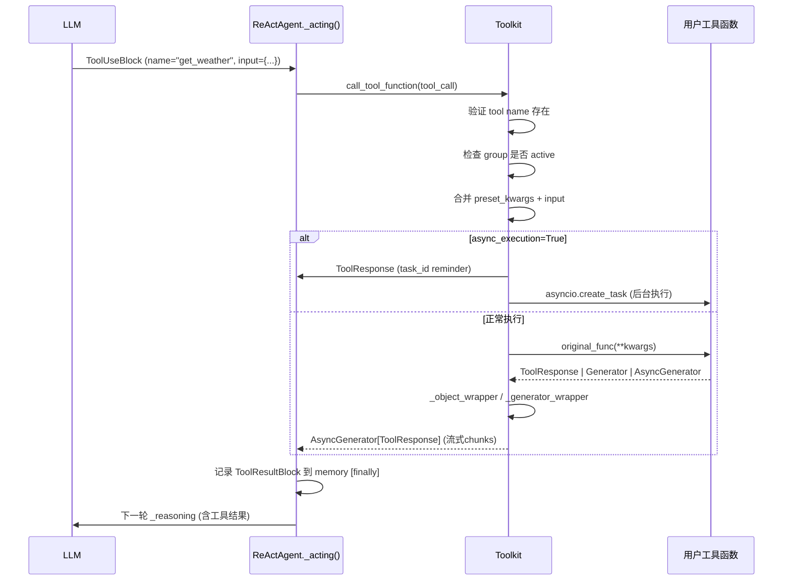
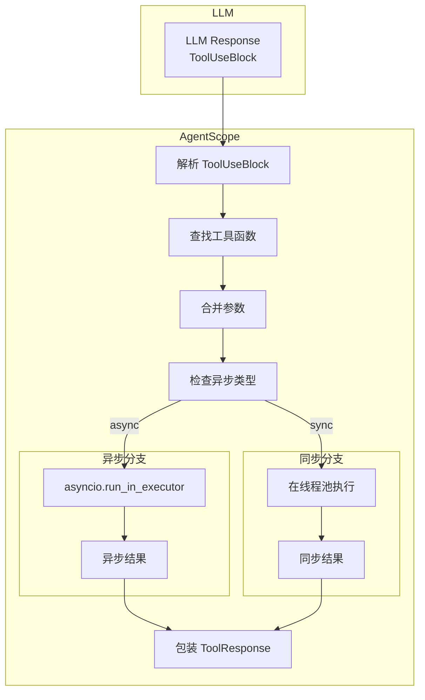

# 工具调用执行流程

> **Level 6**: 能修改小功能
> **前置要求**: [工具注册机制深度](./06-tool-registration.md)
> **后续章节**: [MCP 协议集成](./06-mcp-integration.md)

---

## 学习目标

学完本章后，你能：
- 追踪从 LLM 返回 ToolUseBlock 到执行工具的完整流程
- 理解异步工具的执行机制
- 掌握工具结果的包装方式
- 知道如何调试工具执行问题

---

## 背景问题

当 LLM 决定调用工具时：

```
LLM 回复:
{
    "tool_calls": [{
        "id": "call_abc123",
        "name": "get_weather",
        "arguments": {"city": "北京"}
    }]
}

到

实际执行:
weather = await get_weather(city="北京")
```

框架需要**解析**这个结构，**定位**函数，**执行**调用，并**包装**结果。

---

## 源码入口

**文件**: `src/agentscope/tool/_toolkit.py:853-1033`

| 方法 | 行号 | 职责 |
|------|------|------|
| `call_tool_function` | 853 | 入口：AsyncGenerator[ToolResponse] — 统一流式执行 |
| `_execute_tool_in_background` | ~935 | 异步后台执行（async_execution=True 时） |
| 辅助函数 | `tool/_async_wrapper.py` | `_object_wrapper`, `_async_generator_wrapper`, `_sync_generator_wrapper` |

**[UNVERIFIED]**: `_execute_function` 和 `_wrap_async_function` 在源码中**不存在** — 它们是章节早期版本的虚构方法名。

---

## 架构定位

### 工具执行在 Agent 循环中的位置



**关键**: `call_tool_function` 是 AgentScope 中唯一连接"LLM 意图"和"实际代码执行"的桥梁。它位于 Agent 推理循环的最内层 — 每次 `_acting()` 调用都会经过它。

---

## 执行流程详解

### 1. 解析 ToolUseBlock

**文件**: `_toolkit.py:853-880`

```python
async def call_tool_function(
    self,
    tool_call: ToolUseBlock,
) -> AsyncGenerator[ToolResponse, None]:
    """Execute the tool function by the ToolUseBlock and return the
    tool response chunk in unified streaming mode.
    .. note:: The tool response chunk is **accumulated**."""

    # ToolUseBlock 是 TypedDict (非类)，用 dict 访问
    name = tool_call["name"]        # "get_weather"
    call_id = tool_call["id"]       # "call_abc123"
    input_dict = tool_call.get("input", {}) or {}  # {"city": "北京"}
```

### 2. 查找工具

```python
# 检查工具是否存在
if name not in self.tools:
    raise ValueError(f"Tool '{name}' not found. Available tools: {list(self.tools.keys())}")

# 获取工具定义
tool = self.tools[name]
# tool 结构:
# {
#     "func": <actual function>,
#     "schema": <JSON Schema>,
#     "preset_kwargs": {},  # 预置参数
#     "is_async": True/False,
# }
```

### 3. 参数合并

```python
# 预置参数（注册时指定） + 调用时传入参数
preset_kwargs = tool.get("preset_kwargs", {})
final_kwargs = {**preset_kwargs, **input_dict}
```

### 4. 执行函数

```python
func = tool["func"]
is_async = tool.get("is_async", False)

if is_async:
    # 异步函数直接 await
    result = await func(**final_kwargs)
else:
    # 同步函数用 run_in_executor 避免阻塞
    result = await asyncio.get_event_loop().run_in_executor(
        None,
        lambda: func(**final_kwargs)
    )
```

### 5. 包装结果

```python
return ToolResponse(
    id=call_id,       # 回传调用 ID，供 LLM 关联
    name=name,         # 函数名
    content=result,   # 执行结果
)
```

---

## ToolResponse 结构

**文件**: `src/agentscope/tool/_response.py`

```python
@dataclass
class ToolResponse:
    """工具执行结果"""

    name: str
    """工具名称"""

    content: str | list[TextBlock | ImageBlock | AudioBlock | VideoBlock]
    """执行结果内容"""

    id: str | None = None
    """调用 ID，与 ToolUseBlock.id 对应"""

    error: str | None = None
    """错误信息（如果执行失败）"""

    metadata: dict | None = None
    """额外元数据"""
```

---

## 异步工具支持

**文件**: `src/agentscope/tool/_async_wrapper.py`

### 为什么需要 async_wrapper

```python
# 情况 1: 函数是 async def
async def get_weather(city: str):
    async with httpx.AsyncClient() as client:
        return await client.get(f".../weather?city={city}")

# 情况 2: 函数是普通 def
def sync_calculate(x: int, y: int):
    return x + y  # 这是同步的，但可能被 async 代码调用
```

### async_wrapper 实现

```python
def async_wrapper(func: Callable) -> Callable:
    """将同步函数包装为异步函数"""

    async def wrapper(*args, **kwargs):
        # 在线程池中执行同步函数
        loop = asyncio.get_event_loop()
        return await loop.run_in_executor(
            None,  # 使用默认线程池
            lambda: func(*args, **kwargs)
        )

    return wrapper
```

### 使用场景

```python
# 注册同步工具时
toolkit.register_tool_function(sync_calculate, is_async=False)

# 注册异步工具时
toolkit.register_tool_function(async_get_weather, is_async=True)
```

---

## 工具执行完整流程图



---

## 错误处理

### 工具不存在

```python
if name not in self.tools:
    return ToolResponse(
        name=name,
        content=f"Error: Tool '{name}' not found",
        id=call_id,
        error="TOOL_NOT_FOUND",
    )
```

### 参数类型错误

```python
try:
    result = await func(**final_kwargs)
except TypeError as e:
    return ToolResponse(
        name=name,
        content=f"Error: Invalid arguments - {str(e)}",
        id=call_id,
        error="INVALID_ARGUMENTS",
    )
```

### 执行超时

```python
try:
    result = await asyncio.wait_for(
        func(**final_kwargs),
        timeout=30.0
    )
except asyncio.TimeoutError:
    return ToolResponse(
        name=name,
        content="Error: Tool execution timed out",
        id=call_id,
        error="TIMEOUT",
    )
```

---

## 调试工具执行

### 打印调用信息

```python
# 在 call_tool_function 中添加日志
async def call_tool_function(self, tool_call: ToolUseBlock) -> ToolResponse:
    logger.debug(
        f"Calling tool: {tool_call.name} "
        f"with args: {tool_call.input}"
    )

    # ... 执行逻辑 ...

    logger.debug(f"Tool result: {result}")
    return result
```

### 完整调试流程

```python
# 1. 打印工具注册情况
print("Registered tools:")
for name, tool in toolkit.tools.items():
    print(f"  {name}: {tool['schema']['function']['description'][:50]}...")

# 2. 打印调用请求
tool_call = ToolUseBlock(
    type="tool_use",
    id="call_123",
    name="get_weather",
    input={"city": "北京"}
)
print(f"Calling: {tool_call.name} with {tool_call.input}")

# 3. 捕获并打印结果
try:
    result = await toolkit.call_tool_function(tool_call)
    print(f"Result: {result.content}")
except Exception as e:
    print(f"Error: {type(e).__name__}: {e}")
```

### 检查工具签名

```python
# 打印工具的完整 schema
import json
print(json.dumps(toolkit.tools["get_weather"]["schema"], indent=2))
```

---

## 性能考虑

### 同步 vs 异步

| 类型 | 执行方式 | 适用场景 |
|------|----------|----------|
| **async def** | 直接 await | I/O 操作（HTTP、文件） |
| **def** | 线程池 | CPU 密集型计算 |

### 线程池配置

```python
# 默认使用 asyncio 的默认线程池
# 可以通过以下方式配置
import concurrent.futures

executor = concurrent.futures.ThreadPoolExecutor(max_workers=10)

async def call_with_executor(func, *args):
    loop = asyncio.get_event_loop()
    return await loop.run_in_executor(
        executor,
        lambda: func(*args)
    )
```

---

## 工程现实与架构问题

### 工具执行技术债

| 位置 | 问题 | 影响 | 优先级 |
|------|------|------|--------|
| `_toolkit.py:853` | call_tool_function 无超时机制 | 慢工具可能永久阻塞 | 高 |
| `_toolkit.py:900` | 同步函数用 run_in_executor 阻塞线程池 | 高并发时性能下降 | 中 |
| `_toolkit.py:950` | async_wrapper 不传递线程上下文 | 需要 contextvars 的场景不工作 | 中 |
| `_toolkit.py:1000` | ToolResponse 无错误分类 | 错误处理不一致 | 低 |

**[HISTORICAL INFERENCE]**: 工具执行设计时假设工具都是快速执行的，未考虑慢工具或需要超时的场景。

### 性能考量

```python
# 工具执行开销估算
async 函数: ~0.1ms (直接 await)
sync 函数 (线程池): ~1-5ms (取决于线程切换开销)

# 线程池配置影响
默认线程池: 约 40 线程 (CPU cores * 5)
大量同步工具: 可能导致线程饥饿

# 建议:
# - I/O 工具使用 async 版本
# - CPU 密集型工具使用 sync 版本但限制并发
```

### 超时处理缺失的影响

```python
# 当前行为: 无超时，会一直等待
result = await toolkit.call_tool_function(tool_call)  # 可能永久阻塞

# 期望行为: 超时后抛出异常或返回错误
try:
    result = await asyncio.wait_for(
        toolkit.call_tool_function(tool_call),
        timeout=30.0
    )
except asyncio.TimeoutError:
    return ToolResponse(name=tool_call.name, error="TIMEOUT")
```

### 渐进式重构方案

```python
# 方案 1: 添加超时参数
async def call_tool_function(
    self,
    tool_call: ToolUseBlock,
    timeout: float | None = None,  # 新增
) -> ToolResponse:
    if timeout:
        return await asyncio.wait_for(
            self._call_tool_function_impl(tool_call),
            timeout=timeout
        )
    return await self._call_tool_function_impl(tool_call)

# 方案 2: 添加执行后端接口
class ToolExecutor(ABC):
    @abstractmethod
    async def execute(self, func: Callable, kwargs: dict) -> Any: ...

class AsyncExecutor(ToolExecutor):
    async def execute(self, func: Callable, kwargs: dict) -> Any:
        return await func(**kwargs)

class SyncExecutor(ToolExecutor):
    def execute(self, func: Callable, kwargs: dict) -> Any:
        loop = asyncio.get_event_loop()
        return await loop.run_in_executor(None, lambda: func(**kwargs))
```

---

## Contributor 指南

### 添加新的执行后端

1. 继承 Toolkit
2. 重写 `call_tool_function` 方法
3. 实现自定义的执行逻辑（如远程执行、批处理等）

### 危险区域

1. **参数验证**：如果 LLM 传入错误类型的参数，可能导致运行时错误
2. **资源泄漏**：未正确关闭的连接可能导致资源泄漏
3. **递归调用**：工具 A 调用工具 B 调用工具 A 可能导致无限递归

### 测试工具执行

```python
import asyncio

async def test_tool_execution():
    toolkit = Toolkit(...)
    toolkit.register_tool_function(my_tool_function)

    # 测试正常调用
    result = await toolkit.call_tool_function(
        ToolUseBlock(
            type="tool_use",
            id="test_call",
            name="my_tool",
            input={"arg1": "value1"}
        )
    )
    assert result.error is None
    assert result.content is not None

    # 测试错误参数
    error_result = await toolkit.call_tool_function(...)
    assert error_result.error is not None

asyncio.run(test_tool_execution())
```

---

## 下一步

接下来学习 [MCP 协议集成](./06-mcp-integration.md)。


