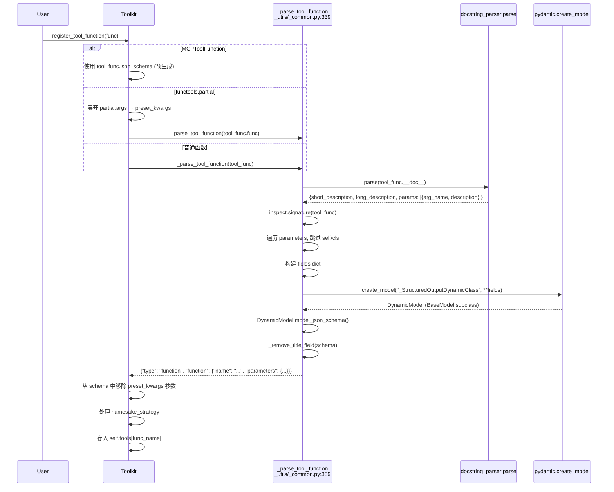

# 工具注册机制深度：从 Python 函数到 JSON Schema

> **Level 6**: 能修改小功能
> **前置要求**: [Toolkit 核心](./06-toolkit-core.md)
> **后续章节**: [工具调用执行流程](./06-tool-execution.md)

---

## 学习目标

学完本章后，你能：
- 追踪 `register_tool_function()` → `_parse_tool_function()` → `pydantic.create_model()` → `model_json_schema()` 的完整链
- 理解 `docstring_parser.parse()` 如何从 docstring 提取参数描述
- 理解 `partial` 函数和 `MCPToolFunction` 的特殊处理
- 知道 `preset_kwargs` 如何从 Schema 中移除以保护敏感信息
- 掌握 `namesake_strategy` 四种同名处理策略

---

## 背景问题

当注册一个工具函数时，框架需要将 Python 函数签名转换为 LLM 可理解的 JSON Schema：

```
Python 函数                           JSON Schema
──────────────────────────────────────────────────────────────────
def get_weather(city: str) → str:    {"type": "function",
    """Query weather."""               "function": {"name": "get_weather",
                                         "description": "Query weather.",
                                         "parameters": {"type": "object",
                                           "properties": {"city": {"type": "string"}},
                                           "required": ["city"]}}}
```

AgentScope **不手写** JSON Schema 生成逻辑。它通过 `pydantic.create_model()` 动态创建 Pydantic 模型，然后调用 `model_json_schema()` 生成标准 Schema。这避免了重复实现 Pydantic 已有的类型→Schema 映射。

---

## 源码入口

| 项目 | 值 |
|------|-----|
| **工具注册** | `src/agentscope/tool/_toolkit.py:274` `register_tool_function()` — 12 个参数 |
| **Schema 生成** | `src/agentscope/_utils/_common.py:339` `_parse_tool_function()` |
| **类型标注** | `typing_extensions.TypedDict` + `Required[]` (用于 `_message_block.py` 的 Block 类型) |
| **Docstring 解析** | `docstring_parser` (第三方库) |

**重要**: Schema 生成不在 `_toolkit.py` 中 — 在 `_utils/_common.py:339`。`_toolkit.py` 中的 `register_tool_function` 调用它生成 schema，然后存入 `self.tools`。

---

## 核心调用链



---

## `_parse_tool_function()` 完整实现

**文件**: `src/agentscope/_utils/_common.py:339-455`

### 阶段 1: Docstring 解析 (line 362-373)

```python
docstring = parse(tool_func.__doc__)
params_docstring = {_.arg_name: _.description for _ in docstring.params}

descriptions = []
if docstring.short_description is not None:
    descriptions.append(docstring.short_description)
if include_long_description and docstring.long_description is not None:
    descriptions.append(docstring.long_description)
func_description = "\n".join(descriptions)
```

使用 `docstring_parser.parse()`（支持 Google、Numpy、Sphinx 等 docstring 风格）将每个参数的描述提取到 `params_docstring` 字典。

### 阶段 2: 动态字段构建 (line 376-432)

```python
fields = {}
for name, param in inspect.signature(tool_func).parameters.items():
    if name in ["self", "cls"]:
        continue

    # 处理 **kwargs
    if param.kind == inspect.Parameter.VAR_KEYWORD:
        if not include_var_keyword:
            continue
        fields[name] = (
            Dict[str, Any] if param.annotation == inspect.Parameter.empty
            else Dict[str, param.annotation],
            Field(description=params_docstring.get(f"**{name}", ...), ...),
        )

    # 处理 *args
    elif param.kind == inspect.Parameter.VAR_POSITIONAL:
        if not include_var_positional:
            continue
        fields[name] = (
            list[Any] if param.annotation == inspect.Parameter.empty
            else list[param.annotation],
            Field(description=params_docstring.get(f"*{name}", ...), ...),
        )

    # 普通参数
    else:
        fields[name] = (
            Any if param.annotation == inspect.Parameter.empty
            else param.annotation,
            Field(description=params_docstring.get(name, None), ...),
        )
```

### 阶段 3: Pydantic 模型创建与 Schema 提取 (line 434-455)

```python
base_model = create_model(
    "_StructuredOutputDynamicClass",
    __config__=ConfigDict(arbitrary_types_allowed=True),
    **fields,
)
params_json_schema = base_model.model_json_schema()

_remove_title_field(params_json_schema)

return {
    "type": "function",
    "function": {
        "name": tool_func.__name__,
        "parameters": params_json_schema,
    },
}
```

`★ Insight ─────────────────────────────────────`
1. **`arbitrary_types_allowed=True`** 是关键 — 允许非标准类型（如自定义 Pydantic 模型作为参数类型），否则 `create_model` 会拒绝。
2. **`_remove_title_field()`** 去掉 Pydantic 自动生成的 `"title"` 字段 — OpenAI/Anthropic API 不接受此字段，会导致 400 错误。
3. **为什么不用手写 Type→Schema 映射？** Pydantic 已处理 `List[int]`, `Optional[str]`, `Union[A, B]` 等泛型类型。手写需要数百行代码来覆盖所有边界情况。
`─────────────────────────────────────────────────`

---

## `register_tool_function()` 的三路分支

**文件**: `src/agentscope/tool/_toolkit.py:274-535`

```mermaid
flowchart TD
    REG[register_tool_function(tool_func, ...)]
    CHECK_TYPE{tool_func 类型?}
    MCP[MCPToolFunction<br/>使用预生成 schema]
    PARTIAL[functools.partial<br/>展开 args → preset_kwargs<br/>调用 _parse_tool_function]
    NORMAL[普通函数<br/>调用 _parse_tool_function]

    REG --> CHECK_TYPE
    CHECK_TYPE -->|MCPToolFunction| MCP
    CHECK_TYPE -->|partial| PARTIAL
    CHECK_TYPE -->|Callable| NORMAL

    MCP --> REMOVE_PRESET[从 schema 中移除<br/>preset_kwargs 参数]
    PARTIAL --> REMOVE_PRESET
    NORMAL --> REMOVE_PRESET

    REMOVE_PRESET --> NAMESAKE[处理 namesake_strategy]
    NAMESAKE --> STORE[存入 self.tools[name]]
```

### `partial` 函数的特殊处理 (line 390-414)

```python
elif isinstance(tool_func, partial):
    kwargs = tool_func.keywords
    if tool_func.args:
        param_names = list(inspect.signature(tool_func.func).parameters.keys())
        for i, arg in enumerate(tool_func.args):
            if i < len(param_names):
                kwargs[param_names[i]] = arg
    preset_kwargs = {**kwargs, **(preset_kwargs or {})}
    original_func = tool_func.func
    json_schema = json_schema or _parse_tool_function(tool_func.func, ...)
```

`partial` 函数的固定参数被合并到 `preset_kwargs`，从而**不在 JSON Schema 中出现**。LLM 看到的参数是部分应用后剩下的参数。

### `preset_kwargs` 从 Schema 中移除 (line 441-443)

```python
for arg_name in preset_kwargs or {}:
    if arg_name in json_schema["function"]["parameters"]["properties"]:
        json_schema["function"]["parameters"]["properties"].pop(arg_name)
```

---

## `namesake_strategy` 同名处理

**源码**: `_toolkit.py:296-301` (参数定义) + ~470-530 (处理逻辑)

| 策略 | 行为 | 使用场景 |
|------|------|----------|
| `"raise"` (默认) | 抛出 ValueError | 开发阶段，避免意外覆盖 |
| `"override"` | 覆盖已存在的工具 | 需要更新工具实现时 |
| `"skip"` | 跳过注册，保留旧工具 | 幂等注册场景 |
| `"rename"` | 添加随机后缀使其唯一 | 需要保留两个同名工具时 |

---

## 工程现实与架构问题

### 技术债

| 位置 | 问题 | 影响 | 优先级 |
|------|------|------|--------|
| `_utils/_common.py:339` | Schema 生成在 `_utils` 而非 `tool/` | 模块边界泄漏，新开发者找不到 | 中 |
| `_common.py:434` | `create_model` 每次都动态生成类 | 高频注册时有 GC 压力 | 低 |
| `_toolkit.py:274` | 12 个参数，API 复杂度高 | `include_var_positional`/`include_var_keyword` 默认 False 容易忘记 | 中 |
| `_common.py:376` | `param.annotation == inspect.Parameter.empty` → `Any` | 无类型标注的参数生成 `{}` schema，LLM 可能传任意值 | 低 |

### `create_model` 的性能

```python
# 每次注册都创建新类
base_model = create_model("_StructuredOutputDynamicClass", ...)

# 对于批量注册（如 MCP 工具），这是 O(n) 的类创建
# 但对于运行时注册 (n < 100)，开销可忽略 (~0.1ms/model)
```

---

## Contributor 指南

### Safe Files

| 文件 | 风险 | 说明 |
|------|------|------|
| `tool/_types.py` | 低 | `RegisteredToolFunction`, `ToolGroup` 类型定义 |

### Dangerous Areas

| 文件:行号 | 风险 | 说明 |
|-----------|------|------|
| `_utils/_common.py:339-455` | 高 | `_parse_tool_function` — 被所有工具注册共享，修改影响全局 |
| `_toolkit.py:274-535` | 高 | `register_tool_function` — 三路分支 + 12 参数，复杂度高 |
| `_toolkit.py:390-414` | 中 | `partial` 处理 — args 到 kwargs 的转换依赖参数顺序 |

### 调试 Schema 生成

```python
# 查看生成的 JSON Schema
schemas = toolkit.get_json_schemas()
import json
print(json.dumps(schemas, indent=2))

# 测试 schema 生成是否匹配函数签名
from agentscope._utils._common import _parse_tool_function
schema = _parse_tool_function(my_func, True, False, False)
assert schema["function"]["name"] == "my_func"
```

---

## 下一步

接下来学习 [工具调用执行流程](./06-tool-execution.md)，了解 `call_tool_function()` 的六种返回类型处理。

---

