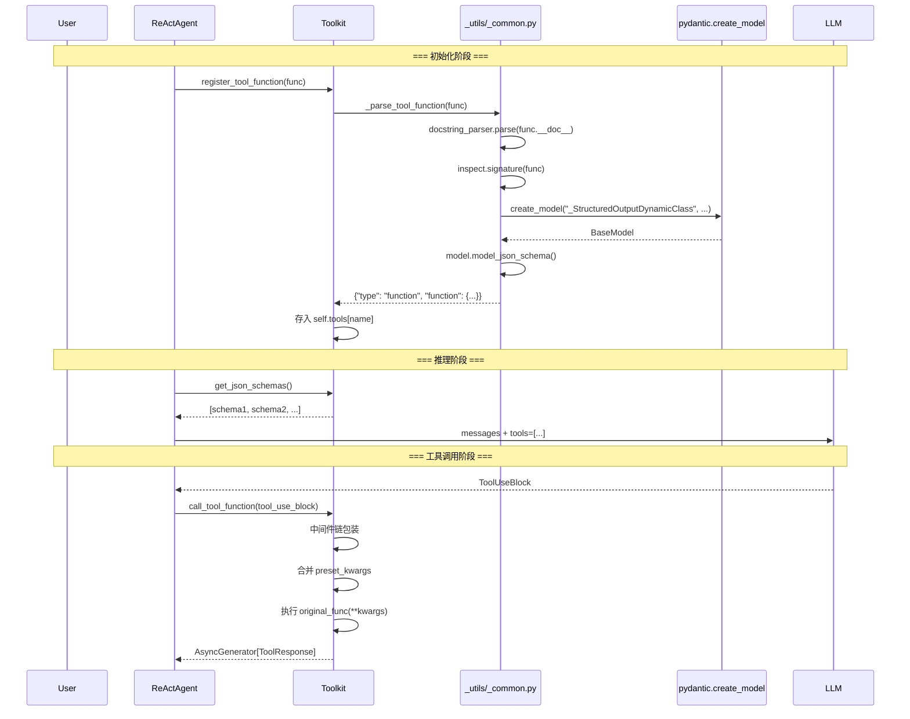

# Toolkit 核心：工具注册、Schema 生成与调用执行

> **Level 5**: 源码调用链
> **前置要求**: [Formatter 系统分析](../05-model-formatter/05-formatter-system.md)
> **后续章节**: [工具注册机制深度](./06-tool-registration.md)

---

## 学习目标

学完本章后，你能：
- 追踪 `register_tool_function()` → `_parse_tool_function()` → `pydantic.create_model()` 的完整 Schema 生成链
- 理解 `call_tool_function()` 的六种返回类型处理（async/sync + generator/object）
- 理解中间件链（middleware chain）如何包装工具调用
- 理解工具分组（ToolGroup）和动态激活机制
- 知道 `_toolkit.py` 为什么是项目中最大的单文件（1684 行）

---

## 背景问题

Agent 需要调用外部工具时面临三个问题：
1. **Schema 生成**：如何从 Python 函数自动生成 LLM 可理解的 JSON Schema？
2. **工具执行**：如何处理同步/异步/生成器等多种返回类型？
3. **工具组织**：如何管理数十个工具，按场景动态启用/禁用？

AgentScope 的 `Toolkit` 类通过以下机制解决：
- **Docstring → Schema**：使用 `docstring_parser` + `pydantic.create_model()` 自动生成 JSON Schema
- **统一执行器**：`call_tool_function()` 统一处理 6 种返回类型
- **工具分组**：ToolGroup 机制支持按场景动态切换工具集

---

## 源码入口

| 项目 | 值 |
|------|-----|
| **主文件** | `src/agentscope/tool/_toolkit.py:117` |
| **类名** | `Toolkit(StateModule)` |
| **行数** | 1684 行（项目中最大单文件） |
| **Schema 生成** | `src/agentscope/_utils/_common.py:339` `_parse_tool_function()` |
| **工具注册** | `_toolkit.py:274` `register_tool_function()` |
| **工具执行** | `_toolkit.py:853` `call_tool_function()` |
| **中间件** | `_toolkit.py:57` `_apply_middlewares()` |
| **辅助类型** | `src/agentscope/tool/_response.py` `ToolResponse` |
| **辅助类型** | `src/agentscope/tool/_types.py` `ToolGroup`, `RegisteredToolFunction` |

---

## 架构定位

### Toolkit 在 Agent 生命周期中的位置



### Toolkit 内部结构

```mermaid
graph TB
    subgraph "Toolkit (1684 行)"
        direction TB

        subgraph "工具存储"
            TOOLS[tools: dict[str, RegisteredToolFunction]]
            GROUPS[groups: dict[str, ToolGroup]]
        end

        subgraph "注册层"
            REG[register_tool_function<br/>line 274]
            MCP_REG[register_mcp_client<br/>line 1035]
            REMOVE[remove_tool_function<br/>line 536]
        end

        subgraph "Schema 层 (委托给 _utils)"
            PARSE[_parse_tool_function<br/>_utils/_common.py:339]
            SCHEMAS[get_json_schemas<br/>line 558]
        end

        subgraph "执行层"
            MIDDLEWARE[_apply_middlewares<br/>line 57]
            CALL[call_tool_function<br/>line 853]
            BACKGROUND[_execute_tool_in_background]
        end

        subgraph "分组管理"
            RESET[reset_equipped_tools<br/>动态切换工具集]
            ACTIVATE[tool_group.activate/deactivate]
        end
    end

    REG --> TOOLS
    REG --> PARSE
    MCP_REG --> REG
    CALL --> TOOLS
    CALL --> MIDDLEWARE
    RESET --> GROUPS
```

---

## 核心源码分析

### 1. Schema 生成：合并非 Toolkit 文件

**文件**: `src/agentscope/_utils/_common.py:339-455`

这是整个工具系统最容易被误解的部分：Schema 生成代码不在 `_toolkit.py` 中，而在 `_utils/_common.py`。

```python
def _parse_tool_function(
    tool_func: ToolFunction,
    include_long_description: bool,
    include_var_positional: bool,
    include_var_keyword: bool,
) -> dict:
    # 步骤1：用 docstring_parser 解析 docstring
    docstring = parse(tool_func.__doc__)
    params_docstring = {_.arg_name: _.description for _ in docstring.params}

    # 步骤2：构建函数描述（short + long description）
    descriptions = []
    if docstring.short_description is not None:
        descriptions.append(docstring.short_description)
    if include_long_description and docstring.long_description is not None:
        descriptions.append(docstring.long_description)
    func_description = "\n".join(descriptions)

    # 步骤3：用 inspect.signature 遍历参数，动态构建 Pydantic Fields
    fields = {}
    for name, param in inspect.signature(tool_func).parameters.items():
        if name in ["self", "cls"]:
            continue
        # 处理 **kwargs, *args, 以及普通参数
        # 将 param.annotation 映射为 Pydantic Field 类型
        # 从 params_docstring 提取参数描述
        fields[name] = (
            Any if param.annotation == inspect.Parameter.empty
            else param.annotation,
            Field(description=params_docstring.get(name, None), ...),
        )

    # 步骤4：动态创建 Pydantic BaseModel
    base_model = create_model(
        "_StructuredOutputDynamicClass",
        __config__=ConfigDict(arbitrary_types_allowed=True),
        **fields,
    )

    # 步骤5：用 Pydantic 的 model_json_schema() 生成 JSON Schema
    params_json_schema = base_model.model_json_schema()
    _remove_title_field(params_json_schema)

    # 步骤6：包装为 OpenAI function-calling 格式
    return {
        "type": "function",
        "function": {
            "name": tool_func.__name__,
            "parameters": params_json_schema,
        },
    }
```

`★ Insight ─────────────────────────────────────`
1. **为什么用 pydantic.create_model() 而非手写 JSON Schema？** Pydantic 已经内置了 Python type → JSON Schema 的完整映射（`int`→`{"type":"integer"}`, `str`→`{"type":"string"}`, `list[X]`→`{"type":"array","items":...}`）。手写这段逻辑会重复 Pydantic 的工作且容易出错。
2. **`arbitrary_types_allowed=True`** 是关键配置 — 允许非标准类型（如自定义类）出现在函数签名中，避免 Pydantic 拒绝无法序列化的类型。
3. **`_remove_title_field()`** 去掉 Pydantic 自动生成的 `"title"` 字段 — LLM API 通常不接受额外的非标准字段。
`─────────────────────────────────────────────────`

### 2. 工具注册：三种函数类型统一处理

**文件**: `src/agentscope/tool/_toolkit.py:274-535`

`register_tool_function()` 参数列表（共 12 个参数，全部从源码验证）：

| 参数 | 类型 | 默认值 | 用途 |
|------|------|--------|------|
| `tool_func` | `ToolFunction` | (必需) | 工具函数 |
| `group_name` | `str \| Literal["basic"]` | `"basic"` | 所属分组 |
| `preset_kwargs` | `dict \| None` | `None` | 预置参数（不暴露给 LLM） |
| `func_name` | `str \| None` | `None` | 自定义函数名 |
| `func_description` | `str \| None` | `None` | 自定义描述 |
| `json_schema` | `dict \| None` | `None` | 手动提供 Schema |
| `include_long_description` | `bool` | `True` | 是否包含长描述 |
| `include_var_positional` | `bool` | `False` | 是否包含 `*args` |
| `include_var_keyword` | `bool` | `False` | 是否包含 `**kwargs` |
| `postprocess_func` | `Callable \| None` | `None` | 后处理函数 |
| `namesake_strategy` | `Literal["raise","override","skip","rename"]` | `"raise"` | 同名策略 |
| `async_execution` | `bool` | `False` | 是否异步执行 |

**三种工具函数类型的处理**：

```python
# 类型 1: MCPToolFunction（MCP 协议工具）
if isinstance(tool_func, MCPToolFunction):
    input_func_name = tool_func.name
    original_func = tool_func.__call__
    json_schema = json_schema or tool_func.json_schema

# 类型 2: functools.partial（部分应用函数）
elif isinstance(tool_func, partial):
    # 将 partial 的固定参数合并到 preset_kwargs
    kwargs = tool_func.keywords
    if tool_func.args:
        param_names = list(inspect.signature(tool_func.func).parameters.keys())
        for i, arg in enumerate(tool_func.args):
            if i < len(param_names):
                kwargs[param_names[i]] = arg
    preset_kwargs = {**kwargs, **(preset_kwargs or {})}
    original_func = tool_func.func
    json_schema = json_schema or _parse_tool_function(tool_func.func, ...)

# 类型 3: 普通函数
else:
    original_func = tool_func
    json_schema = json_schema or _parse_tool_function(tool_func, ...)
```

**preset_kwargs 从 Schema 中移除**：

```python
# 关键：preset_kwargs 中的参数从 JSON Schema 中移除
for arg_name in preset_kwargs or {}:
    if arg_name in json_schema["function"]["parameters"]["properties"]:
        json_schema["function"]["parameters"]["properties"].pop(arg_name)
```

这意味着 LLM **看不到** preset 参数，从而保护了 API Key 等敏感信息，也简化了 LLM 的调用。

### 3. 工具执行：六种返回类型的统一处理

**文件**: `src/agentscope/tool/_toolkit.py:853-1033`

`call_tool_function()` 是一个 `async def ... -> AsyncGenerator[ToolResponse, None]`，即**异步生成器**。所有工具调用都以流式方式返回，每个 chunk 是**累积的**（即后续 chunk 包含之前的内容）。

```mermaid
flowchart TD
    CALL[call_tool_function(ToolUseBlock)]
    CHECK1{tool name<br/>in self.tools?}
    ERR1[返回 FunctionNotFoundError]
    CHECK2{group 是否<br/>active?}
    ERR2[返回 FunctionInactiveError]
    MERGE[合并 preset_kwargs + input]
    ASYNC_MODE{async_execution?}
    BG[创建后台任务<br/>返回 task_id reminder]

    CALL --> CHECK1
    CHECK1 -->|否| ERR1
    CHECK1 -->|是| CHECK2
    CHECK2 -->|否| ERR2
    CHECK2 -->|是| MERGE
    MERGE --> ASYNC_MODE
    ASYNC_MODE -->|是| BG
    ASYNC_MODE -->|否| EXEC[执行 original_func]

    EXEC --> TYPE_CHECK{返回类型?}
    TYPE_CHECK -->|AsyncGenerator| AG[_async_generator_wrapper]
    TYPE_CHECK -->|Generator| SG[_sync_generator_wrapper]
    TYPE_CHECK -->|ToolResponse| OW[_object_wrapper]
    TYPE_CHECK -->|其他| ERR3[TypeError]

    AG --> YIELD[yield ToolResponse chunks]
    SG --> YIELD
    OW --> YIELD
    BG -->|取消/等待/查看| TASK_MGMT[_async_tasks 管理]

    ERR1 --> YIELD
    ERR2 --> YIELD
```

**错误处理的三个层次**：

```python
try:
    if inspect.iscoroutinefunction(tool_func.original_func):
        try:
            res = await tool_func.original_func(**kwargs)
        except asyncio.CancelledError:
            res = ToolResponse(content=[TextBlock(type="text",
                text="<system-info>The tool call has been interrupted...</system-info>")],
                stream=True, is_last=True, is_interrupted=True)
    else:
        res = tool_func.original_func(**kwargs)

except mcp.shared.exceptions.McpError as e:
    res = ToolResponse(content=[TextBlock(type="text",
        text=f"Error occurred when calling MCP tool: {e}")])

except Exception as e:
    res = ToolResponse(content=[TextBlock(type="text",
        text=f"Error: {e}")])
```

**关键设计**：`asyncio.CancelledError` 被单独捕获 — 用户可以通过取消 task 来中断长时间运行的工具，此时返回 `is_interrupted=True` 的 ToolResponse。

### 4. 中间件链：装饰器模式的应用

**文件**: `src/agentscope/tool/_toolkit.py:57-114`

```python
@_apply_middlewares
async def call_tool_function(self, tool_call: ToolUseBlock) -> AsyncGenerator[...]:
    ...
```

`_apply_middlewares` 是一个**装饰器工厂**，在运行时读取 `self._middlewares` 列表，构建洋葱模型（onion model）的中间件链：

```
请求 → middleware_1 → middleware_2 → ... → 原始 call_tool_function
响应 ← middleware_1 ← middleware_2 ← ... ← 原始 call_tool_function
```

每个中间件是一个异步生成器函数，接收 `kwargs` 和 `handler`，yield `ToolResponse` 对象。

### 5. 工具分组：动态切换工具集

```python
# Toolkit 构造时创建分组
toolkit = Toolkit()
toolkit.register_tool_function(weather_func, group_name="weather")
toolkit.register_tool_function(code_func, group_name="coding")

# "basic" 组的工具始终在 Schema 中
# 其他组需要通过 reset_equipped_tools 激活
await toolkit.reset_equipped_tools(groups=["coding"])
# 现在只有 basic + coding 组的工具对 LLM 可见

# 支持 async context manager
async with toolkit:
    # 进入时保存当前分组状态
    # 退出时恢复
    ...
```

`reset_equipped_tools()` 的核心逻辑在 `_toolkit.py:623-700` 范围，它修改 `groups[group_name].active` 标志，并重新计算 `get_json_schemas()` 的返回内容。

---

## 工程现实与架构问题

### 技术债（源码级）

| 位置 | 问题 | 影响 | 优先级 |
|------|------|------|--------|
| `_toolkit.py:4` | TODO: 应考虑拆分 Toolkit 类 | 1684 行单文件难以维护 | 高 |
| `_utils/_common.py:339` | Schema 生成在 `_utils` 而非 `tool/` | 模块边界泄漏，新开发者难以定位 | 中 |
| `_toolkit.py:274` | `register_tool_function` 12 个参数 | API 复杂度高，容易误用 | 中 |
| `_toolkit.py:996` | MCP 异常被吞并转为 ToolResponse | 调试困难，MCP 协议错误不可见 | 中 |
| `_toolkit.py:1006` | 通用 `except Exception` | 隐藏意外错误 | 高 |
| `_toolkit.py:932-968` | `async_execution` 标记为 experimental | 生产使用可能导致不可预期行为 | 中 |

### 为什么 Schema 生成在 `_utils/_common.py` 而非 `tool/`？

**[HISTORICAL INFERENCE]**: `_parse_tool_function` 使用 `pydantic.create_model()` 动态生成模型，这是一种通用工具。它可能最初放在 `tool/` 中，但随着其他模块（如 `plan/`）也需要解析函数签名，被移到了 `_utils/`。但 `_utils/_common.py` 本身已经是一个"垃圾桶"模块（grab-bag），包含了 resample、tool parsing 等完全不相关的功能。

**渐进式重构方案**：

```python
# 方案：将 Schema 生成逻辑移入 tool/ 子包
# tool/
#   _schema.py           # _parse_tool_function, _remove_title_field
#   _toolkit.py          # Toolkit (仅保留注册/调用/分组逻辑)
#   _middleware.py       # _apply_middlewares
```

### `except Exception` 的工程代价

```python
# 当前实现：所有异常都被转为 ToolResponse
except Exception as e:
    res = ToolResponse(content=[TextBlock(
        type="text", text=f"Error: {e}"
    )])
```

这意味着：
- 开发者无法通过异常堆栈定位错误
- 工具函数的 bug（如 `AttributeError`）被静默吞掉
- 调试时需要自己加 logging

**缓解方案**：在 development 模式下记录完整的 traceback 到日志，而不是仅返回错误消息给 LLM。

### 中间件系统的局限性

`_apply_middlewares` 读取 `self._middlewares` 列表，但：
- 中间件只能在 Toolkit 级别注册，不能按工具注册
- 中间件只能操作 `kwargs` 和 `handler`，不能访问原始 `tool_call`
- 没有错误恢复机制 — 一个中间件出错会导致整个链中断

---

## Contributor 指南

### Safe Files（安全修改区域）

| 文件 | 风险 | 说明 |
|------|------|------|
| `tool/_types.py` | 低 | 类型定义，添加新类型安全 |
| `tool/_response.py` | 低 | ToolResponse 结构，影响面小 |
| `tool/_async_wrapper.py` | 低 | 包装器函数，接口清晰 |

### Dangerous Areas（危险区域）

| 文件 | 风险 | 说明 |
|------|------|------|
| `tool/_toolkit.py:274-535` | 高 | `register_tool_function` — 三种函数类型处理逻辑复杂，修改可能破坏注册流程 |
| `tool/_toolkit.py:853-1033` | 高 | `call_tool_function` — 六种返回类型、异步执行、错误处理，任何一个分支修改都需充分测试 |
| `tool/_toolkit.py:57-114` | 中 | `_apply_middlewares` — 闭包捕获 `self`，修改需验证延迟绑定行为 |
| `_utils/_common.py:339-455` | 中 | `_parse_tool_function` — 被多个模块共享，修改影响所有工具注册 |

### 调试技巧

```python
# 1. 查看已注册工具的完整信息
for name, tool in toolkit.tools.items():
    print(f"  {name}:")
    print(f"    group: {tool.group}")
    print(f"    original_func: {tool.original_func}")
    print(f"    preset_kwargs: {tool.preset_kwargs}")

# 2. 查看生成的 JSON Schema（确认是否正确）
import json
schemas = toolkit.get_json_schemas()
print(json.dumps(schemas, indent=2, ensure_ascii=False))

# 3. 直接调用工具（绕过 Agent，用于调试）
tool_call = {
    "type": "tool_use",
    "id": "debug_001",
    "name": "get_weather",
    "input": {"city": "北京"},
}
async for chunk in toolkit.call_tool_function(tool_call):
    print(f"Chunk: {chunk}")

# 4. 检查工具分组状态
for name, group in toolkit.groups.items():
    print(f"  {name}: active={group.active}")
```

### 测试策略

```python
# 测试工具注册
def test_register_tool():
    toolkit = Toolkit()
    toolkit.register_tool_function(my_func)
    assert "my_func" in toolkit.tools
    schemas = toolkit.get_json_schemas()
    assert any(s["function"]["name"] == "my_func" for s in schemas)

# 测试 preset_kwargs 不泄露到 Schema
def test_preset_kwargs_not_in_schema():
    toolkit = Toolkit()
    toolkit.register_tool_function(send_email,
        preset_kwargs={"api_key": "secret"})
    schemas = toolkit.get_json_schemas()
    email_schema = [s for s in schemas
                    if s["function"]["name"] == "send_email"][0]
    assert "api_key" not in str(email_schema)

# 测试同名策略
def test_namesake_raise():
    toolkit = Toolkit()
    toolkit.register_tool_function(func_a)
    with pytest.raises(ValueError):
        toolkit.register_tool_function(func_b,
            func_name="func_a", namesake_strategy="raise")

# 测试异步执行
@pytest.mark.asyncio
async def test_async_execution():
    toolkit = Toolkit()
    toolkit.register_tool_function(slow_func, async_execution=True)
    result = await anext(toolkit.call_tool_function({...}))
    assert "Task ID" in result.content[0]["text"]
```

---

## 下一步

接下来学习 [工具注册机制深度](./06-tool-registration.md)，了解 `_parse_tool_function` 中 Pydantic 动态模型创建的更多细节。

---

