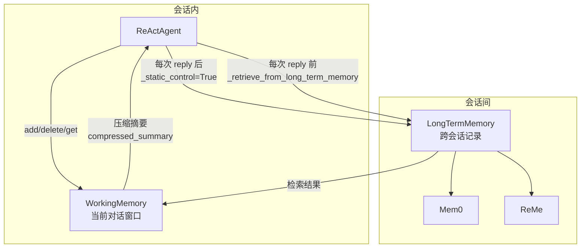

# 长期记忆：Mem0/ReMe

> **Level 5**: 源码调用链
> **前置要求**: [工作记忆实现](./07-working-memory.md)
> **后续章节**: [RAG 知识库系统](./07-rag-knowledge.md)

---

## 学习目标

学完本章后，你能：
- 理解 LongTermMemoryBase 的接口设计
- 掌握 Mem0LongTermMemory 的多策略记录机制
- 掌握 ReMeLongTermMemory 的异步上下文管理模式
- 知道如何在 Agent 中集成长期记忆

---

## 背景问题

工作记忆在会话结束后丢失。当 Agent 需要跨会话记住用户偏好、积累领域知识时，需要**长期记忆**。

**传统方案的问题**：
- 每个会话都要重新告诉 Agent 你的偏好
- 无法从历史对话中学习
- Agent 缺乏"记忆"能力

**AgentScope 的解决方案**：

---

## 架构定位

### 长期记忆与工作记忆的协作



**关键**: 长期记忆在 `reply()` 开始前检索（`_react_agent.py:882`），在 `reply()` 结束后记录（`_react_agent.py:528-536`）。它是一对"书挡"操作——不参与 Agent 循环的内部迭代。

```
┌─────────────────────────────────────────────────────┐
│                    AgentScope                        │
│                                                      │
│  ┌─────────────┐         ┌─────────────────────┐    │
│  │  工作记忆   │         │     长期记忆         │    │
│  │ (会话内)   │  ────>  │  (跨会话 + 向量检索) │    │
│  └─────────────┘         └─────────────────────┘    │
│                                                      │
│  InMemoryMemory             Mem0LongTermMemory       │
│  RedisMemory                ReMeLongTermMemory       │
└─────────────────────────────────────────────────────┘
```

---

## 源码入口

| 项目 | 值 |
|------|-----|
| **基类** | `src/agentscope/memory/_long_term_memory/_long_term_memory_base.py` |
| **Mem0 实现** | `src/agentscope/memory/_long_term_memory/_mem0/_mem0_long_term_memory.py` |
| **ReMe 实现** | `src/agentscope/memory/_long_term_memory/_reme/_reme_long_term_memory_base.py` |
| **ReMe 子类** | `_reme_personal_long_term_memory.py`, `_reme_task_long_term_memory.py`, `_reme_tool_long_term_memory.py` |

---

## LongTermMemoryBase 接口

**文件**: `src/agentscope/memory/_long_term_memory/_long_term_memory_base.py:1-95`

### 核心抽象方法

```python
class LongTermMemoryBase(StateModule):
    """长期记忆基类 - 时序记忆管理系统"""

    async def record(
        self,
        msgs: list[Msg | None],
        **kwargs: Any,
    ) -> Any:
        """开发者接口：记录信息到长期记忆"""
        raise NotImplementedError()

    async def retrieve(
        self,
        msg: Msg | list[Msg] | None,
        limit: int = 5,
        **kwargs: Any,
    ) -> str:
        """开发者接口：从长期记忆检索信息，返回字符串"""
        raise NotImplementedError()
```

### Agent 工具方法

```python
class LongTermMemoryBase(StateModule):
    async def record_to_memory(
        self,
        thinking: str,      # Agent 的推理过程
        content: list[str], # 要记录的内容
    ) -> ToolResponse:
        """Agent 工具：主动记录重要信息"""
        raise NotImplementedError()

    async def retrieve_from_memory(
        self,
        keywords: list[str],
        limit: int = 5,
    ) -> ToolResponse:
        """Agent 工具：基于关键词检索记忆"""
        raise NotImplementedError()
```

### 设计意图

| 方法类型 | 调用者 | 使用场景 |
|---------|--------|---------|
| `record/retrieve` | 开发者 | 在 Agent.reply() 中自动调用 |
| `record_to_memory/retrieve_from_memory` | Agent 自身 | Agent 主动管理记忆的工具 |

---

## Mem0LongTermMemory 实现

**文件**: `src/agentscope/memory/_long_term_memory/_mem0/_mem0_long_term_memory.py:1-747`

### 初始化流程

**文件**: `_mem0_long_term_memory.py:263-379`

```python
class Mem0LongTermMemory(LongTermMemoryBase):
    def __init__(
        self,
        agent_name: str | None = None,
        user_name: str | None = None,
        run_name: str | None = None,
        model: ChatModelBase | None = None,
        embedding_model: EmbeddingModelBase | None = None,
        vector_store_config: VectorStoreConfig | None = None,
        mem0_config: MemoryConfig | None = None,
        **kwargs: Any,
    ) -> None:
        # 1. 注册 agentscope provider 到 mem0
        self._register_agentscope_providers()

        # 2. 配置 mem0
        mem0_config = self._configure_mem0_config(...)

        # 3. 创建异步 memory 实例
        self.long_term_working_memory = mem0.AsyncMemory(mem0_config)
```

### 多策略记录机制

**文件**: `_mem0_long_term_memory.py:380-505`

Mem0LongTermMemory 使用**三级回退策略**确保记忆成功保存：

```python
async def record_to_memory(
    self,
    thinking: str,
    content: list[str],
    **kwargs: Any,
) -> ToolResponse:
    # 策略 1: 以 "user" 角色记录
    # mem0 默认从 user 角色提取记忆
    results = await self._mem0_record([
        {"role": "user", "content": "\n".join(content), "name": "user"}
    ])

    # 策略 2: 如果策略1没有结果，以 "assistant" 角色记录
    # mem0 会使用 AGENT_MEMORY_EXTRACTION_PROMPT 提取
    if len(results["results"]) == 0:
        results = await self._mem0_record([
            {"role": "assistant", "content": "\n".join(content)}
        ])

    # 策略 3: 最后手段 - 直接记录，不进行推理
    if len(results["results"]) == 0:
        results = await self._mem0_record([
            {"role": "assistant", "content": "\n".join(content)}
        ], infer=False)  # 跳过推理，直接保存
```

### 检索机制

**文件**: `_mem0_long_term_memory.py:507-571`

```python
async def retrieve_from_memory(
    self,
    keywords: list[str],
    limit: int = 5,
    **kwargs: Any,
) -> ToolResponse:
    # 并发搜索多个关键词
    search_coroutines = [
        self.long_term_working_memory.search(
            query=keyword,
            agent_id=self.agent_id,
            user_id=self.user_id,
            run_id=self.run_id,
            limit=limit,
        )
        for keyword in keywords
    ]
    search_results = await asyncio.gather(*search_coroutines)

    # 合并结果
    results = []
    for result in search_results:
        results.extend([item["memory"] for item in result["results"]])
        if "relations" in result:
            results.extend(self._format_relations(result))

    return ToolResponse(content=[TextBlock(text="\n".join(results))])
```

### 与 Agent 集成

```python
from agentscope.agent import ReActAgent
from agentscope.memory import InMemoryMemory
from agentscope.memory._mem0 import Mem0LongTermMemory

agent = ReActAgent(
    name="Assistant",
    sys_prompt="你是一个助手...",
    memory=InMemoryMemory(),  # 工作记忆
    long_term_memory=Mem0LongTermMemory(  # 长期记忆
        agent_name="assistant",
        user_name="user123",
        model=model,
        embedding_model=embedding_model,
    ),
)

# Agent 可以主动使用工具记录/检索记忆
# record_to_memory(thinking="用户说他们喜欢蓝色", content=["用户偏好蓝色主题"])
# retrieve_from_memory(keywords=["偏好", "颜色"])
```

---

## ReMeLongTermMemory 实现

**文件**: `src/agentscope/memory/_long_term_memory/_reme/_reme_long_term_memory_base.py:1-365`

### 异步上下文管理

**文件**: `_reme_long_term_memory_base.py:287-365`

ReMeLongTermMemory 使用**异步上下文管理器**管理会话生命周期：

```python
class ReMeLongTermMemoryBase(LongTermMemoryBase):
    def __init__(
        self,
        agent_name: str | None = None,
        user_name: str | None = None,  # 映射到 ReMe 的 workspace_id
        run_name: str | None = None,
        model: DashScopeChatModel | OpenAIChatModel | None = None,
        embedding_model: DashScopeTextEmbedding | OpenAITextEmbedding | None = None,
        **kwargs: Any,
    ) -> None:
        # 从 model 提取 API 凭证
        if isinstance(model, DashScopeChatModel):
            llm_api_base = "https://dashscope.aliyuncs.com/compatible-mode/v1"
            llm_api_key = model.api_key
        elif isinstance(model, OpenAIChatModel):
            llm_api_base = str(model.client.base_url)
            llm_api_key = str(model.client.api_key)

        # 初始化 ReMeApp
        self.app = ReMeApp(
            llm_api_key=llm_api_key,
            llm_api_base=llm_api_base,
            embedding_api_key=embedding_api_key,
            embedding_api_base=embedding_api_base,
            *config_args,
        )
        self._app_started = False

    async def __aenter__(self) -> "ReMeLongTermMemoryBase":
        if self.app is not None:
            await self.app.__aenter__()
            self._app_started = True
        return self

    async def __aexit__(self, exc_type, exc_val, exc_tb) -> None:
        if self.app is not None:
            await self.app.__aexit__(exc_type, exc_val, exc_tb)
        self._app_started = False
```

### 使用模式

```python
from agentscope.memory._reme import ReMePersonalLongTermMemory

memory = ReMePersonalLongTermMemory(
    agent_name="assistant",
    user_name="user123",
    model=model,
    embedding_model=embedding_model,
)

# 必须使用 async with 上下文
async with memory:
    # 在上下文中可以执行记忆操作
    await memory.record_to_memory(
        thinking="用户提到他们住在上海",
        content=["用户住在上海", "用户喜欢中餐"]
    )

    result = await memory.retrieve_from_memory(keywords=["住所"])
```

### ReMe 子类分工

| 子类 | 用途 | 记录内容 |
|------|------|---------|
| `ReMePersonalLongTermMemory` | 用户偏好 | 个人信息、习惯、喜好 |
| `ReMeTaskLongTermMemory` | 任务经验 | 任务执行过程、学习 |
| `ReMeToolLongTermMemory` | 工具使用 | 工具调用模式、指南 |

---

## 两种实现对比

| 特性 | Mem0LongTermMemory | ReMeLongTermMemory |
|------|-------------------|-------------------|
| **依赖** | `mem0ai` | `reme-ai` |
| **配置方式** | MemoryConfig 对象 | 构造函数参数 |
| **会话管理** | 自动状态追踪 | 手动 async with |
| **provider** | DashScope, OpenAI | DashScope, OpenAI |
| **向量存储** | Qdrant (默认) | 可配置 |
| **记录策略** | 三级回退自动选择 | 单一流程 |

### 选择建议

**用 Mem0LongTermMemory 当**：
- 需要简单的开箱即用体验
- 希望自动处理记忆策略
- 使用 Qdrant 作为向量存储

**用 ReMeLongTermMemory 当**：
- 需要细粒度控制不同类型的记忆
- 需要区分个人/任务/工具记忆
- 需要显式管理会话生命周期

---

## 工程现实与架构问题

### 技术债 (源码级)

| 位置 | 问题 | 影响 | 优先级 |
|------|------|------|--------|
| `_mem0_long_term_memory.py:400` | Mem0 记录失败无降级处理 | 三级策略都失败时静默丢失数据 | 高 |
| `_reme_long_term_memory_base.py:287` | ReMe __aenter__ 未验证 app 状态 | 重复进入上下文可能导致异常 | 中 |
| `_mem0_long_term_memory.py:190` | retrieve 并发搜索多个关键词可能超限 | mem0 API 可能有速率限制 | 中 |
| `_reme_personal_long_term_memory.py:50` | ReMe 子类继承层次过深 | 调试时追踪调用链困难 | 低 |
| `_long_term_memory_base.py:70` | record() 接收 None 但未处理 | 传入 None 会导致下游出错 | 低 |

**[HISTORICAL INFERENCE]**: 长期记忆实现主要来自 mem0ai 和 reme-ai 两个外部库，AgentScope 只是包装层。外部库的局限性会传导到包装层。

### 性能考量

```python
# 长期记忆操作延迟
Mem0.record_to_memory(): ~500-2000ms (API 调用 + LLM 推理)
Mem0.retrieve_from_memory(): ~200-500ms (向量搜索)
ReMe 首次 __aenter__: ~1000-3000ms (初始化连接)

# Mem0 三级回退开销
最坏情况: 3 × record_api_call = ~6s
```

### Mem0 记录失败问题

```python
# 当前问题: 三级策略都失败时静默丢失数据
async def record_to_memory(self, thinking, content, **kwargs):
    results = await self._mem0_record([{"role": "user", ...}])
    if len(results["results"]) == 0:
        results = await self._mem0_record([{"role": "assistant", ...}])
    if len(results["results"]) == 0:
        results = await self._mem0_record(
            [{"role": "assistant", ...}], infer=False
        )
    # 如果这里也失败，没有任何处理，数据丢失

# 解决方案: 添加持久化降级
class RobustMem0Memory(Mem0LongTermMemory):
    async def record_to_memory(self, thinking, content, **kwargs):
        try:
            return await super().record_to_memory(thinking, content, **kwargs)
        except Exception as e:
            # 降级到本地文件
            logger.warning(f"Mem0 record failed, falling back to file: {e}")
            await self._fallback_to_file(thinking, content)
            return ToolResponse(content=[TextBlock(text="Record saved locally")])
```

### 渐进式重构方案

```python
# 方案 1: 添加记录确认机制
class ConfirmingMem0Memory(Mem0LongTermMemory):
    async def record_to_memory(self, thinking, content, **kwargs):
        result = await super().record_to_memory(thinking, content, **kwargs)

        # 验证记录成功
        verification = await self.retrieve_from_memory(
            keywords=self._extract_keywords(content)
        )

        if "no relevant" in verification.content[0].text.lower():
            # 记录可能失败，抛出异常或重试
            raise MemoryRecordingError("Mem0 recording verification failed")

        return result

# 方案 2: 添加 ReMe 状态验证
class ValidatingReMeMemory(ReMeLongTermMemoryBase):
    async def __aenter__(self):
        if self._app_started:
            raise RuntimeError("ReMe app already started")
        return await super().__aenter__()
```

---

## Contributor 指南

### 添加新的长期记忆后端

1. 继承 `LongTermMemoryBase`
2. 实现 `record()`, `retrieve()`, `record_to_memory()`, `retrieve_from_memory()`
3. 在 `__init__.py` 中导出

### 调试长期记忆

```python
# 检查 long_term_memory 是否正确初始化
agent = ReActAgent(...)
print(f"Has long_term_memory: {agent.long_term_memory is not None}")

# 测试记录
if hasattr(agent.long_term_memory, 'record_to_memory'):
    result = await agent.long_term_memory.record_to_memory(
        thinking="测试记录",
        content=["测试内容"]
    )
    print(f"Record result: {result}")

# 测试检索
if hasattr(agent.long_term_memory, 'retrieve_from_memory'):
    result = await agent.long_term_memory.retrieve_from_memory(
        keywords=["测试"]
    )
    print(f"Retrieve result: {result}")
```

### 危险区域

1. **Mem0 API 依赖**：外部服务不可用时长期记忆完全失效
2. **ReMe 上下文管理**：必须使用 `async with`，手动调用可能出错
3. **记录验证缺失**：无法确认信息是否真正被记录

---

## 下一步

接下来学习 [RAG 知识库系统](./07-rag-knowledge.md)。


