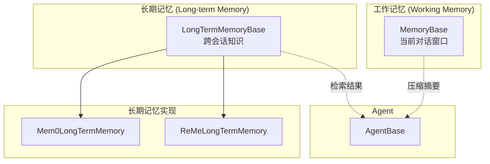
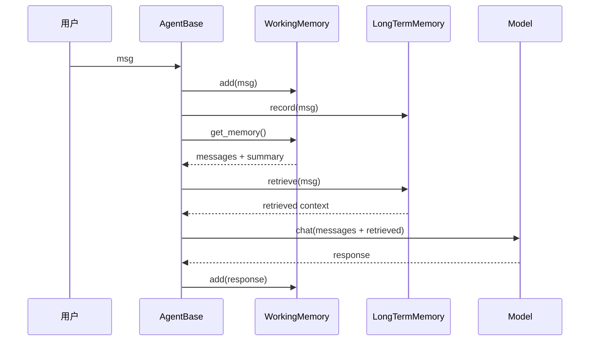
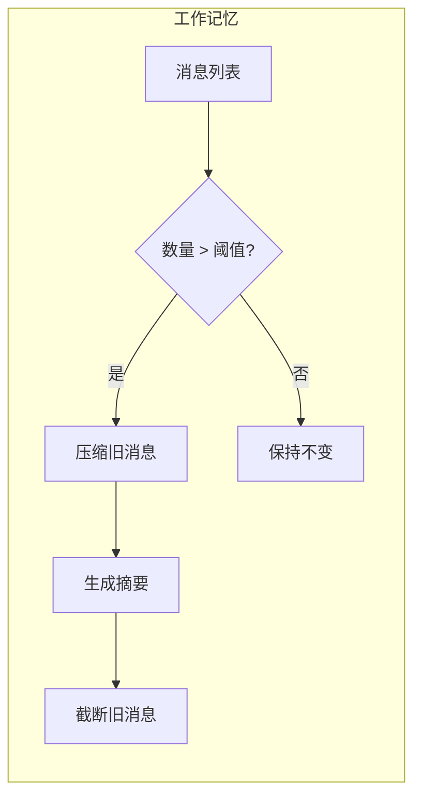

# 记忆系统总体设计

> **Level 5**: 源码调用链
> **前置要求**: [MCP 协议集成](../06-tool-system/06-mcp-integration.md)
> **后续章节**: [工作记忆实现](./07-working-memory.md)

---

## 学习目标

学完本章后，你能：
- 理解 AgentScope 记忆系统的分层设计
- 掌握 MemoryBase 和 LongTermMemoryBase 的接口设计
- 理解工作记忆与长期记忆的协作机制
- 知道记忆压缩和检索的时机

---

## 背景问题

Agent 需要在不同时间尺度上保持信息：

1. **短期记忆**：当前对话的完整上下文（窗口内的消息）
2. **长期记忆**：跨会话积累的知识（检索增强）

传统做法是不断扩大 context window，但有两个问题：
- **成本**：长 context 意味着高 token 消耗
- **性能**：大 context 导致推理变慢

AgentScope 通过**两层记忆系统**解决这个问题：
- **工作记忆**：只保留窗口内的消息，自动压缩旧消息
- **长期记忆**：外部向量存储，支持语义检索

---

## 源码入口

| 项目 | 值 |
|------|-----|
| **目录** | `src/agentscope/memory/` |
| **基类** | `MemoryBase`, `LongTermMemoryBase` |
| **工作记忆** | `_working_memory/_base.py` |
| **长期记忆** | `_long_term_memory/_long_term_memory_base.py` |

---

## 核心架构

### 记忆层次结构



### 与 Agent 的交互



---

## MemoryBase 接口

**文件**: `src/agentscope/memory/_working_memory/_base.py:8-50`

```python
class MemoryBase(StateModule):
    """工作记忆基类"""

    def __init__(self) -> None:
        super().__init__()
        self._compressed_summary: str = ""
        self.register_state("_compressed_summary")

    @abstractmethod
    async def add(
        self,
        memories: Msg | list[Msg] | None,
        marks: str | list[str] | None = None,
        **kwargs: Any,
    ) -> None:
        """添加消息到记忆存储"""

    @abstractmethod
    async def delete(
        self,
        msg_ids: list[str],
        **kwargs: Any,
    ) -> int:
        """删除指定 ID 的消息"""

    @abstractmethod
    async def clear(self) -> None:
        """清空记忆"""

    @abstractmethod
    async def get_memory(
        self,
        mark: str | None = None,
        exclude_mark: str | None = None,
        prepend_summary: bool = True,
        **kwargs: Any,
    ) -> list[Msg]:
        """获取记忆内容"""

    @abstractmethod
    async def size(self) -> int:
        """获取消息数量"""

    async def update_compressed_summary(self, summary: str) -> None:
        """更新压缩摘要"""
        self._compressed_summary = summary
```

### 状态管理

MemoryBase 继承自 `StateModule`，支持状态序列化：

```python
# 获取状态
state = memory.state_dict()
# {'content': [...], '_compressed_summary': '...'}

# 恢复状态
memory.load_state_dict(state)
```

---

## LongTermMemoryBase 接口

**文件**: `src/agentscope/memory/_long_term_memory/_long_term_memory_base.py:8-60`

```python
class LongTermMemoryBase(StateModule):
    """长期记忆基类 - 时序记忆管理系统"""

    async def record(
        self,
        msgs: list[Msg | None],
        **kwargs: Any,
    ) -> Any:
        """记录信息到长期记忆"""

    async def retrieve(
        self,
        msg: Msg | list[Msg] | None,
        limit: int = 5,
        **kwargs: Any,
    ) -> str:
        """从长期记忆检索信息"""

    async def record_to_memory(
        self,
        thinking: str,
        content: list[str],
        **kwargs: Any,
    ) -> ToolResponse:
        """Agent 工具：记录重要信息"""

    async def retrieve_from_memory(
        self,
        keywords: list[str],
        limit: int = 5,
        **kwargs: Any,
    ) -> ToolResponse:
        """Agent 工具：基于关键词检索"""
```

### 与 Agent 工具的集成

长期记忆提供两个**工具函数**供 Agent 调用：

| 工具 | 方法 | 用途 |
|------|------|------|
| `record_to_memory` | `record_to_memory(thinking, content)` | Agent 主动记录重要信息 |
| `retrieve_from_memory` | `retrieve_from_memory(keywords, limit)` | Agent 主动检索记忆 |

---

## 记忆压缩机制

### 压缩时机

记忆压缩发生在**消息数量超过阈值**时：



### 摘要生成

AgentScope 使用 LLM 生成压缩摘要：

```python
# ReActAgent 中的压缩逻辑
async def _compress_memory_if_needed(self) -> None:
    if await self.memory.size() > self.max_message_window:
        old_messages = await self.memory.get_memory()
        summary = await self._generate_summary(old_messages)
        await self.memory.update_compressed_summary(summary)
```

---

## 工作记忆 vs 长期记忆

| 特性 | 工作记忆 | 长期记忆 |
|------|---------|---------|
| **存储内容** | 当前对话窗口 | 跨会话知识 |
| **容量** | 有限（窗口大小） | 无限 |
| **检索方式** | 顺序遍历 | 语义向量检索 |
| **持久化** | 可选（Redis/DB） | 必须（向量数据库） |
| **典型后端** | InMemory, Redis, SQL | Mem0, ReMe, Pinecone |
| **使用场景** | 每次推理都访问 | 按需检索 |

### 协作模式

```python
# Agent 初始化时组合使用
agent = ReActAgent(
    name="Assistant",
    memory=InMemoryMemory(),
    long_term_memory=Mem0LongTermMemory(),
)

# Agent 运行时
# 1. 新消息 → 同时写入工作记忆和长期记忆
# 2. 推理前 → 从工作记忆获取窗口消息
# 3. 推理中 → 可选择从长期记忆检索增强
```

---

## 使用示例

### 基本配置

```python
from agentscope.memory import InMemoryMemory

memory = InMemoryMemory()

await memory.add(Msg("user", "你好", "user"))
await memory.add(Msg("assistant", "你好！", "assistant"))

msgs = await memory.get_memory()
print(f"记忆数量: {await memory.size()}")

await memory.clear()
```

### 带标记的记忆

```python
await memory.add(
    Msg("user", "记住我喜欢蓝色", "user"),
    marks=["preference", "color"]
)

color_msgs = await memory.get_memory(mark="preference")
```

---

## 工程现实与架构问题

### 记忆系统技术债

| 位置 | 问题 | 影响 | 优先级 |
|------|------|------|--------|
| `_memory_base.py` | MemoryBase 未定义 clear 抽象方法 | 各实现不一致 | 中 |
| `_in_memory_memory.py` | 无持久化，进程重启丢失 | 生产环境数据丢失 | 高 |
| `_redis_memory.py` | Redis 连接无自动重连 | 长会话可能断开 | 中 |
| `_sqlalchemy_memory.py` | 异步支持不完整 | 高并发场景性能差 | 中 |

**[HISTORICAL INFERENCE]**: 记忆系统是逐步演进的，最初只有 InMemoryMemory，Redis/SQLAlchemy 是后期添加，架构未统一设计。

### 性能考量

```python
# 记忆操作开销估算
InMemoryMemory.add(): ~0.01ms  # 纯内存操作
RedisMemory.add(): ~1ms        # 网络往返
SQLAlchemyMemory.add(): ~5ms   # 包含事务提交

# 建议:
# - 开发调试: InMemoryMemory
# - 生产环境: RedisMemory (需要设置连接池)
# - 复杂查询: SQLAlchemyMemory
```

### 渐进式重构方案

```python
# 方案 1: 统一 MemoryBase 接口
class MemoryBase(ABC):
    @abstractmethod
    async def add(self, msg: Msg, **kwargs) -> None: ...

    @abstractmethod
    async def get(self, ...) -> list[Msg]: ...

    @abstractmethod
    async def clear(self) -> None: ...  # 新增: 缺失的抽象方法

# 方案 2: 添加连接池管理
class RedisMemory(WorkingMemoryBase):
    def __init__(self, pool_size: int = 10, retry_times: int = 3):
        self._pool = redis.ConnectionPool(max_connections=pool_size)
        self._retry_times = retry_times
```

---

## 设计权衡

### 优势

1. **分层抽象**：工作记忆和长期记忆解耦
2. **状态序列化**：支持 Session 持久化
3. **工具集成**：Agent 可主动管理长期记忆

### 局限

1. **压缩策略固定**：使用 LLM 摘要，可能丢失细节
2. **检索依赖外部**：Mem0/ReMe 需要外部服务
3. **无事务支持**：多步操作不是原子的

---

## Contributor 指南

### 添加新的记忆后端

1. 继承 `MemoryBase`（工作记忆）或 `LongTermMemoryBase`（长期记忆）
2. 实现抽象方法
3. 在 `__init__.py` 中导出

### 调试记忆问题

```python
print(f"消息数: {await memory.size()}")
print(f"摘要: {memory._compressed_summary}")

msgs = await memory.get_memory(prepend_summary=False)
for msg in msgs:
    print(f"[{msg.role}] {msg.content}")
```

---

## 下一步

接下来学习 [工作记忆实现](./07-working-memory.md)。


