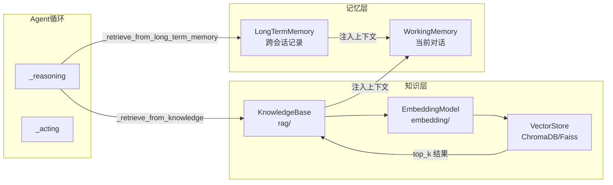
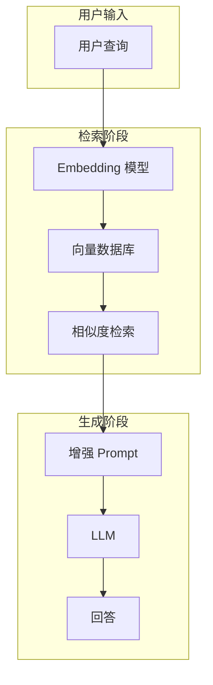
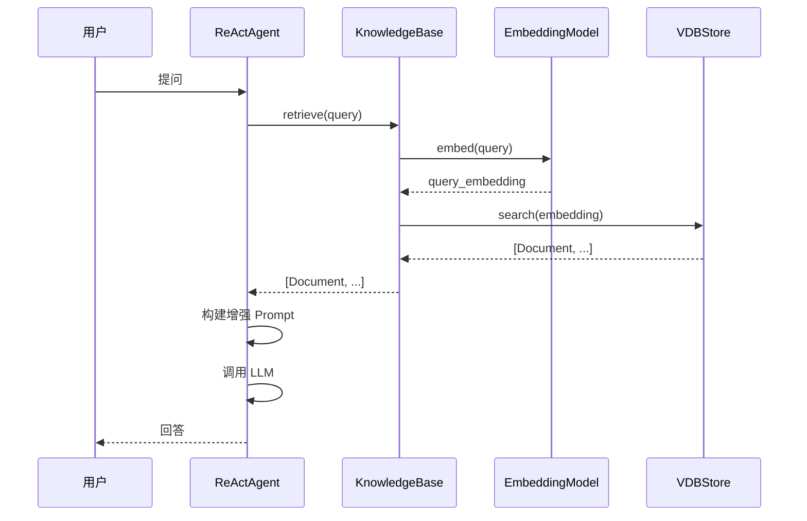

# RAG 知识库系统

> **Level 5**: 源码调用链
> **前置要求**: [长期记忆实现](./07-long-term-memory.md)
> **后续章节**: [多 Agent 协作模式](../08-multi-agent/08-multi-agent-patterns.md)

---

## 学习目标

学完本章后，你能：
- 理解 RAG（检索增强生成）的原理
- 掌握 KnowledgeBase 抽象和 Document 数据结构
- 知道如何在 AgentScope 中配置多种向量存储
- 理解 embedding 模型与向量存储的配合

---

## 背景问题

LLM 的知识受限于训练数据，无法获取最新信息或私有知识。RAG 通过**检索+生成**解决这个问题：

```
┌─────────────────────────────────────────────────────────┐
│                    RAG 流程                              │
│                                                          │
│  用户问题 ──>  embedding ──>  向量检索                   │
│                                      │                   │
│                                      v                   │
│  LLM 生成 <────────────────────  检索结果                 │
│                                      │                   │
│                                      v                   │
│                                 知识库 (Vector DB)        │
└─────────────────────────────────────────────────────────┘
```

**RAG vs 长期记忆**：

| 特性 | RAG 知识库 | 长期记忆 |
|------|-----------|---------|
| **用途** | 外部知识检索 | Agent 自身经验 |
| **数据来源** | 文档、书籍、网页 | Agent 与用户的交互 |
| **更新方式** | 批量导入 | 实时记录 |
| **检索方式** | 语义相似度 | 关键词/语义 |

---

## 架构定位

### RAG 在记忆-推理管道中的位置



**关键**: RAG 知识库在 `_reasoning()` 之前被查询（通过 `_retrieve_from_knowledge()` at `_react_agent.py:908`），结果注入工作记忆。这与长期记忆（`_retrieve_from_long_term_memory()` at line 882）是两条独立的检索管道。

---

## 源码入口

| 项目 | 值 |
|------|-----|
| **目录** | `src/agentscope/rag/` |
| **核心类** | `KnowledgeBase`, `Document`, `DocMetadata` |
| **向量存储** | `_store/_*.py` (Qdrant, Milvus, MongoDB, etc.) |
| **读取器** | `_reader/` |

---

## 核心数据结构

### Document

**文件**: `src/agentscope/rag/_document.py:35-52`

```python
@dataclass
class Document:
    """数据分块"""

    metadata: DocMetadata
    """元数据，包含原始内容"""

    id: str = field(default_factory=shortuuid.uuid)
    """文档唯一 ID"""

    embedding: Embedding | None = None
    """向量嵌入（添加时自动生成）"""

    score: float | None = None
    """检索相关性得分"""
```

### DocMetadata

**文件**: `_document.py:17-31`

```python
@dataclass
class DocMetadata:
    """文档元数据"""

    content: TextBlock | ImageBlock | VideoBlock
    """原始内容（文本/图片/视频）"""

    doc_id: str
    """文档 ID"""

    chunk_id: int
    """分块 ID"""

    total_chunks: int
    """总分块数"""
```

---

## KnowledgeBase 抽象

**文件**: `src/agentscope/rag/_knowledge_base.py:1-131`

### 核心接口

```python
class KnowledgeBase:
    """RAG 知识库抽象"""

    embedding_store: VDBStoreBase
    """向量存储"""

    embedding_model: EmbeddingModelBase
    """embedding 模型"""

    @abstractmethod
    async def retrieve(
        self,
        query: str,
        limit: int = 5,
        score_threshold: float | None = None,
        **kwargs: Any,
    ) -> list[Document]:
        """根据查询检索相关文档"""

    @abstractmethod
    async def add_documents(
        self,
        documents: list[Document],
        **kwargs: Any,
    ) -> None:
        """添加文档到知识库"""
```

### Agent 工具方法

```python
class KnowledgeBase:
    async def retrieve_knowledge(
        self,
        query: str,
        limit: int = 3,
        score_threshold: float = 0.8,
        **kwargs: Any,
    ) -> ToolResponse:
        """Agent 工具：检索知识库

        Args:
            query: 查询字符串，应具体明确
            limit: 返回文档数量
            score_threshold: 0-1 之间的阈值
        """
        docs = await self.retrieve(
            query=query,
            limit=limit,
            score_threshold=score_threshold,
            **kwargs,
        )

        if len(docs):
            return ToolResponse(content=[
                TextBlock(
                    type="text",
                    text=f"Score: {_.score}, Content: {_.metadata.content['text']}"
                )
                for _ in docs
            ])
        return ToolResponse(content=[
            TextBlock(type="text", text="No relevant documents found.")
        ])
```

---

## SimpleKnowledge 实现

**文件**: `src/agentscope/rag/_simple_knowledge.py:1-85`

### 添加文档流程

```python
class SimpleKnowledge(KnowledgeBase):
    async def add_documents(
        self,
        documents: list[Document],
        **kwargs: Any,
    ) -> None:
        # 1. 验证内容类型
        for doc in documents:
            if doc.metadata.content["type"] not in self.embedding_model.supported_modalities:
                raise ValueError(
                    f"{self.embedding_model.model_name} 不支持 "
                    f"{doc.metadata.content['type']} 类型"
                )

        # 2. 生成 embedding
        res_embeddings = await self.embedding_model(
            [_.metadata.content for _ in documents]
        )

        # 3. 关联 embedding 到文档
        for doc, embedding in zip(documents, res_embeddings.embeddings):
            doc.embedding = embedding

        # 4. 存入向量数据库
        await self.embedding_store.add(documents)
```

### 检索流程

```python
class SimpleKnowledge(KnowledgeBase):
    async def retrieve(
        self,
        query: str,
        limit: int = 5,
        score_threshold: float | None = None,
        **kwargs: Any,
    ) -> list[Document]:
        # 1. 将查询文本转为 embedding
        res_embedding = await self.embedding_model([
            TextBlock(type="text", text=query)
        ])

        # 2. 向量数据库相似度搜索
        res = await self.embedding_store.search(
            res_embedding.embeddings[0],
            limit=limit,
            score_threshold=score_threshold,
            **kwargs,
        )
        return res
```

---

## 向量存储后端

**文件**: `src/agentscope/rag/_store/`

### VDBStoreBase 接口

**文件**: `_store/_store_base.py:1-50`

```python
class VDBStoreBase:
    """向量数据库存储抽象"""

    @abstractmethod
    async def add(self, documents: list[Document], **kwargs: Any) -> None:
        """添加文档到向量数据库"""

    @abstractmethod
    async def delete(self, *args: Any, **kwargs: Any) -> None:
        """从向量数据库删除"""

    @abstractmethod
    async def search(
        self,
        query_embedding: Embedding,
        limit: int,
        score_threshold: float | None = None,
        **kwargs: Any,
    ) -> list[Document]:
        """检索相似文档"""
```

### 支持的向量存储

| 存储 | 文件 | 特点 |
|------|------|------|
| **Qdrant** | `_qdrant_store.py` | 开源，高性能，支持云端 |
| **Milvus Lite** | `_milvuslite_store.py` | 轻量级，适合本地 |
| **MongoDB** | `_mongodb_store.py` | 文档数据库 + 向量 |
| **OceanBase** | `_alibabacloud_mysql_store.py` | 阿里云企业版 |
| **MySQL** | - | 需配合向量扩展 |

---

## 使用示例

### 基础配置

```python
from agentscope.rag import SimpleKnowledge, Document
from agentscope.message import TextBlock
from agentscope.embedding import OpenAITextEmbedding
from agentscope.rag._store import QdrantStore

# 1. 配置 embedding 模型
embedding_model = OpenAITextEmbedding(
    model_name="text-embedding-3-small",
    api_key="your-api-key"
)

# 2. 配置向量存储
embedding_store = QdrantStore(
    collection_name="my_knowledge",
    dimension=1536,  # OpenAI embedding 维度
)

# 3. 创建知识库
kb = SimpleKnowledge(
    embedding_store=embedding_store,
    embedding_model=embedding_model,
)

# 4. 添加文档
kb.add_documents([
    Document(
        metadata=DocMetadata(
            content=TextBlock(type="text", text="AgentScope 是一个多 Agent 框架"),
            doc_id="doc1",
            chunk_id=0,
            total_chunks=1,
        )
    )
])

# 5. 检索
results = await kb.retrieve("什么是 AgentScope?", limit=3)
for doc in results:
    print(f"[{doc.score:.3f}] {doc.metadata.content['text']}")
```

### 在 Agent 中使用

```python
from agentscope.agent import ReActAgent
from agentscope.rag import SimpleKnowledge

# 创建知识库
kb = SimpleKnowledge(
    embedding_store=QdrantStore(...),
    embedding_model=OpenAITextEmbedding(...),
)

# Agent 配置知识库
agent = ReActAgent(
    name="Assistant",
    sys_prompt="你是一个助手，使用知识库回答问题。",
    knowledge_base=kb,  # 知识库注入
    model=model,
)

# Agent.reply() 内部会自动：
# 1. 调用 knowledge_base.retrieve() 检索相关文档
# 2. 将检索结果加入 prompt
# 3. LLM 生成回答时参考检索结果
```

### 检索参数调优

```python
# 高精度检索（少结果，高置信）
results = await kb.retrieve(
    query="Python 异步编程",
    limit=1,
    score_threshold=0.9,  # 只返回高相似度
)

# 广泛检索（多结果，低阈值）
results = await kb.retrieve(
    query="编程",
    limit=10,
    score_threshold=0.5,  # 降低阈值获取更多
)
```

---

## RAG 检索质量优化

### 查询优化

```python
# ❌ 模糊查询
results = await kb.retrieve("那个东西")

# ✅ 具体查询
results = await kb.retrieve("用户偏好的主题颜色是什么")

# ✅ 使用多个查询
for query in ["Python 特性", "Python 异步", "Python 装饰器"]:
    results = await kb.retrieve(query)
```

### 文档分块策略

```python
# 大文档应该分块
long_text = "..."  # 很长一段文本

# 方案 1: 固定大小分块
chunks = [long_text[i:i+500] for i in range(0, len(long_text), 500)]

# 方案 2: 语义分块（句子/段落边界）
# ... 使用专门的 chunker
```

---

## 架构图

### RAG 完整流程



### 组件交互



---

## 工程现实与架构问题

### 技术债 (源码级)

| 位置 | 问题 | 影响 | 优先级 |
|------|------|------|--------|
| `_simple_knowledge.py:100` | add_documents 无批量优化 | 大量文档时逐个 embedding 效率低 | 中 |
| `_knowledge_base.py:130` | retrieve 无缓存 | 相同 query 重复计算 embedding | 中 |
| `_document.py:50` | Document.to_dict 无序列化处理 | 复杂 metadata 可能无法正确序列化 | 中 |
| `_store_base.py:50` | search 无分页支持 | 大量结果时无法分页获取 | 低 |
| `_simple_knowledge.py:200` | embedding 失败无回退 | 单个文档 embedding 失败导致整个 add 失败 | 高 |

**[HISTORICAL INFERENCE]**: RAG 实现早期侧重功能正确性，性能优化（批量处理、缓存、分页）是后续发现的需求。embedding 服务依赖也是设计时未充分考虑的问题。

### 性能考量

```python
# RAG 操作开销估算
单文档 embedding: ~50-200ms (取决于 API)
批量 embedding: ~100ms + 10ms/文档 (有折扣)
向量搜索 (Qdrant): ~10-50ms
向量搜索 (Milvus): ~20-100ms

# 1000 文档批量处理
串行: 1000 × 100ms = 100s
批量 (batch_size=100): 10 × 200ms + 9 × 100ms ≈ 2.9s
```

### embedding 失败问题

```python
# 当前问题: 单个文档 embedding 失败导致整个 add 失败
async def add_documents(self, documents, **kwargs):
    for doc in documents:
        res_embeddings = await self.embedding_model([doc.metadata.content])
        # 如果这里失败，整个流程中断

# 解决方案: 添加部分成功机制
class PartialKnowledge(KnowledgeBase):
    async def add_documents(self, documents, **kwargs):
        successful = []
        failed = []

        for doc in documents:
            try:
                embedding = await self.embedding_model([doc.metadata.content])
                doc.embedding = embedding.embeddings[0]
                successful.append(doc)
            except Exception as e:
                logger.warning(f"Failed to embed doc {doc.id}: {e}")
                failed.append((doc, str(e)))

        if successful:
            await self.embedding_store.add(successful)

        return {
            "successful": len(successful),
            "failed": len(failed),
            "errors": failed
        }
```

### 渐进式重构方案

```python
# 方案 1: 添加批量 embedding 优化
class BatchKnowledge(KnowledgeBase):
    async def add_documents(self, documents, batch_size=100, **kwargs):
        for i in range(0, len(documents), batch_size):
            batch = documents[i:i + batch_size]

            # 批量 embedding
            embeddings = await self.embedding_model([
                doc.metadata.content for doc in batch
            ])

            # 关联 embedding
            for doc, embedding in zip(batch, embeddings.embeddings):
                doc.embedding = embedding

            await self.embedding_store.add(batch)

# 方案 2: 添加检索缓存
class CachedKnowledge(KnowledgeBase):
    def __init__(self, *args, cache_ttl=300, **kwargs):
        super().__init__(*args, **kwargs)
        self._cache: dict[str, tuple[float, list[Document]]] = {}
        self._cache_ttl = cache_ttl

    async def retrieve(self, query, **kwargs):
        cache_key = hash((query, kwargs.get("limit", 5)))

        if cache_key in self._cache:
            timestamp, docs = self._cache[cache_key]
            if time.time() - timestamp < self._cache_ttl:
                return docs

        docs = await super().retrieve(query, **kwargs)
        self._cache[cache_key] = (time.time(), docs)
        return docs
```

---

## Contributor 指南

### 添加新的向量存储后端

1. 继承 `VDBStoreBase`
2. 实现 `add()`, `delete()`, `search()` 方法
3. 在 `_store/__init__.py` 中导出

```python
# 示例：伪实现
class MyVectorStore(VDBStoreBase):
    async def add(self, documents: list[Document], **kwargs) -> None:
        # 实现添加逻辑
        pass

    async def search(
        self,
        query_embedding: Embedding,
        limit: int,
        score_threshold: float | None = None,
        **kwargs: Any,
    ) -> list[Document]:
        # 实现检索逻辑
        pass
```

### 调试知识库

```python
# 检查知识库状态
print(f"Store type: {type(kb.embedding_store)}")
print(f"Embedding model: {kb.embedding_model.model_name}")

# 测试 embedding
test_embedding = await kb.embedding_model([
    TextBlock(type="text", text="测试")
])
print(f"Embedding dim: {len(test_embedding.embeddings[0])}")

# 检查向量存储连接
store = kb.embedding_store
if hasattr(store, 'get_client'):
    client = store.get_client()
    print(f"Store client: {type(client)}")
```

### 危险区域

1. **embedding 维度不匹配**：模型维度必须与向量存储 dimension 一致
2. **score_threshold 经验值**：不同向量化器阈值不同，需调试
3. **向量存储连接**：远程服务需处理超时和重连

---

## 设计权衡

### 优势

1. **解耦设计**：KnowledgeBase 与 VDBStore 分离，方便切换
2. **异步 API**：支持高并发操作
3. **工具集成**：Agent 可主动检索知识库
4. **多模态支持**：TextBlock, ImageBlock, VideoBlock

### 局限

1. **无增量更新**：文档更新需要 delete + add
2. **无重排序**：依赖向量相似度，无二次重排
3. **embedding 模型依赖**：检索质量受限于 embedding 模型

---

## 下一步

接下来学习 [多 Agent 协作模式](../08-multi-agent/08-multi-agent-patterns.md)。


