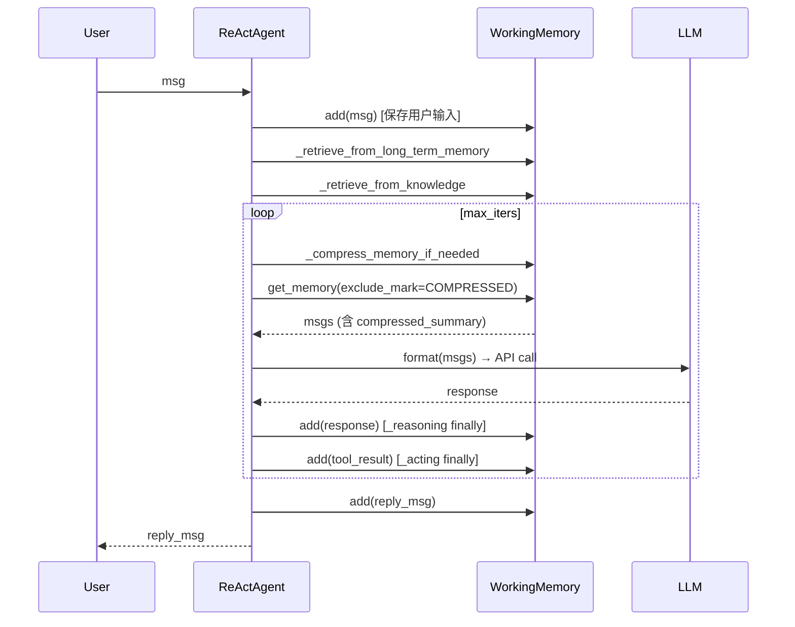

# 工作记忆：InMemory/Redis/SQLAlchemy

> **Level 5**: 源码调用链
> **前置要求**: [记忆系统总体设计](./07-memory-architecture.md)
> **后续章节**: [长期记忆实现](./07-long-term-memory.md)

---

## 学习目标

学完本章后，你能：
- 理解三种工作记忆实现的区别与适用场景
- 掌握 InMemoryMemory 的内部实现
- 知道如何选择合适的记忆后端
- 理解记忆的序列化与反序列化机制

---

## 三种实现对比

| 实现 | 存储介质 | 持久化 | 适用场景 |
|------|---------|--------|---------|
| `InMemoryMemory` | Python 内存 | ❌ 重启丢失 | 开发测试 |
| `RedisMemory` | Redis | ✅ 持久化 | 生产/分布式 |
| `SQLAlchemyMemory` | PostgreSQL/MySQL | ✅ 持久化 | 企业级应用 |
| `TableStoreMemory` | 阿里云表格存储 | ✅ 持久化 | 云原生 |

---

## 架构定位

### 工作记忆在 Agent 循环中的读写时机



**关键**: 工作记忆是 Agent 循环中**读写最频繁**的组件。每次 `_reasoning()` 和 `_acting()` 都会写入。`MemoryMark` 系统（HINT, COMPRESSED）控制哪些消息传给 LLM。

---

## InMemoryMemory 实现

**文件**: `src/agentscope/memory/_working_memory/_in_memory_memory.py:1-180`

### 核心数据结构

```python
class InMemoryMemory(MemoryBase):
    """内存实现的工作记忆"""

    def __init__(self) -> None:
        super().__init__()
        # 使用 (Msg, marks) 元组列表存储
        self.content: list[tuple[Msg, list[str]]] = []
        self.register_state("content")
```

### add() 方法

**文件**: `_in_memory_memory.py:60-100`

```python
async def add(
    self,
    memories: Msg | list[Msg] | None,
    marks: str | list[str] | None = None,
    allow_duplicates: bool = False,
    **kwargs: Any,
) -> None:
    """添加消息到记忆"""
    if memories is None:
        return

    if isinstance(memories, Msg):
        memories = [memories]

    if marks is None:
        marks = []
    elif isinstance(marks, str):
        marks = [marks]

    # 可选去重
    if not allow_duplicates:
        existing_ids = {msg.id for msg, _ in self.content}
        memories = [msg for msg in memories if msg.id not in existing_ids]

    for msg in memories:
        self.content.append((deepcopy(msg), deepcopy(marks)))
```

### get_memory() 方法

**文件**: `_in_memory_memory.py:25-58`

```python
async def get_memory(
    self,
    mark: str | None = None,
    exclude_mark: str | None = None,
    prepend_summary: bool = True,
    **kwargs: Any,
) -> list[Msg]:
    """获取记忆内容"""
    # 按 mark 过滤
    filtered_content = [
        (msg, marks)
        for msg, marks in self.content
        if mark is None or mark in marks
    ]

    # 排除特定 mark
    if exclude_mark is not None:
        filtered_content = [
            (msg, marks)
            for msg, marks in filtered_content
            if exclude_mark not in marks
        ]

    # 可选添加摘要
    if prepend_summary and self._compressed_summary:
        return [
            Msg("user", self._compressed_summary, "user"),
            *[msg for msg, _ in filtered_content],
        ]

    return [msg for msg, _ in filtered_content]
```

### 状态序列化

**文件**: `_in_memory_memory.py:155-180`

```python
def state_dict(self) -> dict:
    """获取状态字典"""
    return {
        **super().state_dict(),
        "content": [[msg.to_dict(), marks] for msg, marks in self.content],
    }

def load_state_dict(self, state_dict: dict, strict: bool = True) -> None:
    """从状态字典加载"""
    self._compressed_summary = state_dict.get("_compressed_summary", "")

    self.content = []
    for item in state_dict.get("content", []):
        if isinstance(item, (tuple, list)) and len(item) == 2:
            msg_dict, marks = item
            msg = Msg.from_dict(msg_dict)
            self.content.append((msg, marks))
```

---

## RedisMemory 实现

**文件**: `src/agentscope/memory/_working_memory/_redis_memory.py`

使用 Redis Hash 存储消息：

```python
class RedisMemory(MemoryBase):
    def __init__(
        self,
        host: str = "localhost",
        port: int = 6379,
        db: int = 0,
        key_prefix: str = "agentscope:memory:",
        **kwargs,
    ) -> None:
        # Redis 连接
        self.redis = redis.Redis(host=host, port=port, db=db, **kwargs)
        self.key_prefix = key_prefix

    async def add(self, memories: Msg | list[Msg] | None, **kwargs) -> None:
        # 使用 Redis Pipeline 批量写入
        pipe = self.redis.pipeline()
        for msg in (memories if isinstance(memories, list) else [memories]):
            key = f"{self.key_prefix}{msg.id}"
            pipe.hset(key, mapping=msg.to_dict())
        pipe.execute()

    async def get_memory(self, **kwargs) -> list[Msg]:
        keys = self.redis.keys(f"{self.key_prefix}*")
        msgs = []
        for key in keys:
            data = self.redis.hgetall(key)
            msgs.append(Msg.from_dict(data))
        return msgs
```

---

## SQLAlchemyMemory 实现

**文件**: `src/agentscope/memory/_working_memory/_sqlalchemy_memory.py`

使用异步 SQLAlchemy：

```python
class SQLAlchemyMemory(MemoryBase):
    def __init__(
        self,
        url: str = "sqlite+aiosqlite:///memory.db",
    ) -> None:
        self.engine = create_async_engine(url)
        self.metadata = MetaData()
        self.table = Table(
            "messages",
            self.metadata,
            Column("id", String, primary_key=True),
            Column("name", String),
            Column("role", String),
            Column("content", Text),
            Column("marks", JSON),
        )

    async def add(self, memories: Msg | list[Msg] | None, **kwargs) -> None:
        async with self.engine.begin() as conn:
            await conn.execute(
                self.table.insert().values([
                    msg.to_dict() for msg in memories
                ])
            )
```

---

## 选择指南

### 开发环境

```python
# 最简单的方式：内存存储
memory = InMemoryMemory()
# 缺点：重启后记忆丢失
```

### 生产环境（单机）

```python
# Redis 持久化
memory = RedisMemory(
    host="localhost",
    port=6379,
    db=0,
)
```

### 生产环境（分布式）

```python
# 共享 Redis 集群
memory = RedisMemory(
    host="redis-cluster.example.com",
    port=6379,
    password=os.environ.get("REDIS_PASSWORD"),
)
```

### 企业级应用

```python
# PostgreSQL 存储
memory = SQLAlchemyMemory(
    url="postgresql+asyncpg://user:pass@db:5432/memory",
)
```

---

## 标记系统

工作记忆支持**标记**来组织消息：

```python
# 添加带标记的消息
await memory.add(
    Msg("user", "用户偏好蓝色", "user"),
    marks=["preference", "color"]
)

# 获取所有带 "preference" 标记的消息
prefs = await memory.get_memory(mark="preference")

# 排除带 "temporary" 标记的消息
permanent = await memory.get_memory(exclude_mark="temporary")

# 更新标记
await memory.update_messages_mark(
    new_mark="archived",
    old_mark="preference",
    msg_ids=["msg-id-1", "msg-id-2"]
)
```

---

## 状态持久化

所有工作记忆实现都支持状态序列化，可与 Session 系统集成：

```python
from agentscope.session import JSONSession

session = JSONSession(save_dir="./sessions")

# 保存
await session.save_session_state(
    session_id="user123-session456",
    memory=agent.memory,
)

# 恢复
await session.load_session_state(
    session_id="user123-session456",
    memory=agent.memory,
)
```

---

## 工程现实与架构问题

### 技术债 (源码级)

| 位置 | 问题 | 影响 | 优先级 |
|------|------|------|--------|
| `_in_memory_memory.py:60` | InMemoryMemory 无持久化 | 进程重启后记忆完全丢失 | 高 |
| `_redis_memory.py:80` | Redis 连接无自动重连 | Redis 服务重启后连接失效 | 高 |
| `_sqlalchemy_memory.py:50` | SQLAlchemy 使用 aiosqlite 但未处理关闭 | 异步引擎关闭可能泄漏资源 | 中 |
| `_in_memory_memory.py:100` | deepcopy 性能差 | 每条消息都深拷贝，大消息时开销大 | 中 |
| `_in_memory_memory.py:72` | allow_duplicates=False 时 O(n) 查找 | 大量消息时去重效率低 | 低 |

**[HISTORICAL INFERENCE]**: 工作记忆实现最初以 InMemoryMemory 为主，Redis 和 SQLAlchemy 是后来添加的。Redis 连接重连和异步资源管理问题未被充分考虑。

### 性能考量

```python
# 记忆操作开销估算
InMemoryMemory.add(): O(1) 追加，去重时 O(n)
InMemoryMemory.get_memory(): O(n) 遍历过滤
RedisMemory.add(): O(1) 但受网络延迟影响 (~1-10ms)
SQLAlchemyMemory.add(): O(1) 但受 DB 延迟影响 (~5-50ms)

# deepcopy 开销
小消息 (~1KB): ~0.1ms
中消息 (~100KB): ~5ms
大消息 (~1MB): ~50ms
```

### Redis 连接问题

```python
# 当前问题: Redis 连接无自动重连机制
class RedisMemory(MemoryBase):
    def __init__(self, host="localhost", port=6379, ...):
        self.redis = redis.Redis(host=host, port=port, ...)
        # 如果 Redis 服务重启，这个连接会失效

# 解决方案: 使用连接池和重连逻辑
class RobustRedisMemory(RedisMemory):
    def __init__(self, *args, **kwargs):
        super().__init__(*args, **kwargs)
        self._pool = redis.ConnectionPool(
            host=self.redis.host,
            port=self.redis.port,
            max_connections=10,
            retry_on_timeout=True,
        )

    async def _ensure_connection(self) -> None:
        try:
            self.redis.ping()
        except redis.ConnectionError:
            self.redis = redis.Redis(connection_pool=self._pool)
```

### 渐进式重构方案

```python
# 方案 1: 添加容量限制防止 OOM
class BoundedInMemoryMemory(InMemoryMemory):
    MAX_SIZE = 10000  # 最大消息数

    async def add(self, memories, **kwargs):
        await super().add(memories, **kwargs)
        # 截断超出的部分
        if len(self.content) > self.MAX_SIZE:
            excess = len(self.content) - self.MAX_SIZE
            self.content = self.content[excess:]

# 方案 2: 添加索引加速去重
class IndexedInMemoryMemory(InMemoryMemory):
    def __init__(self):
        super().__init__()
        self._msg_id_index: set[str] = set()  # O(1) 查找

    async def add(self, memories, allow_duplicates=False, **kwargs):
        if memories is None:
            return

        if isinstance(memories, Msg):
            memories = [memories]

        if not allow_duplicates:
            # 使用索引快速判断
            new_memories = [m for m in memories if m.id not in self._msg_id_index]
            self._msg_id_index.update(m.id for m in new_memories)
            memories = new_memories

        for msg in memories:
            self.content.append((deepcopy(msg), deepcopy(kwargs.get("marks", []))))
```

---

## Contributor 指南

### 添加新的后端

1. 继承 `MemoryBase`
2. 实现 `add()`, `delete()`, `get_memory()`, `clear()`, `size()`
3. 实现 `state_dict()` 和 `load_state_dict()` 支持序列化
4. 在 `__init__.py` 中导出

### 调试

```python
# 检查消息数量
print(f"Size: {await memory.size()}")

# 检查内容
msgs = await memory.get_memory(prepend_summary=False)
for msg, marks in memory.content:
    print(f"[{msg.role}] {msg.content} marks={marks}")
```

### 危险区域

1. **InMemoryMemory 进程共享问题**：多个进程无法共享同一份记忆
2. **Redis 连接超时**：长时间空闲后连接可能断开
3. **SQLAlchemy 异步引擎关闭**：需要正确处理资源释放

---

## 下一步

接下来学习 [长期记忆实现](./07-long-term-memory.md)。


