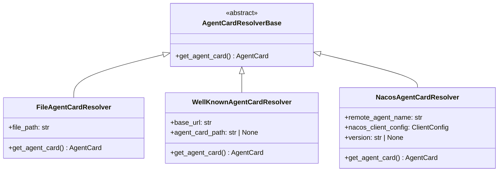

# A2A 协议详解

> **Level 6**: 能修改小功能
> **前置要求**: [MsgHub 高级模式](./08-msghub-patterns.md)
> **后续章节**: [Tracing 追踪与调试](./08-tracing-debugging.md)

---

## 学习目标

学完本章后，你能：
- 理解 A2A（Agent-to-Agent）协议的设计目的
- 掌握 AgentCard 和 AgentCardResolver 的架构
- 实现 File、WellKnown、Nacos 三种服务发现机制
- 理解 A2A 与 MsgHub 的区别与适用场景

---

## 背景问题

当多个 Agent 需要相互通信时面临的问题：
1. **服务发现**：如何找到其他 Agent 的地址？
2. **协议统一**：不同 Agent 如何理解彼此的消息格式？
3. **能力描述**：如何知道对方支持什么功能？

A2A 协议通过 **AgentCard** 元数据和服务发现机制解决这些问题。

---

## 源码入口

| 项目 | 值 |
|------|-----|
| **目录** | `src/agentscope/a2a/` |
| **核心基类** | `AgentCardResolverBase` |
| **实现类** | `FileAgentCardResolver`, `WellKnownAgentCardResolver`, `NacosAgentCardResolver` |
| **外部依赖** | `a2a` (PyPI 包) |

---

## 核心架构

### A2A 协议消息格式

```json
{
  "method": "tasks/send",
  "params": {
    "task": {
      "id": "msg-123",
      "message": {
        "role": "user",
        "content": "Hello"
      }
    }
  }
}
```

### AgentCard 数据结构

```json
{
  "name": "RemoteAgent",
  "url": "http://localhost:8000",
  "description": "A remote A2A agent",
  "version": "1.0.0",
  "capabilities": {},
  "default_input_modes": ["text/plain"],
  "default_output_modes": ["text/plain"],
  "skills": []
}
```

### Resolver 模式



---

## AgentCardResolverBase

**文件**: `src/agentscope/a2a/_base.py:1-25`

```python
class AgentCardResolverBase(ABC):
    """A2A AgentCard 解析器基类

    用于从不同来源获取远程 Agent 的元数据（AgentCard）。
    子类实现不同的服务发现机制。
    """

    @abstractmethod
    async def get_agent_card(self) -> "AgentCard":
        """获取 AgentCard

        Returns:
            `AgentCard`:
                远程 Agent 的元数据卡片
        """
        ...
```

---

## FileAgentCardResolver

**文件**: `src/agentscope/a2a/_file_resolver.py:1-77`

从本地 JSON 文件加载 AgentCard：

```python
class FileAgentCardResolver(AgentCardResolverBase):
    """从 JSON 文件加载 AgentCard"""

    def __init__(self, file_path: str) -> None:
        self._file_path = file_path

    async def get_agent_card(self) -> AgentCard:
        from a2a.types import AgentCard

        path = Path(self._file_path)
        if not path.exists():
            raise FileNotFoundError(
                f"Agent card file not found: {self._file_path}",
            )

        if not path.is_file():
            raise ValueError(f"Path is not a file: {self._file_path}")

        with path.open("r", encoding="utf-8") as f:
            agent_json_data = json.load(f)
            return AgentCard.model_validate(agent_json_data)
```

### 使用示例

```json
// agent_card.json
{
    "name": "ResearchAgent",
    "url": "http://localhost:8001",
    "description": "A research agent for searching papers",
    "version": "1.0.0",
    "capabilities": {},
    "default_input_modes": ["text/plain"],
    "default_output_modes": ["text/plain"],
    "skills": [
        {"id": "search", "name": "Search Papers", "description": "Search academic papers"}
    ]
}
```

```python
from agentscope.a2a import FileAgentCardResolver

resolver = FileAgentCardResolver("agent_card.json")
agent_card = await resolver.get_agent_card()
print(f"Agent: {agent_card.name} at {agent_card.url}")
```

---

## WellKnownAgentCardResolver

**文件**: `src/agentscope/a2a/_well_known_resolver.py:1-78`

从 HTTP URL 动态获取 AgentCard：

```python
class WellKnownAgentCardResolver(AgentCardResolverBase):
    """从 well-known URL 加载 AgentCard"""

    def __init__(
        self,
        base_url: str,
        agent_card_path: str | None = None,
    ) -> None:
        self._base_url = base_url
        self._agent_card_path = agent_card_path

    async def get_agent_card(self) -> AgentCard:
        import httpx
        from a2a.client import A2ACardResolver
        from a2a.utils import AGENT_CARD_WELL_KNOWN_PATH

        parsed_url = urlparse(self._base_url)
        if not parsed_url.scheme or not parsed_url.netloc:
            raise ValueError(f"Invalid URL format: {self._base_url}")

        base_url = f"{parsed_url.scheme}://{parsed_url.netloc}"
        relative_card_path = parsed_url.path

        # 使用默认路径或自定义路径
        agent_card_path = (
            self._agent_card_path
            if self._agent_card_path is not None
            else AGENT_CARD_WELL_KNOWN_PATH
        )

        async with httpx.AsyncClient(
            timeout=httpx.Timeout(timeout=600),
        ) as _http_client:
            resolver = A2ACardResolver(
                httpx_client=_http_client,
                base_url=base_url,
                agent_card_path=agent_card_path,
            )
            return await resolver.get_agent_card(
                relative_card_path=relative_card_path,
            )
```

### 使用示例

```python
from agentscope.a2a import WellKnownAgentCardResolver

# 从远程服务发现 AgentCard
resolver = WellKnownAgentCardResolver(
    base_url="http://research-agent.example.com:8001/.well-known/agent",
)
agent_card = await resolver.get_agent_card()
print(f"Discovered agent: {agent_card.name}")
```

---

## NacosAgentCardResolver

**文件**: `src/agentscope/a2a/_nacos_resolver.py:1-90`

基于阿里云 Nacos 服务发现的动态解析：

```python
class NacosAgentCardResolver(AgentCardResolverBase):
    """从 Nacos 服务注册中心加载 AgentCard"""

    def __init__(
        self,
        remote_agent_name: str,
        nacos_client_config: ClientConfig,
        version: str | None = None,
    ) -> None:
        if not remote_agent_name:
            raise ValueError("The remote_agent_name cannot be empty.")
        if not nacos_client_config:
            raise ValueError("The nacos_client_config cannot be None.")

        self._nacos_client_config = nacos_client_config
        self._remote_agent_name = remote_agent_name
        self._version = version

    async def get_agent_card(self) -> AgentCard:
        try:
            from v2.nacos.ai.model.ai_param import GetAgentCardParam
            from v2.nacos.ai.nacos_ai_service import NacosAIService
        except ImportError as e:
            raise ImportError(
                "Please install the nacos sdk by running `pip install "
                "nacos-sdk-python>=3.0.0` first.",
            ) from e

        client = None
        try:
            client = await NacosAIService.create_ai_service(
                self._nacos_client_config,
            )
            await client.start()
            return await client.get_agent_card(
                GetAgentCardParam(
                    agent_name=self._remote_agent_name,
                    version=self._version,
                ),
            )
        finally:
            if client:
                try:
                    await client.shutdown()
                except Exception as e:
                    logger.warning(
                        "Failed to shutdown Nacos client: %s",
                        str(e),
                    )
```

### 使用示例

```python
from agentscope.a2a import NacosAgentCardResolver
from v2.nacos.common.client_config import ClientConfig

resolver = NacosAgentCardResolver(
    remote_agent_name="research-agent",
    nacos_client_config=ClientConfig(
        server_addresses="nacos.example.com:8848",
    ),
    version="1.0.0",
)

# 从 Nacos 动态发现 AgentCard
agent_card = await resolver.get_agent_card()
print(f"Discovered: {agent_card.name} at {agent_card.url}")
```

---

## 与 MsgHub 的区别

| 特性 | MsgHub | A2A |
|------|--------|-----|
| **通信范围** | 同进程内多 Agent | 跨网络多 Agent |
| **服务发现** | 内存中直接引用 | AgentCard 动态发现 |
| **协议** | 直接方法调用 | HTTP/WebSocket |
| **适用场景** | 本地编排 | 分布式微服务 |
| **复杂度** | 低 | 高 |

### 组合使用

```python
# 内部使用 MsgHub，外部使用 A2A
with MsgHub(participants=[local_agent1, local_agent2]):
    # 本地通信通过 MsgHub
    result = await local_agent1(Msg("user", "hello", "user"))

# 远程通信通过 A2A Resolver
resolver = FileAgentCardResolver("remote_agent.json")
remote_card = await resolver.get_agent_card()
# 使用 remote_card.url 建立 A2A 连接
```

---

## 工程现实与架构问题

### 技术债 (源码级)

| 位置 | 问题 | 影响 | 优先级 |
|------|------|------|--------|
| `_file_resolver.py:50` | File resolver 无 JSON Schema 验证 | 格式错误的 JSON 会导致运行时错误 | 中 |
| `_well_known_resolver.py:100` | 600s 超时不适合生产环境 | 网络慢时可能长时间阻塞 | 高 |
| `_nacos_resolver.py:150` | Nacos 客户端未验证健康状态 | 远程 Agent 宕机时无错误信息 | 中 |
| `_nacos_resolver.py:290` | 客户端 shutdown 可能失败但静默 | 资源泄漏风险 | 低 |
| `_base.py:25` | AgentCardResolverBase 无缓存机制 | 每次调用都重新获取 Card | 中 |

**[HISTORICAL INFERENCE]**: A2A resolver 是为内部服务发现设计的，假设网络可靠且服务稳定。生产环境中超时和缓存问题会更突出。

### 性能考量

```python
# Resolver 性能
File resolver: ~1ms (本地文件)
WellKnown resolver: ~50-500ms (HTTP 请求)
Nacos resolver: ~100-1000ms (SDK 调用)

# 缓存建议
Nacos: 建议缓存 5-10 分钟
WellKnown: 建议缓存 1-5 分钟
File: 无需缓存
```

### WellKnown 超时问题

```python
# 当前问题: 600s 超时太长
class WellKnownAgentCardResolver:
    async def get_agent_card(self):
        async with httpx.AsyncClient(
            timeout=httpx.Timeout(timeout=600),  # 10 分钟!
        ) as _http_client:
            ...

# 解决方案: 添加可配置超时
class ConfigurableWellKnownResolver(WellKnownAgentCardResolver):
    DEFAULT_TIMEOUT = 10.0  # 10 秒默认值

    async def get_agent_card(self, timeout: float | None = None):
        timeout = timeout or self.DEFAULT_TIMEOUT
        async with httpx.AsyncClient(
            timeout=httpx.Timeout(timeout=timeout),
        ) as _http_client:
            ...
```

### 渐进式重构方案

```python
# 方案 1: 添加缓存机制
import asyncio
from functools import lru_cache

class CachedResolverBase(AgentCardResolverBase):
    def __init__(self, cache_ttl: float = 300.0):
        self._cache_ttl = cache_ttl
        self._cache: dict[str, tuple[float, "AgentCard"]] = {}

    async def get_agent_card(self) -> "AgentCard":
        cache_key = self._get_cache_key()
        now = asyncio.get_event_loop().time()

        if cache_key in self._cache:
            timestamp, card = self._cache[cache_key]
            if now - timestamp < self._cache_ttl:
                return card

        card = await self._fetch_agent_card()
        self._cache[cache_key] = (now, card)
        return card

    @abstractmethod
    def _get_cache_key(self) -> str:
        ...

    @abstractmethod
    async def _fetch_agent_card(self) -> "AgentCard":
        ...

# 方案 2: 添加健康检查
class HealthCheckingResolver(AgentCardResolverBase):
    async def get_agent_card(self) -> "AgentCard":
        card = await self._fetch_agent_card()

        # 验证 Agent 可达
        try:
            async with asyncio.timeout(5):
                await self._check_agent_health(card.url)
        except Exception as e:
            logger.warning(f"Agent {card.name} may be unhealthy: {e}")

        return card

    async def _check_agent_health(self, url: str) -> bool:
        import httpx
        async with httpx.AsyncClient() as client:
            response = await client.get(f"{url}/health")
            return response.status_code == 200
```

---

## Contributor 指南

### 添加新的 Resolver

1. 继承 `AgentCardResolverBase`
2. 实现 `get_agent_card()` 方法
3. 在 `__init__.py` 中导出

### 危险区域

- Nacos resolver 会创建网络连接，必须在 `finally` 块中关闭
- File resolver 不检查 JSON Schema 验证，可能加载无效数据
- WellKnown resolver 使用 600s 超时，生产环境需调整

---

## 下一步

接下来学习 [Tracing 追踪与调试](./08-tracing-debugging.md)。


