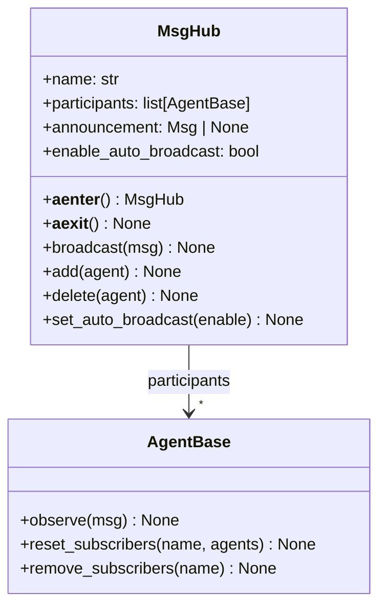

# MsgHub 高级模式

> **Level 6**: 能修改小功能
> **前置要求**: [多 Agent 协作模式](./08-multi-agent-patterns.md)
> **后续章节**: [A2A 协议详解](./08-a2a-protocol.md)

---

## 学习目标

学完本章后，你能：
- 理解 MsgHub 作为上下文管理器的设计
- 掌握自动广播与手动广播的切换
- 动态添加/删除参与者
- 实现复杂的发布-订阅场景

---

## 背景问题

当多个 Agent 需要相互通信时，手动管理订阅关系会变得复杂：
```python
# 手动订阅：每次都要写这么多
x1 = agent1()
agent2.observe(x1)
agent3.observe(x1)

x2 = agent2()
agent1.observe(x2)
agent3.observe(x2)
```

MsgHub 通过上下文管理器自动处理这些订阅关系。

---

## 源码入口

| 项目 | 值 |
|------|-----|
| **文件** | `src/agentscope/pipeline/_msghub.py` |
| **核心类** | `MsgHub` |
| **关键方法** | `broadcast()`, `add()`, `delete()`, `set_auto_broadcast()` |

---

## 架构定位

### MsgHub: 上下文管理器模式的多 Agent 编排

```mermaid
flowchart TB
    subgraph "with MsgHub(participants=[A,B,C]):"
        ENTER[__aenter__<br/>reset_subscribers<br/>broadcast announcement]
        EXEC[Agent 执行<br/>A() / B() / C()]
        EXIT[__aexit__<br/>remove_subscribers]
    end

    ENTER --> EXEC --> EXIT

    subgraph "每个 Agent.__call__() 的 finally 块"
        REPLY[reply() 返回]
        BROADCAST[_broadcast_to_subscribers]
        STRIP[_strip_thinking_blocks]
    end

    REPLY --> STRIP --> BROADCAST
    BROADCAST -->|observe| OTHER[其他 participants]
```

**关键**: MsgHub 不拦截消息、不修改消息、不存储消息。它只在 `__aenter__`/`__aexit__` 时配置 Agent 的订阅关系。消息分发由 Agent 自身的 `_broadcast_to_subscribers`（在 `__call__` 的 `finally` 中）完成。

---

## 核心架构

### MsgHub 设计



### 自动广播原理

**文件**: `_msghub.py:28-50`

```python
async def __aenter__(self) -> "MsgHub":
    """进入 MsgHub 时重置订阅者"""
    self._reset_subscriber()
    if self.announcement is not None:
        await self.broadcast(msg=self.announcement)
    return self

async def __aexit__(self, *args: Any, **kwargs: None) -> None:
    """退出 MsgHub 时清理订阅"""
    if self.enable_auto_broadcast:
        for agent in self.participants:
            agent.remove_subscribers(self.name)
```

### 订阅者管理

**文件**: `_msghub.py:75-95`

```python
def _reset_subscriber(self) -> None:
    """重置所有参与者的订阅者"""
    if self.enable_auto_broadcast:
        for agent in self.participants:
            agent.reset_subscribers(self.name, self.participants)
```

---

## 基本用法

### 自动广播模式

```python
from agentscope.pipeline import MsgHub
from agentscope.agent import ReActAgent

agent1 = ReActAgent(name="Alice", ...)
agent2 = ReActAgent(name="Bob", ...)
agent3 = ReActAgent(name="Charlie", ...)

# 进入 MsgHub：所有参与者相互订阅
with MsgHub(participants=[agent1, agent2, agent3]) as hub:
    # agent1 的回复会自动广播给 agent2 和 agent3
    result1 = await agent1(Msg("user", "Hello", "user"))

    # agent2 的回复也会广播给 agent1 和 agent3
    result2 = await agent2(Msg("user", "Hi", "user"))

# 退出时自动清理订阅
```

### 手动广播模式

```python
with MsgHub(
    participants=[agent1, agent2, agent3],
    enable_auto_broadcast=False,  # 禁用自动广播
) as hub:
    # 只广播特定消息
    await hub.broadcast(Msg("system", "Announcement here", "system"))

    # 或者只发给特定 agent
    # （需要自定义逻辑或直接调用 agent.observe(msg)）
```

---

## 动态管理参与者

### 添加参与者

```python
with MsgHub(participants=[agent1, agent2]) as hub:
    # 动态添加新的参与者
    hub.add(agent3)
    hub.add([agent4, agent5])  # 支持批量添加

    # agent3 现在也会收到广播
    await hub.broadcast(msg)
```

### 删除参与者

```python
with MsgHub(participants=[agent1, agent2, agent3]) as hub:
    # 删除某个参与者
    hub.delete(agent2)

    # 广播时 agent2 不会再收到消息
    await hub.broadcast(msg)
```

### 实现原理

**文件**: `_msghub.py:97-130`

```python
def add(self, new_participant: list[AgentBase] | AgentBase) -> None:
    """添加参与者"""
    if isinstance(new_participant, AgentBase):
        new_participant = [new_participant]

    for agent in new_participant:
        if agent not in self.participants:
            self.participants.append(agent)

    self._reset_subscriber()  # 重置订阅关系

def delete(self, participant: list[AgentBase] | AgentBase) -> None:
    """删除参与者"""
    if isinstance(participant, AgentBase):
        participant = [participant]

    for agent in participant:
        if agent in self.participants:
            self.participants.pop(self.participants.index(agent))
        else:
            logger.warning(...)

    self._reset_subscriber()  # 重置订阅关系
```

---

## 广播机制

### broadcast() 方法

**文件**: `_msghub.py:132-145`

```python
async def broadcast(self, msg: list[Msg] | Msg) -> None:
    """广播消息给所有参与者

    Args:
        msg: 单条消息或消息列表
    """
    for agent in self.participants:
        await agent.observe(msg)
```

### 支持的消息类型

```python
# 广播单条消息
await hub.broadcast(Msg("system", "All agents pay attention", "system"))

# 广播多条消息
await hub.broadcast([
    Msg("system", "Message 1", "system"),
    Msg("system", "Message 2", "system"),
])
```

---

## 初始公告

```python
# 进入 MsgHub 时自动广播公告
with MsgHub(
    participants=[agent1, agent2, agent3],
    announcement=Msg("system", "Conversation starting...", "system"),
) as hub:
    # 公告会在进入时自动广播
    pass  # agents 已经收到了公告
```

---

## 高级用法

### 按组订阅模式

MsgHub 本身不支持组，但可以通过多个 MsgHub 实现：

```python
# 编辑器组
editor_hub = MsgHub(
    participants=[editor1, editor2],
    announcement=Msg("system", "Editor group activated", "system"),
)

# 观众组
viewer_hub = MsgHub(
    participants=[viewer1, viewer2],
    announcement=Msg("system", "Viewer group activated", "system"),
)

# 协同使用
with editor_hub:
    await editor_hub.broadcast(Msg("system", "Editor broadcast", "system"))
```

### 与 Pipeline 组合

```python
from agentscope.pipeline import MsgHub, SequentialPipeline

with MsgHub(participants=[agent1, agent2, agent3]):
    # 在 MsgHub 内使用 Pipeline
    pipeline = SequentialPipeline([sub_agent1, sub_agent2])
    result = await pipeline(initial_msg)

    # Pipeline 的结果也会通过 MsgHub 广播
```

---

## 设计权衡

### 优势

1. **简洁**：无需手动管理订阅关系
2. **自动清理**：上下文管理器确保退出时清理
3. **灵活性**：支持动态添加/删除参与者

### 局限

1. **无消息过滤**：所有消息广播给所有参与者
2. **无优先级**：无法实现消息优先级
3. **无异步队列**：广播是同步等待的

---

## 工程现实与架构问题

### 技术债 (源码级)

| 位置 | 问题 | 影响 | 优先级 |
|------|------|------|--------|
| `_msghub.py:80` | __aenter__ 重置订阅无锁保护 | 并发进入同一 MsgHub 可能导致竞态 | 中 |
| `_msghub.py:97` | _reset_subscriber 无参与者一致性检查 | 添加/删除过程中的状态可能不一致 | 中 |
| `_msghub.py:100` | enable_auto_broadcast=True 时 remove_subscribers 被调用两次 | 重复清理可能导致异常 | 低 |
| `_msghub.py:130` | broadcast 无发送者过滤 | Agent 给自己发的消息也会被广播 | 低 |
| `_msghub.py:145` | add/delete 操作无原子性保证 | 多线程环境下可能导致参与者列表损坏 | 高 |

**[HISTORICAL INFERENCE]**: MsgHub 假设在单线程异步环境中使用，未考虑并发访问场景。随着多 Agent 场景复杂化，并发问题开始显现。

### 性能考量

```python
# MsgHub 开销估算
broadcast(): O(n) n=参与者数量
每个 observe() 调用: ~0.1-1ms
add/delete(): O(n) 需要遍历重置订阅关系

# 100 个参与者的广播
100 × 1ms = 100ms 总开销
```

### 并发访问问题

```python
# 当前问题: 多线程/协程同时操作 MsgHub 可能导致状态不一致
class MsgHub:
    async def add(self, new_participant):
        if isinstance(new_participant, AgentBase):
            new_participant = [new_participant]
        for agent in new_participant:
            self.participants.append(agent)  # 非原子操作
        self._reset_subscriber()  # 如果这里被另一个协程打断

# 解决方案: 添加异步锁
class ThreadSafeMsgHub(MsgHub):
    def __init__(self, *args, **kwargs):
        super().__init__(*args, **kwargs)
        self._lock = asyncio.Lock()

    async def add(self, new_participant):
        async with self._lock:
            await super().add(new_participant)

    async def delete(self, participant):
        async with self._lock:
            await super().delete(participant)
```

### 渐进式重构方案

```python
# 方案 1: 添加参与者验证
class ValidatingMsgHub(MsgHub):
    def add(self, new_participant):
        if isinstance(new_participant, AgentBase):
            new_participant = [new_participant]

        for agent in new_participant:
            if agent in self.participants:
                logger.warning(f"Agent {agent.name} already in participants")
            self.participants.append(agent)

        self._reset_subscriber()

# 方案 2: 添加迭代器安全
class SafeMsgHub(MsgHub):
    def __init__(self, *args, **kwargs):
        super().__init__(*args, **kwargs)
        self._participants_copy = list(self.participants)

    async def broadcast(self, msg):
        # 在 broadcast 期间冻结参与者列表
        participants_snapshot = list(self.participants)
        for agent in participants_snapshot:
            try:
                await agent.observe(msg)
            except Exception as e:
                logger.error(f"observe failed for {agent.name}: {e}")
```

---

## Contributor 指南

### 调试 MsgHub

```python
# 检查参与者列表
with MsgHub(participants=[agent1, agent2, agent3]) as hub:
    print(f"Participants: {[a.name for a in hub.participants]}")
    print(f"Auto broadcast: {hub.enable_auto_broadcast}")

# 检查 agent 的订阅者
# (需要查看 AgentBase 的内部状态)
```

### 常见问题

**问题：消息未收到**
- 确认 agent 在 participants 中
- 确认使用了 `await hub.broadcast()` 而不是只调用 `agent.observe()`

**问题：退出后仍收到消息**
- 确认使用了 `async with MsgHub()` 上下文管理器
- 手动调用 `__aexit__` 清理

### 危险区域

1. **并发 add/delete**：多个协程同时修改 participants 可能导致竞态
2. **broadcast 期间修改 participants**：可能导致某些 agent 收不到消息
3. **__aexit__ 只清理 enable_auto_broadcast=True**：禁用时不会清理订阅

---

## 下一步

接下来学习 [A2A 协议详解](./08-a2a-protocol.md)。


