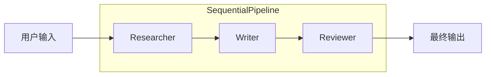
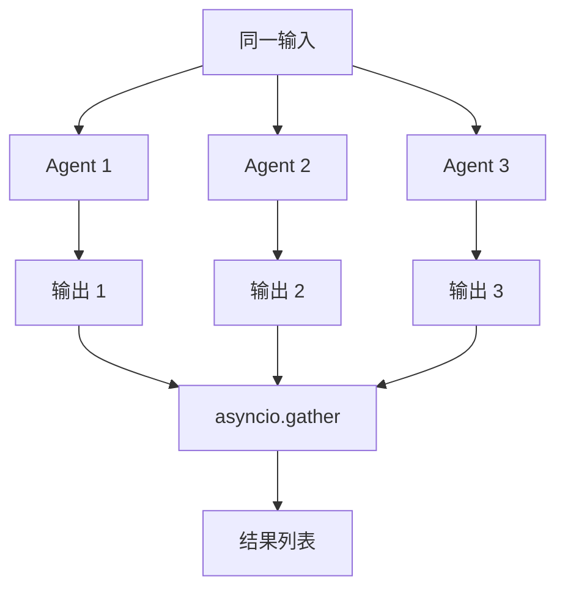
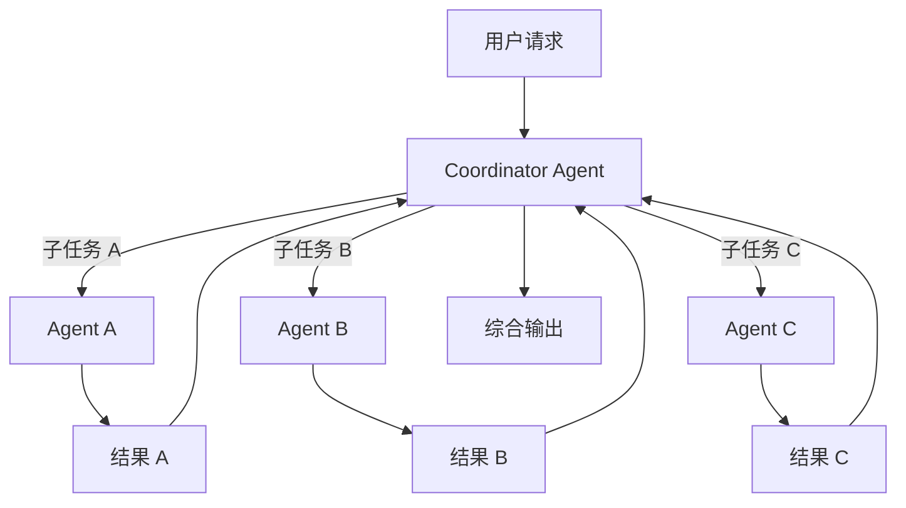

# 多 Agent 协作模式

> **Level 6**: 能修改小功能
> **前置要求**: [RAG 知识库系统](../07-memory-rag/07-rag-knowledge.md)
> **后续章节**: [MsgHub 高级模式](./08-msghub-patterns.md)

---

## 学习目标

学完本章后，你能：
- 理解串行、并行、层次三种协作模式
- 使用 SequentialPipeline 实现流水线
- 使用 FanoutPipeline 实现任务分发
- 选择合适的协作模式解决实际问题

---

## 背景问题

多个 Agent 协作时有不同的交互模式：
1. **串行**：A 的输出是 B 的输入（流水线）
2. **并行**：A/B/C 同时处理同一任务（广播）
3. **层次**：A 协调 B、C 分别处理子任务（分治）

Pipeline 系统提供 `SequentialPipeline` 和 `FanoutPipeline` 来简化这些模式。

---

## 源码入口

| 项目 | 值 |
|------|-----|
| **文件** | `src/agentscope/pipeline/_class.py`, `_functional.py` |
| **核心类** | `SequentialPipeline`, `FanoutPipeline` |
| **核心函数** | `sequential_pipeline()`, `fanout_pipeline()` |

---

## 架构定位

### Pipeline vs MsgHub: 两种多 Agent 编排范式的对比

```mermaid
flowchart LR
    subgraph Pipeline范式_串行
        P_IN[msg] --> P_A[Agent A]
        P_A -->|output| P_B[Agent B]
        P_B -->|output| P_C[Agent C]
        P_C --> P_OUT[result]
    end

    subgraph Pipeline范式_并行
        F_IN[msg] --> F_A[Agent A]
        F_IN --> F_B[Agent B]
        F_IN --> F_C[Agent C]
        F_A --> F_OUT[list[result]]
        F_B --> F_OUT
        F_C --> F_OUT
    end

    subgraph MsgHub范式_对等
        H_A[Agent A] <-->|broadcast/observe| H_B[Agent B]
        H_B <-->|broadcast/observe| H_C[Agent C]
        H_C <-->|broadcast/observe| H_A
    end
```

| 维度 | Pipeline | MsgHub |
|------|----------|--------|
| **消息流** | 单向 (A→B→C 或 1→N) | 双向 (任意 Agent 之间) |
| **控制权** | 外部控制 (Pipeline 编排) | 自治 (Agent 自由交互) |
| **适用场景** | 流水线处理、投票、并行分发 | 辩论、协作、竞争 |
| **实现** | `sequential_pipeline` / `fanout_pipeline` | `MsgHub` context manager |

---

## 协作模式总览

| 模式 | 组件 | 数据流 | 适用场景 |
|------|------|--------|---------|
| 串行 | `SequentialPipeline` | A → B → C | 流水线处理 |
| 并行 | `FanoutPipeline` | A / B / C | 独立任务分发 |
| 层次 | `MsgHub` + 自定义逻辑 | A 协调 | 分工协作 |

---

## 串行模式：SequentialPipeline

**文件**: `src/agentscope/pipeline/_class.py:8-35`

### 设计原理

```python
class SequentialPipeline:
    """顺序执行 Agent 管道

    每个 Agent 的输出传递给下一个 Agent。
    """

    def __init__(self, agents: list[AgentBase]) -> None:
        self.agents = agents

    async def __call__(self, msg: Msg | list[Msg] | None = None) -> Msg | list[Msg] | None:
        for agent in self.agents:
            msg = await agent(msg)
        return msg
```

### 函数式版本

**文件**: `_functional.py:14-45`

```python
async def sequential_pipeline(
    agents: list[AgentBase],
    msg: Msg | list[Msg] | None = None,
) -> Msg | list[Msg] | None:
    """顺序执行管道

    Example:
        msg_output = await sequential_pipeline(
            [agent1, agent2, agent3],
            msg_input
        )
    """
    for agent in agents:
        msg = await agent(msg)
    return msg
```

### 使用示例

```python
from agentscope.agent import ReActAgent
from agentscope.pipeline import SequentialPipeline

# 创建 Agent
researcher = ReActAgent(
    name="Researcher",
    sys_prompt="你是一个研究助手，负责搜索信息。",
    ...
)

writer = ReActAgent(
    name="Writer",
    sys_prompt="你是一个写作助手，负责整理信息写文章。",
    ...
)

reviewer = ReActAgent(
    name="Reviewer",
    sys_prompt="你是一个审校助手，负责检查文章质量。",
    ...
)

# 创建流水线
pipeline = SequentialPipeline([researcher, writer, reviewer])

# 执行
result = await pipeline(Msg("user", "研究量子计算的最新进展", "user"))
# researcher → writer → reviewer → 最终输出
```

### 可视化数据流



---

## 并行模式：FanoutPipeline

**文件**: `src/agentscope/pipeline/_class.py:38-72`

### 设计原理

```python
class FanoutPipeline:
    """并行分发管道

    将同一输入发送给所有 Agent，结果通过 asyncio.gather 收集。
    """

    def __init__(
        self,
        agents: list[AgentBase],
        enable_gather: bool = True,
    ) -> None:
        self.agents = agents
        self.enable_gather = enable_gather

    async def __call__(
        self,
        msg: Msg | list[Msg] | None = None,
        **kwargs: Any,
    ) -> list[Msg]:
        return await fanout_pipeline(
            agents=self.agents,
            msg=msg,
            enable_gather=self.enable_gather,
            **kwargs,
        )
```

### 函数式版本

**文件**: `_functional.py:48-100`

```python
async def fanout_pipeline(
    agents: list[AgentBase],
    msg: Msg | list[Msg] | None = None,
    enable_gather: bool = True,
    **kwargs: Any,
) -> list[Msg]:
    """并行分发管道

    Args:
        enable_gather: True=并发执行, False=顺序执行
    """
    if enable_gather:
        tasks = [
            asyncio.create_task(agent(deepcopy(msg), **kwargs))
            for agent in agents
        ]
        return await asyncio.gather(*tasks)
    else:
        return [await agent(deepcopy(msg), **kwargs) for agent in agents]
```

### 使用示例

```python
from agentscope.agent import ReActAgent
from agentscope.pipeline import FanoutPipeline

# 多个专家同时处理
python_expert = ReActAgent(name="Python Expert", ...)
java_expert = ReActAgent(name="Java Expert", ...)
rust_expert = ReActAgent(name="Rust Expert", ...)

# 创建并行管道
pipeline = FanoutPipeline([python_expert, java_expert, rust_expert])

# 并行执行：同一问题同时问三个专家
results = await pipeline(Msg("user", "解释 async/await", "user"))

# results 是包含三个回复的列表
for expert, result in zip(["Python", "Java", "Rust"], results):
    print(f"{expert}: {result.content}")
```

### 并发 vs 顺序

```python
# 并发执行（默认）
pipeline = FanoutPipeline(agents=[agent1, agent2, agent3])
results = await pipeline(msg)  # 三个 agent 同时运行

# 顺序执行
pipeline = FanoutPipeline(agents=[agent1, agent2, agent3], enable_gather=False)
results = await pipeline(msg)  # 一个接一个运行
```

### 可视化数据流



---

## 层次模式：自定义协调

### 设计原理

层次模式需要一个**协调者 Agent** 来分配任务：



### 实现示例

```python
from agentscope.agent import ReActAgent
from agentscope.pipeline import MsgHub

# 协调者
coordinator = ReActAgent(
    name="Coordinator",
    sys_prompt="""你是一个任务协调者。
    当用户提出复杂任务时，将其分解为子任务，
    分别分配给专家，并综合结果。""",
)

# 专家
researcher = ReActAgent(name="Researcher", ...)
writer = ReActAgent(name="Writer", ...)
critic = ReActAgent(name="Critic", ...)

async def hierarchical_task(msg: Msg) -> Msg:
    # 1. 协调者分析任务
    plan = await coordinator(msg)

    # 2. 根据计划分发子任务
    if "research" in plan.content:
        with MsgHub(participants=[researcher, coordinator]):
            research_result = await researcher(plan)

    # 3. 收集结果并综合
    final = await coordinator(research_result)
    return final
```

---

## 模式对比与选择

| 模式 | 延迟 | 成本 | 适用场景 |
|------|------|------|---------|
| 串行 | 高（累加） | N × 单 Agent | 流水线处理，每步依赖上一步 |
| 并行 | 低（取 max） | N × 单 Agent | 独立任务，同时需要多个结果 |
| 层次 | 中等 | N+1 × 单 Agent | 复杂任务，需要分而治之 |

### 选择指南

**用串行 Pipeline 当**：
- 每个 Agent 的输出是下一个的输入
- 任务有明确的先后顺序
- 如：研究 → 写作 → 审校

**用并行 Pipeline 当**：
- 同一问题需要多个视角
- 子任务相互独立
- 如：多专家评审、多语言翻译

**用层次模式当**：
- 需要动态分解任务
- 子任务数量不固定
- 如：智能调度、复杂工作流

---

## 组合使用

### 串行 + 并行组合

```python
from agentscope.pipeline import SequentialPipeline, FanoutPipeline

# 并行专家评审
review_panel = FanoutPipeline([
    grammar_reviewer,
    style_reviewer,
    fact_reviewer,
])

# 串行流水线
pipeline = SequentialPipeline([
    researcher,
    writer,
    review_panel,  # 并行评审
    editor,        # 综合评审结果编辑
])

result = await pipeline(topic_msg)
```

### Pipeline + MsgHub 组合

```python
from agentscope.pipeline import MsgHub, SequentialPipeline

# 在 MsgHub 内使用 Pipeline
with MsgHub(participants=[agent1, agent2]):
    # Pipeline 结果自动广播
    pipeline = SequentialPipeline([sub1, sub2])
    result = await pipeline(msg)

    # 或者手动广播
    await hub.broadcast(result)
```

---

## 工程实践

### 错误处理

```python
try:
    pipeline = SequentialPipeline([agent1, agent2, agent3])
    result = await pipeline(msg)
except Exception as e:
    # 串行管道中任何一个 agent 失败都会中断
    logger.error(f"Pipeline failed at step: {e}")
    raise
```

### 超时控制

```python
import asyncio

async def pipeline_with_timeout(pipeline, msg, timeout=30):
    try:
        return await asyncio.wait_for(pipeline(msg), timeout=timeout)
    except asyncio.TimeoutError:
        logger.error(f"Pipeline timeout after {timeout}s")
        raise
```

---

## 工程现实与架构问题

### 多 Agent 协作技术债

| 位置 | 问题 | 影响 | 优先级 |
|------|------|------|--------|
| `_class.py:10` | SequentialPipeline 无断点恢复 | 中途失败需从头开始 | 中 |
| `_class.py:43` | FanoutPipeline deepcopy 性能差 | 大消息体复制开销大 | 中 |
| `_class.py:100` | Pipeline 无重试机制 | 单个 Agent 失败导致整体失败 | 高 |
| `_functional.py:14` | sequential_pipeline 无状态保存 | 无法实现管道检查点 | 中 |

**[HISTORICAL INFERENCE]**: Pipeline 设计强调简单性，假设 Agent 是可靠的，逐步添加重试和恢复机制。

### 性能考量

```python
# Pipeline 操作开销估算
SequentialPipeline.forward(): O(n) n=Agent数量
每步延迟: 取决于 Agent.reply() 时间

FanoutPipeline.forward(): O(1) 理论，但受线程池限制
deepcopy(msg): ~1-10ms (取决于消息大小)
asyncio.gather: ~max(各Agent时间)

# 优化建议:
# - 使用 FanoutPipeline 而非串行当顺序不重要
# - 减少 deepcopy 调用频率
```

### 错误处理缺失

```python
# 当前问题: Agent 失败会导致整个 Pipeline 失败
pipeline = SequentialPipeline([agent_a, agent_b, agent_c])
try:
    result = await pipeline(user_msg)
except Exception as e:
    # agent_b 失败，agent_c 根本没有运行
    logger.error(f"Pipeline failed: {e}")

# 期望: 错误恢复机制
class ResilientPipeline:
    def __init__(self, agents, max_retries=3):
        self.agents = agents
        self.max_retries = max_retries

    async def forward(self, msg):
        for i, agent in enumerate(self.agents):
            for attempt in range(self.max_retries):
                try:
                    msg = await agent(msg)
                    break  # 成功，跳到下一个 Agent
                except Exception as e:
                    if attempt == self.max_retries - 1:
                        raise  # 最后一次也失败
                    logger.warning(f"Agent {i} failed, retry {attempt+1}")
```

### 渐进式重构方案

```python
# 方案 1: 添加 Pipeline 断点恢复
class CheckpointPipeline(SequentialPipeline):
    async def forward(self, msg, checkpoint=None):
        start_idx = checkpoint or 0
        for i, agent in enumerate(self.agents[start_idx:], start=start_idx):
            msg = await agent(msg)
            # 保存检查点
            await self._save_checkpoint(i, msg)
        return msg

# 方案 2: 添加并行错误聚合
class FaultTolerantFanout(FanoutPipeline):
    async def forward(self, msg):
        results = await asyncio.gather(
            *[agent(msg) for agent in self.agents],
            return_exceptions=True  # 捕获异常而非抛出
        )
        # 处理错误
        errors = [r for r in results if isinstance(r, Exception)]
        successes = [r for r in results if not isinstance(r, Exception)]
        return {"results": successes, "errors": errors}
```

---

## Contributor 指南

### 添加新 Pipeline 类型

1. 在 `_class.py` 中创建新类
2. 在 `__init__.py` 中导出
3. 实现 `__call__` 方法

### 危险区域

- `FanoutPipeline` 使用 `deepcopy(msg)` 避免状态共享问题
- 串行管道中某个 agent 失败会中断整个流程
- 并行管道的 `enable_gather=False` 不会捕获并发异常

---

## 下一步

接下来学习 [MsgHub 高级模式](./08-msghub-patterns.md)。


