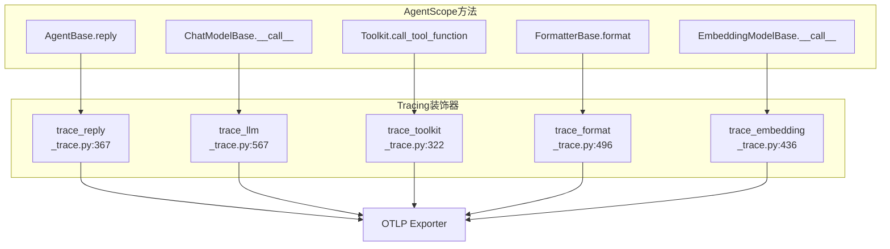

# Tracing 追踪与调试

> **Level 6**: 能修改小功能
> **前置要求**: [A2A 协议详解](./08-a2a-protocol.md)
> **后续章节**: [计划模块](../09-advanced-modules/09-plan-module.md)

---

## 学习目标

学完本章后，你能：
- 理解 AgentScope 的 OpenTelemetry 追踪架构
- 配置 tracing 并理解 span 的生命周期
- 使用 trace 装饰器追踪 agent、llm、toolkit、formatter、embedding 调用
- 解读追踪数据，定位性能瓶颈和错误

---

## 背景问题

当 Agent 系统运行缓慢或出现异常时，如何快速定位问题？传统的 `print` 调试不够用，因为：
1. Agent 调用涉及多个组件（Agent → Formatter → Model → Toolkit）
2. 异步执行让调用链难以追踪
3. 流式输出需要追踪中间状态

Tracing 系统通过 **OpenTelemetry** 为每个操作创建 span，完整记录调用链。

---

## 源码入口

| 项目 | 值 |
|------|-----|
| **目录** | `src/agentscope/tracing/` |
| **核心文件** | `_trace.py`, `_setup.py`, `_extractor.py`, `_attributes.py` |
| **配置** | `src/agentscope/_config.py` 中的 `trace_enabled` |

---

## 架构定位

### Tracing 装饰器在 Agent 调用链中的注入点



**关键**: Tracing 通过 Python 装饰器注入 — 不修改被装饰方法的签名或行为。每个装饰器在 span 中记录输入/输出属性，异常时设置 error status。`_check_tracing_enabled()` 在装饰器入口处检查，未启用时零开销跳过。

---

## 核心架构

### 追踪流程

```mermaid
flowchart TD
    subgraph AgentScope
        AGENT[agent.reply()] --> TRACE_REPLY[trace_reply]
        TRACE_REPLY --> FORMATTER[formatter.format()]
        FORMATTER --> TRACE_FORMAT[trace_format]
        TRACE_FORMAT --> MODEL[model.__call__()]
        MODEL --> TRACE_LLM[trace_llm]
        MODEL -->|Tool Call| TOOLKIT[toolkit.call_tool_function()]
        TOOLKIT --> TRACE_TOOL[trace_toolkit]
    end

    subgraph OpenTelemetry
        TRACE_LLM --> SPAN_LLM[LLM Span]
        TRACE_FORMAT --> SPAN_FORMAT[Formatter Span]
        TRACE_TOOL --> SPAN_TOOL[Tool Span]
        SPAN_LLM --> EXPORTER[OTLP Exporter]
        SPAN_FORMAT --> EXPORTER
        SPAN_TOOL --> EXPORTER
    end
```

### 装饰器类型

| 装饰器 | 追踪对象 | 源码位置 |
|--------|---------|---------|
| `trace_toolkit` | `Toolkit.call_tool_function()` | `_trace.py:322` |
| `trace_reply` | `AgentBase.reply()` | `_trace.py:367` |
| `trace_embedding` | `EmbeddingModelBase.__call__()` | `_trace.py:436` |
| `trace_format` | `FormatterBase.__call__()` | `_trace.py:496` |
| `trace_llm` | `ChatModelBase.__call__()` | `_trace.py:567` |

---

## 配置初始化

### setup_tracing()

**文件**: `src/agentscope/tracing/_setup.py:11-38`

```python
def setup_tracing(endpoint: str) -> None:
    """设置 OpenTelemetry 追踪端点"""
    from opentelemetry import trace
    from opentelemetry.sdk.trace import TracerProvider
    from opentelemetry.sdk.trace.export import BatchSpanProcessor
    from opentelemetry.exporter.otlp.proto.http.trace_exporter import OTLPSpanExporter

    exporter = OTLPSpanExporter(endpoint=endpoint)
    span_processor = BatchSpanProcessor(exporter)

    tracer_provider = trace.get_tracer_provider()
    if isinstance(tracer_provider, TracerProvider):
        tracer_provider.add_span_processor(span_processor)
    else:
        tracer_provider = TracerProvider()
        tracer_provider.add_span_processor(span_processor)
        trace.set_tracer_provider(tracer_provider)
```

### agentscope.init() 中的 tracing

```python
import agentscope

# 方式 1：通过 init 配置
agentscope.init(
    tracing=True,
    tracing_endpoint="http://localhost:4318/v1/traces",
)

# 方式 2：独立 setup
from agentscope.tracing import setup_tracing
setup_tracing(endpoint="http://localhost:4318/v1/traces")
```

---

## trace_reply 装饰器

**文件**: `_trace.py:367-434`

追踪 Agent 的 `reply()` 方法调用：

```python
def trace_reply(
    func: Callable[..., Coroutine[Any, Any, Msg]],
) -> Callable[..., Coroutine[Any, Any, Msg]]:
    """追踪 agent reply 调用"""

    @wraps(func)
    async def wrapper(
        self: "AgentBase",
        *args: Any,
        **kwargs: Any,
    ) -> Msg:
        if not _check_tracing_enabled():
            return await func(self, *args, **kwargs)

        tracer = _get_tracer()
        request_attributes = _get_agent_request_attributes(self, args, kwargs)
        span_name = _get_agent_span_name(request_attributes)

        with tracer.start_as_current_span(
            name=span_name,
            attributes={
                **request_attributes,
                **_get_common_attributes(),
                SpanAttributes.AGENTSCOPE_FUNCTION_NAME: f"{self.__class__.__name__}.{func.__name__}",
            },
            end_on_exit=False,
        ) as span:
            try:
                res = await func(self, *args, **kwargs)
                span.set_attributes(_get_agent_response_attributes(res))
                _set_span_success_status(span)
                return res
            except Exception as e:
                _set_span_error_status(span, e)
                raise e from None

    return wrapper
```

### 属性提取

**文件**: `_extractor.py:447-530`

从 Agent 提取的属性：

| 属性名 | 来源 | 说明 |
|--------|------|------|
| `gen_ai.operation_name` | 固定值 | `invoke_agent` |
| `gen_ai.agent.id` | `instance.id` | Agent 实例 ID |
| `gen_ai.agent.name` | `instance.name` | Agent 名称 |
| `gen_ai.agent.description` | `inspect.getdoc()` | Agent 类文档 |
| `gen_ai.input_messages` | `Msg` 序列化 | 输入消息 |
| `agentscope.function.input` | args/kwargs | 完整输入参数 |

---

## trace_llm 装饰器

**文件**: `_trace.py:567-642`

追踪 Model 的 `__call__()` 方法：

```python
def trace_llm(
    func: Callable[..., Coroutine[Any, Any, ChatResponse | AsyncGenerator[ChatResponse, None]]],
) -> Callable[..., Coroutine[Any, Any, ChatResponse | AsyncGenerator[ChatResponse, None]]]:
    """追踪 LLM 调用"""

    @wraps(func)
    async def async_wrapper(
        self: ChatModelBase,
        *args: Any,
        **kwargs: Any,
    ) -> ChatResponse | AsyncGenerator[ChatResponse, None]:
        if not _check_tracing_enabled():
            return await func(self, *args, **kwargs)

        tracer = _get_tracer()
        request_attributes = _get_llm_request_attributes(self, args, kwargs)
        span_name = _get_llm_span_name(request_attributes)

        with tracer.start_as_current_span(
            name=span_name,
            attributes={**request_attributes, **_get_common_attributes()},
            end_on_exit=False,
        ) as span:
            try:
                res = await func(self, *args, **kwargs)
                if isinstance(res, AsyncGenerator):
                    return _trace_async_generator_wrapper(res, span)
                span.set_attributes(_get_llm_response_attributes(res))
                _set_span_success_status(span)
                return res
            except Exception as e:
                _set_span_error_status(span, e)
                raise e from None

    return async_wrapper
```

### LLM 请求属性

**文件**: `_extractor.py:90-165`

```python
def _get_llm_request_attributes(instance, args, kwargs) -> Dict[str, Any]:
    return {
        # 必需属性
        SpanAttributes.GEN_AI_OPERATION_NAME: OperationNameValues.CHAT,
        SpanAttributes.GEN_AI_PROVIDER_NAME: _get_provider_name(instance),
        SpanAttributes.GEN_AI_REQUEST_MODEL: instance.model_name,

        # 可选生成参数
        SpanAttributes.GEN_AI_REQUEST_TEMPERATURE: kwargs.get("temperature"),
        SpanAttributes.GEN_AI_REQUEST_TOP_P: kwargs.get("p") or kwargs.get("top_p"),
        SpanAttributes.GEN_AI_REQUEST_TOP_K: kwargs.get("top_k"),
        SpanAttributes.GEN_AI_REQUEST_MAX_TOKENS: kwargs.get("max_tokens"),

        # 工具定义
        SpanAttributes.GEN_AI_TOOL_DEFINITIONS: _get_tool_definitions(
            tools=kwargs.get("tools"),
            tool_choice=kwargs.get("tool_choice"),
        ),
    }
```

### Provider 识别

**文件**: `_extractor.py:40-85`

通过类名和 base_url 识别模型提供商：

```python
_CLASS_NAME_MAP = {
    "dashscope": ProviderNameValues.DASHSCOPE,
    "openai": ProviderNameValues.OPENAI,
    "anthropic": ProviderNameValues.ANTHROPIC,
    "gemini": ProviderNameValues.GCP_GEMINI,
    "ollama": ProviderNameValues.OLLAMA,
    "deepseek": ProviderNameValues.DEEPSEEK,
}

_BASE_URL_PROVIDER_MAP = [
    ("api.openai.com", ProviderNameValues.OPENAI),
    ("dashscope", ProviderNameValues.DASHSCOPE),
    ("deepseek", ProviderNameValues.DEEPSEEK),
    ("moonshot", ProviderNameValues.MOONSHOT),
    ("generativelanguage.googleapis.com", ProviderNameValues.GCP_GEMINI),
    ("openai.azure.com", ProviderNameValues.AZURE_AI_OPENAI),
]
```

---

## trace_toolkit 装饰器

**文件**: `_trace.py:220-285`

追踪工具调用：

```python
def trace_toolkit(
    func: Callable[..., AsyncGenerator[ToolResponse, None]],
) -> Callable[..., Coroutine[Any, Any, AsyncGenerator[ToolResponse, None]]]:
    """追踪 toolkit.call_tool_function() 调用"""

    @wraps(func)
    async def wrapper(
        self: Toolkit,
        tool_call: ToolUseBlock,
    ) -> AsyncGenerator[ToolResponse, None]:
        if not _check_tracing_enabled():
            return func(self, tool_call=tool_call)

        tracer = _get_tracer()
        request_attributes = _get_tool_request_attributes(self, tool_call)
        span_name = _get_tool_span_name(request_attributes)

        with tracer.start_as_current_span(
            name=span_name,
            attributes={**request_attributes, **_get_common_attributes()},
            end_on_exit=False,
        ) as span:
            try:
                res = func(self, tool_call=tool_call)
                return _trace_async_generator_wrapper(res, span)
            except Exception as e:
                _set_span_error_status(span, e)
                raise e from None

    return wrapper
```

### 工具属性提取

**文件**: `_extractor.py:295-350`

```python
def _get_tool_request_attributes(instance, tool_call) -> Dict[str, str]:
    attributes = {
        SpanAttributes.GEN_AI_OPERATION_NAME: OperationNameValues.EXECUTE_TOOL,
    }

    if tool_call:
        tool_name = tool_call.get("name")
        attributes[SpanAttributes.GEN_AI_TOOL_CALL_ID] = tool_call.get("id")
        attributes[SpanAttributes.GEN_AI_TOOL_NAME] = tool_name
        attributes[SpanAttributes.GEN_AI_TOOL_CALL_ARGUMENTS] = _serialize_to_str(
            tool_call.get("input")
        )

        # 从工具的 JSON Schema 提取描述
        if tool_name:
            if tool := getattr(instance, "tools", {}).get(tool_name):
                if tool_func := getattr(tool, "json_schema", {}).get("function", {}):
                    attributes[SpanAttributes.GEN_AI_TOOL_DESCRIPTION] = tool_func.get("description")

    return attributes
```

---

## Span 属性定义

**文件**: `src/agentscope/tracing/_attributes.py`

### SpanAttributes 枚举

| 属性 | 说明 | 适用于 |
|------|------|--------|
| `GEN_AI_OPERATION_NAME` | 操作类型 | 所有 |
| `GEN_AI_PROVIDER_NAME` | 模型提供商 | LLM |
| `GEN_AI_REQUEST_MODEL` | 模型名称 | LLM, Embedding |
| `GEN_AI_REQUEST_TEMPERATURE` | 温度参数 | LLM |
| `GEN_AI_REQUEST_MAX_TOKENS` | 最大 token 数 | LLM |
| `GEN_AI_TOOL_DEFINITIONS` | 工具定义 | LLM |
| `GEN_AI_TOOL_CALL_ID` | 工具调用 ID | Tool |
| `GEN_AI_TOOL_NAME` | 工具名称 | Tool |
| `GEN_AI_TOOL_CALL_ARGUMENTS` | 工具参数 | Tool |
| `GEN_AI_INPUT_MESSAGES` | 输入消息 | Agent |
| `GEN_AI_OUTPUT_MESSAGES` | 输出消息 | Agent, LLM |
| `GEN_AI_USAGE_INPUT_TOKENS` | 输入 token 数 | LLM |
| `GEN_AI_USAGE_OUTPUT_TOKENS` | 输出 token 数 | LLM |
| `AGENTSCOPE_FUNCTION_NAME` | 函数全名 | 所有 |
| `AGENTSCOPE_FUNCTION_INPUT` | 函数输入 | 所有 |
| `AGENTSCOPE_FUNCTION_OUTPUT` | 函数输出 | 所有 |

### OperationNameValues

```python
class OperationNameValues:
    CHAT = "chat"                      # LLM 调用
    INVOKE_AGENT = "invoke_agent"      # Agent 调用
    EXECUTE_TOOL = "execute_tool"      # 工具执行
    FORMATTER = "formatter"            # 格式化器
    INVOKE_GENERIC_FUNCTION = "invoke_generic_function"  # 通用函数
    EMBEDDINGS = "embeddings"          # Embedding 调用
```

---

## 使用示例

### 基本配置

```python
import agentscope

# 初始化并启用追踪
agentscope.init(
    model="gpt-4",
    api_key=os.environ.get("OPENAI_API_KEY"),
    tracing=True,
    tracing_endpoint="http://localhost:4318/v1/traces",  # OTLP HTTP endpoint
)

# Agent 运行的所有操作都会被追踪
agent = ReActAgent(...)
result = await agent(Msg("user", "你好", "user"))
```

### 自定义追踪装饰器

```python
from agentscope.tracing import trace

@trace(name="my_custom_operation")
async def my_custom_function(data: dict) -> dict:
    """自定义函数的追踪"""
    # 处理逻辑
    return result
```

### 追踪输出结构

在 tracing endpoint 收到的 span 数据：

```json
{
  "name": "chat gpt-4",
  "attributes": {
    "gen_ai.operation_name": "chat",
    "gen_ai.provider.name": "openai",
    "gen_ai.request.model": "gpt-4",
    "gen_ai.request.temperature": 0.7,
    "gen_ai.request.max_tokens": 1024,
    "gen_ai.tool_definitions": "[{\"type\": \"function\", \"name\": \"search\", ...}]",
    "gen_ai.usage.input_tokens": 150,
    "gen_ai.usage.output_tokens": 82,
    "gen_ai.output_messages": "[{\"role\": \"assistant\", \"parts\": [...]}",
    "agentscope.function.input": "{\"args\": [], \"kwargs\": {...}}",
    "agentscope.function.output": "..."
  },
  "status": { "code": 0 }
}
```

---

## 调试指南

### 常见问题

**问题：tracing 不生效**
- 检查 `tracing=True` 是否设置
- 确认 endpoint URL 正确（OTLP HTTP 格式）
- 验证 `_config.trace_enabled` 为 True

```python
from agentscope import _config
print(f"Tracing enabled: {_config.trace_enabled}")
```

**问题：部分 span 缺失**
- 确认使用了 `@trace_reply` 等装饰器
- 检查 `_check_tracing_enabled()` 返回值

### 性能影响

- Tracing 本身有少量开销（约 1-5ms per span）
- 使用 `BatchSpanProcessor` 批量导出减少网络开销
- 生产环境可设置 `tracing=False` 禁用

---

## 工程现实与架构问题

### 追踪系统技术债

| 位置 | 问题 | 影响 | 优先级 |
|------|------|------|--------|
| `_setup.py:8` | setup_tracing 是全局单例 | 难以测试、不支持多实例 | 中 |
| `_trace.py:318` | trace_reply 嵌套 span 可能重复 | 调试信息混乱 | 低 |
| `_extractor.py:90` | LLM 请求属性提取依赖私有 API | API 变更可能破坏 | 中 |

**[HISTORICAL INFERENCE]**: 追踪系统是后期添加的功能，设计时未考虑多 Agent 场景的分布式追踪需求。

### 性能考量

```python
# 追踪开销估算
1. Span 创建: ~0.1ms
2. 属性提取: ~1ms (取决于属性复杂度)
3. 批量导出: ~10ms (网络延迟)

# 建议: 避免在高频调用路径添加细粒度 span
```

### 渐进式重构方案

```python
# 方案 1: 支持多实例追踪器
class TracingManager:
    _instances: dict[str, TracingConfig]

    @classmethod
    def get_instance(cls, name: str) -> TracingConfig: ...

# 方案 2: 异步属性提取
async def extract_attributes_async(
    span: Span,
    event_type: str,
    data: Any,
) -> None:
    # 在后台线程池执行，避免阻塞主流程
    loop = asyncio.get_event_loop()
    await loop.run_in_executor(None, extract_attributes, span, event_type, data)
```

---

## Contributor 指南

### 添加新的追踪装饰器

1. 在 `_trace.py` 中创建新装饰器函数
2. 在 `_extractor.py` 中实现 `_*_request_attributes()` 和 `_*_response_attributes()`
3. 在 `_attributes.py` 中添加新的 `SpanAttributes` 常量
4. 在 `__init__.py` 中导出新装饰器

### 危险区域

- `_config.trace_enabled` 是全局状态，多线程环境下需注意
- 避免在 `__aenter__`/`__aexit__` 中创建 span，可能导致嵌套问题

---

## 下一步

接下来学习 [计划模块](../09-advanced-modules/09-plan-module.md)。


