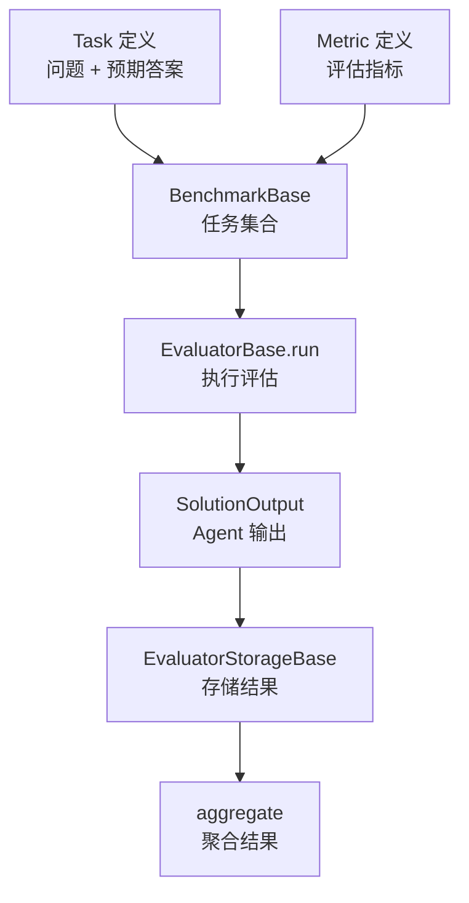
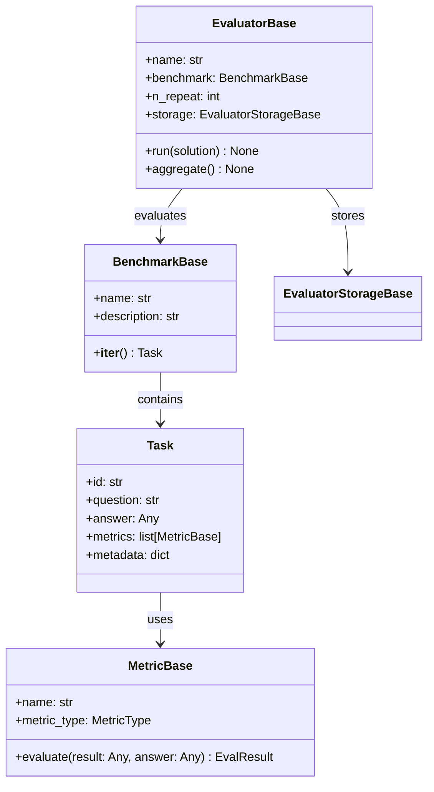

# Evaluate 评估系统

> **Level 7**: 能独立开发模块
> **前置要求**: [TTS 语音合成](./09-tts-system.md)
> **后续章节**: [Tuner 调优系统](./09-tuner-system.md)

---

## 学习目标

学完本章后，你能：
- 理解 EvaluatorBase 的评估流程设计
- 掌握 Task、Benchmark、Metric 的关系
- 理解 GeneralEvaluator 和 RayEvaluator 的适用场景
- 知道如何使用 EvaluatorStorageBase 存储评估结果

---

## 背景问题

当 Agent 开发完成后，如何客观评价其性能？需要一套评估框架来：
1. 定义评估任务（Task）
2. 指定评估指标（Metric）
3. 执行评估并收集结果
4. 存储和聚合结果

Evaluate 系统就是解决这个问题的组件。

---

## 源码入口

| 项目 | 值 |
|------|-----|
| **目录** | `src/agentscope/evaluate/` |
| **核心类** | `EvaluatorBase`, `Task`, `BenchmarkBase`, `MetricType` |
| **关键方法** | `run()`, `aggregate()` |

---

## 核心架构

### 评估流程



### 核心类关系



---

## 核心类详解

### EvaluatorBase

**文件**: `src/agentscope/evaluate/_evaluator/_evaluator_base.py:18-64`

```python
class EvaluatorBase:
    def __init__(
        self,
        name: str,
        benchmark: BenchmarkBase,
        n_repeat: int,
        storage: EvaluatorStorageBase,
    ) -> None:
        """初始化评估器"""
```

**核心职责**：
1. 管理评估生命周期（run → aggregate）
2. 遍历 Benchmark 中的所有 Task
3. 收集 SolutionOutput 并存储

### run() 方法

**文件**: `_evaluator_base.py:48-63`

```python
@abstractmethod
async def run(
    self,
    solution: Callable[[Task, Callable], Coroutine[Any, Any, SolutionOutput]],
) -> None:
    """运行评估的核心方法"""
```

`solution` 是一个 async 函数，输入 Task，返回 Agent 的输出。

### aggregate() 方法

**文件**: `_evaluator_base.py:96-304`

```python
async def aggregate(self) -> None:
    """聚合评估结果"""
    # 1. 遍历 n_repeat 次
    # 2. 对每个 Task 收集指标
    # 3. 聚合 CATEGORY 类型指标的分布
    # 4. 聚合 NUMERICAL 类型指标的 mean/max/min
    # 5. 保存到 storage
```

---

## MetricType 枚举

**文件**: `src/agentscope/evaluate/_metric_base.py`

```python
class MetricType(Enum):
    CATEGORY = "category"    # 分类指标（如：正确/错误）
    NUMERICAL = "numerical"  # 数值指标（如：评分 0-100）
```

---

## Evaluator 实现

### GeneralEvaluator

**文件**: `src/agentscope/evaluate/_evaluator/_general_evaluator.py`

单进程评估器，适用于：
- 小规模评测（< 100 tasks）
- 调试阶段
- 无需并行加速的场景

### RayEvaluator

**文件**: `src/agentscope/evaluate/_evaluator/_ray_evaluator.py`

基于 Ray 的分布式评估器，适用于：
- 大规模评测（1000+ tasks）
- 需要并行加速
- 集群环境

---

## EvaluatorStorageBase

**文件**: `src/agentscope/evaluate/_evaluator_storage/_evaluator_storage_base.py`

```python
class EvaluatorStorageBase(ABC):
    def save_evaluation_meta(self, meta: dict) -> None: ...
    def save_task_meta(self, task_id: str, meta: dict) -> None: ...
    def save_solution_stats(self, task_id: str, repeat_id: str, stats: dict) -> None: ...
    def save_evaluation_result(self, task_id: str, repeat_id: str, metric_name: str, result: EvalResult) -> None: ...
    def get_evaluation_result(self, task_id: str, repeat_id: str, metric_name: str) -> EvalResult: ...
    def save_aggregation_result(self, meta_info: dict) -> None: ...
```

**FileEvaluatorStorage**: 基于文件的存储实现

---

## 使用示例

### 定义 Task 和 Metric

```python
from agentscope.evaluate import Task, MetricBase, MetricType

# 定义任务
task = Task(
    id="math_001",
    question="1+1=?",
    answer="2",
    metrics=[
        MetricBase(name="exact_match", metric_type=MetricType.CATEGORY),
    ]
)

# Agent 解决方案
async def my_solution(task: Task, callback) -> SolutionOutput:
    response = await agent(Msg("user", task.question, "user"))
    return SolutionOutput(result=response.content)
```

### 运行评估

```python
from agentscope.evaluate import GeneralEvaluator, FileEvaluatorStorage

storage = FileEvaluatorStorage(output_dir="./eval_results")
evaluator = GeneralEvaluator(
    name="math_eval",
    benchmark=benchmark,
    n_repeat=3,
    storage=storage,
)

# 执行评估
await evaluator.run(my_solution)

# 聚合结果
await evaluator.aggregate()
```

---

## 工程现实与架构问题

### 技术债 (源码级)

| 位置 | 问题 | 影响 | 优先级 |
|------|------|------|--------|
| `_general_evaluator.py:80` | n_repeat 失败无部分结果保存 | 整个评估失败会导致之前的运行结果丢失 | 高 |
| `_ray_evaluator.py:100` | Ray 集群无连接健康检查 | 集群节点宕机时任务可能永久挂起 | 高 |
| `_evaluator_base.py:150` | aggregate 无增量计算支持 | 重新运行需要完整重算 | 中 |
| `_file_evaluator_storage.py:50` | 文件存储无写入验证 | 磁盘满时静默失败 | 中 |
| `_evaluator_base.py:200` | Task 失败无重试机制 | 单个 Task 失败影响整体评估 | 中 |

**[HISTORICAL INFERENCE]**: Evaluate 系统设计时假设评估是短时间完成的实验环境，生产中需要的容错和增量计算是后来发现的需求。

### 性能考量

```python
# 评估操作开销
GeneralEvaluator: O(n × m) n=Task数, m=n_repeat
RayEvaluator: O(n × m / k) k=Ray 集群节点数

# 单 Task 评估延迟
快速 Task (简单问题): ~1-5s
中等 Task (需要工具): ~10-30s
复杂 Task (多轮对话): ~60-300s

# 1000 Task × 3 repeat × 10s/Task = ~2.5小时 (串行)
```

### Ray 集群故障问题

```python
# 当前问题: Ray 节点故障无自动恢复
class RayEvaluator(EvaluatorBase):
    async def run(self, solution):
        # 任务分发后，如果节点故障，任务可能永久挂起
        ray.get(task_refs)  # 一直等待

# 解决方案: 添加超时和重试
class RobustRayEvaluator(RayEvaluator):
    async def run(self, solution, task_timeout=300, max_retries=2):
        task_refs = self._distribute_tasks(solution)

        for i, ref in enumerate(task_refs):
            for attempt in range(max_retries):
                try:
                    result = await asyncio.wait_for(
                        ray.get(ref),
                        timeout=task_timeout
                    )
                    break
                except asyncio.TimeoutError:
                    logger.warning(f"Task {i} timed out, retry {attempt+1}")
                    ref = self._resubmit_task(ref)

        await self.aggregate()
```

### 渐进式重构方案

```python
# 方案 1: 添加部分结果保存
class CheckpointingEvaluator(EvaluatorBase):
    def __init__(self, *args, checkpoint_interval=10, **kwargs):
        super().__init__(*args, **kwargs)
        self._checkpoint_interval = checkpoint_interval

    async def run(self, solution):
        completed = 0
        for i, task in enumerate(self.benchmark):
            result = await self._evaluate_task(task, solution)

            # 每个 checkpoint_interval 保存一次
            if (i + 1) % self._checkpoint_interval == 0:
                await self._save_checkpoint(i, result)

            completed += 1

        await self.aggregate()

# 方案 2: 添加增量 aggregate
class IncrementalAggregateEvaluator(EvaluatorBase):
    def __init__(self, *args, **kwargs):
        super().__init__(*args, **kwargs)
        self._partial_results: dict[str, list] = {}

    async def run(self, solution):
        for task in self.benchmark:
            result = await self._evaluate_task(task, solution)
            self._partial_results[task.id].append(result)

    async def aggregate(self, incremental: bool = True):
        if incremental and self._partial_results:
            # 只聚合新结果
            return self._incrementally_aggregate()
        return await super().aggregate()
```

---

## Contributor 指南

### 调试评估问题

```python
# 1. 检查 Task 定义
print(f"Task count: {len(benchmark)}")
for task in benchmark:
    print(f"Task {task.id}: {task.question}")

# 2. 检查 Metric 配置
for task in benchmark:
    for metric in task.metrics:
        print(f"Metric: {metric.name}, type: {metric.metric_type}")

# 3. 检查存储结果
result = storage.get_evaluation_result(task_id, repeat_id, metric_name)
print(f"Result: {result.result}, score: {result.score}")
```

### 常见问题

**问题：评估结果为空**
- 检查 solution 函数是否正确返回 SolutionOutput
- 确认 storage 目录有写入权限

**问题：RayEvaluator 启动失败**
- 确认 Ray 已安装：`pip install ray`
- 检查集群配置是否正确

### 危险区域

1. **n_repeat 失败不保存部分结果**：需要实现检查点机制
2. **Ray 集群无健康检查**：需要添加超时和重试
3. **Task 失败无重试**：单个失败影响整体评估

---

## 下一步

接下来学习 [Tuner 调优系统](./09-tuner-system.md)。


