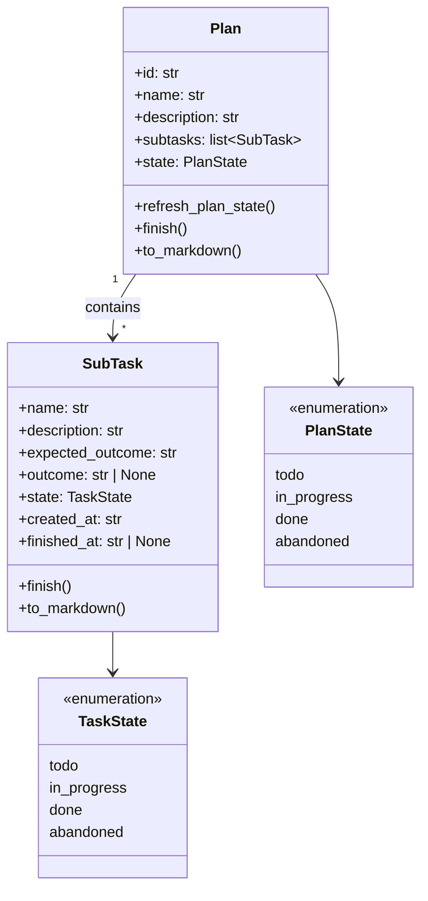
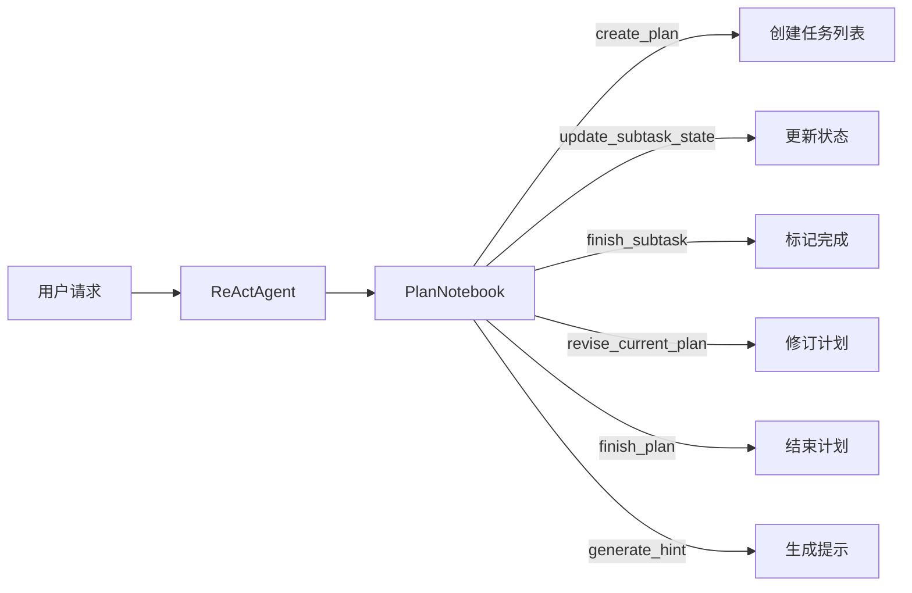
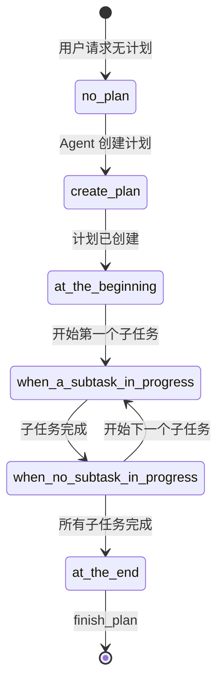

# Plan 规划模块

> **Level 7**: 能独立开发模块
> **前置要求**: [Tracing 追踪与调试](../08-multi-agent/08-tracing-debugging.md)
> **后续章节**: [Session 会话管理](./09-session-management.md)

---

## 学习目标

学完本章后，你能：
- 理解 Plan 和 SubTask 的数据模型设计
- 掌握 PlanNotebook 的计划管理机制
- 理解 DefaultPlanToHint 的提示生成策略
- 知道如何为 Agent 集成规划能力

---

## 背景问题

当 Agent 处理复杂任务时（如"写一个网站"或"做深度研究"），需要一个**规划系统**来：
1. 将复杂任务分解为子任务
2. 跟踪每个子任务的状态
3. 在执行过程中动态调整计划
4. 生成引导 Agent 行为的提示

Plan 模块就是解决这个问题的组件。

---

## 源码入口

| 项目 | 值 |
|------|-----|
| **目录** | `src/agentscope/plan/` |
| **核心类** | `PlanNotebook`, `Plan`, `SubTask` |
| **核心文件** | `_plan_notebook.py`, `_plan_model.py` |

---

## 核心架构

### Plan 数据模型



---

## Plan 模型

**文件**: `src/agentscope/plan/_plan_model.py:104-200`

```python
class Plan(BaseModel):
    id: str = Field(default_factory=shortuuid.uuid)
    name: str
    description: str
    expected_outcome: str
    subtasks: list[SubTask]
    state: Literal["todo", "in_progress", "done", "abandoned"]
    created_at: str
    finished_at: str | None
    outcome: str | None

    def refresh_plan_state(self) -> str:
        """根据子任务状态刷新计划状态"""
        # 如果有 in_progress 子任务，Plan 变为 in_progress
        # 如果所有子任务都完成，Plan 变为 done
        ...

    def finish(self, state: Literal["done", "abandoned"], outcome: str):
        """结束计划"""

    def to_markdown(self, detailed: bool = False) -> str:
        """转换为 Markdown 格式"""
```

### SubTask 模型

**文件**: `_plan_model.py:11-101`

```python
class SubTask(BaseModel):
    name: str                        # 子任务名称（不超过10词）
    description: str                 # 详细描述
    expected_outcome: str            # 预期结果
    outcome: str | None             # 实际结果
    state: Literal["todo", "in_progress", "done", "abandoned"]
    created_at: str                 # 创建时间
    finished_at: str | None         # 完成时间

    def finish(self, outcome: str) -> None:
        """标记子任务完成"""

    def to_oneline_markdown(self) -> str:
        """单行 Markdown 格式"""

    def to_markdown(self, detailed: bool = False) -> str:
        """详细 Markdown 格式"""
```

---

## PlanNotebook

**文件**: `src/agentscope/plan/_plan_notebook.py`

PlanNotebook 是计划管理的核心类，提供工具函数给 Agent 调用。

### 核心功能



### 工具函数

PlanNotebook 提供以下工具函数供 Agent 调用：

| 函数 | 说明 |
|------|------|
| `create_plan` | 创建新计划，分解任务 |
| `update_subtask_state` | 更新子任务状态 |
| `finish_subtask` | 标记子任务完成 |
| `revise_current_plan` | 修订当前计划 |
| `finish_plan` | 结束计划 |
| `generate_hint` | 生成下一步提示 |

---

## DefaultPlanToHint

**文件**: `_plan_notebook.py:16-169`

根据计划状态生成不同的提示信息：

### 状态机



### Hint 生成策略

| 状态 | Hint 内容 |
|------|----------|
| `no_plan` | 提示 Agent 需要创建计划 |
| `at_the_beginning` | 提示开始第一个子任务 |
| `when_a_subtask_in_progress` | 显示当前子任务详情，提示执行 |
| `when_no_subtask_in_progress` | 提示开始下一个子任务 |
| `at_the_end` | 提示总结并结束计划 |

---

## 使用示例

### 集成到 Agent

```python
from agentscope.agent import ReActAgent
from agentscope.plan import PlanNotebook

# 创建计划笔记本
plan_notebook = PlanNotebook()

# 创建 Agent，传入计划工具
agent = ReActAgent(
    name="Assistant",
    sys_prompt="你是一个智能助手...",
    toolkit=plan_notebook.to_toolkit(),  # 转换为 Toolkit
    ...
)

# 用户请求复杂任务
result = await agent(Msg(
    "user",
    "帮我研究量子计算的最新进展",
    "user"
))
```

### 手动管理计划

```python
from agentscope.plan import Plan, SubTask

# 创建计划
plan = Plan(
    name="量子计算研究",
    description="研究量子计算的最新进展",
    expected_outcome="一份完整的研究报告",
    subtasks=[
        SubTask(
            name="搜索论文",
            description="使用搜索引擎查找量子计算相关论文",
            expected_outcome="10篇相关论文列表",
        ),
        SubTask(
            name="阅读摘要",
            description="阅读论文摘要，提取关键信息",
            expected_outcome="关键信息摘要笔记",
        ),
        SubTask(
            name="撰写报告",
            description="整理信息，撰写研究报告",
            expected_outcome="完整的研究报告",
        ),
    ]
)

# Agent 执行过程中的状态更新
plan.subtasks[0].state = "done"
plan.subtasks[0].outcome = "找到了15篇相关论文"
plan.subtasks[1].state = "in_progress"

# 刷新计划状态
plan.refresh_plan_state()
```

---

## 存储机制

Plan 模块支持多种存储后端：

| 实现 | 文件 | 说明 |
|------|------|------|
| `InMemoryPlanStorage` | `_in_memory_storage.py` | 内存存储（默认） |
| 自定义 | 实现 `PlanStorageBase` | 可扩展存储 |

### PlanStorageBase 接口

```python
class PlanStorageBase(ABC):
    @abstractmethod
    async def save(self, plan: Plan) -> None: ...

    @abstractmethod
    async def load(self, plan_id: str) -> Plan | None: ...

    @abstractmethod
    async def list_plans(self) -> list[str]: ...
```

---

## 扩展 Plan 模块

### 自定义 Hint 策略

```python
class CustomPlanToHint(DefaultPlanToHint):
    def __call__(self, plan: Plan | None) -> str | None:
        # 自定义提示逻辑
        if plan and len(plan.subtasks) > 5:
            return "这是一个大型任务，请仔细规划每一步。"
        return super().__call__(plan)
```

### 自定义存储

```python
class FilePlanStorage(PlanStorageBase):
    async def save(self, plan: Plan) -> None:
        with open(f"{plan.id}.json", "w") as f:
            json.dump(plan.model_dump(), f)

    async def load(self, plan_id: str) -> Plan | None:
        if os.path.exists(f"{plan_id}.json"):
            with open(f"{plan_id}.json") as f:
                return Plan.model_validate(json.load(f))
        return None
```

---

## 工程现实与架构问题

### 技术债 (源码级)

| 位置 | 问题 | 影响 | 优先级 |
|------|------|------|--------|
| `_plan_notebook.py:50` | InMemoryPlanStorage 无容量限制 | 长时间运行可能导致内存泄漏 | 中 |
| `_plan_notebook.py:80` | 多 Agent 并发修改同一计划无锁 | 竞态条件导致状态不一致 | 高 |
| `_plan_model.py:104` | refresh_plan_state() 每次遍历所有子任务 | O(n) 复杂度，大计划时效率低 | 低 |
| `_plan_notebook.py:120` | DefaultPlanToHint 无状态缓存 | 每次调用都重新计算 | 低 |
| `_plan_model.py:150` | 计划完成后无法重新激活 | abandoned 状态是终态 | 低 |

**[HISTORICAL INFERENCE]**: Plan 模块设计时假设单 Agent 使用场景，暂未考虑多 Agent 并发修改和计划持久化的需求。

### 性能考量

```python
# Plan 操作开销
refresh_plan_state(): O(n) n=子任务数量
create_plan(): O(1) 创建
finish_subtask(): O(1) 更新
to_markdown(): O(n) 序列化

# 内存占用
每个 SubTask: ~1KB (不含 outcome)
1000 个计划 × 平均 5 个子任务 = ~5MB
```

### 并发修改问题

```python
# 当前问题: 多 Agent 可能同时修改同一计划
class PlanNotebook:
    async def update_subtask_state(self, plan_id, task_id, new_state):
        plan = await self.storage.load(plan_id)
        # 如果两个 Agent 同时在这里 load，可能读到相同的 plan
        plan.subtasks[task_id].state = new_state
        await self.storage.save(plan)  # 后写的会覆盖先写的

# 解决方案: 添加乐观锁
class VersionedPlan(Plan):
    version: int = 0

class OptimisticPlanNotebook(PlanNotebook):
    async def update_subtask_state(self, plan_id, task_id, new_state, expected_version):
        plan = await self.storage.load(plan_id)
        if plan.version != expected_version:
            raise ConflictError("Plan was modified by another agent")
        plan.subtasks[task_id].state = new_state
        plan.version += 1
        await self.storage.save(plan)
```

### 渐进式重构方案

```python
# 方案 1: 添加计划过期机制
class ExpiringPlanStorage(InMemoryPlanStorage):
    DEFAULT_TTL = 3600  # 1 小时

    def __init__(self, ttl: int = None):
        super().__init__()
        self._ttl = ttl or self.DEFAULT_TTL
        self._access_times: dict[str, float] = {}

    async def save(self, plan: Plan) -> None:
        await super().save(plan)
        self._access_times[plan.id] = time.time()

    async def load(self, plan_id: str) -> Plan | None:
        plan = await super().load(plan_id)
        if plan and time.time() - self._access_times.get(plan_id, 0) > self._ttl:
            await self.delete(plan_id)
            return None
        return plan

# 方案 2: 添加并发控制
class LockingPlanNotebook(PlanNotebook):
    def __init__(self, storage: PlanStorageBase):
        super().__init__(storage)
        self._locks: dict[str, asyncio.Lock] = {}

    async def _get_lock(self, plan_id: str) -> asyncio.Lock:
        if plan_id not in self._locks:
            self._locks[plan_id] = asyncio.Lock()
        return self._locks[plan_id]

    async def update_subtask_state(self, plan_id, task_id, new_state):
        async with await self._get_lock(plan_id):
            # 现在是原子操作
            ...
```

---

## Contributor 指南

### 调试计划问题

```python
# 1. 检查计划状态
print(f"Plan state: {plan.state}")
print(f"Subtasks: {[s.name for s in plan.subtasks]}")

# 2. 打印 Markdown 表示
print(plan.to_markdown(detailed=True))

# 3. 生成 Hint
hint_generator = DefaultPlanToHint()
print(hint_generator(plan))
```

### 常见问题

**问题：计划状态未正确刷新**
- 确认调用了 `refresh_plan_state()`
- 检查子任务状态是否正确更新

**问题：Hint 提示不准确**
- 检查 `DefaultPlanToHint` 的状态判断逻辑
- 考虑继承并自定义 Hint 策略

### 危险区域

1. **并发修改同一计划**：多 Agent 场景下可能导致状态覆盖
2. **InMemoryPlanStorage 无持久化**：进程重启后所有计划丢失
3. **计划无过期机制**：长时间运行可能导致内存泄漏

---

## 下一步

接下来学习 [Session 会话管理](./09-session-management.md)。


