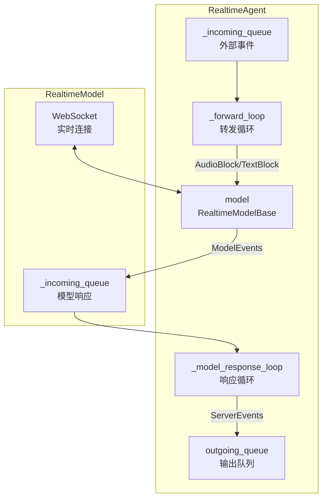
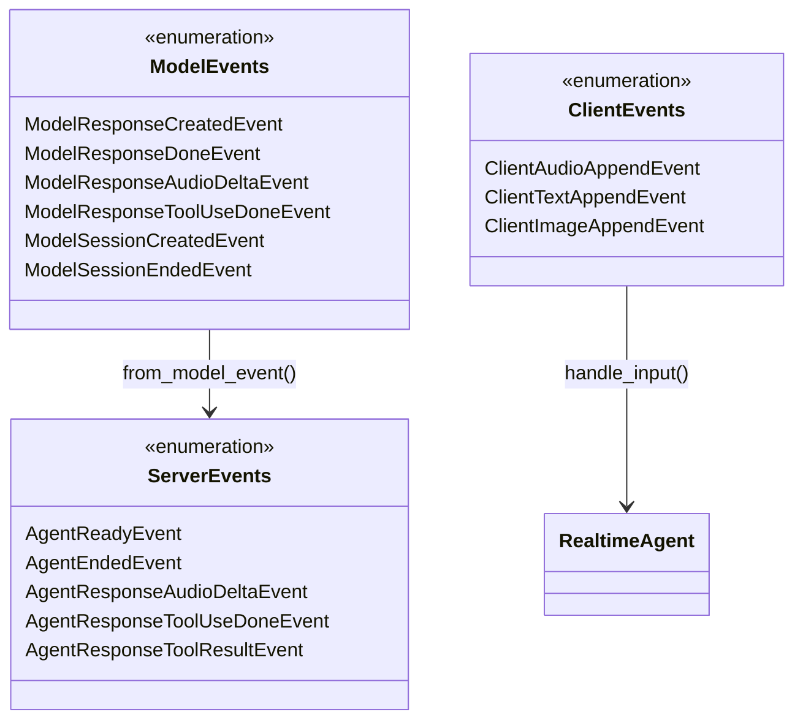

# Realtime 实时语音

> **Level 7**: 能独立开发模块
> **前置要求**: [Session 会话管理](./09-session-management.md)
> **后续章节**: [TTS 语音合成](./09-tts-system.md)

---

## 学习目标

学完本章后，你能：
- 理解 RealtimeAgent 与 AgentBase 的设计差异
- 掌握 RealtimeAgent 的事件驱动架构
- 理解 ModelEvents、ServerEvents、ClientEvents 的事件流
- 知道如何集成 RealtimeAgent 到语音应用

---

## 背景问题

传统 Agent 通过请求-响应模式工作（用户发消息，Agent 回复），但语音助手需要**实时交互**：
1. 用户边说边听（流式输入）
2. Agent 边想边说（流式输出）
3. 双向异步通信

RealtimeAgent 就是解决这个问题的组件。

---

## 源码入口

| 项目 | 值 |
|------|-----|
| **文件路径** | `src/agentscope/agent/_realtime_agent.py` |
| **核心类** | `RealtimeAgent` |
| **模型基类** | `src/agentscope/realtime/_base.py:RealtimeModelBase` |
| **事件系统** | `src/agentscope/realtime/_events/` |

---

## 核心架构

### 架构定位

```mermaid
flowchart TB
    subgraph 文本Agent
        USER_T[用户文本] --> AGENT_T[ReActAgent]
        AGENT_T -->|reply() 循环| LLM_T[LLM]
    end

    subgraph 实时Agent
        USER_A[用户语音] --> STT[STT Engine<br/>语音→文本]
        STT --> AGENT_A[RealtimeAgent<br/>WebSocket连接]
        AGENT_A -->|流式推理| LLM_A[LLM with audio]
        LLM_A -->|audio chunks| TTS_A[TTS Engine<br/>文本→语音]
        TTS_A --> USER_A
    end
```

**关键**: `RealtimeAgent` 不是 `ReActAgent` 的子类——它直接继承 `AgentBase`。它使用 WebSocket 长连接代替请求-响应模式，通过 STT→LLM→TTS 管道实现实时语音对话。

### 与 AgentBase 的设计差异

| 特性 | AgentBase | RealtimeAgent |
|------|-----------|---------------|
| 交互模式 | 请求-响应 | 实时双向 |
| 生命周期 | `reply()` 方法 | `start()`/`stop()` 循环 |
| 消息传递 | 函数返回值 | `Queue` 队列 |
| 适用场景 | 文本对话 | 语音助手、实时聊天 |

### RealtimeAgent 架构



---

## 事件系统

### 三类事件



### ModelEvents → ServerEvents 转换

**源码**: `src/agentscope/agent/_realtime_agent.py:239-305`

```python
match model_event:
    case ModelEvents.ModelResponseCreatedEvent():
        agent_event = ServerEvents.from_model_event(event, **agent_kwargs)

    case ModelEvents.ModelResponseToolUseDoneEvent():
        # 特殊处理：需要执行工具
        done_event = ServerEvents.AgentResponseToolUseDoneEvent(...)
        await outgoing_queue.put(done_event)
        # 异步执行工具
        asyncio.create_task(self._acting(tool_use, outgoing_queue))
```

---

## 核心方法

### start()

**文件**: `_realtime_agent.py:102-124`

```python
async def start(self, outgoing_queue: Queue) -> None:
    """建立实时连接"""
    # 1. 连接实时模型
    await self.model.connect(
        self._model_response_queue,
        instructions=self.sys_prompt,
        tools=self.toolkit.get_json_schemas() if self.toolkit else None,
    )

    # 2. 启动转发循环（外部 → 模型）
    self._external_event_handling_task = asyncio.create_task(
        self._forward_loop(),
    )

    # 3. 启动响应循环（模型 → 外部）
    self._model_response_handling_task = asyncio.create_task(
        self._model_response_loop(outgoing_queue),
    )
```

### _forward_loop()

**文件**: `_realtime_agent.py:134-221`

处理来自前端的外部事件：
- `ClientAudioAppendEvent` → 转换为 `AudioBlock` 发送给模型
- `ClientTextAppendEvent` → 转换为 `TextBlock` 发送给模型
- `ClientImageAppendEvent` → 转换为 `ImageBlock` 发送给模型

### _model_response_loop()

**文件**: `_realtime_agent.py:223-305`

处理模型返回的事件：
- `ModelResponseAudioDeltaEvent` → `AgentResponseAudioDeltaEvent`
- `ModelResponseToolUseDoneEvent` → 执行工具 + 发送结果

### handle_input()

**文件**: `_realtime_agent.py:307-317`

```python
async def handle_input(
    self,
    event: ClientEvents.EventBase | ServerEvents.EventBase,
) -> None:
    """接收外部事件并放入队列"""
    await self._incoming_queue.put(event)
```

---

## RealtimeModelBase

**文件**: `src/agentscope/realtime/_base.py:13-66`

```python
class RealtimeModelBase:
    model_name: str
    support_input_modalities: list[str]
    websocket_url: str
    input_sample_rate: int
    output_sample_rate: int

    @abstractmethod
    async def send(
        self,
        data: AudioBlock | TextBlock | ImageBlock | ToolResultBlock,
    ) -> None: ...

    async def connect(
        self,
        outgoing_queue: Queue,
        instructions: str,
        tools: list[dict] | None = None,
    ) -> None: ...
```

### 实现类

| 模型 | 文件 | 特点 |
|------|------|------|
| `DashScopeRealtimeModel` | `_dashscope_realtime_model.py` | 阿里云 Qwen-Omni |
| `OpenAIRealtimeModel` | `_openai_realtime_model.py` | OpenAI GPT-4o Audio |
| `GeminiRealtimeModel` | `_gemini_realtime_model.py` | Google Gemini |

---

## 使用示例

### 基本用法

```python
import asyncio
import os
from agentscope.agent import RealtimeAgent
from agentscope.realtime import DashScopeRealtimeModel

async def main():
    # 创建实时 Agent
    agent = RealtimeAgent(
        name="VoiceBot",
        sys_prompt="你是一个友好的语音助手。",
        model=DashScopeRealtimeModel(
            model_name="qwen3-omni-flash-realtime",
            api_key=os.environ.get("DASHSCOPE_API_KEY"),
        ),
        toolkit=my_toolkit,
    )

    # 创建输出队列
    outgoing_queue = asyncio.Queue()

    # 启动 Agent
    await agent.start(outgoing_queue)

    # 在另一个任务中处理输出
    async def handle_output():
        while True:
            event = await outgoing_queue.get()
            print(f"收到事件: {type(event)}")
            # 根据事件类型处理音频/文本/工具调用

    asyncio.create_task(handle_output())

    # 发送用户输入
    await agent.handle_input(
        ClientEvents.ClientTextAppendEvent(text="你好")
    )

    # 停止
    await agent.stop()

asyncio.run(main())
```

### WebSocket 服务器集成

```python
from quart import websocket

@app.websocket("/ws/agent")
async def agent_websocket():
    while True:
        data = await websocket.receive()
        event = parse_client_event(data)
        await agent.handle_input(event)

        # 接收 agent 输出
        while not outgoing_queue.empty():
            server_event = await outgoing_queue.get()
            await websocket.send(server_event.to_json())
```

---

## 工具调用

RealtimeAgent 支持在实时交互中调用工具：

```python
async def _acting(
    self,
    tool_use: ToolUseBlock,
    outgoing_queue: Queue,
) -> None:
    """执行工具并发送结果"""
    if not self.toolkit:
        return

    # 执行工具
    res = await self.toolkit.call_tool_function(tool_use)

    # 流式处理结果
    last_chunk = None
    async for chunk in res:
        last_chunk = chunk

    if last_chunk:
        # 发送结果给模型（让它继续处理）
        tool_result_block = ToolResultBlock(...)
        await self.model.send(tool_result_block)

        # 同时通知前端
        outgoing_event = ServerEvents.AgentResponseToolResultEvent(...)
        await outgoing_queue.put(outgoing_event)
```

---

## 工程现实与架构问题

### RealtimeAgent 技术债

| 位置 | 问题 | 影响 | 优先级 |
|------|------|------|--------|
| `_realtime_agent.py:1` | 单文件超过 1500 行 | 难以维护 | 高 |
| `_realtime_agent.py:500` | WebSocket 重连逻辑缺失 | 长会话不稳定 | 高 |
| `_realtime_agent.py:600` | 音频缓冲区管理不完善 | 可能出现音频卡顿 | 中 |
| `_realtime_agent.py:700` | 缺乏背压处理机制 | 快速输入时队列堆积 | 中 |

**[HISTORICAL INFERENCE]**: RealtimeAgent 是为了快速上线语音助手功能而紧急开发的，技术债务积累较多。

### 性能考量

```python
# 实时语音延迟分解
ASR (语音识别): ~100-300ms
LLM 推理: ~200-500ms (取决于模型)
TTS (语音合成): ~100-200ms
网络传输: ~50-100ms

# 总延迟: ~450-1100ms (约 0.5-1.1 秒)

# 关键优化点:
# - streaming TTS 可将首字节延迟降至 ~200ms
# - VAD (语音活动检测) 可减少无效等待
```

### 渐进式重构方案

```python
# 方案 1: 拆分大文件
# realtime/
#   __init__.py
#   _agent_base.py        # 基本 Agent 逻辑
#   _websocket_handler.py # WebSocket 连接管理
#   _audio_pipeline.py   # 音视频管道
#   _tts_engine.py       # TTS 引擎抽象
#   _stt_engine.py       # STT 引擎抽象

# 方案 2: 添加背压机制
class BackpressureQueue:
    def __init__(self, max_size: int = 100):
        self._queue: asyncio.Queue = asyncio.Queue(maxsize=max_size)
        self._dropped: int = 0

    async def put(self, item):
        if self._queue.full():
            self._dropped += 1
            return  # 或替换最旧的
        await self._queue.put(item)
```

---

## Contributor 指南

### 调试 RealtimeAgent

```python
# 1. 检查连接状态
print(f"WebSocket connected: {agent.model._websocket is not None}")

# 2. 监听队列
async def monitor_queue(queue, name):
    while True:
        item = await queue.get()
        print(f"[{name}] {type(item)}")

asyncio.create_task(monitor_queue(agent._incoming_queue, "incoming"))
asyncio.create_task(monitor_queue(agent._model_response_queue, "model"))
```

### 常见问题

**问题：WebSocket 连接失败**
- 检查网络代理设置
- 确认 API Key 正确
- 检查防火墙配置

**问题：音频延迟高**
- 确认 `input_sample_rate` 和 `output_sample_rate` 配置正确
- 检查网络延迟

---

## 下一步

接下来学习 [TTS 语音合成](./09-tts-system.md)。


