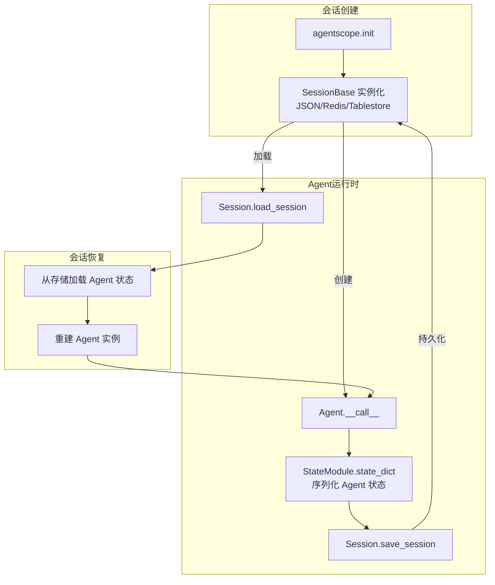
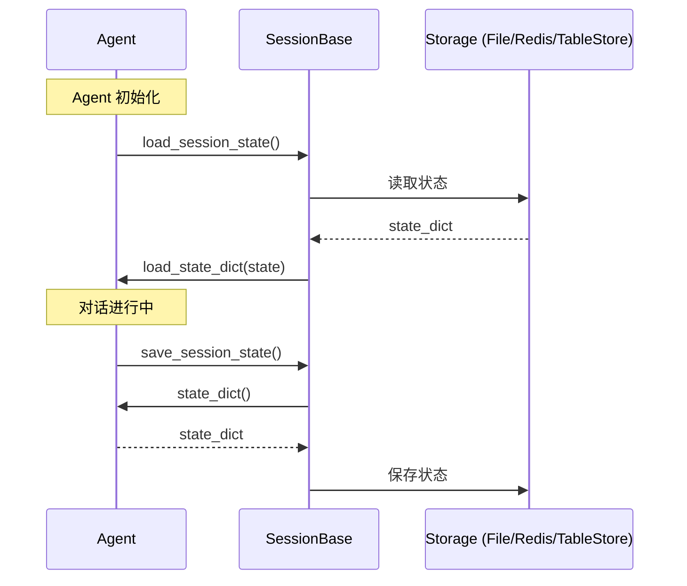

# Session 会话管理

> **Level 7**: 能独立开发模块
> **前置要求**: [Plan 规划模块](./09-plan-module.md)
> **后续章节**: [Realtime 实时语音](./09-realtime-agent.md)

---

## 学习目标

学完本章后，你能：
- 理解 Session 的设计目的和核心职责
- 掌握 SessionBase 的 save/load 机制
- 理解 StateModule 与 Session 的交互
- 选择合适的 Session 后端

---

## 背景问题

当 Agent 作为 Web 服务运行时，需要在多次请求之间保持状态：
1. 用户对话历史（Memory）
2. Agent 配置（Toolkit）
3. 中间状态（变量）

Session 系统就是解决这个问题的组件，实现**状态持久化**。

---

## 源码入口

| 项目 | 值 |
|------|-----|
| **目录** | `src/agentscope/session/` |
| **基类** | `SessionBase` |
| **核心方法** | `save_session_state()`, `load_session_state()` |

---

## 架构定位

### Session 在 Agent 生命周期中的作用域



**关键**: Session 是 `StateModule` 的持久化层。每个注册了 `register_state()` 的组件（Toolkit, Memory, Agent）通过 `state_dict()` 输出其状态，Session 负责序列化和恢复。

---

## 核心架构

### Session 与 StateModule 交互



---

## SessionBase 接口

**文件**: `src/agentscope/session/_session_base.py:8-48`

```python
class SessionBase:
    @abstractmethod
    async def save_session_state(
        self,
        session_id: str,
        user_id: str = "",
        **state_modules_mapping: StateModule,
    ) -> None:
        """保存状态"""

    @abstractmethod
    async def load_session_state(
        self,
        session_id: str,
        user_id: str = "",
        allow_not_exist: bool = True,
        **state_modules_mapping: StateModule,
    ) -> None:
        """加载状态"""
```

---

## StateModule 机制

Session 保存的是 `StateModule` 的状态。Agent 的各个组件都实现了 `StateModule` 接口：

```python
class StateModule(ABC):
    @abstractmethod
    def state_dict(self) -> dict: ...

    @abstractmethod
    def load_state_dict(self, state: dict) -> None: ...
```

**实现 StateModule 的组件**：
- `MemoryBase` — 记忆状态
- `Toolkit` — 工具注册状态
- `AgentBase` — Agent 整体状态

---

## Session 实现对比

| 实现 | 文件 | 存储介质 | 适用场景 |
|------|------|----------|---------|
| `JSONSession` | `_json_session.py` | 本地文件系统 | 开发/小规模 |
| `RedisSession` | `_redis_session.py` | Redis | 生产/分布式 |
| `TableStoreSession` | `_tablestore_session.py` | 阿里云 TableStore | 大规模/云原生 |

### JSONSession

**文件**: `_json_session.py:12-130`

```python
class JSONSession(SessionBase):
    def __init__(self, save_dir: str = "./") -> None:
        self.save_dir = save_dir

    def _get_save_path(self, session_id: str, user_id: str) -> str:
        """获取保存路径"""
        if user_id:
            file_path = f"{user_id}_{session_id}.json"
        else:
            file_path = f"{session_id}.json"
        return os.path.join(self.save_dir, file_path)

    async def save_session_state(self, session_id, user_id="", **modules):
        """保存状态到 JSON 文件"""
        state_dicts = {
            name: module.state_dict()
            for name, module in modules.items()
        }
        path = self._get_save_path(session_id, user_id)
        async with aiofiles.open(path, "w") as f:
            await f.write(json.dumps(state_dicts))

    async def load_session_state(self, session_id, user_id="", allow_not_exist=True, **modules):
        """从 JSON 文件加载状态"""
        path = self._get_save_path(session_id, user_id)
        if os.path.exists(path):
            async with aiofiles.open(path) as f:
                states = json.loads(await f.read())
            for name, module in modules.items():
                if name in states:
                    module.load_state_dict(states[name])
```

---

## 使用示例

### 基本用法

```python
import asyncio
from agentscope.session import JSONSession
from agentscope.agent import ReActAgent

async def main():
    session = JSONSession(save_dir="./sessions")

    agent = ReActAgent(...)

    # 加载已有状态
    await session.load_session_state(
        session_id="user123-session456",
        user_id="user123",
        agent=agent,  # 传入要恢复状态的组件
    )

    # Agent 处理请求
    response = await agent(msg)

    # 保存状态
    await session.save_session_state(
        session_id="user123-session456",
        user_id="user123",
        agent=agent,
    )

asyncio.run(main())
```

### Redis Session（生产环境）

```python
from agentscope.session import RedisSession

session = RedisSession(
    host="redis.example.com",
    port=6379,
    db=0,
    password=os.environ.get("REDIS_PASSWORD"),
)

# 使用方式相同
await session.load_session_state(session_id="...", agent=agent)
await session.save_session_state(session_id="...", agent=agent)
```

### 多组件状态管理

```python
# 同时保存多个组件的状态
await session.save_session_state(
    session_id="session123",
    memory=agent.memory,      # 记忆
    toolkit=agent.toolkit,   # 工具
    # agent=agent,           # Agent 本身（可选）
)

# 加载时同样可以指定多个组件
await session.load_session_state(
    session_id="session123",
    memory=agent.memory,
    toolkit=agent.toolkit,
)
```

---

## 状态序列化

### state_dict()

```python
# Memory 的 state_dict 示例
{
    "messages": [
        {"name": "user", "content": "你好", "role": "user"},
        {"name": "assistant", "content": "你好！", "role": "assistant"},
    ],
    "metadata": {"created_at": "2026-05-10T12:00:00Z"}
}
```

### load_state_dict()

```python
# 从 dict 恢复状态
def load_state_dict(self, state: dict) -> None:
    self.messages = state["messages"]
    self.metadata = state["metadata"]
```

---

## 工程现实与架构问题

### Session 管理技术债

| 位置 | 问题 | 影响 | 优先级 |
|------|------|------|--------|
| `_session_manager.py` | Session 清理依赖定时器，可能不及时 | 磁盘空间浪费 | 中 |
| `_session_base.py` | StateModule 序列化依赖各模块正确实现 | 某些模块忘记实现会静默失败 | 高 |
| `_json_session.py` | JSON 文件无锁，并发写入可能损坏 | 生产环境多实例不安全 | 高 |
| `_redis_session.py` | Redis 连接无自动重连 | 长会话可能断开 | 中 |

**[HISTORICAL INFERENCE]**: Session 管理是后期添加的功能，JSON 文件存储是为了简化开发调试，生产环境应使用 Redis 等支持并发的后端。

### 性能考量

```python
# Session 操作开销估算
JSONSession.save(): ~5-20ms (文件 I/O)
JSONSession.load(): ~3-10ms (文件 I/O)
RedisSession.save(): ~1-5ms (网络往返)
RedisSession.load(): ~1-3ms (网络往返)

# 序列化开销 (state_dict)
小 Agent (~100 msgs): ~10ms
大 Agent (~1000 msgs): ~100ms+

# 建议:
# - 开发调试: JSONSession
# - 生产环境: RedisSession 或数据库 Session
```

### 并发安全问题

```python
# 当前 JSONSession 的并发问题
# 两个 Agent 同时保存同一个 Session:
async def save(self, session_id, user_id, **modules):
    # 无锁保护
    with open(f"{session_id}.json", "w") as f:
        json.dump(state, f)  # 可能被另一个写入覆盖

# 解决方案: 添加文件锁或使用 Redis
import fcntl
with open(f"{session_id}.json", "a") as f:
    fcntl.flock(f.fileno(), fcntl.LOCK_EX)
    # 写入...
    fcntl.flock(f.fileno(), fcntl.LOCK_UN)
```

### 渐进式重构方案

```python
# 方案 1: 添加 Session 后端接口
class SessionBackend(ABC):
    @abstractmethod
    async def save(self, session_id: str, state: dict) -> None: ...

    @abstractmethod
    async def load(self, session_id: str) -> dict | None: ...

    @abstractmethod
    async def list_sessions(self, user_id: str) -> list[str]: ...

# 方案 2: 添加并发安全层
class SafeJSONSession(SessionBackend):
    def __init__(self, save_dir: str):
        self._lock_dir = os.path.join(save_dir, ".locks")

    async def save(self, session_id: str, state: dict) -> None:
        lock_path = f"{self._lock_dir}/{session_id}.lock"
        async with aiofiles.open(lock_path, "w") as lock_file:
            await lock_file.write("")
            # 保存逻辑...
```

---

## Contributor 指南

### 调试 Session 问题

```python
# 1. 检查保存路径
session = JSONSession(save_dir="/tmp/sessions")
path = session._get_save_path("session123", "user456")
print(f"Session file: {path}")
print(f"Exists: {os.path.exists(path)}")

# 2. 检查状态内容
async with aiofiles.open(path) as f:
    content = await f.read()
    print(f"Content: {content}")

# 3. 检查 StateModule 序列化
agent = ReActAgent(...)
state = agent.state_dict()  # 确认实现了 StateModule
print(f"State keys: {state.keys()}")
```

### 自定义 Session 后端

```python
class MySession(SessionBase):
    async def save_session_state(self, session_id, user_id="", **modules):
        # 自定义保存逻辑
        state = {name: m.state_dict() for name, m in modules.items()}
        await my_storage.set(session_id, state)

    async def load_session_state(self, session_id, user_id="", allow_not_exist=True, **modules):
        state = await my_storage.get(session_id)
        if state:
            for name, module in modules.items():
                if name in state:
                    module.load_state_dict(state[name])
```

---

## 常见问题

**问题：Session 状态为空**
- 检查 `state_dict()` 是否返回正确内容
- 检查 `load_state_dict()` 是否正确实现

**问题：JSON 文件损坏**
- 使用 `allow_not_exist=False` 捕获异常
- 备份机制：保存前先写 `.bak` 文件

---

## 下一步

接下来学习 [Realtime 实时语音](./09-realtime-agent.md)。


