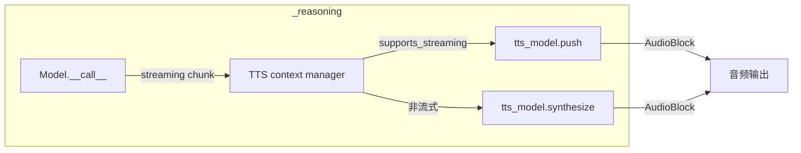
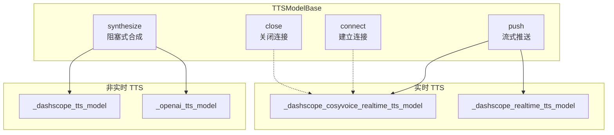

# TTS 语音合成

> **Level 7**: 能独立开发模块
> **前置要求**: [Realtime 实时语音](./09-realtime-agent.md)
> **后续章节**: [Evaluate 评估系统](./09-evaluate-system.md)

---

## 学习目标

学完本章后，你能：
- 理解 TTSModelBase 的设计目的和核心职责
- 掌握 synthesize() 和 push() 的使用场景
- 知道如何为 Agent 集成 TTS 能力

---

## 背景问题

当 Agent 需要"说话"而非仅返回文本时，需要一个将文本转换为语音的组件。TTS 系统就是解决这个问题的模块。

---

## 源码入口

| 项目 | 值 |
|------|-----|
| **文件路径** | `src/agentscope/tts/` |
| **基类** | `TTSModelBase` |
| **核心方法** | `synthesize()`, `push()`, `connect()`, `close()` |
| **TTSResponse** | `TTSResponse` (包含 AudioBlock) |

---

## 架构定位

### TTS 在 ReActAgent 推理管道中的集成点



**关键**: TTS 不改变 Agent 逻辑 — 它在 `_reasoning()` 内部通过 context manager 注入（`_react_agent.py:578-617`）。流式 TTS 逐 chunk 推送，非流式 TTS 在完整响应后合成。

---

## 核心架构

### TTSModelBase 职责



---

## 核心方法

### synthesize()

**文件**: `src/agentscope/tts/_tts_base.py:124-143`

```python
@abstractmethod
async def synthesize(
    self,
    msg: Msg | None = None,
    **kwargs: Any,
) -> TTSResponse | AsyncGenerator[TTSResponse, None]:
    """Synthesize speech from text.

    Returns:
        TTSResponse or AsyncGenerator[TTSResponse, None]
    """
```

**两种模式**：
1. **非流式**：直接返回 `TTSResponse`（包含完整音频）
2. **流式**：返回 `AsyncGenerator[TTSResponse, None]`，逐块返回音频

### push()

**文件**: `_tts_base.py:94-122`

```python
async def push(
    self,
    msg: Msg,
    **kwargs: Any,
) -> TTSResponse:
    """Append text to be synthesized (realtime TTS only).

    Note: Non-blocking, may return empty response if no audio ready yet.
    """
```

**仅实时 TTS 模型需要实现**。用于流式输入场景。

### connect() / close()

**文件**: `_tts_base.py:70-92`

```python
async def connect(self) -> None:
    """Connect to TTS service and initialize resources."""

async def close(self) -> None:
    """Close connection and clean up resources."""
```

---

## TTSResponse 结构

**文件**: `src/agentscope/tts/_tts_response.py:30-55`

```python
@dataclass
class TTSResponse(DictMixin):
    content: AudioBlock | None  # 音频数据
    id: str                     # 唯一标识
    created_at: str              # 创建时间
    type: Literal["tts"]        # 固定为 "tts"
    usage: TTSUsage | None      # 用量信息
    is_last: bool               # 是否是流式最后一个
```

---

## 使用示例

### 基本用法

```python
from agentscope.tts import OpenAITTTSModel
from agentscope.message import Msg

# 创建 TTS 模型
tts = OpenAITTTSModel(model_name="tts-1", stream=False)

# 合成语音
msg = Msg("assistant", "你好，我是 AgentScope", "assistant")
response = await tts.synthesize(msg)

# 获取音频
audio_block = response.content  # AudioBlock 类型
```

### 实时 TTS

```python
from agentscope.tts import DashScopeRealtimeTTSModel

tts = DashScopeRealtimeTTSModel(model_name="cosyvoice", stream=True)

async with tts:
    # 流式推送文本
    for chunk in text_chunks:
        msg = Msg("assistant", chunk, "assistant")
        await tts.push(msg)

    # 获取完整合成结果
    final_response = await tts.synthesize()
```

---

## TTS 实现对比

| 实现 | 文件 | streaming_input | 特点 |
|------|------|----------------|------|
| DashScopeTTS | `_dashscope_tts_model.py` | ❌ | 阿里云语音合成 |
| OpenAITTS | `_openai_tts_model.py` | ❌ | OpenAI TTS API |
| GeminiTTS | `_gemini_tts_model.py` | ❌ | Google Gemini TTS |
| CosyVoiceRealtime | `_dashscope_cosyvoice_realtime_tts_model.py` | ✅ | 阿里云实时语音 |
| DashScopeRealtime | `_dashscope_realtime_tts_model.py` | ✅ | 阿里云实时合成 |

---

## 集成到 Agent

ReActAgent 内置 TTS 支持：

```python
from agentscope.agent import ReActAgent
from agentscope.tts import OpenAITTTSModel

# 创建带 TTS 的 Agent
tts = OpenAITTTSModel(model_name="tts-1", stream=False)

agent = ReActAgent(
    model=model,
    toolkit=toolkit,
    tts=tts,  # 传入 TTS 模型
    ...
)

# Agent 回复时会自动调用 TTS 生成语音
msg = Msg("user", "请介绍一下自己", "user")
response = await agent(msg)
# response.audio 包含合成的语音
```

---

## 工程现实与架构问题

### 技术债 (源码级)

| 位置 | 问题 | 影响 | 优先级 |
|------|------|------|--------|
| `_tts_base.py:100` | synthesize 无超时控制 | 网络慢时可能永久阻塞 | 高 |
| `_tts_response.py:50` | AudioBlock 可能为 None | 调用方需要空值检查 | 中 |
| `_dashscope_tts_model.py:80` | DashScope TTS 无流式输入支持 | 无法实现实时对话 | 中 |
| `_tts_base.py:120` | close() 无强制刷新机制 | 流式输出可能被截断 | 中 |
| `_openai_tts_model.py:60` | OpenAI TTS 无速率限制 | 可能触发 API 限流 | 低 |

**[HISTORICAL INFERENCE]**: TTS 模块是后添加的功能，设计时主要考虑功能正确性，生产环境需要的超时控制和流式完整性保障未充分考虑。

### 性能考量

```python
# TTS 操作延迟估算
DashScope TTS: ~200-500ms (取决于文本长度)
OpenAI TTS: ~300-800ms
流式首包: ~100-200ms
每个音频块: ~20-50ms

# 音频大小估算
1 分钟音频: ~100KB-500KB (取决于采样率)
```

### 流式输出截断问题

```python
# 当前问题: close() 不保证所有音频已发送
class RealtimeTTSModel(TTSModelBase):
    async def close(self) -> None:
        # 流可能还没完成
        await self._stream.aclose()

# 解决方案: 添加 flush 参数
class FlushingTTSModel(TTSModelBase):
    async def close(self, flush: bool = True) -> None:
        if flush:
            # 等待所有待发送音频完成
            while not self._stream.is_empty():
                await asyncio.sleep(0.1)
        await self._stream.aclose()
```

### 渐进式重构方案

```python
# 方案 1: 添加超时控制
class TimeoutTTSModel(TTSModelBase):
    async def synthesize(self, msg, timeout: float = 30.0, **kwargs):
        try:
            return await asyncio.wait_for(
                self._synthesize_impl(msg, **kwargs),
                timeout=timeout
            )
        except asyncio.TimeoutError:
            logger.error(f"TTS synthesis timed out after {timeout}s")
            raise

# 方案 2: 添加流完整性验证
class VerifiedTTSModel(TTSModelBase):
    async def synthesize(self, msg, **kwargs) -> TTSResponse:
        response = await self._synthesize_impl(msg, **kwargs)

        # 验证音频完整性
        if response.content:
            audio_data = response.content.data
            expected_duration = response.usage.get("duration") if response.usage else None
            actual_duration = len(audio_data) / (response.content.sample_rate * response.content.channels * 2)

            if expected_duration and abs(actual_duration - expected_duration) > 0.5:
                logger.warning(
                    f"Audio duration mismatch: expected {expected_duration}s, "
                    f"got {actual_duration}s"
                )

        return response
```

---

## Contributor 指南

### 调试 TTS 问题

```python
# 1. 检查 TTS 模型是否正确配置
print(f"TTS model: {tts.model_name}")
print(f"Supports streaming: {tts.supports_streaming_input}")

# 2. 检查响应
response = await tts.synthesize(msg)
print(f"Audio block: {response.content}")
print(f"Is last: {response.is_last}")
print(f"Usage: {response.usage}")
```

### 常见问题

**问题：TTS 返回空响应**
- 检查 API Key 是否配置正确
- 检查模型名称是否支持
- 验证网络连接

**问题：流式 TTS 无输出**
- 确认 `supports_streaming_input` 为 True
- 检查 `connect()` 是否在 `async with` 块内调用

### 危险区域

1. **synthesize 无超时**：网络问题可能导致永久等待
2. **close() 不等待流完成**：可能导致音频截断
3. **API 限流**：高频调用需要添加速率限制

---

## 下一步

接下来学习 [Evaluate 评估系统](./09-evaluate-system.md)。


