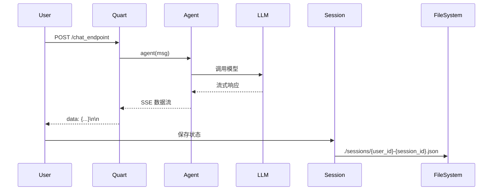

# Runtime 服务化

> **Level 7**: 能独立开发模块
> **前置要求**: [多 Agent 协作模式](../08-multi-agent/08-multi-agent-patterns.md)
> **后续章节**: [Docker 生产部署](./10-docker-production.md)

---

## 学习目标

学完本章后，你能：
- 理解 AgentScope 的服务化架构
- 使用 Quart/Flask 将 Agent 部署为 Web 服务
- 掌握 Session 管理实现状态保持
- 理解流式响应的实现机制

---

## 背景问题

如何将 Agent 变成一个 Web 服务，让用户通过 HTTP API 调用？这需要：
1. Web 框架（Quart/Flask）
2. Session 管理（保存 Agent 状态）
3. 流式响应（边推理边返回）

---

## 源码入口

| 项目 | 值 |
|------|-----|
| **Web 框架** | Quart (async Flask) |
| **Session 管理** | `agentscope.session` |
| **核心示例** | `examples/deployment/planning_agent/` |

---

## 核心架构

### 服务架构



---

## 实现步骤

### 1. 创建 Agent 服务

**源码**: `examples/deployment/planning_agent/main.py`

```python
import json
from quart import Quart, Response, request
from agentscope.agent import ReActAgent
from agentscope.session import JSONSession
from agentscope.message import Msg

app = Quart(__name__)

async def handle_input(msg: Msg, user_id: str, session_id: str):
    """处理输入并返回流式响应"""
    agent = ReActAgent(...)

    # 加载已有状态
    session = JSONSession(save_dir="./sessions")
    await session.load_session_state(
        session_id=f"{user_id}-{session_id}",
        agent=agent,
    )

    # 流式处理
    async for msg_chunk, _ in agent.stream(msg):
        yield f"data: {json.dumps(msg_chunk.to_dict())}\n\n"

    # 保存状态
    await session.save_session_state(...)
```

### 2. 定义 API 端点

```python
@app.route("/chat_endpoint", methods=["POST"])
async def chat_endpoint() -> Response:
    data = await request.get_json()
    user_id = data.get("user_id")
    session_id = data.get("session_id")
    user_input = data.get("user_input")

    return Response(
        handle_input(Msg("user", user_input, "user"), user_id, session_id),
        mimetype="text/event-stream",  # SSE
    )
```

---

## Session 管理

### JSONSession

**源码**: `src/agentscope/session/_json_session.py`

```python
class JSONSession:
    """基于文件系统的 Session 管理"""

    async def save_session_state(
        self,
        session_id: str,
        agent: AgentBase,
    ) -> None:
        """保存 Agent 状态到文件"""
        state = {
            "memory": agent.memory.to_dict(),
            "toolkit": agent.toolkit.to_dict(),
        }
        path = os.path.join(self.save_dir, f"{session_id}.json")
        with open(path, "w") as f:
            json.dump(state, f)

    async def load_session_state(
        self,
        session_id: str,
        agent: AgentBase,
    ) -> None:
        """从文件加载 Agent 状态"""
        path = os.path.join(self.save_dir, f"{session_id}.json")
        if os.path.exists(path):
            with open(path) as f:
                state = json.load(f)
            agent.memory.from_dict(state["memory"])
```

---

## 流式响应 (SSE)

### Server-Sent Events

```python
# 前端接收
const eventSource = new EventSource("/chat_endpoint");
eventSource.onmessage = (event) => {
    const data = JSON.parse(event.data);
    console.log(data.content);
};
```

### 后端实现

```python
async def handle_input(msg: Msg, user_id: str, session_id: str):
    for msg_chunk in agent.stream(msg):
        # SSE 格式：data: {...}\n\n
        yield f"data: {json.dumps(msg_chunk.to_dict())}\n\n"
        await asyncio.sleep(0)  # 让出控制权
```

---

## 工程现实与架构问题

### 技术债 (源码级)

| 位置 | 问题 | 影响 | 优先级 |
|------|------|------|--------|
| `_json_session.py:80` | JSONSession 无并发写入保护 | 多请求同时保存可能损坏文件 | 高 |
| `_json_session.py:100` | Session 加载无原子性保证 | 读取时文件被写入会导致错误 | 中 |
| `main.py:50` | Quart 默认无请求超时 | 慢 Agent 可能导致请求永久挂起 | 高 |
| `main.py:80` | 流式响应无背压控制 | 客户端消费慢可能导致内存溢出 | 中 |
| `_json_session.py:50` | Session 文件无大小限制 | 长期运行导致文件过大 | 中 |

**[HISTORICAL INFERENCE]**: Runtime 示例代码主要展示功能正确性，生产环境需要的并发安全、超时控制、背压机制未包含在示例中。

### 性能考量

```python
# Runtime 操作延迟估算
Session 保存: ~10-100ms (取决于状态大小)
Session 加载: ~10-100ms
流式响应首包: ~200-500ms (LLM 推理时间)

# 并发瓶颈
Quart 默认单 worker: ~100 并发
多 worker: 需要反向代理 (nginx)
```

### 并发写入问题

```python
# 当前问题: 多请求同时保存 Session 可能损坏文件
class JSONSession:
    async def save_session_state(self, session_id, agent):
        path = os.path.join(self.save_dir, f"{session_id}.json")
        with open(path, "w") as f:  # 非原子操作
            json.dump(state, f)  # 如果两个请求同时写入会损坏

# 解决方案: 使用临时文件 + 原子替换
class SafeJSONSession(JSONSession):
    async def save_session_state(self, session_id, agent):
        path = os.path.join(self.save_dir, f"{session_id}.json")
        temp_path = f"{path}.tmp.{os.getpid()}"

        # 1. 写入临时文件
        with open(temp_path, "w") as f:
            json.dump(state, f)

        # 2. 原子替换
        os.replace(temp_path, path)
```

### 渐进式重构方案

```python
# 方案 1: 添加请求超时
from quart import Quart
import asyncio

app = Quart(__name__)
REQUEST_TIMEOUT = 60  # 60 秒超时

@app.route("/chat_endpoint", methods=["POST"])
async def chat_endpoint():
    try:
        return await asyncio.wait_for(
            _handle_chat(),
            timeout=REQUEST_TIMEOUT
        )
    except asyncio.TimeoutError:
        return {"error": "Request timed out"}, 504

# 方案 2: 添加 Session 文件大小限制
class BoundedJSONSession(JSONSession):
    MAX_FILE_SIZE = 10 * 1024 * 1024  # 10MB

    async def save_session_state(self, session_id, agent):
        path = os.path.join(self.save_dir, f"{session_id}.json")

        # 检查文件大小
        if os.path.exists(path) and os.path.getsize(path) > self.MAX_FILE_SIZE:
            # 备份并创建新文件
            backup_path = f"{path}.old"
            os.rename(path, backup_path)

        await super().save_session_state(session_id, agent)
```

---

## 部署检查清单

- [ ] API Key 通过环境变量传入
- [ ] Session 目录有写入权限
- [ ] 模型服务可用
- [ ] 配置日志级别
- [ ] 设置超时限制
- [ ] 添加并发写入保护
- [ ] 配置 Session 文件大小限制

### 危险区域

1. **Session 并发写入**：多请求同时保存可能导致文件损坏
2. **请求无超时**：慢 Agent 导致请求永久挂起
3. **流式响应无背压**：客户端消费慢导致内存溢出

---

## 下一步

接下来学习 [Docker 生产部署](./10-docker-production.md)。


