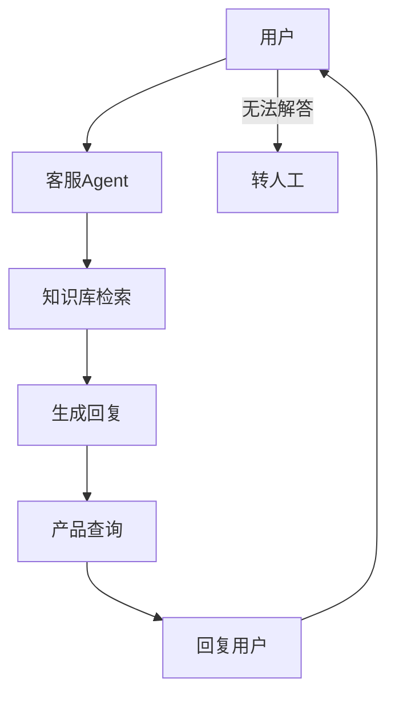

# 项目实战：智能客服

> **Level 6**: 能修改小功能
> **前置要求**: [天气 Agent 项目](./11-weather-agent.md)
> **后续章节**: [多 Agent 辩论项目](./11-multi-agent-debate.md)

---

## 学习目标

学完本章后，你能：
- 构建一个基于 RAG 的智能客服 Agent
- 掌握知识库检索与 Agent 的结合
- 理解多工具协作的客服场景
- 学会使用 MsgHub 实现多 Agent 协作

---

## 背景问题

智能客服是企业级 Agent 应用的经典场景。它需要同时处理 FAQ 检索、产品查询、订单追踪、情感识别和人工转接——每种能力对应不同的工具和知识源。核心工程挑战：**如何在单个 Agent 中组织多个工具和知识库，并优雅地处理"转人工"等控制流**。

---

## 源码入口

| 项目 | 值 |
|------|-----|
| **参考模块** | `src/agentscope/rag/` (知识库检索), `src/agentscope/pipeline/_msghub.py` (多 Agent 协作) |
| **核心类** | `KnowledgeBase`, `MsgHub`, `ReActAgent` |

---

## 项目概述

构建一个智能客服 Agent，支持：
- 基于知识库的 FAQ 问答
- 产品查询、订单状态查询
- 多轮对话记忆
- 转人工服务

---

## 架构设计



---

## 实现步骤

### 1. 定义知识库

```python
from agentscope.rag import KnowledgeBase, FileReader

# 创建知识库
kb = KnowledgeBase(
    reader=FileReader(path="./data/faq.md"),
    vectorizer=...,
)

# 添加产品文档
kb.add_documents([
    {"content": "产品A: 价格99元", "metadata": {"type": "product"}},
    {"content": "产品B: 价格199元", "metadata": {"type": "product"}},
])
```

### 2. 创建客服 Agent

```python
import asyncio
from agentscope.agent import ReActAgent
from agentscope.memory import InMemoryMemory
from agentscope.model import DashScopeChatModel
from agentscope.tool import Toolkit

async def main():
    toolkit = Toolkit()
    toolkit.register_tool_function(kb.search)
    toolkit.register_tool_function(check_order_status)
    toolkit.register_tool_function(escalate_to_human)

    agent = ReActAgent(
        name="CustomerService",
        sys_prompt="你是一个专业的客服助手，擅长回答产品相关问题。",
        model=DashScopeChatModel(...),
        toolkit=toolkit,
        memory=InMemoryMemory(),
    )

    # 处理用户请求
    result = await agent(Msg("user", "产品A有什么特点？", "user"))
    print(result.content)

asyncio.run(main())
```

---

## 核心组件

### 知识库检索

```python
async def search_knowledge(query: str) -> str:
    """从知识库检索相关信息"""
    results = await kb.search(query, top_k=3)
    return "\n".join([r.content for r in results])
```

### 订单查询

```python
def check_order_status(order_id: str) -> str:
    """查询订单状态"""
    # 模拟数据库查询
    return f"订单 {order_id}: 已发货，预计3天到达"
```

---

## 扩展任务

### 扩展 1：使用 MsgHub 实现多 Agent 协作

```python
from agentscope.pipeline import MsgHub

# 创建客服 Hub
hub = MsgHub(
    agents=[sales_agent, support_agent, complaint_agent],
    publish_strategy="route_by_content",  # 按内容路由
)

await hub.broadcast(Msg("user", "我想投诉", "user"))
```

### 扩展 2：添加情感识别

```python
# 检测用户情感，调整回复策略
sentiment = detect_sentiment(user_input)
if sentiment == "angry":
    response = await polite_agent.reply(msg)
else:
    response = await normal_agent.reply(msg)
```

---

## 工程现实与架构问题

### 技术债 (源码级)

| 位置 | 问题 | 影响 | 优先级 |
|------|------|------|--------|
| `kb.search()` | 知识库检索无分页 | 大量结果时性能差 | 中 |
| `rag/` | 知识库无增量更新 | 文档变更需要全量重建 | 中 |
| `escalate_to_human` | 转人工无状态传递 | 人工客服看不到对话历史 | 高 |
| `kb/` | 文档解析无错误处理 | 格式错误的文档导致静默失败 | 中 |
| `MsgHub` | 多 Agent 路由策略有限 | 复杂路由需要自定义实现 | 中 |

**[HISTORICAL INFERENCE]**: 客服系统示例展示核心功能，生产环境需要的转人工状态传递、文档错误处理、检索分页是实际部署时发现的需求。

### 性能考量

```python
# 客服系统操作延迟估算
知识库检索: ~100-500ms (取决于向量数据库)
LLM 生成: ~200-500ms
订单查询 API: ~50-200ms

# 知识库规模影响
1000 文档: ~100ms 检索
10000 文档: ~300ms 检索
100000 文档: ~1s 检索
```

### 转人工状态传递问题

```python
# 当前问题: 转人工时对话历史丢失
async def escalate_to_human(order_id: str) -> str:
    # 返回转人工指令，但不包括对话历史
    return "正在为您转接人工客服..."

# 解决方案: 传递完整上下文
class HandoffManager:
    def __init__(self, session_store: SessionStore):
        self.session_store = session_store

    async def escalate_to_human(self, user_id: str, agent_id: str) -> str:
        # 获取完整对话历史
        history = await self.session_store.get_conversation_history(user_id)

        # 发送到人工客服系统
        await self.human_service.create_ticket(
            user_id=user_id,
            agent_id=agent_id,
            conversation_history=history,
            escalation_reason="用户请求转人工",
        )

        return f"已为您转接人工客服，请稍候..."

    async def get_conversation_history(self, user_id: str) -> list[Msg]:
        # 从 Session 获取完整历史
        session = await self.session_store.load_session(user_id)
        return session.messages
```

### 渐进式重构方案

```python
# 方案 1: 添加知识库增量更新
class IncrementalKnowledgeBase(KnowledgeBase):
    async def add_documents(self, documents, **kwargs):
        # 检查文档是否已存在
        existing_ids = await self.store.get_existing_ids()

        new_docs = []
        for doc in documents:
            if doc.id not in existing_ids:
                new_docs.append(doc)
            else:
                # 更新已存在的文档
                await self.store.update(doc)

        if new_docs:
            await super().add_documents(new_docs)

# 方案 2: 添加检索分页
class PagedKnowledgeBase(KnowledgeBase):
    async def search(self, query, page=1, page_size=10, **kwargs):
        all_results = await super().search(query, limit=1000, **kwargs)

        # 分页
        start = (page - 1) * page_size
        end = start + page_size
        paginated_results = all_results[start:end]

        return {
            "results": paginated_results,
            "total": len(all_results),
            "page": page,
            "page_size": page_size,
            "total_pages": (len(all_results) + page_size - 1) // page_size,
        }
```

---

## 常见问题

**问题：知识库检索结果不准确**
- 调整 `top_k` 参数
- 检查文档质量
- 优化 embedding 模型

**问题：Agent 回复过于模板化**
- 优化 system prompt
- 增加 few-shot examples

### 危险区域

1. **转人工状态丢失**：人工客服看不到完整对话历史
2. **知识库无增量更新**：每次更新需要全量重建
3. **文档解析无错误处理**：格式错误文档导致静默失败

---

## 下一步

接下来学习 [多 Agent 辩论项目](./11-multi-agent-debate.md)。


