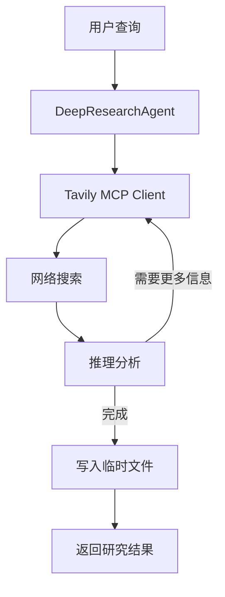

# 项目实战：深度研究助手

> **Level 8**: 能提交高质量 PR
> **前置要求**: [多 Agent 辩论项目](./11-multi-agent-debate.md)
> **后续章节**: [语音助手项目](./11-voice-assistant.md)

---

## 学习目标

学完本章后，你能：
- 构建一个能进行多步网络搜索的研究 Agent
- 掌握 MCP (Model Context Protocol) 客户端集成
- 理解 DeepResearchAgent 的搜索-推理循环
- 学会使用临时文件存储管理研究结果

---

## 背景问题

深度研究是 Agent 能力的终极测试——Agent 需要自主完成"搜索→分析→再搜索→综合→报告"的完整研究循环。这涉及 MCP 协议工具集成（Tavily 搜索）、多步推理、临时文件管理和流式输出。核心问题：**如何让 Agent 自主决定"还需要搜索什么"并迭代深化研究？**

---

## 源码入口

| 项目 | 值 |
|------|-----|
| **参考模块** | `src/agentscope/mcp/` (MCP 客户端), `src/agentscope/tool/_text_file/` (文件工具) |
| **核心类** | `MCPClientBase`, `HTTPStatefulClient`, `ReActAgent` |

---

## 项目概述

构建一个深度研究 Agent，支持：
- 使用 Tavily MCP 进行网络搜索
- 多轮搜索-推理-综合的研究流程
- 将研究结果写入临时文件
- 支持流式输出研究进展

---

## 架构设计



---

## 实现步骤

### 1. 安装依赖

```bash
pip install agentscope[full]
npx -y tavily-mcp@latest
```

### 2. 创建研究 Agent

```python
import asyncio
import os
from agentscope.agent import DeepResearchAgent
from agentscope.formatter import DashScopeChatFormatter
from agentscope.memory import InMemoryMemory
from agentscope.model import DashScopeChatModel
from agentscope.message import Msg
from agentscope.mcp import StdIOStatefulClient

async def main(user_query: str) -> None:
    # 创建 Tavily MCP 客户端
    tavily_client = StdIOStatefulClient(
        name="tavily_mcp",
        command="npx",
        args=["-y", "tavily-mcp@latest"],
        env={"TAVILY_API_KEY": os.getenv("TAVILY_API_KEY", "")},
    )
    await tavily_client.connect()

    # 创建研究 Agent
    agent = DeepResearchAgent(
        name="ResearchBot",
        sys_prompt="你是一个专业的研究助手，擅长进行深度信息检索和分析。",
        model=DashScopeChatModel(
            api_key=os.environ.get("DASHSCOPE_API_KEY"),
            model_name="qwen3-max",
            enable_thinking=False,
            stream=True,
        ),
        formatter=DashScopeChatFormatter(),
        memory=InMemoryMemory(),
        search_mcp_client=tavily_client,
        tmp_file_storage_dir="./research_results",
        max_tool_results_words=10000,
    )

    # 执行研究
    msg = Msg("user", user_query, "user")
    result = await agent(msg)
    print(result)

    await tavily_client.close()

asyncio.run(main("解释量子计算的基本原理"))
```

---

## 核心组件

### DeepResearchAgent

**源码**: `examples/agent/deep_research_agent/deep_research_agent.py`

关键参数：
- `search_mcp_client`: MCP 搜索客户端
- `tmp_file_storage_dir`: 临时文件存储目录
- `max_tool_results_words`: 最大工具结果字数

### Tavily MCP

```python
# StdIOStatefulClient 用于本地运行的 MCP 服务
tavily_client = StdIOStatefulClient(
    name="tavily_mcp",
    command="npx",
    args=["-y", "tavily-mcp@latest"],
    env={"TAVILY_API_KEY": "..."},
)
```

---

## 扩展任务

### 扩展 1：使用 SerpAPI

```python
from agentscope.mcp import HttpStatefulClient

serp_client = HttpStatefulClient(
    name="serpapi",
    base_url="https://serpapi.com",
    headers={"Authorization": f"Bearer {os.getenv('SERPAPI_KEY')}"},
)
```

### 扩展 2：自定义搜索结果处理

```python
agent = DeepResearchAgent(
    ...
    max_tool_results_words=20000,  # 增加结果字数限制
    custom_post_process=my_post_processor,  # 自定义后处理
)
```

---

## 工程现实与架构问题

### 技术债 (源码级)

| 位置 | 问题 | 影响 | 优先级 |
|------|------|------|--------|
| `DeepResearchAgent` | 搜索-推理循环无最大次数限制 | 复杂问题可能导致无限循环 | 高 |
| `tmp_file_storage_dir` | 临时文件无自动清理 | 磁盘空间随时间增长 | 中 |
| `MCP client` | StdIO 模式无连接健康检查 | MCP 服务崩溃无感知 | 高 |
| `max_tool_results_words` | 限制可能导致信息丢失 | 重要信息被截断 | 中 |
| `search_mcp_client` | MCP 重连无指数退避 | 频繁重连时可能触发限流 | 中 |

**[HISTORICAL INFERENCE]**: 深度研究 Agent 面向演示场景，生产环境需要的循环限制、临时文件清理、连接健康检查是部署后才发现的需求。

### 性能考量

```python
# DeepResearchAgent 操作延迟估算
单次搜索: ~500ms-2s (Tavily API)
推理分析: ~200-500ms (LLM)
完整研究 (5-10 轮): ~5-30 分钟

# 临时文件大小估算
每次研究: ~100KB-1MB (取决于结果数量)
100 次研究: ~10MB-100MB
```

### 无限循环问题

```python
# 当前问题: 无最大搜索次数限制
class DeepResearchAgent(ReActAgent):
    async def research(self, query):
        while True:  # 可能无限循环
            search_results = await self.search_mcp_client.search(query)
            analysis = await self.analyze(search_results)
            if self.is_complete(analysis):
                break
            query = self.refine_query(analysis)

# 解决方案: 添加循环限制
class BoundedDeepResearchAgent(ReActAgent):
    DEFAULT_MAX_ITERATIONS = 10

    def __init__(self, *args, max_iterations=None, **kwargs):
        super().__init__(*args, **kwargs)
        self.max_iterations = max_iterations or self.DEFAULT_MAX_ITERATIONS

    async def research(self, query):
        for i in range(self.max_iterations):
            search_results = await self.search_mcp_client.search(query)
            analysis = await self.analyze(search_results)

            if self.is_complete(analysis):
                break

            if i == self.max_iterations - 1:
                logger.warning(
                    f"Reached max iterations ({self.max_iterations}), "
                    f"returning partial results"
                )

            query = self.refine_query(analysis)
```

### 渐进式重构方案

```python
# 方案 1: 添加临时文件自动清理
class CleaningDeepResearchAgent(DeepResearchAgent):
    DEFAULT_TTL_DAYS = 7

    def __init__(self, *args, cleanup_ttl_days=None, **kwargs):
        super().__init__(*args, **kwargs)
        self.cleanup_ttl_days = cleanup_ttl_days or self.DEFAULT_TTL_DAYS

    async def research(self, query):
        result = await super().research(query)

        # 后台清理过期文件
        asyncio.create_task(self._cleanup_old_files())

        return result

    async def _cleanup_old_files(self):
        now = time.time()
        ttl_seconds = self.cleanup_ttl_days * 86400

        for filename in os.listdir(self.tmp_file_storage_dir):
            filepath = os.path.join(self.tmp_file_storage_dir, filename)
            if os.path.isfile(filepath):
                if now - os.path.getmtime(filepath) > ttl_seconds:
                    os.remove(filepath)
                    logger.info(f"Cleaned up old research file: {filename}")

# 方案 2: 添加 MCP 健康检查和重连
class RobustMCPClient:
    DEFAULT_RETRY_DELAYS = [1, 2, 5, 10, 30]  # 指数退避

    async def _ensure_connection(self):
        for attempt, delay in enumerate(self.DEFAULT_RETRY_DELAYS):
            try:
                await self.client.ping()
                return
            except Exception as e:
                if attempt < len(self.DEFAULT_RETRY_DELAYS) - 1:
                    logger.warning(
                        f"MCP connection failed, retrying in {delay}s..."
                    )
                    await asyncio.sleep(delay)
                else:
                    raise ConnectionError(
                        f"MCP connection failed after {len(self.DEFAULT_RETRY_DELAYS)} attempts"
                    )
```

---

## 常见问题

**问题：Tavily MCP 启动失败**
```bash
# 确保 npx 可用
npx -y tavily-mcp@latest

# 检查 API Key
echo $TAVILY_API_KEY
```

**问题：搜索结果为空**
- 检查 `search_mcp_client` 是否正确连接
- 确认 MCP 服务返回了有效数据

### 危险区域

1. **搜索循环无最大次数**：复杂问题可能导致无限循环
2. **临时文件无清理**：磁盘空间持续增长
3. **MCP 连接无健康检查**：服务崩溃无感知

---

## 下一步

接下来学习 [语音助手项目](./11-voice-assistant.md)。


