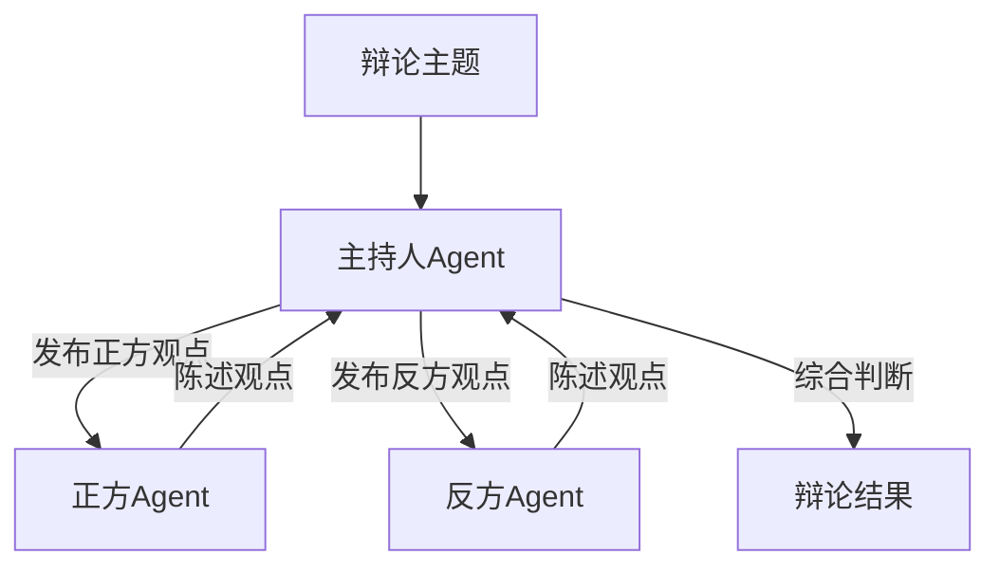

# 项目实战：多 Agent 辩论

> **Level 7**: 能独立开发模块
> **前置要求**: [客服系统项目](./11-customer-service.md)
> **后续章节**: [深度研究助手](./11-deep-research.md)

---

## 学习目标

学完本章后，你能：
- 构建支持多 Agent 辩论的系统
- 掌握 MsgHub 的广播和订阅机制
- 理解 Agent 之间的消息传递模式
- 学会设计辩论 Agent 的角色和策略

---

## 背景问题

多 Agent 辩论是理解 Agent 间通信模式的最佳实践场景。每个 Agent 需要**监听**他人的发言（通过 `observe()`），并**发表**自己的观点（通过 `reply()`）。MsgHub 的发布-订阅模式是实现这种对等通信的核心机制。核心问题：**如何让多个 Agent 在对等拓扑中互相对话，而非单向流水线？**

---

## 源码入口

| 项目 | 值 |
|------|-----|
| **参考模块** | `src/agentscope/pipeline/_msghub.py` (MsgHub), `src/agentscope/agent/_agent_base.py:448` (Agent.__call__ 中 finally 广播) |
| **核心类** | `MsgHub`, `ReActAgent` |

---

## 项目概述

构建一个多 Agent 辩论系统，支持：
- 正方 Agent 和反方 Agent
- 基于 MsgHub 的消息广播
- 辩论主持人 Agent（裁判）
- 多轮辩论和总结

---

## 架构设计



---

## 实现步骤

### 1. 定义辩论 Agent

```python
from agentscope.agent import ReActAgent
from agentscope.message import Msg

def create_debate_agent(name: str, stance: str, opponent: str):
    """创建辩论 Agent"""
    sys_prompt = f"""你是一个辩论者，扮演 {name}。
你支持 {stance} 观点。
对手是 {opponent}，你需要针对其观点进行反驳。
保持逻辑清晰，论据充分。"""

    return ReActAgent(
        name=name,
        sys_prompt=sys_prompt,
        model=model,
        toolkit=toolkit,
        memory=InMemoryMemory(),
    )
```

### 2. 使用 MsgHub 实现辩论

```python
import asyncio
from agentscope.pipeline import MsgHub
from agentscope.message import Msg

async def debate(topic: str):
    # 创建辩论 Agent
    pro_agent = create_debate_agent("正方", "支持", "反方")
    con_agent = create_debate_agent("反方", "反对", "正方")
    moderator = create_debate_agent("主持人", "客观公正", "")

    # 创建 Hub
    hub = MsgHub(
        agents=[pro_agent, con_agent, moderator],
        announce_strategy="all",  # 广播给所有 Agent
    )

    async with hub:
        # 主持人发布主题
        await hub.broadcast(Msg("system", f"辩论主题：{topic}", "system"))

        # 多轮辩论
        for round_num in range(3):
            # 正方发言
            pro_msg = await pro_agent(Msg("user", "请陈述你的观点", "system"))
            await hub.broadcast(pro_msg)

            # 反方发言
            con_msg = await con_agent(Msg("user", "请陈述你的观点", "system"))
            await hub.broadcast(con_msg)

        # 主持人总结
        summary = await moderator(Msg("user", "请总结辩论", "system"))
        print(f"辩论总结: {summary.content}")

asyncio.run(debate("人工智能是否会取代人类工作？"))
```

---

## 核心组件

### MsgHub 订阅机制

```python
# Agent 订阅特定类型的消息
hub.subscribe(agent=pro_agent, filter_func=lambda msg: msg.role == "system")

# Agent 接收消息
async for msg in agent.receive():
    print(f"收到消息: {msg.content}")
```

### 辩论策略

```python
# 正方策略
pro_strategy = """
1. 提出核心论点
2. 用数据和案例支撑
3. 预判反方论点并准备反驳
4. 保持逻辑连贯
"""

# 反方策略
con_strategy = """
1. 质疑前提假设
2. 提出反例
3. 指出论证漏洞
4. 提出 alternative view
"""
```

---

## 扩展任务

### 扩展 1：添加观众 Agent

```python
audience = UserAgent("观众")
hub.add_agent(audience)
```

### 扩展 2：评分机制

```python
async def evaluate_debate(pro_args: list, con_args: list):
    """评估辩论质量"""
    score = {
        "logic": evaluate_logic(pro_args + con_args),
        "evidence": evaluate_evidence(pro_args + con_args),
        "persuasion": evaluate_persuasion(pro_args, con_args),
    }
    return score
```

---

## 工程现实与架构问题

### 技术债 (源码级)

| 位置 | 问题 | 影响 | 优先级 |
|------|------|------|--------|
| `MsgHub` | 广播无消息去重机制 | 重复消息导致 Agent 处理混乱 | 中 |
| `MsgHub` | Agent 发言无顺序保证 | 多轮辩论时可能乱序 | 中 |
| `debate()` | 辩论轮数硬编码 | 无法根据话题难度自适应 | 低 |
| `memory` | Agent 记忆无过期机制 | 长期辩论导致 context 膨胀 | 中 |
| `create_debate_agent()` | system prompt 注入无验证 | Prompt 注入攻击风险 | 高 |

**[HISTORICAL INFERENCE]**: 多 Agent 辩论系统面向演示场景，生产环境需要的消息去重、顺序保证、Prompt 安全是后来发现的需求。

### 性能考量

```python
# 多 Agent 辩论操作延迟估算
单 Agent 推理: ~200-500ms (LLM)
MsgHub 广播: ~10ms/Agent
一轮辩论 (2 Agent): ~1-2s
3 轮辩论: ~3-6s

# 内存占用
每 Agent Memory: ~1KB/100条消息
3 Agent × 1000条 = ~30KB
```

### Prompt 注入问题

```python
# 当前问题: user 输入直接注入 system prompt
def create_debate_agent(name: str, stance: str, opponent: str):
    sys_prompt = f"""你是一个辩论者，扮演 {name}。
你支持 {stance} 观点。  # user 输入可能包含恶意指令
对手是 {opponent}，你需要针对其观点进行反驳。"""

# 解决方案: 添加输入验证
import re

def sanitize_prompt_input(user_input: str) -> str:
    # 移除可能的 prompt 注入模式
    dangerous_patterns = [
        r"ignore previous instructions",
        r"disregard.*system",
        r"你现在是",
    ]

    for pattern in dangerous_patterns:
        user_input = re.sub(pattern, "[已过滤]", user_input, flags=re.IGNORECASE)

    return user_input

def create_debate_agent(name: str, stance: str, opponent: str):
    # 验证和清理输入
    name = sanitize_prompt_input(name)
    stance = sanitize_prompt_input(stance)
    opponent = sanitize_prompt_input(opponent)

    sys_prompt = f"""你是一个辩论者，扮演 {name}。
你支持 {stance} 观点。
对手是 {opponent}，你需要针对其观点进行反驳。"""
```

### 渐进式重构方案

```python
# 方案 1: 添加消息去重
class DeduplicatingMsgHub(MsgHub):
    def __init__(self, *args, **kwargs):
        super().__init__(*args, **kwargs)
        self._seen_messages: set[str] = set()

    async def broadcast(self, msg):
        # 生成消息指纹
        msg_fingerprint = hash((msg.name, msg.content, msg.timestamp))

        if msg_fingerprint in self._seen_messages:
            logger.debug(f"Skipping duplicate message: {msg.content[:50]}...")
            return

        self._seen_messages.add(msg_fingerprint)
        await super().broadcast(msg)

# 方案 2: 添加发言顺序保证
class OrderedMsgHub(MsgHub):
    def __init__(self, *args, **kwargs):
        super().__init__(*args, **kwargs)
        self._发言锁 = asyncio.Lock()
        self._当前发言者: str | None = None

    async def broadcast(self, msg, expected_speaker: str | None = None):
        async with self._发言锁:
            if expected_speaker and self._当前发言者 != expected_speaker:
                # 等待正确的发言者
                await asyncio.wait_for(
                    self._等待发言权(expected_speaker),
                    timeout=30.0
                )

            await super().broadcast(msg)
            self._当前发言者 = expected_speaker
```

---

## 常见问题

**问题：Agent 回复重复**
- 检查 memory 配置
- 调整 `max_iters` 限制

**问题：辩论陷入循环**
- 在 system prompt 中添加"不要重复之前的观点"
- 限制辩论轮数

### 危险区域

1. **Prompt 注入风险**：user 输入直接用于构造 system prompt
2. **消息无去重**：重复广播可能导致 Agent 处理混乱
3. **发言无顺序保证**：多 Agent 同时发言可能乱序

---

## 下一步

接下来学习 [深度研究助手](./11-deep-research.md)。


