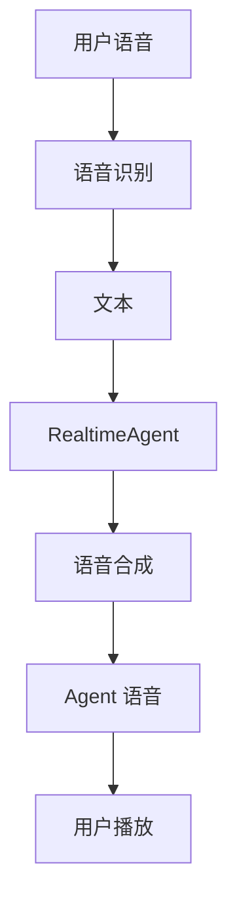

# 项目实战：语音助手

> **Level 8**: 能提交高质量 PR
> **前置要求**: [深度研究助手](./11-deep-research.md)
> **后续章节**: [PR 流程与代码规范](../12-contributing/12-how-to-contribute.md)

---

## 学习目标

学完本章后，你能：
- 构建一个支持语音输入/输出的助手 Agent
- 掌握 DashScope Omni 模型集成
- 理解 RealtimeAgent 的语音交互机制
- 学会配置 TTS 和音频播放

---

## 背景问题

语音助手是 Agent 交互模式的终极形态——从文本的"请求-响应"升级为语音的"实时双向流"。这涉及 ASR（语音识别）、LLM（推理）、TTS（语音合成）三条管道的串联。核心问题：**如何在 WebSocket 长连接上实现"边说边听边想"的实时交互？**

---

## 源码入口

| 项目 | 值 |
|------|-----|
| **参考模块** | `src/agentscope/realtime/` (实时模型), `src/agentscope/agent/_realtime_agent.py` (RealtimeAgent) |
| **核心类** | `RealtimeAgent`, `RealtimeModelBase`, `DashScopeRealtimeModel` |

---

## 项目概述

构建一个语音助手 Agent，支持：
- 语音输入（用户说话）
- 语音输出（Agent 说话）
- 基于 Qwen-Omni 模型的多模态交互

---

## 架构设计



---

## 实现步骤

### 1. 配置环境

```bash
# 设置 API Key
export DASHSCOPE_API_KEY="your-api-key"

# 安装依赖
pip install agentscope[full]
```

### 2. 创建语音助手

```python
import asyncio
import os
from agentscope.agents import RealtimeAgent
from agentscope.message import Msg
from agentscope.model import DashScopeModel

async def main():
    # 创建实时 Agent
    agent = RealtimeAgent(
        name="VoiceBot",
        model=DashScopeModel(
            model_name="qwen-omni",
            api_key=os.environ.get("DASHSCOPE_API_KEY"),
            enable_audio=True,  # 开启音频模式
        ),
    )

    # 启动语音交互
    await agent.run()

asyncio.run(main())
```

---

## 核心组件

### RealtimeAgent

**源码**: `src/agentscope/agent/_realtime_agent.py`

关键参数：
- `model`: 支持音频的模型（如 Qwen-Omni, GPT-4o Audio）
- `enable_audio`: 是否启用音频模式

### TTS 配置

```python
from agentscope.tts import OpenAITTTSModel

tts = OpenAITTTSModel(
    model_name="tts-1",
    stream=True,
)

agent = RealtimeAgent(
    ...
    tts=tts,
)
```

---

## 使用示例

### 交互流程

```python
# 1. 用户通过麦克风输入语音
# 2. Agent 识别语音并转换为文本
# 3. Agent 处理请求（可能调用工具）
# 4. Agent 生成回复（文本 + 语音）
# 5. 语音输出给用户

async def main():
    agent = RealtimeAgent(...)

    # 启动持续交互
    await agent.run()
```

---

## 扩展任务

### 扩展 1：自定义 TTS

```python
from agentscope.tts import DashScopeTTSModel

tts = DashScopeTTSModel(
    model_name="cosyvoice",
    voice="zh-CNFemale",
)

agent = RealtimeAgent(
    ...,
    tts=tts,
)
```

### 扩展 2：添加工具能力

```python
agent = RealtimeAgent(
    ...,
    toolkit=my_toolkit,  # 添加工具
    model=model_with_tools,
)
```

---

## 工程现实与架构问题

### 技术债 (源码级)

| 位置 | 问题 | 影响 | 优先级 |
|------|------|------|--------|
| `RealtimeAgent` | 音频模式无降级处理 | 网络波动时无 fallback | 高 |
| `RealtimeAgent` | 语音识别无用户确认 | ASR 错误可能导致误解 | 中 |
| `Qwen-Omni` | 音频模式下工具调用受限 | 无法使用工具能力 | 高 |
| `tts` | 语音合成无断句优化 | 机械感强，自然度低 | 低 |
| `run()` | 无优雅关闭机制 | 长时间运行后关闭可能卡住 | 中 |

**[HISTORICAL INFERENCE]**: 语音助手面向功能演示，生产环境需要的降级处理、ASR 确认、优雅关闭是后来发现的需求。

### 性能考量

```python
# 语音助手操作延迟估算
语音识别 (ASR): ~100-500ms
LLM 推理: ~200-500ms
语音合成 (TTS): ~200-800ms
端到端延迟: ~500-2000ms

# 网络影响
网络好: ~500ms 端到端
网络差: ~2-5s 端到端
网络极差: 可能完全失败
```

### 音频模式降级问题

```python
# 当前问题: 网络波动时无 fallback
class RobustRealtimeAgent(RealtimeAgent):
    async def run(self):
        while True:
            try:
                audio_input = await self._get_audio_input()
                response = await self._process_audio(audio_input)
                await self._play_audio(response)
            except NetworkError as e:
                logger.warning(f"Network error: {e}, falling back to text mode")
                await self._run_text_mode()
            except AudioError as e:
                logger.error(f"Audio error: {e}")
                await self._play_error_message()

    async def _run_text_mode(self):
        """降级到文本模式"""
        text_input = await self._get_text_input()
        response = await self.agent(text_input)
        await self._display_text(response.content)
```

### 渐进式重构方案

```python
# 方案 1: 添加 ASR 确认机制
class ConfirmingRealtimeAgent(RealtimeAgent):
    async def run(self):
        while True:
            audio_input = await self._get_audio_input()
            text = await self._recognize_speech(audio_input)

            # 询问用户确认识别结果
            confirmed = await self._confirm_text(
                f"您说的是: {text}"
            )

            if not confirmed:
                # 重新识别
                continue

            response = await self._process_text(confirmed)
            await self._play_audio(response)

# 方案 2: 添加优雅关闭
class GracefulRealtimeAgent(RealtimeAgent):
    def __init__(self, *args, **kwargs):
        super().__init__(*args, **kwargs)
        self._shutdown_event = asyncio.Event()

    async def run(self):
        try:
            await asyncio.wait_for(
                self._run_loop(),
                timeout=self._max_runtime
            )
        except asyncio.TimeoutError:
            logger.info("Max runtime reached, shutting down gracefully")

        await self._graceful_shutdown()

    async def _graceful_shutdown(self):
        """优雅关闭：完成当前请求后再关闭"""
        logger.info("Waiting for current request to complete...")

        # 停止接收新请求
        self._接收新请求 = False

        # 等待当前请求完成
        if self._current_task:
            try:
                await asyncio.wait_for(
                    self._current_task,
                    timeout=10.0
                )
            except asyncio.TimeoutError:
                logger.warning("Current task timed out, forcing shutdown")
                self._current_task.cancel()

        # 关闭音频设备
        await self._audio_device.close()

        logger.info("Shutdown complete")
```

---

## 常见问题

**问题：Qwen-Omni 模型无法生成工具调用**
- 这是已知限制，音频输出模式下模型能力受限
- 解决方案：关闭 `enable_audio` 或使用纯文本模式

**问题：TTS 播放延迟**
- 检查网络连接
- 尝试使用流式 TTS 减少首字节延迟

### 危险区域

1. **音频模式无降级**：网络问题时无 fallback 到文本模式
2. **ASR 无用户确认**：语音识别错误可能导致误解
3. **无优雅关闭机制**：长时间运行后关闭可能卡住

---

## 下一步

接下来学习 [PR 流程与代码规范](../12-contributing/12-how-to-contribute.md)。


