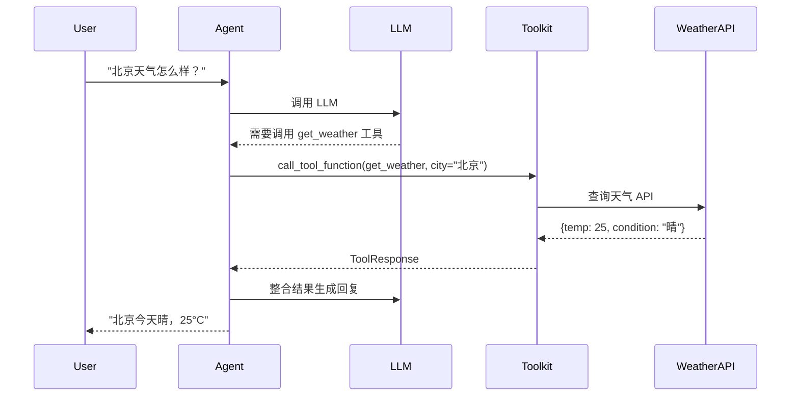

# 项目实战：天气 Agent

> **Level 6**: 能修改小功能
> **前置要求**: [RAG 知识库系统](../07-memory-rag/07-rag-knowledge.md)
> **后续章节**: [客服系统项目](./11-customer-service.md)

---

## 学习目标

学完本章后，你能：
- 从零构建一个带工具调用能力的天气查询 Agent
- 掌握 Toolkit 的工具注册流程
- 理解 ReActAgent 如何与工具系统交互
- 学会使用流式输出提升用户体验

---

## 项目概述

构建一个能查询天气的对话 Agent，支持：
- 输入城市名称，返回实时天气
- 流式输出，边推理边展示
- 支持多轮对话记忆

---

## 背景问题

天气查询是最经典的 Agent 入门项目——它涉及 AgentScope 的所有核心组件（Model, Formatter, Toolkit, Memory），但业务逻辑足够简单（一个 API 调用），让初学者能专注于理解框架的组装方式而非业务复杂性。

本项目回答的核心问题：**如何将 LLM 的"工具调用意图"转化为实际的 Python 函数执行？**

---

## 源码入口

| 项目 | 值 |
|------|-----|
| **参考示例** | `examples/agent/react_agent/main.py` |
| **核心类** | `ReActAgent`, `Toolkit`, `InMemoryMemory`, `DashScopeChatModel` |
| **关键方法** | `register_tool_function()`, `call_tool_function()` → `src/agentscope/tool/_toolkit.py:274,853` |

---

## 架构设计



---

## 实现步骤

### 1. 定义天气工具

```python
from agentscope.message import Msg

def get_weather(city: str) -> str:
    """查询城市天气

    Args:
        city: 城市名称，如"北京"、"上海"

    Returns:
        天气信息字符串
    """
    # 模拟天气 API
    weather_db = {
        "北京": {"temp": 25, "condition": "晴", "humidity": 40},
        "上海": {"temp": 28, "condition": "多云", "humidity": 65},
        "东京": {"temp": 22, "condition": "小雨", "humidity": 80},
    }

    if city not in weather_db:
        return f"抱歉，暂不支持查询 {city} 的天气"

    data = weather_db[city]
    return f"{city}: {data['condition']}, {data['temp']}°C, 湿度 {data['humidity']}%"
```

### 2. 创建 Agent

```python
import asyncio
import os
from agentscope.agent import ReActAgent
from agentscope.formatter import DashScopeChatFormatter
from agentscope.memory import InMemoryMemory
from agentscope.model import DashScopeChatModel
from agentscope.tool import Toolkit

async def main():
    # 创建工具包
    toolkit = Toolkit()
    toolkit.register_tool_function(get_weather)

    # 创建 Agent
    agent = ReActAgent(
        name="WeatherBot",
        sys_prompt="你是一个专业的天气助手，可以查询各城市的天气信息。",
        model=DashScopeChatModel(
            api_key=os.environ.get("DASHSCOPE_API_KEY"),
            model_name="qwen-max",
            enable_thinking=False,
            stream=True,  # 开启流式输出
        ),
        formatter=DashScopeChatFormatter(),
        toolkit=toolkit,
        memory=InMemoryMemory(),
    )

    # 对话
    msg = None
    while True:
        user_input = input("请输入问题（或输入 exit 退出）: ")
        if user_input.lower() == "exit":
            break
        msg = Msg("user", user_input, "user")
        response = await agent(msg)
        print(f"\nAgent: {response.content}\n")

asyncio.run(main())
```

---

## 核心源码解析

### 工具注册

**源码**: `src/agentscope/tool/_toolkit.py:274`

```python
def register_tool_function(
    self,
    func: Callable,
    name: str | None = None,
    description: str | None = None,
    **preset_kwargs: Any,
) -> None:
    """注册工具函数

    1. 解析函数签名获取参数信息
    2. 生成 JSON Schema 描述参数
    3. 存储到 self.tools 字典
    """
```

### 工具调用

**源码**: `_toolkit.py:853`

```python
async def call_tool_function(
    self,
    tool_call: ToolUseBlock,
) -> ToolResponse:
    """执行工具调用

    1. 根据 name 在 self.tools 中查找工具
    2. 注入 preset_kwargs
    3. 调用函数并返回结果
    """
```

---

## 流式输出处理

```python
# 开启 stream=True 时，Agent 会边推理边输出
agent = ReActAgent(
    ...
    stream=True,  # 关键参数
)

# Agent 内部会实时打印推理过程和工具调用
# 用户可以看到 "正在思考..." → "调用工具..." → "获取结果..." 的过程
```

---

## 扩展任务

### 扩展 1：添加预设参数

```python
# API 密钥等敏感信息通过 preset_kwargs 注入
toolkit.register_tool_function(
    get_weather,
    preset_kwargs={"api_key": os.environ["WEATHER_API_KEY"]}
)
```

### 扩展 2：支持多工具

```python
toolkit.register_tool_function(get_weather)
toolkit.register_tool_function(get_forecast)  # 添加天气预报
toolkit.register_tool_function(get_history)  # 添加历史天气
```

---

## 工程现实与架构问题

### 技术债 (源码级)

| 位置 | 问题 | 影响 | 优先级 |
|------|------|------|--------|
| `examples/weather_agent` | 无真实天气 API 集成 | 示例使用模拟数据无法用于生产 | 高 |
| `main.py:50` | stream=True 但无流式处理优化 | 推理过程打印可能乱序 | 中 |
| `_toolkit.py:274` | 工具函数参数无类型验证 | 类型错误在运行时才报错 | 中 |
| `_toolkit.py:853` | 工具调用无超时机制 | 慢工具导致 Agent 永久等待 | 高 |
| `main.py:100` | API Key 直接从环境变量读取 | 未处理环境变量缺失的情况 | 中 |

**[HISTORICAL INFERENCE]**: 天气 Agent 示例代码主要面向教学目的，使用模拟数据。生产环境需要的真实 API 集成、错误处理、超时控制未包含在示例中。

### 性能考量

```python
# 天气 Agent 操作延迟估算
LLM 推理: ~200-500ms (取决于模型)
工具调用: ~50-200ms (本地函数或 API)
流式输出: ~10-50ms/ token

# 内存占用
InMemoryMemory: ~10KB/100条消息
Toolkit: ~1KB/工具
```

### 工具调用超时问题

```python
# 当前问题: 工具调用无超时机制
class ToolCallAgent(ReActAgent):
    async def _call_tool(self, tool_name, tool_input):
        # 如果工具卡住，这里会永久等待
        return await self.toolkit.call_tool_function(...)

# 解决方案: 添加超时包装
import asyncio

async def call_tool_with_timeout(toolkit, tool_name, tool_input, timeout=10.0):
    try:
        return await asyncio.wait_for(
            toolkit.call_tool_function(tool_name, tool_input),
            timeout=timeout
        )
    except asyncio.TimeoutError:
        logger.error(f"Tool {tool_name} timed out after {timeout}s")
        return ToolResponse(content=[TextBlock(text=f"工具调用超时: {tool_name}")])
```

### 渐进式重构方案

```python
# 方案 1: 添加真实天气 API
class RealWeatherToolkit(Toolkit):
    def __init__(self, api_key: str):
        super().__init__()
        self.api_key = api_key
        self.register_tool_function(self._get_weather)

    async def _get_weather(self, city: str) -> str:
        import httpx
        async with httpx.AsyncClient() as client:
            response = await client.get(
                f"https://api.weather.com/v3/wx/conditions/current",
                params={"city": city, "apiKey": self.api_key},
                timeout=10.0,
            )
            if response.status_code != 200:
                raise APIError(f"Weather API error: {response.status_code}")
            return response.json()

# 方案 2: 添加 API Key 验证
def validate_api_key():
    api_key = os.environ.get("DASHSCOPE_API_KEY")
    if not api_key:
        raise EnvironmentError(
            "DASHSCOPE_API_KEY environment variable is not set. "
            "Please set it before running the agent."
        )
    return api_key
```

---

## 常见问题

**问题：Agent 不调用工具**
- 检查 `toolkit.get_json_schemas()` 是否返回正确
- 检查工具函数是否有完整的 docstring

**问题：工具返回结果不正确**
- 检查函数返回值是否为字符串
- 检查参数类型是否与 docstring 一致

### 危险区域

1. **使用模拟数据**：生产环境需要替换为真实 API
2. **工具调用无超时**：慢工具导致 Agent 永久等待
3. **API Key 无验证**：环境变量缺失时错误信息不明确

---

## 下一步

接下来学习 [客服系统项目](./11-customer-service.md)。


