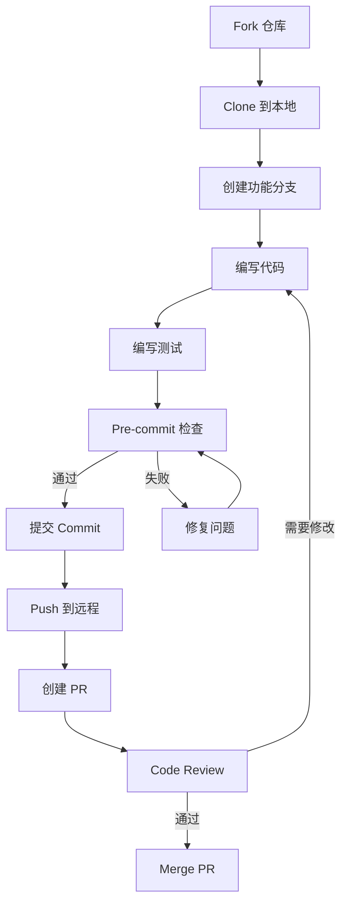

# PR 流程与代码规范

> **Level 8**: 能提交高质量 PR
> **前置要求**: [天气 Agent 项目](../11-projects/11-weather-agent.md)
> **后续章节**: [源码导航地图](./12-codebase-navigation.md)

---

## 学习目标

学完本章后，你能：
- 理解 AgentScope 的完整 PR 提交流程
- 遵循代码规范和 Git 提交规范
- 通过所有 pre-commit 检查
- 编写符合项目标准的文档和测试

---

## 背景问题

从"能运行 AgentScope"到"能为 AgentScope 贡献代码"，需要跨越的不只是技术门槛，还有流程门槛：

1. **代码规范**：`pylint` + `flake8` + `black` + `mypy` 四重检查
2. **Pre-commit Hook**：17 个 hooks 在提交前自动运行
3. **测试要求**：新功能必须有对应测试
4. **文档要求**：docstring 使用 Google-style 格式

本章将这些流程从 `.pre-commit-config.yaml` 和 `CONTRIBUTING.md` 中提取出来，形成可操作的步骤指南。

---

## 源码入口

| 项目 | 值 |
|------|-----|
| **贡献指南** | `CONTRIBUTING.md` (根目录) |
| **Pre-commit 配置** | `.pre-commit-config.yaml` |
| **CI 配置** | `.github/workflows/` |
| **代码标准** | `.github/copilot-instructions.md` |

---

## PR 提交流程

### 完整流程



### 详细步骤

```bash
# 1. Fork 仓库（通过 GitHub UI）

# 2. Clone 到本地
git clone https://github.com/YOUR_NAME/agentscope.git
cd agentscope

# 3. 创建功能分支
git checkout -b feat/your-feature-name

# 4. 安装开发依赖
pip install -e "agentscope[full]"

# 5. 开发...
# 编写代码和测试

# 6. 运行 pre-commit 检查
pre-commit run --all-files

# 7. 提交代码
git add .
git commit -m "feat(module): add your feature description"

# 8. Push 到远程
git push origin feat/your-feature-name

# 9. 在 GitHub 上创建 Pull Request
```

---

## 代码规范

### 文件命名

| 类型 | 规则 | 示例 |
|------|------|------|
| 内部模块 | `_` 前缀 | `_toolkit.py` |
| 公开 API | 无前缀 | `toolkit.py` |
| 测试文件 | `_test.py` 后缀 | `model_test.py` |

### 导入规则

**必须使用懒加载**：

```python
# ✅ 正确：第三方库在使用时导入
def some_function():
    from external_lib import Something
    return Something()

# ❌ 错误：在文件顶部导入
from external_lib import Something
```

### Docstring 标准

**必须使用英文**，遵循以下模板：

```python
def func(
    self,
    param1: str,
    param2: int | None = None,
) -> str:
    """Short description of the function.

    Longer description if needed, explaining the purpose,
    behavior, and any important details.

    Args:
        param1 (`str`):
            Description of param1
        param2 (`int | None`, optional):
            Description of param2. Defaults to None.

    Returns:
        `str`:
            Description of the return value

    Example:
        >>> result = func("hello", 42)
        >>> print(result)
        hello42
    """
```

### 类型注解

**必须使用类型注解**：

```python
# ✅ 正确
def process_data(data: list[dict[str, Any]]) -> dict[str, Any]:
    ...

# ❌ 错误
def process_data(data):
    ...
```

---

## Pre-commit 检查

### 检查列表

| 检查项 | 命令 | 说明 |
|--------|------|------|
| black | `black --check src/` | 代码格式化 |
| flake8 | `flake8 src/` | 代码风格 |
| mypy | `mypy src/` | 类型检查 |
| isort | `isort --check src/` | 导入排序 |
| pylint | `pylint src/` | 代码质量 |

### 跳过检查

**禁止跳过文件级检查**。

唯一允许跳过的情况：Agent 类的 system prompt 参数（避免 `\n` 格式化问题）。

```python
# pylint: disable=unnecessary-paren
# noqa: E501
```

---

## Git 提交规范

### Commit 格式

```
<type>(<scope>): <subject>

<body>

<footer>
```

### Type 前缀

| Type | 说明 | 示例 |
|------|------|------|
| `feat` | 新功能 | `feat(agent): add new agent type` |
| `fix` | Bug 修复 | `fix(toolkit): resolve tool registration bug` |
| `docs` | 文档更新 | `docs(readme): update installation guide` |
| `refactor` | 重构 | `refactor(memory): optimize cache logic` |
| `test` | 测试 | `test(agent): add integration tests` |
| `ci` | CI/CD | `ci: add new github workflow` |
| `chore` | 构建/工具 | `chore: upgrade dependencies` |

### 示例

```bash
git commit -m "feat(toolkit): add support for dynamic tool registration

- Add register_tool_async method
- Update JSON schema generation for async tools
- Add unit tests for async registration

Closes #123"
```

---

## 测试要求

### 测试结构

```python
import pytest
from agentscope.module import MyClass

class TestMyClass:
    """Test cases for MyClass."""

    @pytest.mark.asyncio
    async def test_basic_functionality(self):
        """Test basic functionality."""
        instance = MyClass()
        result = await instance.do_something()
        assert result == expected_value

    @pytest.mark.asyncio
    async def test_error_handling(self):
        """Test error handling for invalid input."""
        with pytest.raises(ValueError):
            await MyClass().do_something(invalid_input)
```

### 运行测试

```bash
# 运行所有测试
pytest tests/

# 运行单个文件
pytest tests/model_openai_test.py

# 按关键词过滤
pytest tests/ -k "memory"

# 隔离测试（每个测试独立进程）
pytest tests/ --forked
```

---

## PR 模板

```markdown
## Summary
<!-- 简短描述 PR 的内容和目的 -->

## Changes
<!-- 详细描述具体变更 -->

## Test Plan
<!-- 测试计划或验证步骤 -->

- [ ] Unit tests added
- [ ] Integration tests passed
- [ ] Manual verification completed

## Checklist
- [ ] Code follows the project's coding standards
- [ ] Pre-commit checks passed
- [ ] Documentation updated (if needed)
- [ ] Breaking changes documented (if any)
```

---

## Code Review 要点

### 必须满足 [MUST]
- 懒加载第三方库
- 内部模块使用 `_` 前缀
- 所有函数有 docstring
- 无硬编码密钥
- 新功能有测试

### 强烈建议 [SHOULD]
- 代码简洁，无冗余
- 复用现有工具函数
- 合理拆分大文件

---

## 下一步

接下来学习 [源码导航地图](./12-codebase-navigation.md)。


---

## 工程现实与架构问题

### 技术债 (源码级)

| 位置 | 问题 | 影响 | 优先级 |
|------|------|------|--------|
| `pre-commit` | hook 失败信息不明确 | 难以快速定位问题 | 中 |
| `pre-commit` | 跳过检查的例外过多 | 代码规范执行不一致 | 中 |
| `docs` | 文档更新无强制检查 | 文档与代码不同步 | 低 |
| `test` | 集成测试覆盖不足 | 难以发现跨模块问题 | 高 |

**[HISTORICAL INFERENCE]**: pre-commit hooks 的设计优先考虑了开发体验（允许跳过），而非强制执行规范。这导致了规范执行的不一致性。

### 性能考量

```bash
# Pre-commit 检查时间估算
black:        ~1-3s (取决于文件数量)
flake8:       ~2-5s (首次全量)
mypy:         ~10-30s (类型检查较慢)
isort:        ~0.5-2s
pylint:       ~5-15s (代码质量检查)

# 完整 pre-commit 运行: ~20-60s
# 增量检查 (git diff): ~5-15s
```

### 渐进式重构方案

```python
# 方案 1: 改进 pre-commit 失败信息
# .pre-commit-config.yaml
fail_fast: true  # 第一个失败就停止
verbose: true    # 显示详细输出

# 方案 2: 添加文档同步检查
from pathlib import Path
import re

def check_docs_sync(src_dir: str, docs_dir: str) -> list[str]:
    """检查源码中的 API 变更是否同步到文档"""
    issues = []

    # 提取源码中的公开函数
    src_functions = set()
    for py_file in Path(src_dir).rglob("*.py"):
        if "__init__" in str(py_file):
            src_functions.update(_extract_public_functions(py_file))

    # 检查文档是否提及
    for doc_file in Path(docs_dir).rglob("*.md"):
        content = doc_file.read_text()
        mentioned_functions = set(re.findall(r'`(\w+)\(.*?\)`', content))

        for func in mentioned_functions:
            if func not in src_functions:
                issues.append(f"文档提及未知函数: {func} in {doc_file}")

    return issues

# 方案 3: 添加测试覆盖率 gate
# pytest.ini
[pytest]
addopts = --cov=src/agentscope --cov-fail-under=80

# 这要求测试覆盖率必须达到 80% 才能通过
```

