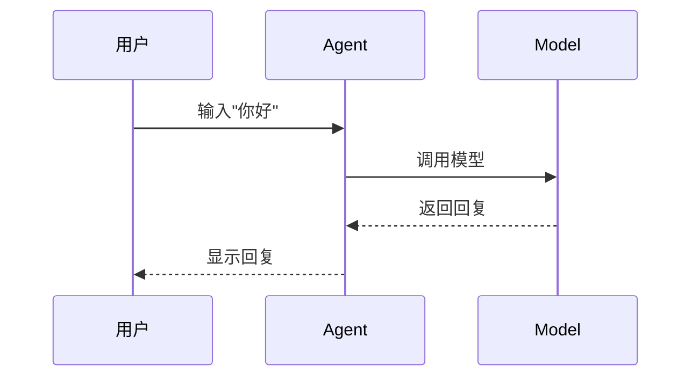
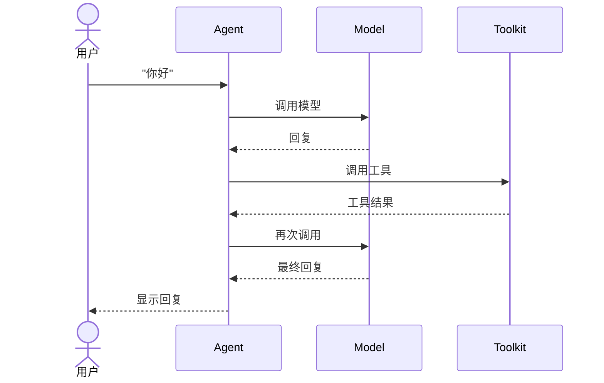

# 写作风格指南

> 本书借鉴《网络是怎样连接的》的写作风格，所有作者请务必遵循本指南。

---

## 一、核心写作原则

### 1. 追踪式学习优先

**每个章节都要回答一个问题**：数据在这一步是怎么流动的？

```
❌ 不要这样写                    ✓ 要这样写
"Msg是消息对象"          →  "Msg是Agent之间传递的消息，
包含name/content/role"          当用户发消息时，Msg是这样创建的..."
```

### 2. 图解优先于文字

每章至少包含1张追踪图，用ASCII或Mermaid格式：



### 3. Java对照贯穿始终

每章至少包含1处Java对照，帮助Java开发者建立概念映射：

```markdown
**💡 Java开发者注意**
- Python的`self`就是Java的`this`
- 但Python必须显式声明self，Java的this是隐式的
```

---

## 二、章节结构模板

```markdown
## X-Y 章节标题

### 🎯 这一章的目标
学完之后，你能XXX

### 🚀 先跑起来
[完整可运行的代码，showLineNumbers]

### 🔍 追踪数据流动
[追踪图或时序图]

### 📖 深入理解
[核心概念解释]

### 💡 Java开发者注意
[Java对照和注意事项]

### 🎯 思考题
1. ...
2. ...
3. ...

<details>
<summary>思考题答案</summary>

1. ...
2. ...

</details>

★ **Insight** ─────────────────────────────────────
[关键洞察1]
[关键洞察2]
─────────────────────────────────────────────────
```

---

## 三、写作风格要求

### ✅ 要这样做

1. **用"你"而不是"读者"**
   - ❌ "读者需要理解..."
   - ✅ "你会理解..."

2. **先给结论，再解释原因**
   - ❌ "这是因为..."
   - ✅ "这是因为...（后面解释）"

3. **用"说人话"解释术语**
   - ❌ "ReAct是一种推理框架"
   - ✅ "ReAct = Reason + Act，就是'先想后做'"

4. **适当使用emoji增加亲和力**
   - 🎯 目标
   - 🔍 追踪
   - 💡 注意事项
   - 🚀 代码
   - ⚠️ 坑预警

5. **代码注释要友好**
   ```python
   # 这里是Java的xxx，Python这样写
   ```

### ❌ 不要这样做

1. 不要用"本节将讲解..."
2. 不要用"请注意..."（用"💡 Java开发者注意"代替）
3. 不要大段定义
4. 不要学术化的描述
5. 不要冷冰冰的"技术说明"

---

## 四、追踪图规范

### 消息追踪图

```
用户 → [Msg创建] → [Pipeline路由] → [Agent处理] → [回复Msg] → 用户
```

### 时序追踪图



---

## 五、代码规范

### 1. 代码必须完整可运行

```python
# ❌ 错误 - 碎片代码
agent = agentscope.ReActAgent

# ✅ 正确 - 完整可运行
import agentscope
from agentscope.message import Msg

agentscope.init()
agent = agentscope.ReActAgent(
    name="my_agent",
    model=agentscope.OpenAIChatModel(api_key="..."),
    sys_prompt="你是一个有帮助的助手"
)
result = await agent(Msg(name="user", content="你好", role="user"))
print(result)
```

### 2. 代码注释要标注行号

```python showLineNumbers
# 这是第1行
# 这是第2行
```

### 3. Java对照代码也要完整

```python
# Python
def greet(name: str) -> str:
    return f"Hello, {name}"

// Java
public String greet(String name) {
    return "Hello, " + name;
}
```

---

## 六、术语处理

### 首次出现用**粗体**

```markdown
**Msg** 是消息对象，**Agent** 是智能体...
```

### 术语"说人话"专栏

每章结尾用对话形式解释术语：

```markdown
### 📖 术语其实很简单

**Msg** = **M**essage
> "就是消息嘛！就像微信消息一样，有发送者、内容、接收者"

**Pipeline** = 管道
> "就像工厂的流水线，消息从一端进去，从另一端出来"
```

---

## 七、常见错误处理

### 用"坑预警"代替"请注意"

```markdown
⚠️ **坑预警**：Python的缩进很容易出错！
- 用4个空格，不要用Tab
- 混用空格和Tab会导致IndentationError
```

---

## 八、源码引用规范

### 必须验证的内容

编写涉及源码的章节时，**必须**验证以下内容：

1. **文件路径验证**
   ```bash
   # 确认文件存在
   ls src/agentscope/agent/_react_agent.py
   ```

2. **行号验证**
   ```bash
   # 确认方法/类的行号
   grep -n "def reply" src/agentscope/agent/_react_agent.py
   ```

3. **参数签名验证**
   ```python
   # 确认参数名称与源码一致
   # ❌ 错误：MsgHub(agents=[...])
   # ✅ 正确：MsgHub(participants=[...])
   ```

### 源码引用格式

```markdown
**文件**: `src/agentscope/agent/_react_agent.py:376-537`

```python showLineNumbers
async def reply(  # 第376行开始
    ...
```
```

### 常见错误避免

| 错误类型 | 后果 | 正确做法 |
|----------|------|----------|
| 行号错误 | 读者找不到代码 | 用 `grep -n` 验证 |
| 参数名错误 | 代码无法运行 | 用IDE自动补全验证 |
| 已删除的API | 文档过时 | 提交前运行示例代码 |

---

## 九、文档维护指南

### 源码更新时的文档同步

当 AgentScope 源码发生以下变化时，**必须**同步更新文档：

| 源码变化 | 文档更新要求 |
|----------|--------------|
| 新增类/方法 | 在对应章节添加说明，更新源码映射索引 |
| 方法签名变化 | 更新参数说明、示例代码 |
| 行号变化 | 更新所有引用的行号 |
| API废弃 | 标记为已废弃，添加迁移指南 |

### 版本管理

在章节开头标注适用版本：
```markdown
> **适用版本**: AgentScope >= 1.0.19
```

### 验证命令

提交前运行以下命令验证文档质量：

```bash
# 检查文档中引用的文件是否存在
grep -rh "src/agentscope/" teaching/ | grep "\.py:" | while read line; do
    file=$(echo "$line" | cut -d: -f1)
    if [ ! -f "$file" ]; then
        echo "Missing: $file"
    fi
done
```

---

## 十、质量检查清单

提交章节前，请检查：

- [ ] 代码是否完整可运行？
- [ ] 是否有追踪图？
- [ ] 是否有Java对照？
- [ ] 术语是否首次出现用粗体？
- [ ] 是否有"说人话"的术语解释？
- [ ] 是否有思考题和答案？
- [ ] 是否遵循本指南的风格？
- [ ] 源码文件路径是否正确？
- [ ] 引用的行号是否与当前源码匹配？
- [ ] API参数名是否与源码一致？
- [ ] 是否标注了适用版本？
