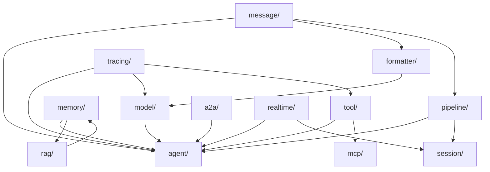
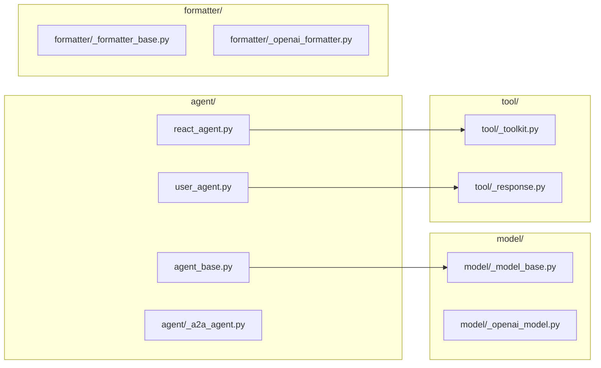
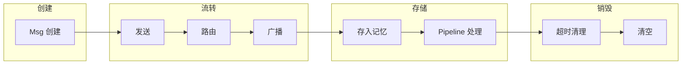
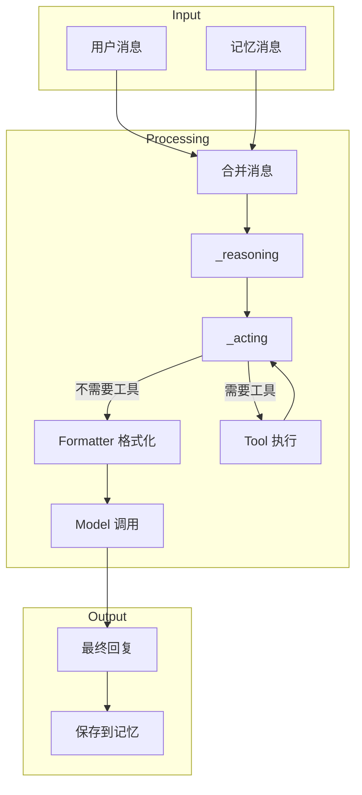
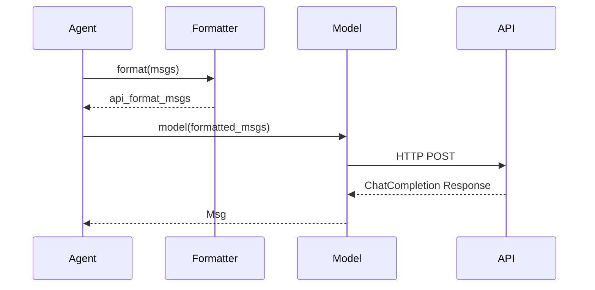
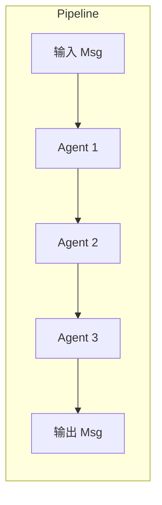

# AgentScope 架构文档

> **Level**: 0 (前置基础)
> **前置要求**: [repository-map.md](./repository-map.md), [tech-stack.md](./tech-stack.md)
> **目标**: 理解 AgentScope 的模块边界、生命周期、数据流与调用链

---

## 1. 模块边界图

### 1.1 核心模块依赖关系



### 1.2 模块职责边界

| 模块 | 职责边界 | 不应做什么 |
|------|----------|-----------|
| `agent/` | Agent 行为逻辑 | 不应直接调用 LLM API |
| `model/` | LLM API 调用 | 不应管理 Agent 状态 |
| `formatter/` | 消息格式转换 | 不应决定调用哪个 Model |
| `tool/` | 工具执行 | 不应管理 Agent 记忆 |
| `memory/` | 消息存储 | 不应执行工具 |
| `pipeline/` | 多 Agent 编排 | 不应定义 Agent 逻辑 |
| `message/` | 消息结构定义 | 不应包含业务逻辑 |

### 1.3 模块文件边界



---

## 2. 生命周期图

### 2.1 Agent 生命周期

```mermaid
stateDiagram-v2
    [*] --> Created: Agent()
    Created --> Ready: 初始化完成
    Ready --> Running: reply(msg)
    Running --> Running: 工具调用循环
    Running --> Ready: 返回最终回复
    Ready --> [*]: 销毁

    Running --> Running: 推理循环
    note right of Running
        _reasoning() → _acting()
        → 工具调用 → 结果处理
    end
```

### 2.2 消息生命周期



### 2.3 工具执行生命周期

```mermaid
flowchart TD
    START[LLM 返回 ToolUseBlock] --> PARSE[解析工具名和参数]
    PARSE --> LOOKUP[查找工具函数]
    LOOKUP --> CHECK{函数类型}
    CHECK -->|async| ASYNC[await func()]
    CHECK -->|sync| SYNC[run_in_executor]
    ASYNC --> WRAP[包装 ToolResponse]
    SYNC --> WRAP
    WRAP --> RESULT[返回结果给 LLM]
    RESULT --> END[结束]
```

---

## 3. 数据流图

### 3.1 Agent 完整数据流



### 3.2 Model 调用数据流



### 3.3 Pipeline 数据流



---

## 4. 调用链索引

### 4.1 核心调用链

| 场景 | 调用链 | 入口文件 |
|------|--------|----------|
| **Agent 运行** | `agent(msg)` → `__call__()` → `reply()` → `_reasoning()` → `_acting()` → `toolkit.call_tool_function()` | `agent/_react_agent.py:376` |
| **工具注册** | `register_tool_function()` → `_parse_tool_function()` [in `_utils/_common.py:339`] → `pydantic.create_model()` → `model_json_schema()` | `tool/_toolkit.py:274` |
| **工具调用** | `call_tool_function()` → AsyncGenerator → `_object_wrapper` / `_async_generator_wrapper` | `tool/_toolkit.py:853` |
| **消息广播** | `MsgHub.broadcast()` → `agent.observe()` | `pipeline/_msghub.py:130` |
| **Pipeline** | `SequentialPipeline.__call__()` → `sequential_pipeline()` [in `_functional.py`] | `pipeline/_class.py:27` |
| **Model 调用** | `model.__call__()` → `formatter.format()` → `client.chat.completions.create()` | `model/_openai_model.py:176` |

### 4.2 详细调用链：Agent.reply()

```
AgentBase.__call__() [agent/_agent_base.py:448]
  └─> ReActAgent.reply() [agent/_react_agent.py:376]
      ├─> memory.add(msg) [agent/_react_agent.py:396]
      ├─> _retrieve_from_long_term_memory() [agent/_react_agent.py:882]
      ├─> _retrieve_from_knowledge() [agent/_react_agent.py:908]
      ├─> [for _ in range(max_iters):]
      │   ├─> _compress_memory_if_needed() [agent/_react_agent.py:1015]
      │   ├─> _reasoning() [agent/_react_agent.py:540]
      │   │   ├─> formatter.format(msgs) [formatter/_formatter_base.py:15]
      │   │   └─> model(prompt, tools, tool_choice) [model/_openai_model.py:176]
      │   └─> _acting() [agent/_react_agent.py:657]
      │       └─> toolkit.call_tool_function() [tool/_toolkit.py:853]
      │           └─> AsyncGenerator[ToolResponse]
      └─> _summarizing() [agent/_react_agent.py:725] (if reply_msg is None)
```

### 4.3 详细调用链：工具注册

```
Toolkit.register_tool_function() [tool/_toolkit.py:274]
  ├─> _parse_tool_function() [NOT in _toolkit.py — in _utils/_common.py:339]
  │   ├─> docstring_parser.parse(func.__doc__)
  │   ├─> inspect.signature(func)
  │   ├─> pydantic.create_model("_StructuredOutputDynamicClass", **fields)
  │   └─> model.model_json_schema()
  ├─> 从 JSON Schema 中移除 preset_kwargs 参数
  └─> self.tools[name] = RegisteredToolFunction(...)
```

### 4.4 详细调用链：MsgHub.broadcast()

```
MsgHub.broadcast() [pipeline/_msghub.py:130]
  └─> for agent in self.participants:
      └─> agent.observe(msg) [agent/_agent_base.py:185]
  [注: MsgHub 不维护 _subscribers，订阅关系通过 Agent 实例的 reset_subscribers 管理]
```

---

## 5. 模块间数据格式

### 5.1 Msg 结构流转

```
用户代码: Msg(name="user", content="Hello", role="user")
    ↓
Agent.receive(): 原样传递
    ↓
memory.add(): 存储 Msg 对象
    ↓
memory.get(): 返回 Msg 列表
    ↓
formatter.format(): 转换为 API 格式 dict
    ↓
model._call_llm(): 发送 dict 到 API
```

### 5.2 ToolUseBlock 到 ToolResponse

```
LLM Response: {"tool_calls": [{"id": "call_123", "name": "get_weather", ...}]}
    ↓
ToolUseBlock(id="call_123", name="get_weather", ...)
    ↓
toolkit.call_tool_function()
    ↓
ToolResponse(id="call_123", name="get_weather", content="...")
    ↓
返回给 LLM 继续推理
```

---

## 6. 关键文件索引

### 6.1 Agent 模块

| 文件 | 行数 | 关键方法 |
|------|------|----------|
| `agent/_agent_base.py` | 774 | `reply()`, `observe()`, `__call__()` |
| `agent/_react_agent_base.py` | 117 | ReActAgentBase, `_ReActAgentMeta` |
| `agent/_react_agent.py` | 1137 | ReAct 完整实现 |

### 6.2 Model 模块

| 文件 | 行数 | 关键方法 |
|------|------|----------|
| `model/_model_base.py` | - | `__call__()` |
| `model/_openai_model.py` | 795 | `_call_llm()`, `parse_stream()` |

### 6.3 Tool 模块

| 文件 | 行数 | 关键方法 |
|------|------|----------|
| `tool/_toolkit.py` | 1684 | `register_tool_function()`, `call_tool_function()` |

### 6.4 Pipeline 模块

| 文件 | 行数 | 关键方法 |
|------|------|----------|
| `pipeline/_class.py` | - | `SequentialPipeline.forward()`, `FanoutPipeline.forward()` |
| `pipeline/_msghub.py` | 157 | `broadcast()`, `add()`, `delete()` |

---

