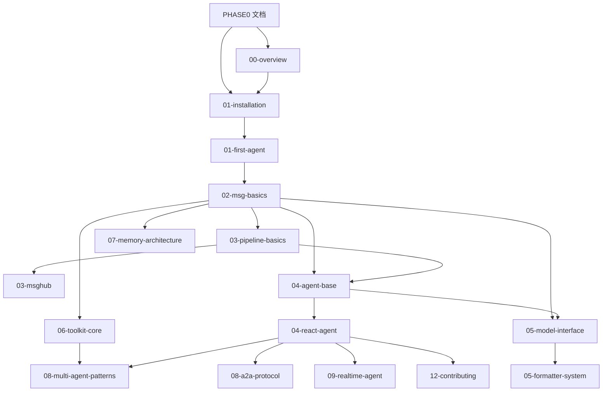
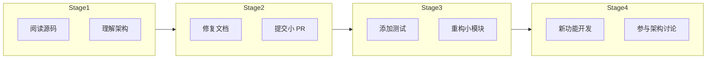

# AgentScope 课程大纲

> **Level**: 0 (前置基础)
> **前置要求**: [architecture.md](./architecture.md)
> **目标**: 理解 Level 1-9 学习路径、章节依赖关系、Contributor 成长路线

---

## 1. 学习路径概览

### 1.1 完整学习路线图

```mermaid
flowchart TD
    subgraph Level0
        R0A[repository-map]
        R0B[tech-stack]
        R0C[system-entrypoints]
        R0D[teaching-audit]
    end

    subgraph Level1
        L1A[00-overview]
        L1B[01-installation]
    end

    subgraph Level2
        L2A[01-first-agent]
        L2B[02-msg-basics]
    end

    subgraph Level3
        L3A[03-pipeline-basics]
        L3B[03-msghub]
        L3C[04-agent-base]
    end

    subgraph Level4
        L4A[04-react-agent]
        L4B[05-model-interface]
    end

    subgraph Level5
        L5A[05-formatter-system]
        L5B[06-toolkit-core]
        L5C[07-memory-architecture]
    end

    subgraph Level6
        L6A[08-multi-agent-patterns]
        L6B[08-a2a-protocol]
    end

    subgraph Level7
        L7A[09-plan-module]
        L7B[09-realtime-agent]
        L7C[09-session-management]
    end

    subgraph Level8
        L8A[10-deployment]
        L8B[11-projects]
    end

    subgraph Level9
        L9A[12-contributing]
        L9B[12-codebase-navigation]
        L9C[12-architecture-decisions]
    end

    Level0 --> Level1
    Level1 --> Level2
    Level2 --> Level3
    Level3 --> Level4
    Level4 --> Level5
    Level5 --> Level6
    Level6 --> Level7
    Level7 --> Level8
    Level8 --> Level9
```

### 1.2 学习目标分级

| Level | 目标 | 读者角色 | 预期产出 |
|-------|------|----------|----------|
| **Level 0** | 建立整体认知 | 新手 | 知道项目是什么、在哪里 |
| **Level 1** | 入门 | 新手 | 能运行 Hello World |
| **Level 2** | 基础 | 实习生 | 能修改简单逻辑 |
| **Level 3** | 模块边界 | Junior Dev | 理解模块职责 |
| **Level 4** | 核心数据流 | Mid Dev | 能追踪调用链 |
| **Level 5** | 源码调用链 | Senior Dev | 能修改核心功能 |
| **Level 6** | 系统集成 | 架构师 | 能设计多 Agent 系统 |
| **Level 7** | 高级机制 | 高级工程师 | 能优化性能 |
| **Level 8** | 项目实战 | 全级别 | 完成实战项目 |
| **Level 9** | Contributor | Contributor | 能提交高质量 PR |

---

## 2. 章节依赖关系

### 2.1 依赖关系矩阵

| 章节 | 前置章节 | 强依赖 | 弱依赖 |
|------|----------|--------|--------|
| 01-first-agent | 01-installation | ✅ | - |
| 02-msg-basics | 01-first-agent | ✅ | - |
| 02-content-blocks | 02-msg-basics | ✅ | - |
| 03-pipeline-basics | 02-msg-basics | ✅ | - |
| 03-msghub | 03-pipeline-basics | ✅ | - |
| 04-agent-base | 02-msg-basics, 03-pipeline-basics | ✅ | - |
| 04-react-agent | 04-agent-base | ✅ | 05-model-interface |
| 04-user-agent | 04-agent-base | - | ✅ |
| 04-a2a-agent | 04-agent-base | ✅ | - |
| 05-model-interface | 02-msg-basics | ✅ | - |
| 05-formatter-system | 05-model-interface | ✅ | - |
| 06-toolkit-core | 02-msg-basics | ✅ | - |
| 06-tool-registration | 06-toolkit-core | ✅ | - |
| 06-tool-execution | 06-tool-registration | ✅ | - |
| 07-memory-architecture | 04-agent-base | ✅ | - |
| 08-multi-agent-patterns | 04-react-agent, 03-pipeline-basics | ✅ | - |
| 08-tracing-debugging | 04-react-agent | - | ✅ |
| 09-realtime-agent | 04-agent-base, 09-session-management | ✅ | - |

### 2.2 依赖关系图

---

## 3. Level 1-9 详细学习路径

### Level 0: 前置基础

**目标**: 建立整体认知，理解架构入口

| 文档 | 时长 | 学习内容 |
|------|------|----------|
| [repository-map.md](./repository-map.md) | 20分钟 | 仓库结构、模块职责 |
| [tech-stack.md](./tech-stack.md) | 15分钟 | 技术选型、依赖 |
| [system-entrypoints.md](./system-entrypoints.md) | 30分钟 | 关键调用链 |
| [architecture.md](./architecture.md) | 30分钟 | 模块边界、数据流 |
| [teaching-audit.md](./teaching-audit.md) | 10分钟 | 内容覆盖 |

**产出**: 能回答"AgentScope 是什么"和"源码在哪里"

---

### Level 1: 入门级

**目标**: 知道项目是干什么的

| 章节 | 时长 | 学习内容 | 产出 |
|------|------|----------|------|
| [00-overview.md](../00-architecture-overview/00-overview.md) | 30分钟 | AgentScope 核心概念 | 能解释什么是 Agent |
| [01-installation.md](../01-getting-started/01-installation.md) | 30分钟 | 环境搭建、API Key | 能运行 `pip install agentscope` |

**产出**: 完成开发环境配置

---

### Level 2: 基础级

**目标**: 能运行项目

| 章节 | 时长 | 学习内容 | 产出 |
|------|------|----------|------|
| [01-first-agent.md](../01-getting-started/01-first-agent.md) | 1小时 | 运行第一个 Agent | 能运行 `agentscope.init()` + `ReActAgent` |
| [02-msg-basics.md](../02-message-system/02-msg-basics.md) | 1小时 | Msg 的 name/content/role | 能创建 `Msg(name="user", content="...", role="user")` |

**产出**: 完成第一个可运行的 Agent

---

### Level 3: 模块边界

**目标**: 理解模块边界

| 章节 | 时长 | 学习内容 | 产出 |
|------|------|----------|------|
| [03-pipeline-basics.md](../03-pipeline/03-pipeline-basics.md) | 2小时 | SequentialPipeline | 能用 Pipeline 连接多个 Agent |
| [03-msghub.md](../03-pipeline/03-msghub.md) | 1小时 | MsgHub 发布-订阅 | 能实现广播消息 |
| [04-agent-base.md](../04-agent-architecture/04-agent-base.md) | 2小时 | AgentBase 抽象 | 能解释 Agent 的 reply/observe 方法 |

**产出**: 能选择合适的模块组合

---

### Level 4: 核心数据流

**目标**: 理解核心数据流

| 章节 | 时长 | 学习内容 | 产出 |
|------|------|----------|------|
| [04-react-agent.md](../04-agent-architecture/04-react-agent.md) | 4小时 | Reasoning-Acting 循环 | 能追踪 Agent 的完整调用链 |
| [05-model-interface.md](../05-model-formatter/05-model-interface.md) | 2小时 | ChatModelBase 统一接口 | 能切换不同的 LLM |

**产出**: 能理解 Agent 如何调用 LLM

---

### Level 5: 源码调用链

**目标**: 能跟踪源码调用链

| 章节 | 时长 | 学习内容 | 产出 |
|------|------|----------|------|
| [05-formatter-system.md](../05-model-formatter/05-formatter-system.md) | 2小时 | Formatter 系统分析 | 能添加新的 Formatter |
| [06-toolkit-core.md](../06-tool-system/06-toolkit-core.md) | 3小时 | Toolkit 核心 | 能使用 `register_tool_function()` |
| [07-memory-architecture.md](../07-memory-rag/07-memory-architecture.md) | 2小时 | 记忆系统总体设计 | 能选择合适的记忆实现 |

**产出**: 能修改源码级别的功能

---

### Level 6: 修改小功能

**目标**: 能修改小功能

| 章节 | 时长 | 学习内容 | 产出 |
|------|------|----------|------|
| [08-multi-agent-patterns.md](../08-multi-agent/08-multi-agent-patterns.md) | 2小时 | 多 Agent 协作模式 | 能设计多 Agent 系统 |
| [08-a2a-protocol.md](../08-multi-agent/08-a2a-protocol.md) | 1小时 | A2A 协议详解 | 能使用 A2AAgent |

**产出**: 能实现多 Agent 协作

---

### Level 7: 高级机制

**目标**: 理解高级机制

| 章节 | 时长 | 学习内容 | 产出 |
|------|------|----------|------|
| [09-plan-module.md](../09-advanced-modules/09-plan-module.md) | 2小时 | Plan 模块 | 能实现复杂任务分解 |
| [09-realtime-agent.md](../09-advanced-modules/09-realtime-agent.md) | 2小时 | 实时代理 | 能实现语音交互 |
| [09-session-management.md](../09-advanced-modules/09-session-management.md) | 1小时 | 会话管理 | 能管理长会话 |

**产出**: 能使用高级特性优化系统

---

### Level 8: 项目实战

**目标**: 完成实战项目

| 章节 | 时长 | 项目 |
|------|------|------|
| [11-weather-agent.md](../11-projects/11-weather-agent.md) | 3小时 | 天气 Agent |
| [11-customer-service.md](../11-projects/11-customer-service.md) | 4小时 | 智能客服 |
| [11-multi-agent-debate.md](../11-projects/11-multi-agent-debate.md) | 4小时 | 多 Agent 辩论 |
| [11-deep-research.md](../11-projects/11-deep-research.md) | 5小时 | 深度研究助手 |
| [11-voice-assistant.md](../11-projects/11-voice-assistant.md) | 5小时 | 语音助手 |

**产出**: 5 个完整项目

---

### Level 9: Contributor 成长

**目标**: 能提交高质量 PR

| 章节 | 时长 | 学习内容 | 产出 |
|------|------|----------|------|
| [12-how-to-contribute.md](../12-contributing/12-how-to-contribute.md) | 2小时 | PR 流程、代码规范 | 能提交第一个 PR |
| [12-codebase-navigation.md](../12-contributing/12-codebase-navigation.md) | 1小时 | 源码导航地图 | 能快速定位源码 |
| [12-debugging-guide.md](../12-contributing/12-debugging-guide.md) | 2小时 | 调试指南 | 能 Debug AgentScope |
| [12-architecture-decisions.md](../12-contributing/12-architecture-decisions.md) | 2小时 | 架构决策记录 | 能参与架构讨论 |

**产出**: 成为 AgentScope Contributor

---

## 4. Contributor 成长路线

### 4.1 成长阶段

### 4.2 每个阶段的成长目标

| 阶段 | 目标 | 具体行动 | 验收标准 |
|------|------|----------|----------|
| **Stage 1** | 阅读源码 | 阅读 00-05 章节 | 能描述 Agent 调用链 |
| **Stage 2** | 首次贡献 | 修复文档错误、typo | PR merged |
| **Stage 3** | 深入贡献 | 添加测试、代码重构 | 测试覆盖增加 |
| **Stage 4** | 核心贡献 | 新功能、架构改进 | 参与设计讨论 |

### 4.3 Contributor 技能清单

| 技能 | Level 1 | Level 2 | Level 3 | Level 4 |
|------|---------|---------|---------|---------|
| **源码阅读** | 理解目录结构 | 追踪调用链 | 理解设计模式 | 发现架构问题 |
| **代码修改** | 修复 bug | 添加测试 | 重构模块 | 新功能设计 |
| **文档撰写** | 修复错误 | 补充示例 | 编写教程 | 编写架构文档 |
| **Debug** | 阅读错误信息 | 使用日志 | 断点调试 | 性能分析 |
| **PR 流程** | 提交 PR | Review 代码 | 设计 API | 参与决策 |

---

## 5. 学习资源索引

### 5.1 按技能索引

| 技能 | 学习资源 |
|------|----------|
| 环境搭建 | [01-installation.md](../01-getting-started/01-installation.md) |
| Agent 运行 | [01-first-agent.md](../01-getting-started/01-first-agent.md) |
| 消息系统 | [02-msg-basics.md](../02-message-system/02-msg-basics.md) |
| Pipeline | [03-pipeline-basics.md](../03-pipeline/03-pipeline-basics.md) |
| Agent 架构 | [04-agent-base.md](../04-agent-architecture/04-agent-base.md) |
| ReAct 循环 | [04-react-agent.md](../04-agent-architecture/04-react-agent.md) |
| 工具系统 | [06-toolkit-core.md](../06-tool-system/06-toolkit-core.md) |
| 记忆系统 | [07-memory-architecture.md](../07-memory-rag/07-memory-architecture.md) |
| 多 Agent | [08-multi-agent-patterns.md](../08-multi-agent/08-multi-agent-patterns.md) |
| 调试 | [08-tracing-debugging.md](../08-multi-agent/08-tracing-debugging.md) |
| 部署 | [10-runtime.md](../10-deployment/10-runtime.md) |
| 贡献 | [12-how-to-contribute.md](../12-contributing/12-how-to-contribute.md) |

---

