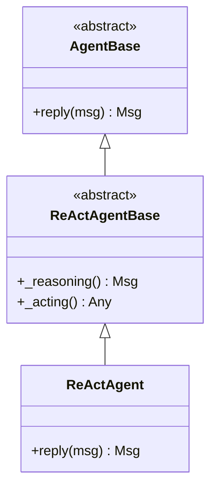

# 第1章 Python面向对象编程

> **目标**：理解Python面向对象与Java的区别，掌握Agent开发所需的OOP知识

---

## 🎯 学习目标

学完之后，你能：
- 说出Python类与Java类的本质区别
- 理解Python的特殊方法（魔术方法）
- 掌握Python的继承和抽象类
- 阅读AgentScope源码中的面向对象设计

---

## 🔍 背景问题

**为什么需要理解Python OOP？**

AgentScope是用Python写的，面向对象是Python的核心编程范式。

当你阅读源码时，会看到大量类的继承、方法的覆盖、抽象类的定义。Java开发者需要理解Python独特的OOP机制才能读懂代码。

---

## 📦 架构定位

### Python OOP在AgentScope中的体现

```
src/agentscope/
├── agent/
│   ├── _agent_base.py      # AgentBase 抽象基类
│   ├── _react_agent_base.py # ReActAgentBase 抽象基类
│   └── _react_agent.py      # ReActAgent 具体实现
├── message/
│   └── _message_base.py     # Msg 类定义
└── pipeline/
    └── _msghub.py          # MsgHub 类定义
```

**继承层次**：


---

## 🔬 关键概念解析

### 1. self参数 — Python显式的this

**Python**（第69-74行）：
```python showLineNumbers
class Agent:
    def __init__(self, name: str):  # self必须显式声明
        self.name = name
    
    def speak(self, content: str) -> None:
        print(f"{self.name}: {content}")

agent = Agent("Bot")
agent.speak("Hello")  # self自动传入
```

**Java对比**：
```java
public class Agent {
    private String name;
    
    public Agent(String name) {
        this.name = name;  // this是隐式的
    }
    
    public void speak(String content) {
        System.out.println(this.name + ": " + content);
    }
}
```

**核心区别**：
| Python | Java |
|--------|------|
| `self`必须显式声明 | `this`隐式存在 |
| 可以给实例随意赋值 | 属性必须在类中声明 |

### 2. 构造函数 `__init__`

**Python**（第131-134行）：
```python
class Agent:
    def __init__(self, name: str, model: Any):
        self.name = name       # 通过self.xxx创建属性
        self.model = model
        self._history = []    # 下划线前缀表示"私有"（约定）
```

**vs Java**：
```java
public class Agent {
    private String name;
    private Object model;
    private List history;
    
    public Agent(String name, Object model) {
        this.name = name;
        this.model = model;
        this.history = new ArrayList<>();
    }
}
```

### 3. 继承与抽象类

**Python抽象基类**（第168-177行）：
```python showLineNumbers
from abc import ABC, abstractmethod

class AgentBase(ABC):  # ABC = Abstract Base Class
    @abstractmethod
    def reply(self, msg: Msg) -> Msg:
        pass  # 必须被子类实现

class ReActAgent(AgentBase):
    def reply(self, msg: Msg) -> Msg:  # 实现抽象方法
        return Msg(name=self.name, content="响应")
```

**vs Java接口**：
```java
public interface AgentBase {
    Msg reply(Msg msg);
}

public class ReActAgent implements AgentBase {
    @Override
    public Msg reply(Msg msg) {
        return new Msg(this.name, "响应");
    }
}
```

### 4. 特殊方法（魔术方法）

**源码位置**：`src/agentscope/message/_message_base.py:75-84`

```python showLineNumbers
class Msg:
    def __str__(self) -> str:  # 类似Java的toString()
        return f"Msg({self.name}, {self.content})"
    
    def __repr__(self) -> str:
        return f"Msg(name={self.name!r}, ...)"
    
    def __eq__(self, other) -> bool:
        return self.name == other.name and self.content == other.content
    
    def __call__(self) -> str:
        """让Msg实例可以像函数一样调用"""
        return self.content
```

**常用魔术方法对照**：

| 魔术方法 | 用途 | Java对应 |
|----------|------|----------|
| `__init__` | 初始化 | 构造函数 |
| `__str__` | 字符串表示 | toString() |
| `__eq__` | `==`比较 | equals() |
| `__call__` | `obj()`调用 | 无直接对应 |
| `__enter__` | with语句入口 | try-with-resources |
| `__exit__` | with语句退出 | finally |

### 5. 多继承

Python支持多继承，Java不支持：

```python
class Agent:
    pass

class Talkative:
    def speak(self):
        print("Hello!")

class SocialAgent(Agent, Talkative):  # 多继承
    pass
```

---

## ⚠️ Java开发者注意

### Python没有访问修饰符

Python用命名约定表示可见性：

```python
class Agent:
    def __init__(self):
        self.public_attr = "公开"
        self._protected_attr = "受保护（约定）"
        self.__private_attr = "名称重整为_Agent__private_attr"
```

### dataclass减少样板代码

Python 3.7+的dataclass：

```python showLineNumbers
from dataclasses import dataclass

@dataclass
class Msg:
    name: str
    content: str
    role: str

# 自动生成 __init__, __str__, __eq__
msg = Msg(name="user", content="Hi", role="user")
```

**AgentScope的Msg不是dataclass**，因为需要自定义逻辑（如ID自动生成）。

---

## 🔧 Contributor指南

### 适合新手修改的文件

| 文件 | 原因 |
|------|------|
| `src/agentscope/message/_message_base.py` | Msg类，结构简单 |
| `src/agentscope/pipeline/_class.py` | Pipeline类，逻辑清晰 |

### 危险的修改区域

**⚠️ 警告**：

1. **Msg的role断言**（`_message_base.py:61`）
   ```python
   assert role in ["user", "assistant", "system"]
   ```
   修改可能导致消息类型混乱

2. **AgentBase.reply()签名**
   ```python
   async def reply(self, msg: Msg | list[Msg] | None = None, ...) -> Msg
   ```
   这是所有Agent的入口，修改需要谨慎

### 如何添加新Agent

**步骤1**：继承AgentBase或ReActAgentBase：
```python
from agentscope.agent import AgentBase

class MyAgent(AgentBase):
    async def reply(self, msg, ...) -> Msg:
        # 实现你的Agent逻辑
        return Msg(...)
```

**步骤2**：在`__init__.py`中导出：
```python
from .my_agent import MyAgent
```

---

## 🎯 思考题

<details>
<summary>1. Python的方法第一个参数为什么必须是self？能不能省略？</summary>

**答案**：
- **不能省略**。Python的self是显式传递实例引用的机制
- 当你调用`agent.speak("hi")`时，Python内部变成`Agent.speak(agent, "hi")`
- 这与Java不同：Java的`this`是隐式的，Python选择显式

**好处**：
- 方法可以赋值给变量：`func = agent.speak`
- 可以显式操作：`Agent.speak(agent, "hi")`
</details>

<details>
<summary>2. Python的"私有"属性是怎么实现的？真的私有吗？</summary>

**答案**：
- **约定私有**：`self._attr`（单下划线）只是约定，外部仍可访问
- **名称重整**：`self.__attr`（双下划线）会变成`_ClassName__attr`，但仍可访问
- **Python没有真正的私有**。这是"鸭子类型"哲学的体现

```python
class Agent:
    def __init__(self):
        self.__secret = "不能访问"

agent = Agent()
print(agent._Agent__secret)  # 可以访问，但不应该这样做
```
</details>

<details>
<summary>3. dataclass和普通类有什么区别？AgentScope为什么不用dataclass？</summary>

**答案**：
- **dataclass自动生成** `__init__`, `__str__`, `__eq__`, `__repr__`
- **适用场景**：数据容器，如配置对象、DTO

**AgentScope为什么不用**：
```python
# Msg需要自定义逻辑
class Msg:
    def __init__(self, name, content, role):
        self.name = name
        self.content = content
        self.role = role
        self.id = shortuuid.uuid()      # dataclass做不到
        self.timestamp = datetime.now() # dataclass做不到
```
</details>

---

★ **Insight** ─────────────────────────────────────
- **Python的self** = Java的this，但必须显式声明
- **Python没有访问修饰符**，用命名约定代替（_受保护，__私有）
- **dataclass** = 自动生成样板代码的数据类
- **多继承**在Python中允许，Java不支持
─────────────────────────────────────────────────
