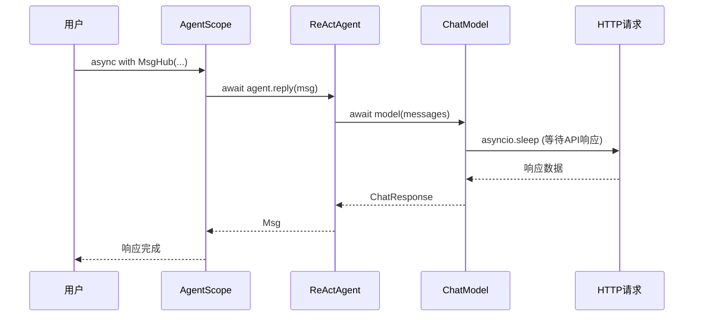

# 第2章 Python异步编程

> **目标**：理解Python异步编程模型，掌握async/await在AgentScope中的应用

---

## 🎯 学习目标

学完之后，你能：
- 说出协程与事件循环的工作原理
- 正确使用async/await语法
- 在AgentScope中调用异步API
- 避免常见的异步错误

---

## 🔍 背景问题

**为什么AgentScope大量使用async/await？**

AgentScope需要：
1. **同时运行多个Agent** — 聊天机器人同时处理多个用户请求
2. **等待模型响应** — LLM API调用是I/O密集型
3. **保持响应** — 用户界面不能卡死

如果用同步代码，10个Agent同时运行需要10个线程（内存开销大）。用异步，10万个协程也可以轻松运行。

---

## 📦 架构定位

### 异步在AgentScope中的体现



### 核心文件

| 文件 | 关键异步函数 |
|------|-------------|
| `src/agentscope/agent/_react_agent.py` | `async def reply()` |
| `src/agentscope/model/_model_base.py` | `async def __call__()` |
| `src/agentscope/pipeline/_msghub.py` | `async def broadcast()` |

---

## 🔬 核心概念解析

### 1. 协程（Coroutine）

**定义**：协程是"可暂停和恢复的函数"

```python showLineNumbers
async def my_agent():
    print("1. 开始处理")
    await asyncio.sleep(1)  # ← 暂停点，可被其他协程使用
    print("2. 处理完成")
    return "结果"
```

**关键规则**：
- `async def`定义的函数返回协程对象，不立即执行
- `await`执行协程直到遇到暂停点
- 暂停时，事件循环可以执行其他协程

### 2. 事件循环（Event Loop）

**源码位置**：`asyncio`模块

```python showLineNumbers
async def task1():
    print("Task 1 start")
    await asyncio.sleep(1)  # 暂停1秒
    print("Task 1 end")

async def task2():
    print("Task 2 start")
    await asyncio.sleep(0.5)  # 暂停0.5秒
    print("Task 2 end")

async def main():
    # 并发执行两个任务
    await asyncio.gather(task1(), task2())

asyncio.run(main())
```

**输出**：
```
Task 1 start
Task 2 start
Task 2 end    # 0.5秒后
Task 1 end    # 1秒后
```

### 3. await的三重作用

```python
async def example():
    # 1. 等待协程完成
    result = await async_function()
    
    # 2. 等待可等待对象（实现了__await__）
    await some_object
    
    # 3. 表达式可以继续执行
    value = await get_data() + await get_more_data()
```

### 4. 并发 vs 并行

| 概念 | 含义 | Python实现 |
|------|------|-----------|
| **并发（Concurrency）** | 交替执行，看起来像同时 | `asyncio.gather()` |
| **并行（Parallelism）** | 真正同时执行 | `ThreadPoolExecutor` |

```python
# 并发：I/O等待时切换（asyncio）
async def fetch(url):
    return await http_get(url)

async def main():
    results = await asyncio.gather(*[fetch(u) for u in urls])

# 并行：真正同时执行（线程）
with concurrent.futures.ThreadPoolExecutor() as pool:
    results = list(pool.map(fetch_sync, urls))
```

---

## 🚀 先跑起来

### AgentScope异步调用

```python showLineNumbers
import asyncio
from agentscope.agent import ReActAgent
from agentscope.message import Msg

async def main():
    # 创建Agent
    agent = ReActAgent(name="Assistant", ...)
    
    # 异步调用
    response = await agent(Msg(name="user", content="你好"))
    print(response.content)

# 运行
asyncio.run(main())
```

### MsgHub异步使用

```python showLineNumbers
async with MsgHub(participants=[agent1, agent2]) as hub:
    # 异步广播
    await hub.broadcast(Msg(name="system", content="开始"))
    # Agent会自动处理
```

---

## ⚠️ 工程经验与坑

### ⚠️ 常见异步错误

**错误1：忘记await**
```python
# ❌ 错误：协程不会自动执行
hub = MsgHub(participants=[agent1, agent2])
hub.broadcast(msg)  # 返回协程对象，不执行！

# ✅ 正确
await hub.broadcast(msg)
```

**错误2：在同步代码中调用异步函数**
```python
# ❌ 错误：SyntaxError
def sync_function():
    result = await async_function()

# ✅ 正确：在async函数中调用
async def async_function2():
    result = await async_function()
```

**错误3：混用同步和异步HTTP库**
```python
# ❌ 错误：同步库会阻塞事件循环
import requests  # 同步库

async def fetch_all():
    results = [requests.get(url) for url in urls]  # 阻塞！

# ✅ 正确：使用异步库
import aiohttp

async def fetch_all():
    async with aiohttp.ClientSession() as session:
        tasks = [session.get(url) for url in urls]
        results = await asyncio.gather(*tasks)
```

---

## 🔧 Contributor指南

### 适合新手修改的文件

| 文件 | 原因 |
|------|------|
| `src/agentscope/agent/_react_agent.py` | 核心异步逻辑 |
| `src/agentscope/model/_model_base.py` | 模型调用异步 |

### 危险的修改区域

**⚠️ 警告**：

1. **在异步函数中使用同步阻塞**
   ```python
   # ❌ 错误：会阻塞整个事件循环
   async def bad_example():
       time.sleep(10)  # 同步sleep
       return await something_async()
   
   # ✅ 正确：使用asyncio.sleep
   async def good_example():
       await asyncio.sleep(10)
       return await something_async()
   ```

2. **忘记处理异常**
   ```python
   # ❌ 错误
   async def maybe_fail():
       await risky_call()  # 如果失败，异常会传播
   
   # ✅ 正确：捕获异常
   async def safe_call():
       try:
           return await risky_call()
       except Exception as e:
           logger.error(f"Failed: {e}")
           return fallback()
   ```

---

## 💡 Java开发者注意

| Python | Java | 说明 |
|--------|------|------|
| `async def` | `CompletableFuture.supplyAsync()` | 异步声明 |
| `await` | `future.get()` | 等待结果 |
| `asyncio.gather()` | `CompletableFuture.allOf()` | 并发等待 |
| `asyncio.sleep()` | `Thread.sleep()` | 休眠（但异步！） |

**Python更轻量**：
- Java每个并发请求需要一个线程（重量级）
- Python每个协程只是一个对象（轻量级）
- 10万个协程可以轻松运行

---

## 🎯 思考题

<details>
<summary>1. await会阻塞线程吗？为什么？</summary>

**答案**：
- **不会**。`await`让出控制权给事件循环
- 事件循环可以执行其他协程
- 直到await的操作完成，协程才恢复

```python
async def task():
    print("开始")
    await asyncio.sleep(10)  # 让出控制权，10秒内其他协程可以执行
    print("结束")
```
</details>

<details>
<summary>2. 什么时候用asyncio.gather？什么时候用asyncio.create_task？</summary>

**答案**：

| 函数 | 用途 | 返回值 |
|------|------|--------|
| `asyncio.gather()` | 并发执行多个协程 | 结果列表 |
| `asyncio.create_task()` | 创建任务但不立即执行 | Task对象 |

```python
# gather：等待所有结果
results = await asyncio.gather(task1(), task2(), task3())

# create_task：创建任务，可以 later await
task = asyncio.create_task(long_running())
# 做其他事...
result = await task  # later
```
</details>

<details>
<summary>3. 为什么AgentScope选择async/await而不是线程？</summary>

**答案**：
- **内存效率**：协程是对象，线程是系统资源
- **上下文切换**：协程切换在用户态，线程切换需要内核态
- **I/O密集型**：Agent主要等待LLM响应，异步完美契合
- **Python GIL限制**：Python多线程无法真正并行CPU计算，但I/O等待时GIL会释放

**对比**：
- 线程：1000个并发请求 = 1000个线程（内存开销大）
- 协程：1000个并发请求 = 1000个协程对象（轻量）
</details>

---

★ **Insight** ─────────────────────────────────────
- **async/await** = Python协程语法，非阻塞I/O
- **await让出控制权** = 协程暂停，事件循环执行其他协程
- **asyncio.gather** = 并发执行多个协程
- **协程是合作式多任务**，比线程更轻量
─────────────────────────────────────────────────
