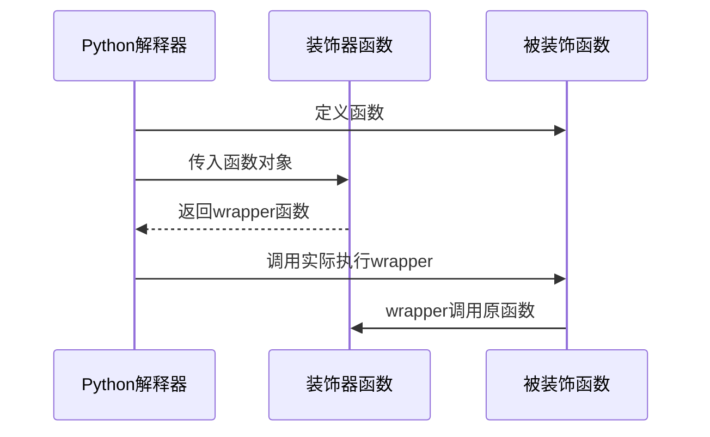

# 第3章 Python高级语法

> **目标**：掌握装饰器、上下文管理器和元类，理解AgentScope源码中的高级用法

---

## 🎯 学习目标

学完之后，你能：
- 理解装饰器原理并阅读装饰器代码
- 掌握上下文管理器用于资源管理
- 了解元类在框架设计中的应用
- 为AgentScope贡献代码

---

## 🔍 背景问题

**为什么需要学习这些高级语法？**

AgentScope框架大量使用这些高级特性：
- **装饰器**：`@trace_reply`追踪Agent回复
- **上下文管理器**：`async with MsgHub()`管理生命周期
- **元类**：Agent注册、Hook机制

不理解这些，你无法读懂源码。

---

## 📦 架构定位

### 高级语法在AgentScope中的体现

| 特性 | 源码位置 | 用途 |
|------|----------|------|
| `@trace_reply` | `src/agentscope/tracing/__init__.py` | 追踪装饰器 |
| `async with MsgHub()` | `src/agentscope/pipeline/_msghub.py` | 资源生命周期管理 |
| `_AgentMeta` | `src/agentscope/agent/_agent_meta.py` | Agent元类注册 |

---

## 🔬 核心概念解析

### 1. 装饰器（Decorator）

**原理**：装饰器是"修饰函数的函数"



**基础装饰器**：
```python showLineNumbers
def log_calls(func):
    """记录函数调用的装饰器"""
    def wrapper(*args, **kwargs):
        print(f"调用 {func.__name__}")
        result = func(*args, **kwargs)
        print(f"返回 {result}")
        return result
    return wrapper

@log_calls
def add(a, b):
    return a + b

# 等价于：add = log_calls(add)
# 调用时实际执行：wrapper()
```

**带参数的装饰器**：
```python showLineNumbers
def repeat(times):
    """重复执行times次的装饰器"""
    def decorator(func):
        def wrapper(*args, **kwargs):
            for _ in range(times):
                result = func(*args, **kwargs)
            return result
        return wrapper
    return decorator

@repeat(3)
def greet():
    print("Hello!")

greet()  # 打印3次Hello!
```

### 2. 上下文管理器（Context Manager）

**原理**：自动资源获取和释放

**类实现**：
```python showLineNumbers
class Timer:
    def __enter__(self):
        self.start = time.time()
        return self
    
    def __exit__(self, exc_type, exc_val, exc_tb):
        elapsed = time.time() - self.start
        print(f"耗时: {elapsed:.2f}秒")
        return False  # 不吞异常

with Timer():
    result = expensive_operation()
```

**async实现**（如MsgHub）：
```python showLineNumbers
class MsgHub:
    async def __aenter__(self):
        # 进入时：设置订阅关系
        self._reset_subscriber()
        return self
    
    async def __aexit__(self, exc_type, exc_val, exc_tb):
        # 退出时：清理订阅关系
        if self.enable_auto_broadcast:
            for agent in self.participants:
                agent.remove_subscribers(self.name)

async with MsgHub(participants=[a1, a2]) as hub:
    await hub.broadcast(msg)
```

**@contextmanager简化**：
```python showLineNumbers
from contextlib import contextmanager

@contextmanager
def timer():
    start = time.time()
    yield  # 执行with块内代码
    elapsed = time.time() - start
    print(f"耗时: {elapsed:.2f}秒")

with timer():
    result = expensive_operation()
```

### 3. 元类（Metaclass）

**原理**：元类是"创建类的类"

```python showLineNumbers
# type是内置元类
MyClass = type("MyClass", (), {"x": 1})

# 相当于
class MyClass:
    x = 1
```

**自定义元类**：
```python showLineNumbers
class RegistryMeta(type):
    """自动注册类的元类"""
    _registry = {}
    
    def __new__(mcs, name, bases, attrs):
        cls = super().__new__(mcs, name, bases, attrs)
        # 自动注册Agent类
        if attrs.get('__agent_name__'):
            RegistryMeta._registry[attrs['__agent_name__']] = cls
        return cls

class BaseAgent(metaclass=RegistryMeta):
    pass

class MyAgent(BaseAgent, __agent_name__="my_agent"):
    pass

# 自动注册完成
print(RegistryMeta._registry)  # {'my_agent': MyAgent}
```

### 4. AgentScope中的装饰器

**@trace_reply装饰器**：
```python
# src/agentscope/agent/_react_agent.py:375
@trace_reply
async def reply(self, msg, ...) -> Msg:
    ...
```

**AgentScope元类示例**：
```python
# src/agentscope/agent/_agent_meta.py:159
class _AgentMeta(type):
    """Agent的元类，用于自动注册"""
    _registry = {}

    def __new__(mcs, name, bases, attrs):
        cls = super().__new__(mcs, name, bases, attrs)
        # 自动注册Agent类
        if attrs.get('__agent_name__'):
            _AgentMeta._registry[attrs['__agent_name__']] = cls
        return cls
```

---

## ⚠️ 工程经验与坑

### ⚠️ 装饰器顺序

多个装饰器从上到下执行：

```python
@decorator1  # 先执行
@decorator2  # 后执行
def func():
    pass

# 等价于：func = decorator1(decorator2(func))
```

### ⚠️ @contextmanager的异常处理

```python
@contextmanager
def risky():
    try:
        yield "resource"
    except Exception as e:
        print(f"异常: {e}")
        raise  # 重新抛出异常

with risky() as r:
    raise ValueError("oops")  # 异常会被捕获并重新抛出
```

---

## 🔧 Contributor指南

### 适合新手修改的文件

| 文件 | 原因 |
|------|------|
| `src/agentscope/pipeline/_msghub.py` | 上下文管理器实现 |
| `src/agentscope/agent/_agent_meta.py` | 元类逻辑清晰 |

### 危险的修改区域

**⚠️ 警告**：

1. **装饰器修改被装饰函数的元数据**
   ```python
   # ❌ 错误：wrapper会隐藏原函数信息
   def bad_decorator(func):
       def wrapper(*args):
           return func(*args)
       return wrapper
   
   # ✅ 正确：使用functools.wraps
   from functools import wraps
   
   def good_decorator(func):
       @wraps(func)  # 保留原函数元数据
       def wrapper(*args):
           return func(*args)
       return wrapper
   ```

2. **元类修改影响所有子类**
   - 元类的`__new__`会影响所有子类
   - 错误修改可能导致整个框架行为异常

---

## 💡 Java开发者注意

| Python特性 | Java对应 | 说明 |
|-----------|----------|------|
| `@decorator` | AOP切面/代理 | 装饰器是运行时包装 |
| `with` | try-with-resources | 上下文管理器自动清理 |
| `metaclass` | `Class<T>`对象 | 元类是Class的Class |
| `@dataclass` | Lombok `@Data` | 自动生成样板代码 |

**Java没有装饰器语法**，但有注解+处理器类似效果：
```java
// Java 注解处理器
@MyAnnotation
public class MyClass {
    // 编译器或运行时处理注解
}
```

---

## 🎯 思考题

<details>
<summary>1. 装饰器和继承有什么区别？各自适用场景？</summary>

**答案**：
- **装饰器**：运行时修改，不改变类结构，可叠加
- **继承**：编译时决定，静态的，单继承限制

| 场景 | 推荐 |
|------|------|
| 需要修改多个函数行为 | 装饰器 |
| 需要复用类结构 | 继承 |
| 需要组合多个功能 | 装饰器叠加 |

**示例**：日志、计时、缓存等功能适合装饰器。
</details>

<details>
<summary>2. 为什么MsgHub要用async with而不是普通的with？</summary>

**答案**：
- MsgHub需要执行异步操作（`await agent.observe()`）
- 上下文管理器的`__aenter__`和`__aexit__`必须是异步的
- 普通`with`不支持异步操作

```python
# 同步版本
class SyncHub:
    def __enter__(self):
        # 同步操作
        return self
    
    def __exit__(self, ...):
        # 同步清理

# 异步版本
class MsgHub:
    async def __aenter__(self):
        # 异步初始化，如 await self.connect()
        return self
    
    async def __aexit__(self, ...):
        # 异步清理
```
</details>

<details>
<summary>3. 元类有什么实际用途？AgentScope用元类做什么？</summary>

**答案**：
- **自动注册**：框架发现组件并注册
- **验证**：检查类是否符合规范
- **注入**：自动添加属性或方法

**AgentScope的实际用途**：
- Agent注册：自动将Agent类加入注册表
- 元类控制创建过程

```python
# src/agentscope/agent/_agent_meta.py
class _AgentMeta(type):
    def __new__(mcs, name, bases, attrs):
        cls = super().__new__(mcs, name, bases, attrs)
        # 自动注册Agent类
        if attrs.get('__agent_name__'):
            _AgentMeta._registry[attrs['__agent_name__']] = cls
        return cls
```
</details>

---

★ **Insight** ─────────────────────────────────────
- **装饰器** = 修改函数行为的"包装器"，用`@`语法糖
- **上下文管理器** = 自动资源管理，用`with`确保清理
- **元类** = 控制类的创建，用于框架自动注册
- **async with** = 异步版本的上下文管理器
─────────────────────────────────────────────────
