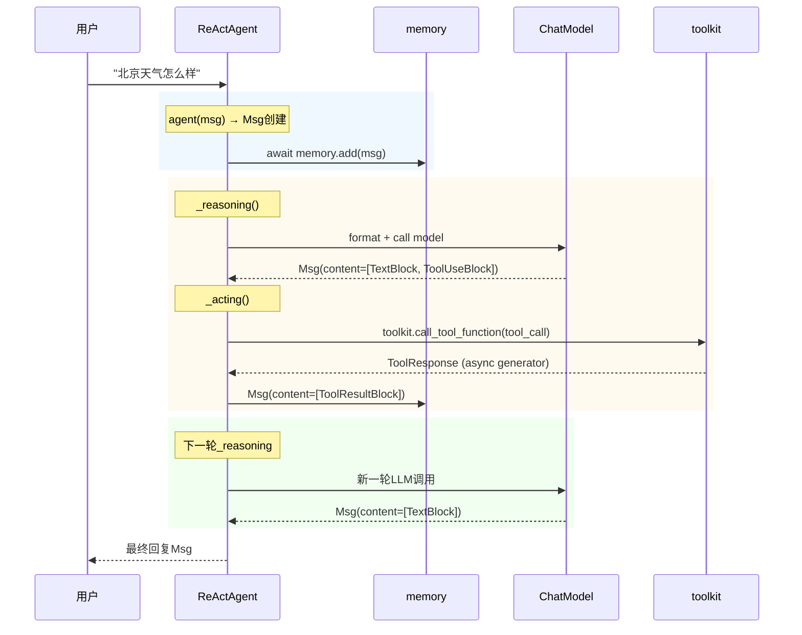

# 第4章 消息传递机制（Msg）

> **目标**：深入理解AgentScope中消息的结构和作用

---

## 🎯 学习目标

学完之后，你能：
- 说出Msg在AgentScope架构中的定位
- 创建各种类型的消息
- 理解ContentBlock机制
- 追踪消息在Agent间的流动

---

## 🔍 背景问题

**为什么需要Msg？**

当你调用`await agent(Msg(name="user", content="你好", role="user"))`时，AgentScope内部发生了什么？

- 需要一种统一格式表示"谁说的、说什么、是什么角色"
- 需要支持多模态内容（文本、工具调用、图像、音频）
- 需要在Agent、Model、Memory之间传递信息

Msg就是AgentScope的"统一消息协议"。

---

## 📦 架构定位

### 源码入口

| 项目 | 值 |
|------|-----|
| **文件路径** | `src/agentscope/message/_message_base.py` |
| **类名** | `Msg` |
| **Block文件** | `src/agentscope/message/_message_block.py` |

### ContentBlock类型

| Block类型 | 源码定义 | 用途 |
|-----------|----------|------|
| `TextBlock` | `_message_block.py:9` | 文本内容 |
| `ThinkingBlock` | `_message_block.py:18` | 思考过程 |
| `ToolUseBlock` | `_message_block.py:79` | 工具调用请求 |
| `ToolResultBlock` | `_message_block.py:94` | 工具执行结果 |
| `ImageBlock` | `_message_block.py:49` | 图像内容 |
| `AudioBlock` | `_message_block.py:59` | 音频内容 |
| `VideoBlock` | `_message_block.py:69` | 视频内容 |

---

## 🔬 核心源码分析

### 4.1 Msg类结构

**文件**: `src/agentscope/message/_message_base.py:21-73`

```python showLineNumbers
class Msg:
    """The message class in agentscope."""

    def __init__(
        self,
        name: str,                                    # 发送者名称
        content: str | Sequence[ContentBlock],         # 内容：文本或ContentBlock列表
        role: Literal["user", "assistant", "system"], # 角色
        metadata: dict[str, JSONSerializableObject] | None = None,  # 元数据
        timestamp: str | None = None,                  # 时间戳
        invocation_id: str | None = None,             # 调用ID（用于追踪）
    ) -> None:
        ...
        
        self.name = name
        self.content = content
        self.role = role  # 注意：只有"user", "assistant", "system"
        self.metadata = metadata or {}
        self.id = shortuuid.uuid()  # 自动生成唯一ID
        self.timestamp = timestamp or datetime.now().strftime("%Y-%m-%d %H:%M:%S.%f")[:-3]
        self.invocation_id = invocation_id
```

**关键约束**（第54-62行）：
```python
assert isinstance(content, (list, str)), "The content must be a string or a list of content blocks."
assert role in ["user", "assistant", "system"]  # 注意：不包括"tool"！
```

### 4.2 ContentBlock结构

**文件**: `src/agentscope/message/_message_block.py`

```python showLineNumbers
# TextBlock - 文本内容
class TextBlock(TypedDict, total=False):
    type: Required[Literal["text"]]
    text: str

# ThinkingBlock - 思考过程（用于o1等模型的CoT）
class ThinkingBlock(TypedDict, total=False):
    type: Required[Literal["thinking"]]
    thinking: str

# ToolUseBlock - 工具调用请求
class ToolUseBlock(TypedDict, total=False):
    type: Required[Literal["tool_use"]]  # 注意是"tool_use"
    id: str                              # 工具调用唯一ID
    name: str                             # 工具函数名
    input: dict[str, object]             # 工具参数（不是arguments！）
    raw_input: str                        # 原始字符串输入

# ToolResultBlock - 工具执行结果
class ToolResultBlock(TypedDict, total=False):
    type: Required[Literal["tool_result"]]
    id: Required[str]                      # 对应ToolUseBlock的id
    name: Required[str]                   # 工具函数名
    output: Required[str | Sequence[ContentBlock]]  # 工具输出结果

# ImageBlock - 图像
class ImageBlock(TypedDict, total=False):
    type: Required[Literal["image"]]
    source: Required[Base64Source | URLSource]
```

### 4.3 消息流动追踪图



---

## ⚠️ 工程经验与坑

### ⚠️ role的合法值只有三个

**错误代码**：
```python
# ❌ 错误！会抛出AssertionError
msg = Msg(name="tool", content="天气查询结果", role="tool")
```

**正确做法**：工具返回应该用`ToolResultBlock`：
```python
# ✅ 正确：工具返回是ToolResultBlock，不是role="tool"
msg = Msg(
    name="assistant",
    content=[
        ToolResultBlock(
            type="tool_result",
            id="call_abc123",  # 对应ToolUseBlock的id
            name="get_weather",
            output="北京天气晴，25度"
        )
    ],
    role="assistant"
)
```

**为什么这样设计？** 因为Msg的role表示的是"消息是谁生成的"，工具是Agent调用的，所以工具结果仍然是"assistant"角色，只是content里包含了ToolResultBlock。

### ⚠️ ToolUseBlock的字段是input不是arguments

**错误代码**：
```python
# ❌ 错误
tool_block = ToolUseBlock(
    type="tool_use",
    name="get_weather",
    arguments='{"city": "北京"}'  # 应该是input！
)
```

**正确代码**：
```python
# ✅ 正确
tool_block = ToolUseBlock(
    type="tool_use",
    id="call_abc123",
    name="get_weather",
    input={"city": "北京"},  # 不是arguments！
    raw_input='get_weather(city="北京")'
)
```

**源码依据**（第88行）：
```python
input: Required[dict[str, object]]  # The input of the tool
```

---

## 🔧 Contributor指南

### 适合新手修改的文件

| 文件 | 原因 |
|------|------|
| `src/agentscope/message/_message_block.py` | 简单添加新Block类型 |
| `src/agentscope/message/_message_base.py` | Msg类的简单扩展 |

### 危险的修改区域

**⚠️ 警告**：

1. **Msg的role断言**（第61行）
   ```python
   assert role in ["user", "assistant", "system"]
   ```
   如果修改这个，可能导致整个框架的行为异常

2. **content类型断言**（第54-57行）
   ```python
   assert isinstance(content, (list, str))
   ```
   很多地方假设content是str或list，改了会破坏兼容性

### 如何添加新的ContentBlock

**步骤1**：在`_message_block.py`中定义新Block：
```python
class MyCustomBlock(TypedDict, total=False):
    type: Required[Literal["my_custom"]]
    data: Required[str]
```

**步骤2**：在`__init__.py`中导出：
```python
from ._message_block import MyCustomBlock
```

---

## 💡 Java开发者注意

```python
# Python Msg vs Java DTO
```

| Python Msg | Java | 说明 |
|------------|------|------|
| `name: str` | `sender: String` | 发送者 |
| `content: str \| list[ContentBlock]` | `body: Object` | 内容 |
| `role: Literal["user","assistant","system"]` | `messageType: Enum` | 角色 |
| `metadata: dict` | `headers: Map<String, Object>` | 元数据 |
| `id: str` (auto) | `uuid: String` | 唯一ID |

**关键区别**：
- Java通常用多个类表示不同消息类型，Python用同一个`Msg`类+不同`ContentBlock`
- Python的`TypedDict`是结构化字典，编译期不做类型检查（运行时检查）

---

## 🎯 思考题

<details>
<summary>1. 为什么Msg的role不包含"tool"，而是把工具结果放在ToolResultBlock中？</summary>

**答案**：
- **角色语义**：role表示"这条消息是谁生成的"
  - "user" = 用户生成的
  - "assistant" = AI生成的
  - "system" = 系统生成的
- **工具是Agent的一部分**：工具调用是Agent执行的，所以结果仍然是assistant生成的
- **ToolResultBlock的id对应**：通过id关联ToolUseBlock和ToolResultBlock，保持调用链完整

**源码依据**：第61行的断言限制了role只能是这三种
</details>

<details>
<summary>2. ContentBlock为什么用TypedDict而不是 dataclass？</summary>

**答案**：
- **兼容性**：TypedDict是字典，可以直接序列化/反序列化为JSON
- **与LLM API一致**：很多LLM API（如OpenAI）返回的就是这样的结构
- **灵活性**：可以混用不同Block类型在同一个content列表中
- **历史原因**：早期版本就是这样设计的，保持向后兼容

**对比dataclass**：
```python
# dataclass更适合有行为的对象
@dataclass
class ToolResultBlock:
    type: str
    id: str
    content: str
    
# 但Msg.content需要的是"可以是str或Block列表"
# TypedDict更轻量
```
</details>

<details>
<summary>3. metadata字段有什么用？什么时候使用？</summary>

**答案**：
- **结构化输出**：当Agent需要返回结构化数据时（如JSON），会放在metadata中
- **追踪信息**：如`invocation_id`用于关联API调用
- **自定义数据**：允许用户附加任意数据

**使用示例**：
```python
# Agent返回结构化数据
response = await agent(Msg(
    name="user",
    content="生成一个用户画像",
    role="user"
), structured_model=UserProfile)

# structured_model会放在metadata中
# 访问方式：response.metadata  # 包含结构化输出
```
</details>

---

★ **Insight** ─────────────────────────────────────
- **Msg = 统一消息协议**，role只有user/assistant/system三种
- **工具返回是ToolResultBlock**，不是role="tool"
- **ContentBlock是结构化内容**，TypedDict形式，与JSON兼容
- **ToolUseBlock.input**不是arguments！这是常犯的错误
─────────────────────────────────────────────────
