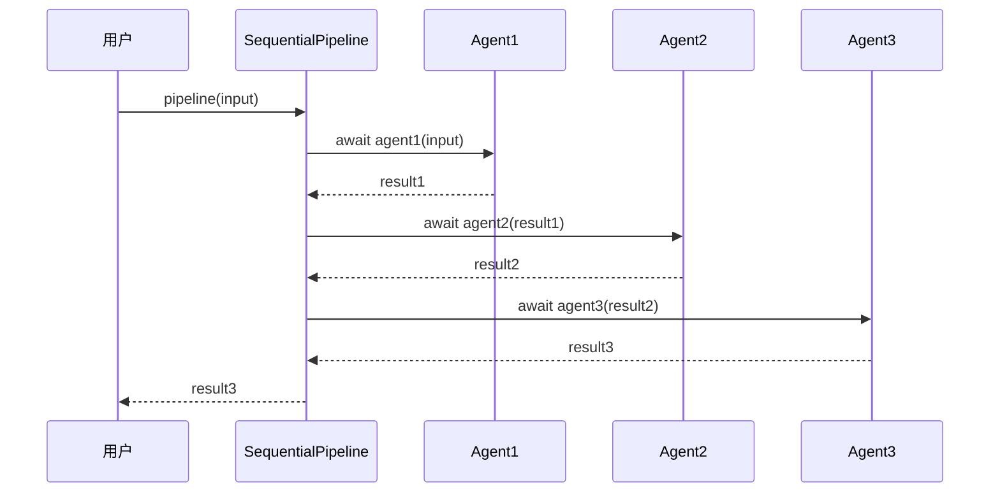
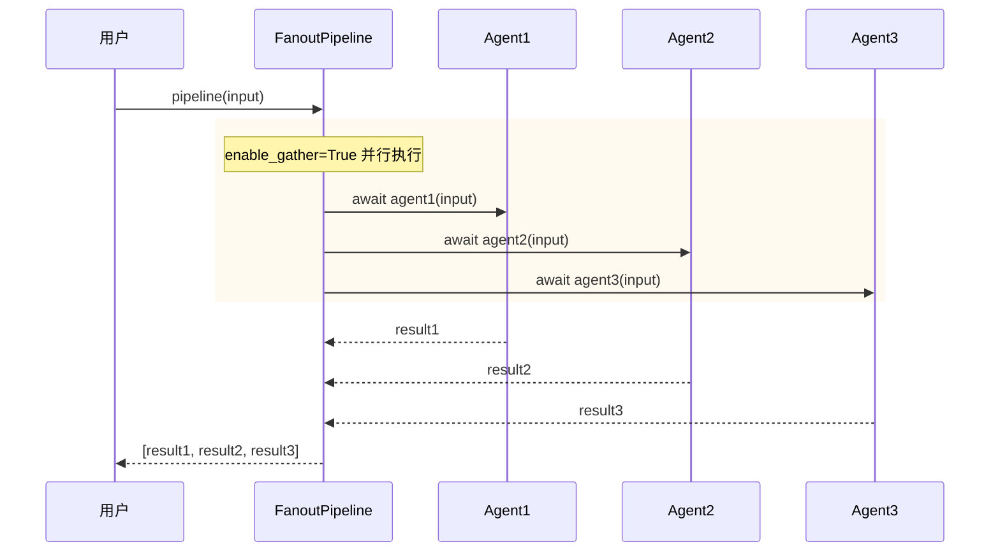

# 第5章 管道与流水线（Pipeline）

> **目标**：理解Pipeline如何编排Agent的执行顺序

---

## 🎯 学习目标

学完之后，你能：
- 说出Pipeline在AgentScope架构中的定位
- 使用SequentialPipeline串联Agent
- 使用FanoutPipeline并行分发Agent
- 根据场景选择合适的Pipeline类型

---

## 🔍 背景问题

**为什么需要Pipeline？**

当你有多个Agent需要协作时：
- "先分析用户问题，再调用工具查询，最后生成回复" - 需要顺序执行
- "同时问3个专家意见，再汇总" - 需要并行执行

Pipeline就是AgentScope的"工作流引擎"。

---

## 📦 架构定位

### 源码入口

| 项目 | 值 |
|------|-----|
| **文件路径** | `src/agentscope/pipeline/_class.py` |
| **类名** | `SequentialPipeline`, `FanoutPipeline` |
| **函数实现** | `src/agentscope/pipeline/_functional.py` |

### 模块关系图

```mermaid
classDiagram
    class SequentialPipeline {
        +agents: list[AgentBase]
        +__call__(msg) Msg
    }
    class FanoutPipeline {
        +agents: list[AgentBase]
        +enable_gather: bool
        +__call__(msg) list[Msg]
    }
    class sequential_pipeline() {
        # 函数式实现
    }
    class fanout_pipeline() {
        # 函数式实现
    }
    
    SequentialPipeline ..> sequential_pipeline : uses
    FanoutPipeline ..> fanout_pipeline : uses
```

### Pipeline在整体架构中的位置

```
┌─────────────────────────────────────────────────────────────────┐
│                      Pipeline层                                   │
│                                                                  │
│  用户代码                                                        │
│  pipeline = SequentialPipeline([agent1, agent2])                 │
│  result = await pipeline(msg)                                   │
└─────────────────────────────────────────────────────────────────┘
                              │
                              ▼
┌─────────────────────────────────────────────────────────────────┐
│              SequentialPipeline / FanoutPipeline                  │
│         （编排多个Agent的执行顺序）                                │
└─────────────────────────────────────────────────────────────────┘
                              │
                              ▼
┌─────────────────────────────────────────────────────────────────┐
│                      Agent层                                     │
│                  (ReActAgent, UserAgent, ...)                    │
└─────────────────────────────────────────────────────────────────┘
```

---

## 🔬 核心源码分析

### 5.1 SequentialPipeline — 顺序执行

**文件**: `src/agentscope/pipeline/_class.py:10-40`

```python showLineNumbers
class SequentialPipeline:
    """An async sequential pipeline class, which executes a sequence of
    agents sequentially. Compared with functional pipeline, this class
    can be re-used."""

    def __init__(self, agents: list[AgentBase]) -> None:
        """Initialize a sequential pipeline class

        Args:
            agents: A list of agents.
        """
        self.agents = agents

    async def __call__(
        self,
        msg: Msg | list[Msg] | None = None,
    ) -> Msg | list[Msg] | None:
        """Execute the sequential pipeline

        Args:
            msg: The initial input that will be passed to the first agent.
        """
        return await sequential_pipeline(
            agents=self.agents,
            msg=msg,
        )
```

### 5.2 FanoutPipeline — 并行分发

**文件**: `src/agentscope/pipeline/_class.py:43-90`

```python showLineNumbers
class FanoutPipeline:
    """An async fanout pipeline class, which distributes the same input to
    multiple agents."""

    def __init__(
        self,
        agents: list[AgentBase],
        enable_gather: bool = True,  # 关键参数！
    ) -> None:
        """Initialize a fanout pipeline class

        Args:
            agents: A list of agents to execute.
            enable_gather: Whether to execute agents concurrently
                using asyncio.gather(). If False, agents are executed
                sequentially.
        """
        self.agents = agents
        self.enable_gather = enable_gather

    async def __call__(
        self,
        msg: Msg | list[Msg] | None = None,
        **kwargs: Any,
    ) -> list[Msg]:
        """Execute the fanout pipeline

        Returns:
            list[Msg]: A list of output messages from all agents.
        """
        return await fanout_pipeline(
            agents=self.agents,
            msg=msg,
            enable_gather=self.enable_gather,
            **kwargs,
        )
```

### 5.3 SequentialPipeline执行流程



### 5.4 FanoutPipeline执行流程



---

## 🚀 先跑起来

### 顺序Pipeline示例

```python showLineNumbers
from agentscope.pipeline import SequentialPipeline
from agentscope.agent import ReActAgent
from agentscope.message import Msg

# 创建Agent
analyzer = ReActAgent(name="Analyzer", model=model, ...)
summarizer = ReActAgent(name="Summarizer", model=model, ...)

# 顺序管道：A的结果传给B
pipeline = SequentialPipeline(agents=[analyzer, summarizer])

# 执行（需要传入Msg对象）
result = await pipeline(Msg(
    name="user",
    content="分析这篇文档的主要内容",
    role="user"
))
print(result.content)
```

### 并行Pipeline示例

```python showLineNumbers
from agentscope.pipeline import FanoutPipeline

# 创建多个Agent
analyst1 = ReActAgent(name="Analyst1", model=model1, ...)
analyst2 = ReActAgent(name="Analyst2", model=model2, ...)
analyst3 = ReActAgent(name="Analyst3", model=model3, ...)

# 并行管道：同时分发给多个Agent
multi = FanoutPipeline(agents=[analyst1, analyst2, analyst3])

# 执行，返回列表（需要传入Msg对象）
results = await multi(Msg(
    name="user",
    content="分析这个产品的市场竞争力",
    role="user"
))
for r in results:
    print(f"{r.name}: {r.content}")
```

---

## ⚠️ 工程经验与坑

### ⚠️ enable_gather=False 变成顺序执行

```python
# 默认：并行执行
fp1 = FanoutPipeline(agents=[a1, a2, a3], enable_gather=True)

# 改为True：顺序执行（有点反直觉）
fp2 = FanoutPipeline(agents=[a1, a2, a3], enable_gather=False)
```

**源码依据**：`enable_gather=False`时，`fanout_pipeline`内部会逐个await，而不是用`asyncio.gather`。

### ⚠️ SequentialPipeline返回类型可能是list

如果传入的msg是list，返回也可能为list：

```python
# 输入是Msg
result1 = await pipeline(Msg(...))  # 返回Msg

# 输入是Msg列表
result2 = await pipeline([Msg(...), Msg(...)])  # 返回list[Msg]
```

---

## 🔧 Contributor指南

### 适合新手修改的文件

| 文件 | 原因 |
|------|------|
| `src/agentscope/pipeline/_functional.py` | 函数式实现，逻辑简单 |
| `src/agentscope/pipeline/_class.py` | 类封装，增加配置项 |

### 危险的修改区域

**⚠️ 警告**：

1. **fanout_pipeline的gather逻辑**
   ```python
   if enable_gather:
       results = await asyncio.gather(*tasks)  # 并行
   else:
       results = [await task for task in tasks]  # 顺序
   ```
   错误修改可能导致性能问题

2. **sequential_pipeline的消息传递**
   - 每个Agent的输出作为下一个Agent的输入
   - 如果类型不匹配会出错

---

## 💡 Java开发者注意

```python
# Python Pipeline vs Java
```

| Python | Java | 说明 |
|--------|------|------|
| `SequentialPipeline` | `Stream.reduce()` | 顺序处理 |
| `FanoutPipeline(enable_gather=True)` | `CompletableFuture.allOf()` | 并行处理 |
| `FanoutPipeline(enable_gather=False)` | `for`循环 | 顺序执行 |
| `await pipeline(msg)` | `future.get()` | 异步转同步 |

**Java对比**：
```java
// Java Stream 类似 SequentialPipeline
var result = Stream.of(a1, a2, a3)
    .reduce(input, (msg, agent) -> agent.process(msg), (a, b) -> a);

// Java CompletableFuture 类似 FanoutPipeline
var futures = Stream.of(a1, a2, a3)
    .map(agent -> CompletableFuture.supplyAsync(() -> agent.process(input)));
CompletableFuture.allOf(futures.toArray()).join();
```

---

## 🎯 思考题

<details>
<summary>1. 为什么FanoutPipeline默认enable_gather=True？</summary>

**答案**：
- **性能考虑**：并行执行通常比顺序执行更快
- **独立性假设**：多个Agent处理同一任务时，通常假设它们是独立的
- **如果需要顺序**：应该用SequentialPipeline，而不是FanoutPipeline+enable_gather=False

**什么时候用enable_gather=False**：
- Agent之间有共享资源（如写同一个文件）
- Agent调用有频率限制，需要串行化
</details>

<details>
<summary>2. SequentialPipeline和FanoutPipeline可以嵌套吗？</summary>

**答案**：
- **可以**！Pipeline本身就是对Agent的封装
- 例如：先并行分析3个方面，再串行总结

```python
# 嵌套示例
parallel = FanoutPipeline(agents=[a1, a2, a3])
pipeline = SequentialPipeline(agents=[parallel, summarizer])

# 执行：a1,a2,a3并行 → summarizer顺序处理结果
result = await pipeline(input)
```
</details>

<details>
<summary>3. Pipeline和MsgHub有什么区别？</summary>

**答案**：

| 对比项 | Pipeline | MsgHub |
|--------|----------|--------|
| **用途** | 编排Agent执行顺序 | Agent间消息传递 |
| **执行模式** | 管道式：一进一出 | 广播式：一进多出 |
| **消息流** | 单向顺序 | 多向广播 |
| **源码位置** | `_class.py` | `_msghub.py` |

**使用场景**：
- Pipeline：流水线处理，如"分析→总结→回复"
- MsgHub：多Agent协作，如"辩论系统、聊天室"
</details>

---

★ **Insight** ─────────────────────────────────────
- **SequentialPipeline = 流水线**，A→B→C，上一个的输出是下一个的输入
- **FanoutPipeline = 广播**，同时分发给多个Agent，结果是列表
- **enable_gather参数**：True=并行（默认），False=顺序
- **Pipeline可嵌套**，实现复杂工作流
─────────────────────────────────────────────────
