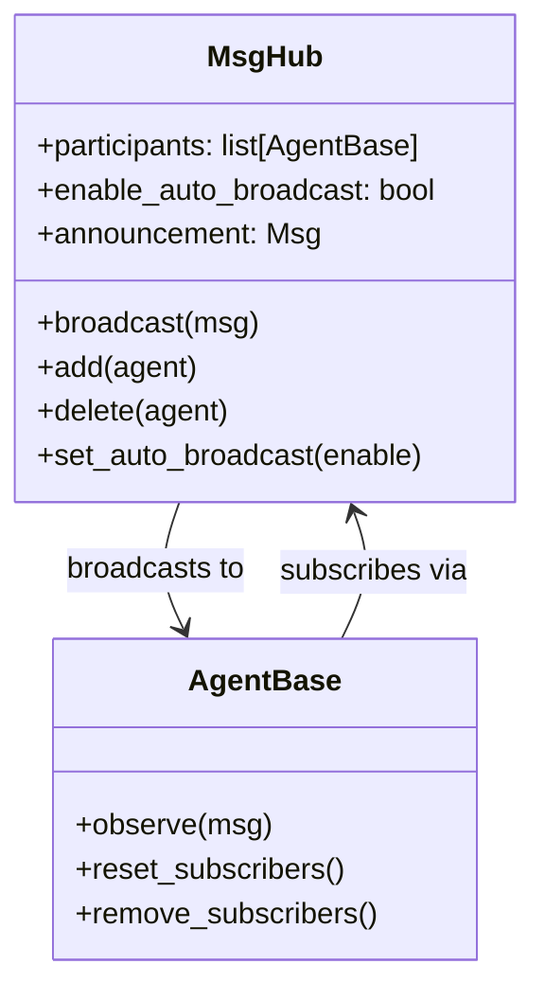

# 第6章 发布-订阅模式（MsgHub）

> **目标**：深入理解MsgHub如何实现多Agent松耦合通信

---

## 🎯 学习目标

学完之后，你能：
- 说出MsgHub在AgentScope架构中的定位
- 使用MsgHub协调多Agent消息传递
- 理解auto_broadcast机制
- 区分Pipeline和MsgHub的使用场景

---

## 🔍 背景问题

**为什么需要MsgHub？**

当你有多个Agent需要协作时：
- 辩论系统：正方、反方、主持人需要互相"听到"对方的发言
- 聊天室：多个用户+多个Agent需要看到所有消息
- 监控系统：多个Agent需要同时收到报警消息

**Pipeline的问题**：每个Agent的输出只能传给下一个Agent，无法实现"一对多"。

**MsgHub的解决方案**：广播式消息传递，所有订阅者同时收到。

---

## 📦 架构定位

### 源码入口

| 项目 | 值 |
|------|-----|
| **文件路径** | `src/agentscope/pipeline/_msghub.py` |
| **类名** | `MsgHub` |
| **关键方法** | `broadcast()`, `observe()`, `add()`, `delete()` |

### 模块关系图



### MsgHub在整体架构中的位置

```
┌─────────────────────────────────────────────────────────────────┐
│                      MsgHub层                                     │
│                                                                  │
│  用户代码                                                        │
│  async with MsgHub(participants=[a1, a2, a3]) as hub:           │
│      await hub.broadcast(msg)                                   │
└─────────────────────────────────────────────────────────────────┘
                              │
                              ▼
┌─────────────────────────────────────────────────────────────────┐
│                      Agent层                                     │
│              (AgentBase.observe() 接收消息)                       │
└─────────────────────────────────────────────────────────────────┘
```

---

## 🔬 核心源码分析

### 6.1 MsgHub初始化

**文件**: `src/agentscope/pipeline/_msghub.py:42-71`

```python showLineNumbers
class MsgHub:
    def __init__(
        self,
        participants: Sequence[AgentBase],
        announcement: list[Msg] | Msg | None = None,
        enable_auto_broadcast: bool = True,  # 关键参数！
        name: str | None = None,
    ) -> None:
        """Initialize a MsgHub context manager.

        Args:
            participants: 参与MsgHub的Agent序列
            announcement: 进入时广播给所有参与者的消息
            enable_auto_broadcast: 是否启用自动广播。
                True=任何Agent的回复自动广播给其他Agent
                False=只能通过hub.broadcast()手动广播
            name: MsgHub名称，用于标识订阅者
        """
        self.name = name or shortuuid.uuid()
        self.participants = list(participants)
        self.announcement = announcement
        self.enable_auto_broadcast = enable_auto_broadcast
```

### 6.2 auto_broadcast机制

**核心逻辑**：

```python showLineNumbers
def _reset_subscriber(self) -> None:
    """Reset the subscriber for agent in self.participant"""
    if self.enable_auto_broadcast:
        for agent in self.participants:
            agent.reset_subscribers(self.name, self.participants)
```

**作用**：当`enable_auto_broadcast=True`时，每个Agent的`reply()`结果会自动广播给其他参与者。

**等效手动实现**（文档注释中的例子）：
```python
# 自动广播（enable_auto_broadcast=True）
with MsgHub(participants=[agent1, agent2, agent3]):
    agent1()  # agent1的回复会自动发给agent2, agent3
    agent2()  # agent2的回复会自动发给agent1, agent3

# 等效的手动实现
x1 = agent1()
agent2.observe(x1)  # 手动观察
agent3.observe(x1)

x2 = agent2()
agent1.observe(x2)
agent3.observe(x2)
```

### 6.3 broadcast()方法

**文件**: `src/agentscope/pipeline/_msghub.py:130-138`

```python showLineNumbers
async def broadcast(self, msg: list[Msg] | Msg) -> None:
    """Broadcast the message to all participants.

    Args:
        msg: Message(s) to be broadcast among all participants.
    """
    for agent in self.participants:
        await agent.observe(msg)
```

**关键点**：
- 手动广播，不依赖auto_broadcast
- 通过`agent.observe()`让Agent"看到"消息
- `observe()`通常会把消息加入Agent的memory

### 6.4 添加/删除参与者

```python showLineNumbers
def add(self, new_participant: list[AgentBase] | AgentBase) -> None:
    """Add new participant into this hub"""
    if isinstance(new_participant, AgentBase):
        new_participant = [new_participant]
    
    for agent in new_participant:
        if agent not in self.participants:
            self.participants.append(agent)
    
    self._reset_subscriber()  # 重新设置订阅关系

def delete(self, participant: list[AgentBase] | AgentBase) -> None:
    """Delete agents from participant.

    Args:
        participant: Agent or list of agents to remove

    Note:
        如果agent不在participants中，会记录warning日志
    """
    if not isinstance(participant, list):
        participant = [participant]

    for agent in participant:
        if agent in self.participants:
            self.participants.remove(agent)
        else:
            import logging
            logging.warning(f"Agent {agent} not in participants")

    self._reset_subscriber()
```

---

## 🚀 先跑起来

### 基本用法

```python showLineNumbers
from agentscope.pipeline import MsgHub
from agentscope.message import Msg

# 创建多个Agent
agent1 = ReActAgent(name="Agent1", ...)
agent2 = ReActAgent(name="Agent2", ...)
agent3 = ReActAgent(name="Agent3", ...)

# 使用MsgHub协调
async with MsgHub(participants=[agent1, agent2, agent3]) as hub:
    # 进入时广播 announcement（如果有）
    await hub.broadcast(Msg(
        name="System",
        content="任务开始",
        role="system"
    ))

    # Agent1回复，自动广播给agent2和agent3
    # 注意：需要传入Msg对象，不能只传字符串
    response1 = await agent1(Msg(
        name="user",
        content="分析这个问题",
        role="user"
    ))

    # Agent2回复，自动广播给agent1和agent3
    response2 = await agent2(Msg(
        name="user",
        content="补充观点",
        role="user"
    ))
```

### 禁用自动广播

```python showLineNumbers
# 只使用手动广播
async with MsgHub(
    participants=[agent1, agent2],
    enable_auto_broadcast=False  # 禁用自动广播
) as hub:
    await hub.broadcast(Msg(name="System", content="任务开始", role="system"))
    # Agent的回复不会自动广播

    response1 = await agent1(Msg(name="user", content="分析", role="user"))
    # 需要手动广播
    await hub.broadcast(response1)
```

---

## ⚠️ 工程经验与坑

### ⚠️ auto_broadcast的副作用

**问题**：如果`enable_auto_broadcast=True`，每个Agent回复后会自动广播给其他Agent，可能导致：
- 无限循环：Agent A回复 → 广播给B → B回复 → 广播给A → ...
- 消息爆炸：参与者越多，消息数量指数增长

**建议**：
```python
# 复杂场景建议禁用auto_broadcast
async with MsgHub(
    participants=[agent1, agent2, agent3],
    enable_auto_broadcast=False  # 手动控制
) as hub:
    # 在适当的时机调用broadcast()
```

### ⚠️ observe()的语义

**源码显示**（第138行）：
```python
await agent.observe(msg)
```

`observe()`的默认实现是把消息加入Agent的memory。但具体行为取决于Agent实现。

---

## 🔧 Contributor指南

### 适合新手修改的文件

| 文件 | 原因 |
|------|------|
| `src/agentscope/pipeline/_msghub.py` | MsgHub类，逻辑清晰 |

### 危险的修改区域

**⚠️ 警告**：

1. **`_reset_subscriber()`逻辑**（第89-93行）
   - 控制auto_broadcast的核心逻辑
   - 错误修改可能导致消息丢失或重复

2. **`broadcast()`的遍历顺序**（第137行）
   ```python
   for agent in self.participants:
       await agent.observe(msg)
   ```
   如果participants包含正在执行中的Agent，可能有竞态条件

---

## 💡 Java开发者注意

```python
# Python MsgHub vs Java
```

| Python MsgHub | Java | 说明 |
|---------------|------|------|
| `MsgHub(participants=[a1,a2])` | `EventBus.register(subscriber)` | 注册订阅者 |
| `hub.broadcast(msg)` | `eventBus.post(message)` | 广播消息 |
| `enable_auto_broadcast=True` | `@Subscribe`注解自动处理 | 自动广播 |
| `agent.observe(msg)` | `onEvent(message)` | 收到消息的处理 |

**Java对比**：
```java
// Google Guava EventBus
EventBus eventBus = new EventBus();
eventBus.register(new Object() {
    @Subscribe
    public void onMessage(Message msg) {
        // 处理消息
    }
});
eventBus.post(message);  // 广播
```

**关键区别**：
- EventBus需要显式注册@Subscribe方法
- MsgHub通过reset_subscribers()批量设置订阅关系
</details>

---

## 🎯 思考题

<details>
<summary>1. 为什么MsgHub要使用上下文管理器（async with）？</summary>

**答案**：
- **生命周期管理**：进入时设置订阅关系，退出时清理
- **资源清理**（第83-87行）：
  ```python
  async def __aexit__(self, *args, **kwargs) -> None:
      if self.enable_auto_broadcast:
          for agent in self.participants:
              agent.remove_subscribers(self.name)
  ```
- **防止内存泄漏**：退出时不清理会导致Agent之间保持不必要的引用

**对比Java**：try-with-resources的等价设计
</details>

<details>
<summary>2. enable_auto_broadcast=True可能导致什么实际问题？</summary>

**答案**：
- **消息风暴**：每个Agent回复都广播给所有其他Agent
- **无限循环**：如果Agent基于接收到的消息再次回复，可能形成循环
- **性能问题**：N个Agent，每个回复广播N-1次，时间复杂度O(N²)

**实际场景**：辩论系统中，如果auto_broadcast开启，正方说一句话，反方立即回复，这条回复又会触发正方再次回复...

**建议**：复杂协作场景建议`enable_auto_broadcast=False`，手动控制何时广播
</details>

<details>
<summary>3. MsgHub和Pipeline的核心区别是什么？</summary>

**答案**：

| 对比项 | Pipeline | MsgHub |
|--------|----------|--------|
| **消息模式** | 点对点管道 | 发布-订阅广播 |
| **输出归属** | 每个Agent输出传给下一个 | 所有订阅者收到相同消息 |
| **依赖关系** | 有依赖（上一个输出是下一个输入）| 无依赖（松耦合）|
| **执行控制** | 顺序执行 | 并行处理 |
| **适用场景** | 流水线处理 | 事件通知、多Agent协作 |

**选择建议**：
- "A的结果给B，B的结果给C" → SequentialPipeline
- "所有人都收到这条通知" → MsgHub + broadcast()
- "正方说给反方听，反方说给正方听" → MsgHub + enable_auto_broadcast=True
</details>

---

★ **Insight** ─────────────────────────────────────
- **MsgHub = 广播站**，通过publish-subscribe模式实现松耦合
- **auto_broadcast是双刃剑**：方便但可能导致消息风暴
- **broadcast() vs observe()**：broadcast是主动推，observe是被动收
- **上下文管理器保证资源清理**：进入设置订阅，退出清理订阅
─────────────────────────────────────────────────
