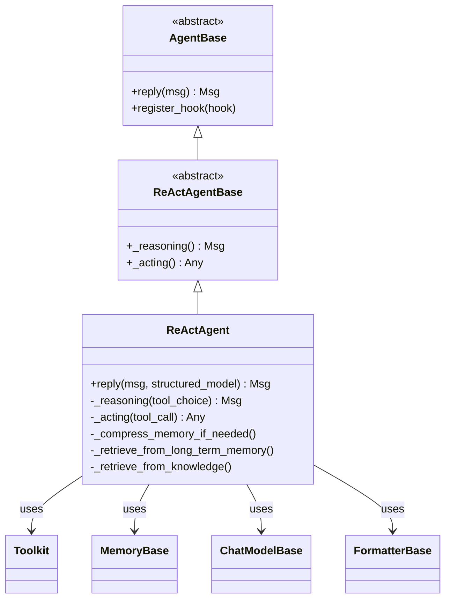
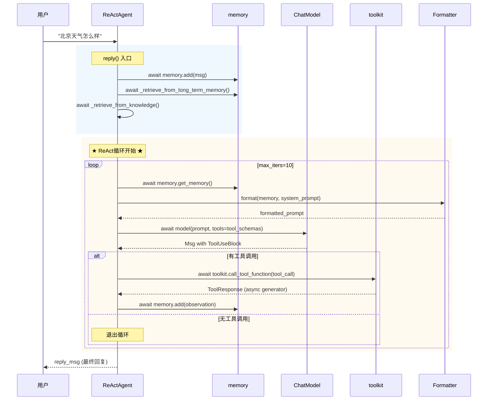

# 第7章 ReActAgent工作原理

> **目标**：深入理解AgentScope中ReActAgent的源码实现

---

## 🎯 学习目标

学完之后，你能：
- 说出ReActAgent在AgentScope架构中的定位
- 追踪一条用户消息在ReActAgent中的完整旅程
- 阅读并理解`src/agentscope/agent/_react_agent.py`的核心逻辑
- 调试Agent的推理-行动循环
- 为ReActAgent贡献代码

---

## 🔍 背景问题

**为什么需要ReActAgent？**

当你问Agent"北京天气怎么样"时，Agent需要：
1. 理解用户想要查询天气
2. 提取"北京"这个城市参数
3. 调用天气API
4. 将API返回的JSON转化为自然语言回答

如果直接让LLM生成回复，它可能：
- 不知道当前真实天气（幻觉）
- 不知道如何调用工具
- 返回格式不符合预期

**ReAct范式**解决的是"让LLM能够思考-行动-观察的循环，直到完成任务"。

---

## 📦 架构定位

### 源码入口

| 项目 | 值 |
|------|-----|
| **文件路径** | `src/agentscope/agent/_react_agent.py` |
| **类名** | `ReActAgent` |
| **基类** | `ReActAgentBase`（位于`src/agentscope/agent/_react_agent_base.py`）|
| **主方法** | `async def reply(self, msg: Msg | list[Msg] | None = None, ...)` |
| **继承关系** | `AgentBase` → `ReActAgentBase` → `ReActAgent` |

### 模块关系图



### ReActAgent在整体架构中的位置

```
┌─────────────────────────────────────────────────────────────────┐
│                        应用层                                     │
│  用户代码: agent = ReActAgent(...)  await agent(Msg(...))       │
└─────────────────────────────────────────────────────────────────┘
                              │
                              ▼
┌─────────────────────────────────────────────────────────────────┐
│                     AgentBase.reply()                            │
│              （所有Agent的入口，定义在_agent_base.py）             │
└─────────────────────────────────────────────────────────────────┘
                              │
                              ▼
┌─────────────────────────────────────────────────────────────────┐
│              ReActAgent.reply() ★ 本章重点                        │
│         （执行ReAct推理-行动循环）                                 │
│                                                                      │
│  调用链:                                                          │
│    reply()                                                        │
│      ├─ memory.add(msg)          # 存储用户消息                      │
│      ├─ _retrieve_from_long_term_memory()  # 长期记忆检索           │
│      ├─ _retrieve_from_knowledge()         # 知识库检索            │
│      │                                                              │
│      └─ for _ in range(max_iters):  # ReAct循环                   │
│             ├─ _compress_memory_if_needed()  # 内存压缩            │
│             ├─ _reasoning()         # 调用LLM生成工具调用           │
│             └─ _acting()            # 执行工具，返回结果            │
│                    │                                                │
│                    ▼                                               │
│             [检查是否退出: 无工具调用? 结构化输出完成?]              │
└─────────────────────────────────────────────────────────────────┘
                              │
                              ▼
┌─────────────────────────────────────────────────────────────────┐
│                    Model/Toolkit/Memory                          │
│         （ReActAgent的依赖组件）                                   │
└─────────────────────────────────────────────────────────────────┘
```

---

## 🔬 核心源码分析

### 7.1 reply() 方法 — 完整调用链

**文件**: `src/agentscope/agent/_react_agent.py:376-537`

```python showLineNumbers
@trace_reply
async def reply(
    self,
    msg: Msg | list[Msg] | None = None,
    structured_model: Type[BaseModel] | None = None,
) -> Msg:
    """Generate a reply based on the current state and input arguments."""
    # 步骤1: 记录用户消息到内存
    await self.memory.add(msg)

    # 步骤2: 长期记忆检索（如果启用）
    await self._retrieve_from_long_term_memory(msg)
    
    # 步骤3: 知识库检索（如果配置了knowledge）
    await self._retrieve_from_knowledge(msg)

    # 步骤4: 结构化输出管理
    tool_choice: Literal["auto", "none", "required"] | None = None
    if structured_model:
        # 注册generate_response工具
        self.toolkit.register_tool_function(getattr(self, self.finish_function_name))
        tool_choice = "required"
    else:
        self.toolkit.remove_tool_function(self.finish_function_name)

    # 步骤5: ★ ReAct推理-行动循环 ★
    structured_output = None
    reply_msg = None
    for _ in range(self.max_iters):  # 默认max_iters=10
        # 5a. 内存压缩（如果需要）
        await self._compress_memory_if_needed()
        
        # 5b. 推理阶段：调用LLM
        msg_reasoning = await self._reasoning(tool_choice)
        
        # 5c. 行动阶段：执行工具调用
        futures = [
            self._acting(tool_call)
            for tool_call in msg_reasoning.get_content_blocks("tool_use")
        ]
        if self.parallel_tool_calls:
            structured_outputs = await asyncio.gather(*futures)
        else:
            structured_outputs = [await _ for _ in futures]
        
        # 5d. 检查退出条件
        if self._required_structured_model:
            # 需要结构化输出
            if structured_outputs:
                reply_msg = Msg(self.name, msg_reasoning.get_content_blocks("text"), ...)
                break
        elif not msg_reasoning.has_content_blocks("tool_use"):
            # 无工具调用，只有文本回复 → 退出
            reply_msg = msg_reasoning
            break

    # 步骤6: 达到最大迭代次数时的兜底
    if reply_msg is None:
        reply_msg = await self._summarizing()

    # 步骤7: 记录到长期记忆（如果是static_control模式）
    if self._static_control:
        await self.long_term_memory.record(...)

    return reply_msg
```

### 7.2 _reasoning() 方法 — LLM调用

**文件**: `src/agentscope/agent/_react_agent.py:540+`

```python showLineNumbers
async def _reasoning(
    self,
    tool_choice: Literal["auto", "none", "required"] | None = None,
) -> Msg:
    """Perform the reasoning process.
    
    核心逻辑：
    1. 获取hint（来自PlanNotebook）
    2. 格式化消息（memory + system prompt）
    3. 调用model，得到包含tool_use blocks的Msg
    """
    # 获取hint（如果print_hint_msg启用）
    hint_msg = None
    if self.print_hint_msg:
        hint_msg = self._get_hint()
    
    # 构建prompt：格式化memory中的历史消息
    prompt = await self.formatter.format(
        memory=self.memory,
        system_prompt=self.sys_prompt,
        hint=hint_msg,
    )
    
    # 调用LLM，返回包含TextBlock和ToolUseBlock的Msg
    msg_reasoning = await self.model(
        prompt,
        stream=True,
        tool_choice=tool_choice,
        tools=self.toolkit.get_tool_schemas(),  # 传递工具schema给LLM
    )
    
    return msg_reasoning
```

### 7.3 _acting() 方法 — 工具执行

```python showLineNumbers
async def _acting(self, tool_call: ToolUseBlock) -> dict | None:
    """Execute a single tool call.

    Args:
        tool_call: 包含tool_use block的Msg

    Returns:
        如果是finish函数调用，返回结构化输出；否则返回None
    """
    # 创建工具结果消息
    tool_res_msg = Msg(
        "system",
        [
            ToolResultBlock(
                type="tool_result",
                id=tool_call["id"],
                name=tool_call["name"],
                output=[],  # 初始化为空，后续从chunk累积
            ),
        ],
        "system",
    )

    try:
        # 调用工具（call_tool_function是async generator）
        tool_res = await self.toolkit.call_tool_function(tool_call)

        # 异步迭代处理每个chunk
        async for chunk in tool_res:
            # 累积工具输出
            tool_res_msg.content[0]["output"] = chunk.content
            await self.print(tool_res_msg, chunk.is_last)

            # 检查是否是finish函数且成功
            if (
                tool_call["name"] == self.finish_function_name
                and chunk.metadata
                and chunk.metadata.get("success", False)
            ):
                return chunk.metadata.get("structured_output")

        return None

    finally:
        # 将工具结果加入memory
        await self.memory.add(tool_res_msg)
```

### 7.4 数据流追踪图



---

## ⚠️ 工程经验与历史包袱

### 为什么max_iters默认值是10？

查看源码第256行：
```python
max_iters (`int`, defaults to `10`):
    """The maximum number of iterations of the reasoning-acting loops."""
```

**历史原因**：早期版本没有内存压缩，如果对话很长，LLM的context window会爆。设置10次迭代是一个工程折中。

**问题**：对于复杂任务（如写一篇万字报告），10次可能不够。

**建议**：如果你的任务需要多轮工具调用，可以调大这个值：
```python
agent = ReActAgent(
    name="Researcher",
    max_iters=30,  # 复杂任务需要更大值
    ...
)
```

### 内存压缩机制（CompressionConfig）

**源码位置**：第107-150行定义了`CompressionConfig`

当对话历史超过`trigger_threshold`（默认token数）时，会触发压缩：

```python
# 压缩配置示例
compression = ReActAgent.CompressionConfig(
    enable=True,
    agent_token_counter=token_counter,
    trigger_threshold=6000,  # 超过6000 token时压缩
    keep_recent=3,  # 保留最近3条消息
)
```

**压缩Prompt**（第129-137行）：
```
"<system-hint>You have been working on the task described above 
but have not yet completed it. 
Now write a continuation summary that will allow you to resume 
work efficiently in a future context window..."
```

---

## 🔧 Contributor指南

### 适合新手修改的文件

| 文件 | 原因 |
|------|------|
| `src/agentscope/agent/_react_agent.py` | 核心逻辑，结构清晰 |
| `src/agentscope/agent/_agent_base.py` | AgentBase基类，Hook系统 |

### 危险的修改区域

**⚠️ 警告**：以下区域的修改需要非常小心：

1. **reply()方法的循环退出条件**（第453-518行）
   - 错误修改可能导致无限循环
   - 或导致Agent在应该回复时继续调用工具

2. **_reasoning()中的tool_choice参数**（第437行）
   - 影响LLM是否生成工具调用
   - 错误修改可能导致Agent行为异常

3. **memory的add/get顺序**（第396行）
   - 错误的顺序会导致对话历史错乱

### 调试技巧

```python
import logging

# 开启DEBUG日志可以看到完整的ReAct循环
logging.basicConfig(level=logging.DEBUG)

# 或者在AgentScope初始化时
agentscope.init(
    project="DebugAgent",
    logging_level="DEBUG",
)
```

### 如何添加新的Hook

ReActAgent继承自`AgentBase`，支持Hook机制：

```python
# 在src/agentscope/agent/_agent_base.py中定义
class AgentBase:
    def _pre_hook(self, msg: Msg) -> Msg:
        """Hook在推理之前"""
        return msg
    
    def _post_hook(self, msg: Msg) -> Msg:
        """Hook在回复之后"""
        return msg
```

---

## 💡 Java开发者注意

```python
# Python ReActAgent vs Java状态机
```

**对比**：

| Python AgentScope | Java Spring | 说明 |
|-------------------|--------------|------|
| `async def reply()` | `CompletableFuture<Msg> reply()` | 异步返回 |
| `memory.add(msg)` | `@Autowired MemoryService` | 内存管理 |
| `toolkit.call_tool_function(tool_call)` | `ToolExecutor.execute(tool)` | 工具执行 |
| `_reasoning()/_acting()` | StateMachine transitions | 状态转换 |
| `@trace_reply`装饰器 | Micrometer tracing | 追踪 |

**关键区别**：
- Python使用`async/await`，Java使用`CompletableFuture`
- Python的ReAct循环是"LLM决定下一步"，Java状态机是"代码决定下一步"

---

## 🎯 思考题

<details>
<summary>1. 为什么ReActAgent的_reasoning()返回的是Msg而不是字符串？</summary>

**答案**：
- Msg可以同时包含`TextBlock`（文本回复）和`ToolUseBlock`（工具调用）
- 这允许LLM在一次响应中既生成文本又生成工具调用
- 如果只返回字符串，就丢失了工具调用的结构化信息
- 源码第543行的注释说明：`Returns: A Msg with certain content blocks`
</details>

<details>
<summary>2. 如果Agent陷入无限工具调用循环，会发生什么？</summary>

**答案**：
- `max_iters`参数（默认10）会限制循环次数
- 达到最大迭代后，会调用`_summarizing()`生成兜底回复（第522-524行）
- 这是一种保护机制，防止Agent无限制运行
- 但也可能导致复杂任务被提前终止

**实际场景**：
```python
# 如果你的任务需要更多迭代
agent = ReActAgent(
    name="Researcher",
    max_iters=50,  # 深度研究需要更多迭代
    ...
)
```
</details>

<details>
<summary>3. 工具执行的parallel_tool_calls=True和False有什么区别？</summary>

**答案**：
- **False（顺序执行）**：第450-451行，逐个执行工具调用
- **True（并行执行）**：第448行，使用`asyncio.gather`并发执行

**源码对比**：
```python
if self.parallel_tool_calls:
    structured_outputs = await asyncio.gather(*futures)  # 并行
else:
    structured_outputs = [await _ for _ in futures]       # 顺序
```

**适用场景**：
- 工具之间无依赖 → 并行（更快）
- 工具之间有依赖（如第二个工具需要第一个的结果）→ 顺序
</details>

---

★ **Insight** ─────────────────────────────────────
- **ReActAgent的精髓**：不是"直接回答"，而是"推理→行动→观察→再推理"的循环
- **Msg是核心载体**：一次LLM调用可能返回文本+工具调用，Msg承接所有信息
- **max_iters是安全网**：防止无限循环，但可能牺牲复杂任务的完整性
- **内存压缩是后来加的**：解决context window溢出问题，属于历史包袱
─────────────────────────────────────────────────
