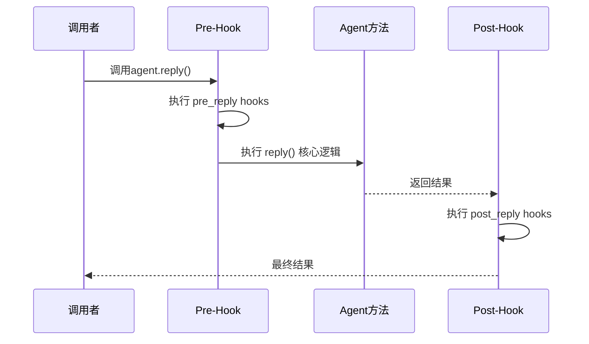

# 第8章 Hook机制

> **目标**：深入理解AgentScope的Hook系统如何拦截和扩展Agent行为

---

## 🎯 学习目标

学完之后，你能：
- 说出Hook在AgentScope架构中的位置
- 使用Hook拦截Agent的pre/post各个阶段
- 为AgentScope贡献自定义Hook

---

## 🔍 背景问题

**为什么需要Hook？**

当你想要：
- 记录Agent的每次思考过程（用于调试）
- 在Agent回复前修改内容（过滤、注入）
- 监控Agent的性能指标
- 实现权限控制

**Hook就是"在关键点插入代码"的机制**。

---

## 📦 架构定位

### 源码入口

| 项目 | 值 |
|------|-----|
| **Hook类型定义** | `src/agentscope/types/_hook.py` |
| **Hook注册方法** | `src/agentscope/agent/_agent_base.py` |
| **Hook包装器** | `src/agentscope/agent/_agent_meta.py` |

### Hook类型

**文件**: `src/agentscope/types/_hook.py:5-18`

```python showLineNumbers
AgentHookTypes = (
    "pre_reply",      # 回复前
    "post_reply",     # 回复后
    "pre_observe",    # 观察前
    "post_observe",   # 观察后
    "pre_print",      # 打印前
    "post_print",     # 打印后
)

ReActAgentHookTypes = (
    "pre_reasoning",   # 推理前
    "post_reasoning",  # 推理后
    "pre_acting",      # 行动前
    "post_acting",     # 行动后
) + AgentHookTypes
```

---

## 🔬 核心源码分析

### 8.1 Hook注册方法

**文件**: `src/agentscope/agent/_agent_base.py:533-586`

```python showLineNumbers
def register_instance_hook(
    self,
    hook_type: AgentHookTypes,
    hook_name: str,
    hook: Callable,
) -> None:
    """Register a hook to the agent instance.

    Args:
        hook_type: The type of the hook (pre_reply, post_reply, etc.)
        hook_name: The name of the hook. If already registered,
            the hook will be overwritten.
        hook: The hook function.
    """
    hooks = getattr(self, f"_instance_{hook_type}_hooks")
    hooks[hook_name] = hook
```

**类级别注册**（第591-616行）：
```python showLineNumbers
@classmethod
def register_class_hook(
    cls,
    hook_type: AgentHookTypes,
    hook_name: str,
    hook: Callable,
) -> None:
    """Register a hook to the agent class (所有实例共享)."""
    hooks = getattr(cls, f"_class_{hook_type}_hooks")
    hooks[hook_name] = hook
```

### 8.2 Hook的包装机制

**文件**: `src/agentscope/agent/_agent_meta.py:55-161`

```python showLineNumbers
def _wrap_with_hooks(
    func_name: str,
    func: Callable,
) -> Callable:
    """装饰器：包装原函数，添加pre/post hooks"""
    
    async def wrapped_function(self, *args, **kwargs):
        # 防止重复执行
        if getattr(self, f"_hook_running_{func_name}", False):
            return await func(self, *args, **kwargs)
        
        # 1. 执行 pre_hooks
        pre_hooks = (
            list(self._instance_pre_{func_name}_hooks.values()) +
            list(self.__class__._class_pre_{func_name}_hooks.values())
        )
        for pre_hook in pre_hooks:
            modified_kwargs = pre_hook(self, kwargs)
            if modified_kwargs:
                kwargs = modified_kwargs
        
        # 2. 执行原函数
        setattr(self, f"_hook_running_{func_name}", True)
        try:
            result = await func(self, *args, **kwargs)
        finally:
            setattr(self, f"_hook_running_{func_name}", False)
        
        # 3. 执行 post_hooks
        post_hooks = (
            list(self._instance_post_{func_name}_hooks.values()) +
            list(self.__class__._class_post_{func_name}_hooks.values())
        )
        for post_hook in post_hooks:
            result = post_hook(self, result) or result
        
        return result
    
    return wrapped_function
```

### 8.3 Hook流程图



---

## 🚀 先跑起来

### 注册一个实例级别的Hook

```python showLineNumbers
from agentscope.agent import AgentBase

# 创建Hook函数
# 注意：pre_hook接收 (self, normalized_kwargs)，返回修改后的kwargs或None
async def my_pre_reply_hook(agent, normalized_kwargs):
    """回复前的Hook"""
    print(f"Agent {agent.name} 即将回复")
    # 可以修改kwargs中的参数
    normalized_kwargs["msg"] = modified_msg
    return normalized_kwargs  # 返回修改后的参数

# 注意：post_hook接收 (self, normalized_kwargs, output)，返回修改后的output或None
async def my_post_reply_hook(agent, normalized_kwargs, output):
    """回复后的Hook"""
    print(f"Agent {agent.name} 回复完成: {output.content[:50]}...")
    return output  # 返回修改后的结果

# 创建Agent并注册Hook
agent = AgentBase(name="TestAgent", ...)
agent.register_instance_hook("pre_reply", "my_pre", my_pre_reply_hook)
agent.register_instance_hook("post_reply", "my_post", my_post_reply_hook)
```

### 注册一个类级别的Hook

```python showLineNumbers
# 类级别Hook：所有实例共享
@classmethod
def setup_class_hook(cls):
    async def log_all_replies(agent, normalized_kwargs, output):
        print(f"[LOG] {cls.__name__} replied: {output.content}")
        return output

    cls.register_class_hook("post_reply", "logger", log_all_replies)

# 调用
setup_class_hook()
# 现在所有AgentBase实例的回复都会被记录
```

---

## ⚠️ 工程经验与坑

### ⚠️ Hook的执行顺序

**实例Hook先于类Hook执行**：

```python
# 源码顺序（第100-104行）
pre_hooks = (
    list(self._instance_pre_{func_name}_hooks.values()) +  # 实例先
    list(self.__class__._class_pre_{func_name}_hooks.values())  # 类后
)
```

### ⚠️ Hook返回值的处理

```python
# pre_hook 必须返回 dict（修改后的参数）或 None
async def my_pre_hook(agent, normalized_kwargs):
    if some_condition:
        normalized_kwargs["msg"] = modified_msg  # 修改参数
        return normalized_kwargs  # 必须返回dict
    return None  # 不修改

# post_hook 返回 output 或 None（None表示不修改）
async def my_post_hook(agent, normalized_kwargs, output):
    if should_modify:
        return modified_output
    return None  # 不修改，使用原结果
```

---

## 🔧 Contributor指南

### 适合新手修改的文件

| 文件 | 原因 |
|------|------|
| `src/agentscope/hooks/__init__.py` | 内置Hook实现 |
| `src/agentscope/evaluate/...` | 已有Hook使用示例 |

### 危险的修改区域

**⚠️ 警告**：

1. **`_wrap_with_hooks`的guard逻辑**（第79-80行）
   ```python
   if getattr(self, hook_guard_attr, False):
       return await func(self, *args, **kwargs)
   ```
   防止重入，但如果错误修改可能导致Hook不执行

2. **Hook的注册顺序**
   - 实例Hook先于类Hook执行
   - 同类型Hook按注册顺序执行

---

## 💡 Java开发者注意

```python
# Python Hook vs Java Interceptor
```

| Python AgentScope | Java | 说明 |
|-------------------|------|------|
| `register_instance_hook()` | `@AroundInvoke` 注解 | 方法拦截 |
| `pre_reply/post_reply` | `preInvoke()`/`postInvoke()` | 切面位置 |
| Hook是函数 | Interceptor是Bean | 实现方式不同 |
| 字典存储 | 有序列表 | 执行顺序 |

**Java对比**：
```java
// Java CDI Interceptor
@Interceptor
public class LoggingInterceptor {
    @AroundInvoke
    public Object intercept(InvocationContext ctx) {
        System.out.println("Before");
        Object result = ctx.proceed();  // 执行原方法
        System.out.println("After");
        return result;
    }
}
```

---

## 🎯 思考题

<details>
<summary>1. 为什么需要实例Hook和类Hook两种级别？</summary>

**答案**：
- **类Hook**：所有实例共享，用于框架级别的拦截（如日志、监控）
- **实例Hook**：单个实例独享，用于特定实例的行为修改

**实际场景**：
```python
# 类Hook：记录所有Agent的回复
AgentBase.register_class_hook("post_reply", "logger", log_all_replies)

# 实例Hook：只修改特定Agent
agent = ReActAgent(...)
agent.register_instance_hook("pre_reply", "debug", my_debug_hook)
```
</details>

<details>
<summary>2. pre_hook的返回值有什么要求？为什么？</summary>

**答案**：
- **必须返回dict或None**
- 返回dict表示修改后的参数，会传递给下一个Hook或原函数
- 返回None表示不修改参数

**源码依据**（第105-117行）：
```python
for pre_hook in pre_hooks:
    modified_keywords = await _execute_async_or_sync_func(
        pre_hook,
        self,
        deepcopy(current_normalized_kwargs),
    )
    if modified_keywords is not None:
        assert isinstance(modified_keywords, dict)
        current_normalized_kwargs = modified_keywords
```
</details>

<details>
<summary>3. Hook如何避免无限循环？</summary>

**答案**：
- **Guard机制**：第79-80行
  ```python
  if getattr(self, hook_guard_attr, False):
      return await func(self, *args, **kwargs)
  ```
- 如果Hook已经在执行中，再次调用直接执行原函数，跳过Hook

**防止的问题**：
- pre_hook调用了会触发同一Hook的方法
- post_hook修改了会触发同一Hook的观察者
</details>

---

★ **Insight** ─────────────────────────────────────
- **Hook系统**在`AgentBase`中实现，通过`_wrap_with_hooks`包装原函数
- **两种Hook**：实例Hook（单个Agent）和类Hook（所有Agent共享）
- **pre_hook返回dict**表示修改参数，返回None表示不修改
- **Guard机制**防止Hook重入导致的无限循环
─────────────────────────────────────────────────
