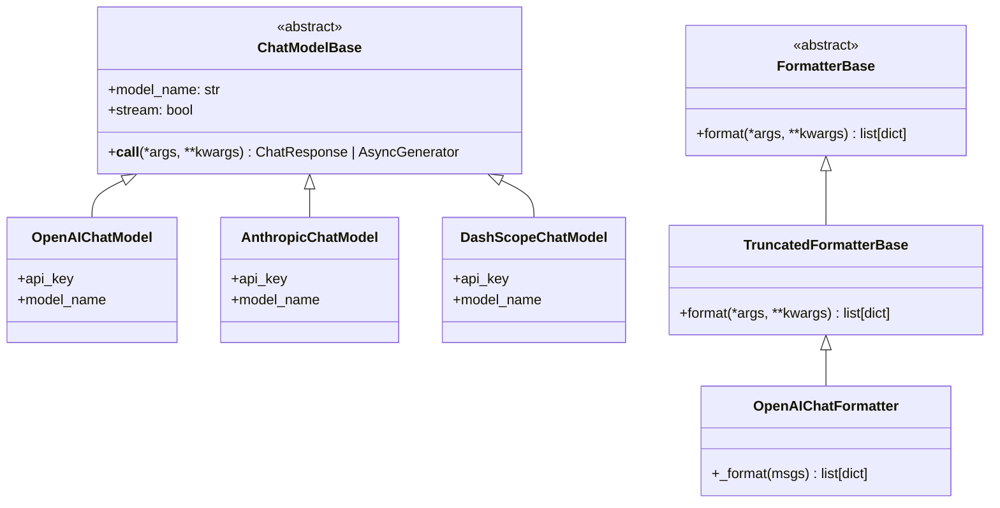
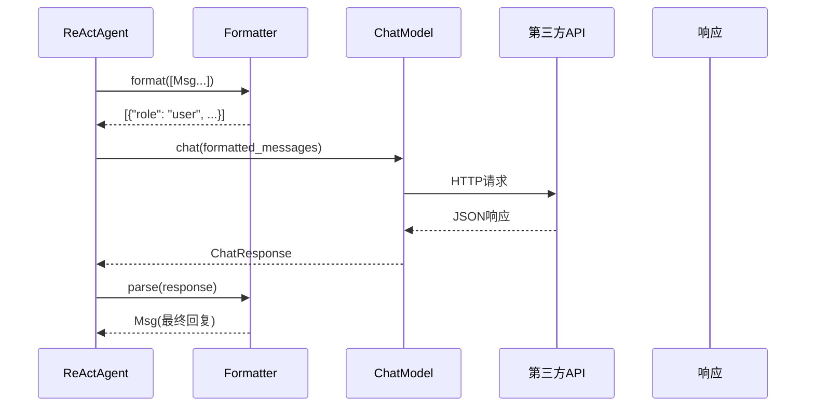

# 第9章 Model与Formatter

> **目标**：深入理解AgentScope的Model抽象层和Formatter适配机制

---

## 🎯 学习目标

学完之后，你能：
- 说出Model/Formatter在AgentScope架构中的定位
- 理解为什么需要Formmatter适配不同模型API
- 为AgentScope添加新的模型支持

---

## 🔍 背景问题

**为什么需要Model和Formatter两层抽象？**

不同模型服务商（OpenAI、Anthropic、DashScope）的API格式完全不同：
- **OpenAI**：`{"role": "user", "content": "..."}`
- **Anthropic**：`{"role": "user", "content": [{"type": "text", "text": "..."}]}`
- **DashScope**：`{"role": "user", "text": "..."}`

如果Agent直接调用模型，所有调用代码都要改。

**解决方案**：Model统一接口 + Formatter适配不同格式

---

## 📦 架构定位

### 源码入口

| 项目 | 值 |
|------|-----|
| **Model基类** | `src/agentscope/model/_model_base.py` |
| **Formatter基类** | `src/agentscope/formatter/_formatter_base.py` |
| **OpenAI实现** | `src/agentscope/model/_openai_model.py` |
| **OpenAI Formatter** | `src/agentscope/formatter/_openai_formatter.py` |

### 继承关系图



### 数据流图



---

## 🔬 核心源码分析

### 9.1 ChatModelBase

**文件**: `src/agentscope/model/_model_base.py`

```python showLineNumbers
class ChatModelBase:
    """The base class for all chat models."""

    @abstractmethod
    async def __call__(
        self,
        *args: Any,
        **kwargs: Any,
    ) -> ChatResponse | AsyncGenerator[ChatResponse, None]:
        """Send chat messages to the model and returns the response.

        Args:
            messages: Formatted messages from formatter
            tools: Optional tool definitions
            **kwargs: Additional arguments (stream, temperature, etc.)

        Returns:
            ChatResponse or async generator of ChatResponse
        """
        pass
```

### 9.2 FormatterBase

**文件**: `src/agentscope/formatter/_formatter_base.py:11-17`

```python showLineNumbers
class FormatterBase:
    """The base class for formatters."""

    @abstractmethod
    async def format(
        self,
        *args: Any,
        **kwargs: Any,
    ) -> list[dict[str, Any]]:
        """Format the Msg objects to a list of dictionaries that satisfy the
        API requirements."""

    # 实际formatter继承自TruncatedFormatterBase，format签名如下：
    # async def format(self, msgs: list[Msg], **kwargs) -> list[dict[str, Any]]:
```

### 9.3 OpenAIChatFormatter._format()

**文件**: `src/agentscope/formatter/_openai_formatter.py:219-371`

```python showLineNumbers
class OpenAIChatFormatter(TruncatedFormatterBase):
    """Formatter for OpenAI chat API."""

    async def _format(
        self,
        msgs: list[Msg],
    ) -> list[dict[str, Any]]:
        """Format message objects into OpenAI API required format.

        Args:
            msgs: List of Msg objects to format

        Returns:
            [{"role": "user", "name": "Alice", "content": [...]},
             {"role": "assistant", "name": "Bob", "content": [...]}]
        """
        messages = []
        i = 0
        while i < len(msgs):
            msg = msgs[i]
            content_blocks = []
            tool_calls = []

            # 遍历Msg的content blocks
            for block in msg.get_content_blocks():
                if block.get("type") == "text":
                    content_blocks.append({**block})

                elif block.get("type") == "tool_use":
                    # 工具调用请求
                    tool_calls.append({
                        "id": block.get("id"),
                        "type": "function",
                        "function": {
                            "name": block.get("name"),
                            "arguments": json.dumps(block.get("input", {})),
                        },
                    })

                elif block.get("type") == "tool_result":
                    # 工具执行结果 -> role="tool" 的消息
                    textual_output, _ = self.convert_tool_result_to_string(block["output"])
                    messages.append({
                        "role": "tool",
                        "tool_call_id": block.get("id"),
                        "content": textual_output,
                        "name": block.get("name"),
                    })

                elif block.get("type") == "image":
                    # 图像 -> 转为 OpenAI 格式
                    content_blocks.append(_format_openai_image_block(block))

            # 构建 OpenAI 消息格式
            msg_openai = {
                "role": msg.role,
                "name": msg.name,
                "content": content_blocks or None,
            }
            if tool_calls:
                msg_openai["tool_calls"] = tool_calls

            if msg_openai["content"] or msg_openai.get("tool_calls"):
                messages.append(msg_openai)

            i += 1

        return messages
```

**关键点**：
- `_format()` 是私有方法，公有 `format()` 方法在 `TruncatedFormatterBase` 中
- 处理 `TextBlock`、`ToolUseBlock`、`ToolResultBlock`、`ImageBlock` 等
- `ToolUseBlock` → `tool_calls` 列表
- `ToolResultBlock` → role="tool" 的独立消息

---

## ⚠️ 工程经验与坑

### ⚠️ Formatter与Model必须匹配

```python
# ❌ 错误：Anthropic的API格式用OpenAIFormatter
model = AnthropicChatModel(...)
formatter = OpenAIChatFormatter()  # 不匹配！

# ✅ 正确：使用对应的Formatter
model = AnthropicChatModel(...)
formatter = AnthropicChatFormatter()
```

### ⚠️ 不同模型的API格式差异

| 模型 | role字段 | content格式 |
|------|----------|-------------|
| OpenAI | `{"role": "user", ...}` | `{"content": "..."}` |
| Anthropic | `{"role": "user", ...}` | `{"content": [{"type": "text", "text": "..."}]}` |
| DashScope | `{"role": "user", ...}` | `{"text": "..."}` |

---

## 🔧 Contributor指南

### 适合新手修改的文件

| 文件 | 原因 |
|------|------|
| `src/agentscope/formatter/_openai_formatter.py` | 已有实现参考 |
| `src/agentscope/model/_openai_model.py` | 模型实现简单 |

### 如何添加新模型支持

**步骤1**：创建Formatter

```python
# src/agentscope/formatter/_my_model_formatter.py
class MyModelChatFormatter(TruncatedFormatterBase):
    async def format(self, msgs: list[Msg], **kwargs):
        # 实现格式转换
        return [{"role": "user", "content": "..."}]
```

**步骤2**：创建Model

```python
# src/agentscope/model/_my_model.py
class MyModelChatModel(ChatModelBase):
    async def __call__(self, *args, **kwargs):
        # 调用API
        return ChatResponse(...)
```

**步骤3**：在`__init__.py`中导出

---

## 💡 Java开发者注意

```python
# Python Model/Formatter vs Java
```

| Python | Java | 说明 |
|---------|------|------|
| `ChatModelBase` | `ModelAdapter`接口 | 统一接口 |
| `Formatter.format()` | `RequestConverter` | 请求转换 |
| `Formatter.parse()` | `ResponseConverter` | 响应转换 |

**Java没有这种模式**，Java通常用Builder模式或DTO转换。

---

## 🎯 思考题

<details>
<summary>1. 为什么Formatter需要知道Agent的memory？</summary>

**答案**：
- Formatter需要将对话历史（memory）格式化为API请求
- 不同模型对消息历史格式不同
- Formatter负责把Msg列表转换为模型能理解的dict列表

```python
# memory包含对话历史
memory = agent.memory  # [Msg(user, "hi"), Msg(assistant, "hello")]

# formatter将memory转换为API格式
messages = await formatter.format(
    memory=memory,
    system_prompt="You are a helpful assistant"
)
# 返回: [{"role": "system", ...}, {"role": "user", ...}, {"role": "assistant", ...}]
```
</details>

<details>
<summary>2. 如果模型API格式变了，Formatter需要改吗？</summary>

**答案**：
- **是**。Formatter就是用来适配API变化的
- 如果OpenAI的API格式变了，只需修改`OpenAIChatFormatter`
- Agent代码不需要改

**这就是解耦的好处**：Model/Formatter作为适配层，隔离API变化
</details>

<details>
<summary>3. 能同时使用多个模型吗？</summary>

**答案**：
- **能**。创建多个Model实例即可

```python
# 同时使用GPT-4和Claude
gpt_model = OpenAIChatModel(api_key="...", model="gpt-4")
claude_model = AnthropicChatModel(api_key="...", model="claude-3")

# 可以组合使用
agent1 = ReActAgent(name="GPT", model=gpt_model, ...)
agent2 = ReActAgent(name="Claude", model=claude_model, ...)
```
</details>

---

★ **Insight** ─────────────────────────────────────
- **Model = 统一接口**，所有模型实现同一个抽象
- **Formatter = 格式适配器**，Msg→API格式→Msg
- **两层抽象的好处**：API变化只改Formatter，新增模型只加Model
- **Formatter.format()需要memory**：因为要包含对话历史
─────────────────────────────────────────────────
